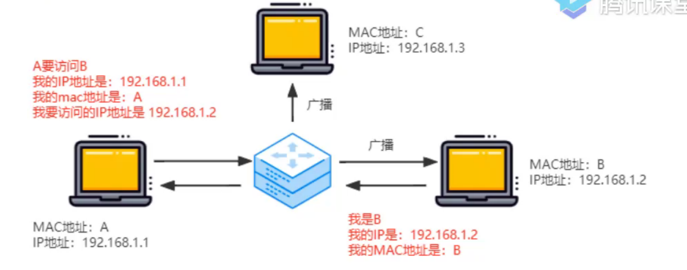
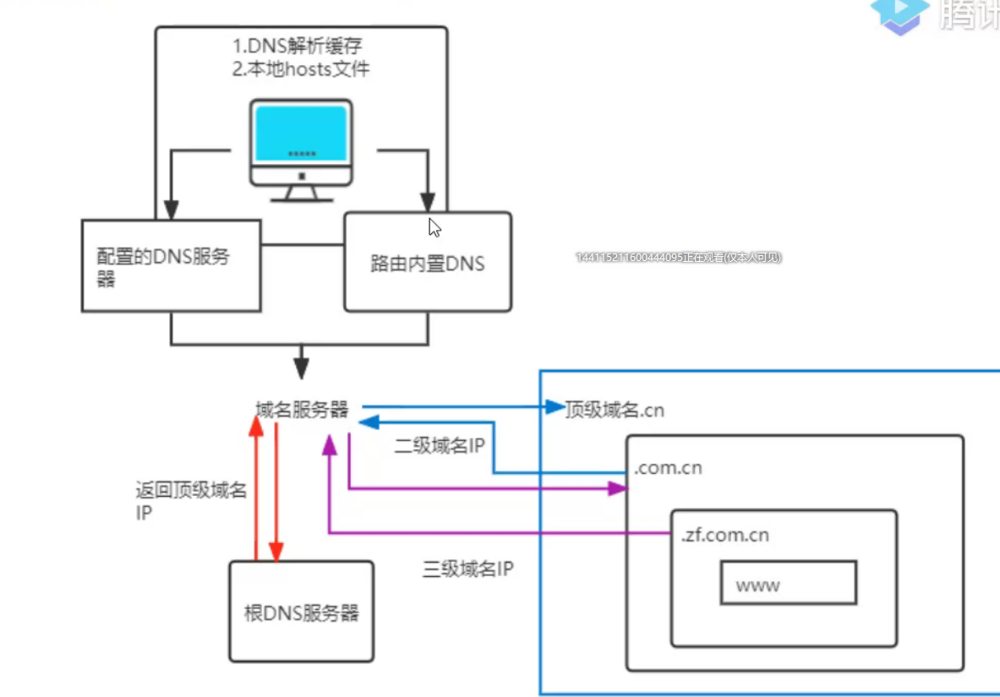
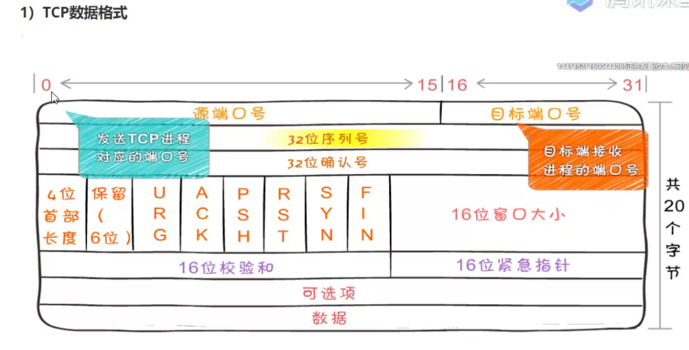
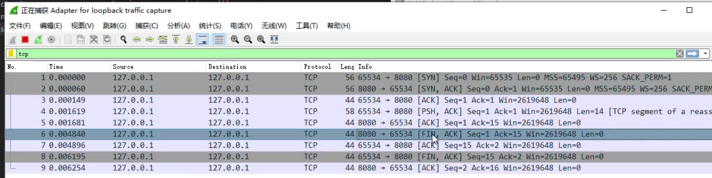

### OSI 七层模拟

Open System Interconnection OSI 理想化模型

* 应用层 用户最终使用的接口 微信 qq 网页
* 表示层 数据进行描述 或者 压缩
* 会话层 建立会话和管理会话
* 传输层 把数据传递给对方 丢了需要重新传递吗
* 网络层 网络层 寻址
* 数据链路层 主要关心两个设备 连接起来 连接数据
* 物理层 关心传输数据 0 1 传输的是比特流

写信

* 具体的实际内容
* 整理话术 表达出来
* 怎么传 丢了要不要冲洗你传递 504 -> 301
* 增加具体位置，对方地址
* 传输信 交给不同的邮局
* 最终的交通工具

### 七层协议真正做了什么
- 报文 应用层
- 数据段 传输层 + 数据 + 端口
- 数据包 网络层 + 数据 + 端口 + ip
- 数据帧 链路层 + 数据 + 端口 + ip + mac地址

> 

### 地址
#### ip 地址

例子 192.168.1.1

最大 255.255.255.255
IPV4 IP地址的第四个版本 最大值 42亿
IPV6 本地链接 IPv6 地址 : fe80::f530:c49d:bcbe:4d3c%14

#### mac 地址

原则是唯一 每个网卡都有一个 mac 地址

### 物理层有哪些设备？
- 光纤 电话线

### 链路层设备

- 交换机 （局域网通信）mac 地址概念

### 网络层设备

- 路由器 默认两个不同的网络 不能相互通信 想让两个不同的区域的设备来通信
- 没有wan口的路由器可以看成交互及 默认两个不同的网络 不能相互通信
- 想让两个不同的区域的设备来通信 要经过网关

## 网络中的协议
- 协议约定和规范 (在OSI 模型中 只有 三层以上的才能成为 协议)

应用层 HTTP DNS DHCP协议
传输层协议 TCP UDP
网络层协议 IP协议 ARP协议 下层为上层提供服务的

ARP协议 有歧义的 核心价值在于将 ip 地址转化为 mac 地址 ip => mac 地址

DHCP 协议 动态 IP分配，动态主机配置协议 自动分配IP，基于UDP的 不需要可靠的

## DNS 协议

DNS 是 Domain Name System 缩写 ，DNS服务器进行域名和与之对应的 IP地址转换的服务器

* 顶级域名 .cn .cn ip 返回
* 二级域名 .com.cn ip 返回，三级域名 www.zf.com.cn 有多少个点 就是几级域名

访问过程 zf.com.cn

### TCP & UDP
 两个协议都在 传输层，我们经常说 TCP 是面向连接的而 UDP是面向无连接的
 
* UDP 发送请求后，不考虑对方是否接受到，内容是否完整，顺序是否正确。收到数据后也不会进行通知
* 首部结构简单，在数据传输时能实现最小开销

#### TCP
tcp 传输控制协议 Transition 可靠 面向连接的协议，传输效率低（不可靠的IP层上面建立 可靠的传输层）
tcp 提供双工服务，即数据可以互相发送

#### TCP 三次握手 四次挥手
SYN 是发送消息
ACK 是接受到消息

