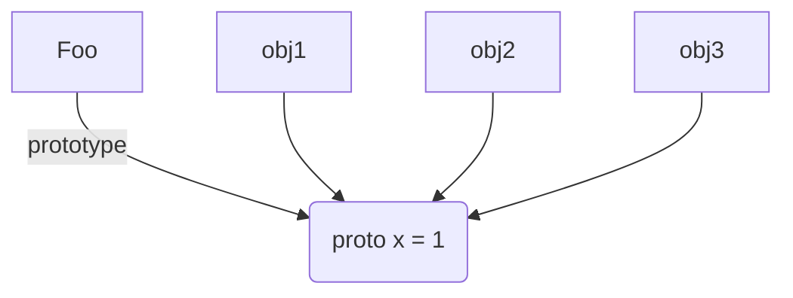

# Javascript
### Javascript 六种数据类型
5种的是原始类型，1种对象类型
1. Object
2. Number
3. String
4. Boolean
5. Null
6. Undefined

### Object 对象包含6种类型的对象
1. Function
2. Arguments
3. Math
4. Date
5. RegExp
6. Error

#### Javascript 隐式转换
1. 字符串转数字 +String +'37'
2. 数字转化为字符串 Number + '' 37 + ''
3. == 等于 与 严格等于
4. NaN !== NaN 每个人都是 NaN 与所有的东西都不相等
5. undefined === undefined
6. null === null
7. ===严格等于 首先是执行类型判断是否相等，再判断值
8. ==非严格等于 会使用常识类型转换和比较 判断是否相等

#### Javascript 包装对象
1. 当一个基础类型想要通过对象的方式去使用他的属性或者增加他的属性时候，Javascript 就会将基础类型转化为包装类型对象，包装类型才有对象的属性等
2. 相当于 new String(str) 里面就会有很多属性 当走完 a.length 以后临时对象 就会消除
3. 所以a.t 就不能成功的赋值了
4. str => String Object 123 => Number Object true => Boolean Object
5. 包装类型在运算的时候，会先调用valueOf方法，如果valueOf返回的还是包装类型，那么再调用toString方法

包装类型的例子
```javascript
var a = "string";
alert(a.length);
a.t = 3;
alert(a.t);
```

#### JavaScript 数据类型检测
* typeof 返回的是字符串类型 适合基本类型和function的检测
* instanceof obj instanceof Object 左操作数是一个对象 右操作数是一个函数对象或者函数构造器 左边如果不是对象就会直接返回 false
* Object.prototyoe.toString
* constructor 不稳定的方法 会被改写
* duck type 判断某个对象是否存在某个方法 从而判断对象


| 方法名称 | 语法 | 返回值 | 特殊情况 | 
| --- | --- | --- | --- |
| typeof | typeof params 判断基础类型  | 字符串 "number" "boolean" "function" "undefined" | typeof null "object" typeof NaN "number" typeof(undefined) "undefined" typeof Function.prototype "function" 遇到null的判断的时候会失效 |
| instanceof | 判断对象类型，通过原型链判断 obj instanceof Object | 返回布尔值   | 不同window或者iframe间的对象类型检测不能使用instanceof |
| Object.prototyoe.toString.apply(Object) | Object.prototyoe.toString.apply(Object) | 字符串 "[object Array]" "[object Function]" "[object Null]" "[object Undefined]" | IE6/7/8 Object.prototype.toStirng.apply(null) 返回的是 "[object Object]" |

#### 手写instanceof 方法
```js
function instanceOf(left, right) { 
    let proto = left.__proto__; 
    while(proto) {
        if(proto === right.prototype){ 
            return true;
        }
        proto = proto.__proto__ 
    } 
    return false 
}
```

#### Javscript 表达式
* 原始表达式 10
* 初始化表达式 var a = 10
* 复合表达式 10 * 20
* 数组，对象的初始化表达式 [1,2] [1,,,4] {x:1, y:2}
* 函数表达式 var fun = function() {}
* 属性访问表达式 var o ={x:1}; o.x o['x']
* 调用表达式 func();
* 对象创建表达式 new Func(1,2) new Object


#### Javascript 运算符
* 一元运算符 +num
* 二元运算符 a+b
* 三元运算符 c ? a ：b
* 赋值运算符
* 比较
* 算术
* 位
* 逻辑
* 字符串
* 特殊运算符

##### 特殊运算符

* ,
* delete
* in
* instanceof
* typeof
* new
* this
* void
* throw

```javascript
// ,
var val = (1,2,3) // val = 3

// delete
var obj = {x:1};
delete obj.x; // 删除obj 里面的属性 x
var obj = {};
Object.defineProperty(obj, 'x', {
    configurable: false,
    value: 1
});

delete obj.x; // false 不能被删除
console.log(obj.x);

// in
window.x = 1;
'x' in window;// true

// new
function Foo() {}
Foo.prototype.x = 1;
var obj = new Foo();
obj.x; // 1
obj.hasOwnProperty('x'); //false
obj.__proto__.hasOwnProperty('x'); // true

// instanceof 判断对象类型 左边的是对象 右边的是构造函数或者函数对象
[1,2] instanceof Array; //true

// typeof 判断基础类型为主
typeof 1;// "number"
typeof null; // "object"

// this this返回的是上下文
this;// window
var obj = {
    func: function(){return this;}
}
obj.func(); // obj

// void
void 0 // undefined
void(0) // undefined

// throw
throw new Error('error');
// 抛出异常

// 实现new 操作符号
```

#### 块 block
语法｛
    语句1;
    语句2;
    ...
    语句n
｝
***没有块级作用域***
```javascript
var i = 0;
for(; i<arr.length; i++) {
    ...
}
```
1. 函数作用域
2. 全局作用域
3. 没有块级作用域

#### var
```javascript
var a = b = 1;
function foo() {
    var a = b =1;
}
typeof a; // undefined
typeof b; // "number" b 变成了全局变量
```

#### try catch
```javascript
try {
    throw "test"; // 抛出错误
} catch (ex) {
    console.log(ex); // test
} finally {
    console.log('finally')
}
```

**执行顺序的考验**
```javascript
try {
    try {
        throw new Error("oops");
    } finally {
        console.log('finally');
    }
} catch (ex) {
    console.log('outer'); 
} finally {
    console.log('finally')
}
// 1. 先执行内部的 抛出的错误 oops
// 2. 再执行内部的 finally
// 3. 最后执行外部的捕获错误 outer
```

```javascript
try {
    try {
        throw new Error("oops");
    } catch(ex) {
        console.log('inner', ex);
    } finally {
        console.log('finally');
    }
} catch (ex) {
    console.log('outer');
} finally {
    console.log('finally');
}
// 1. 先执行内部的 抛出的错误 oops
// 2. 再执行内部的捕获错误 catch inner error
// 3. 最后执行内部 finally
// 4. 外部的 catch 将不会执行 因为内部已经处理过了
```

```javascript
try {
    try {
        throw new Error("oops");
    } catch(ex) {
        console.log('inner', ex);
        throw ex;
    } finally {
        console.log('finally');
    }
} catch (ex) {
    console.log('outer');
}
// 1. 先执行内部的 抛出的错误 oops
// 2. 再执行内部的捕获错误 catch inner error
// 3. 最后执行内部 finally
// 4. 外部的 catch 执行 outer
```

#### function
1. 函数声明会预先处理，在函数声明之前也能正常调用, 也叫做函数前置
2. 函数表达式就不可以这样做
```javascript
// 函数声明
fd(); // true
function fd() {
    // do sth.
    return true;
}

// 函数表达式
fe(); // TypeError
var fe = function() {
    // do sth.
}
```

#### for ... in
1. 顺序是不确定的
2. enumerable 为 false 时 不会出现
3. for in 对象属性时受原型链影响
4. 坑比较多，不建议使用

```javascript
var p;
var obj = {x:1, y:2}

for (p in obj) {
}
```

#### switch
```javascript
// 需要注意的是 需要使用break 阻止继续走下去
var val = 2;
switch(val) {
    case 1:
        console.log(1);
        break;
    case 2:
        console.log(2);
        break;
    default:
        console.log(0);
        break;
}
```

```javascript
// 多个使用的时候
var val = 2;
switch(val) {
    case 1:
    case 2:
    case 3:
        console.log(123);
        break;
    case 4:
    case 5:
    case 6:
        console.log(456);
        break;
    default:
        console.log(0);
        break;
}
```

#### 循环
```javascript
while (isTrue) {
    // do sth
}

do {
    // do sth.
} while (isTrue)

var i;
for (i = 0; i < n; i++) {
    // do sth
}
```

#### with
1. 不建议使用with
2. 让 JS引擎优化很难
3. 可读性很差
4. 可被变量所替代
5. 严格模式下面是禁止使用的
```javascript
with ({x: 1}) {
    console.log(x);
}
with (document.forms[0]) {
    // 隐藏调用了 document.forms[0].name.values
    console.log(name.values);
}

var form = document.forms[0].name.values;
```

#### 严格模式
1. 严格模式是一种特殊的执行模式
2. 修复部分语言上的不足
3. 提供错误检查，而且增加了安全性
4. 向上兼容，编写Node等高质量的代码的时候有用，
5. 打包脚本，服务器运行代码有用

```javascript
'use strict'; // 全部都用全局严格模式
function func() {
    'use strict';
}
```

#### 区别
1. 不允许使用with
2. 不允许未声明的变量被赋值
3. arguments 变成参数的静态副本
4. delete参数，函数名报错
5. delete 不可配置的属性报错
6. 对象字面量重复属性名报错
7. 禁止八进制字面量
8. eval, arguments 变成了关键字，不能作为变量或者函数名
9. eval 独立作用域
10. arguments.caller, arguments.callee 被禁用
11. 一般函数调用时（不是对象的方法调用，也不使用apply/call/bind）等修改this) this指向 null,而不是全局对象window
12. 若使用apply/call,当传入null 或者 undefined时，this将会指向 null 或者 undefined，而不是全局
13. 试图修改不可写属性（writable = false）在不可扩展的对象上添加属性时报错 TypeError，而不是忽略


```javascript
// 不允许未声明的变量被赋值
!function () {
    'use strict';
    x=1;
    console.log(window.x);
}();
// ReferenceError

// 变成了 静态副本 不会影响
// arguments 没有办法被改变了
!function (a) {
    'use strict';
    // arguments 变成静态副本
    arguments[0] = 100;
    console.log(a); // 1
}(1);

// 特殊情况 传入对象
// 共享传递的 修改对象属性会影响
!function (a) {
    'use strict';
    // arguments 变成静态副本
    arguments[0].x = 100;
    console.log(a.x); // 100
}({x:1});

// 返回 false 不会报错
!function (a) {
   console.log(delete a);
}(1);

// SyntaxError
!function (a) {
    'use strict';
   console.log(delete a);
}(1);

// TypeError
!function (a) {
    'use strict';
    var obj = {};
    Object.defineProperty(obj, 'a', {
        configurable: false
    });
    delete obj.a; // 正常模式下 false 不能被删除
}(1);

// SyntaxError 
// 不能定义重复的值 语法错误
!function () {
    'use strict';
    var obj = {x: 1, x: 2};
}();


// SyntaxError 
// 禁止使用八进制 字面量
!function () {
    'use strict';
    console.log(0123); // 正常模式下面 显示 83
}();

// SyntaxError
// 严格模式下 禁止使用 eval，arguments 变关键字
!function () {
    'use strict';
    function eval() {}
}();

// evalVal is not defined undefined
!function () {
    'use strict';
    eval('var evalVal = 2'); // 正常模式下面 会显示 2
    console.log(evalVal);
}();

```


### 对象 
对象中包含一系列的属性，这些属性是无序的，每个属性都有一个字符串 key 对应的的value,像字典一样，重点问题


#### 对象结构 每个属性访问权限的控制

1. writable
2.  enumerable
3.  configurable
4.  value
5.  get/set

隐藏的深奥属性
1. proto
2. class
3. extensible


```javascript
function foo() {}
foo.prototype.z = 3;
var obj = new foo();
obj.z // 3
```

#### 对象创建，原型链
1. 对象创建的方法 var obj1 = {x:2, y: 1}
2. new 创造/原型链
3. Object.create({x: 1})


```javascript
function foo() {}
foo.prototype.z = 3;

// object的原型 指向 foo(构造器)的prototype属性
// 作用
var obj = new foo();
obj.y = 2;
obj.x = 1;

obj.x // 1
obj.y // 2
obj.z // 3
typeof obj.toString; // 'function'
'z' in obj; // true
// z 不在 obj上的 z在 obj的原型链上的
obj.hasOwnProperty('z'); // false

// 赋值操作
obj.z = 5;
obj.hasOwnProperty('z'); // true
foo.prototype.z; // 3
// 先会在当前的对象中找，找不到才会去原型链上面找，先到上一级找
obj.z; // 5
obj.z = undefined;
obj.z; // undefined

delete obj.z; // true
// delete 只能删除当前对象中的属性 不能删除原型链上的
obj.z; // 3
```
**原型链
obj => var obj = new foo() => foo.prototype => function foo(){} => Object.prototype => null**


```javascript
// 这里的 x 创建在 Object 的 prototype 属性中 而不是 在 obj 中
// 这里的 obj原型 指向的是 Object的protoType
var obj = Object.create({x: 1});
obj.x // 1
// 用自变量创建的对象 原型指向的是 Object.prototype 指向Object构造器的 prototype属性
typeof obj.toString // "function"
obj.hasOwnProperty('x'); // false

// 并不是所有的 对象属性上面都有 toString方法的
// 这样创建的话，obj的原型 直接就指向 null 了 所以 obj 就没有 toString方法了    
var obj = Object.create(null);
obj.toString // undefined
```

#### 属性操作
1. 读写对象属性
2. 属性异常
3. 删除属性
4. 检测属性
5. 枚举属性


##### 属性读写
```javascript
var obj = {x:1, y: 2};
obj.x; // 1
obj['y']; // 2 属性名称需要拼接的时候 用到 中括号的方式

obj.["x"] = 3;
obj.y = 4;


// for in 属性
// 有可能吧 原型链上面的属性也会遍历出来 不确定顺序的
// 不建议使用 for in
var p;
for (p in obj) {
    console.log(obj[p])
}
```

##### 属性读写-异常
```javascript
var obj = {x: 1};
obj.y; // undefined

var yz = obj.y.z; // TypeError: Cannot read property 'z' of undefined
obj.y.z = 2; // TypeError: Cannot set proerty 'z' of undefined

var yz;
var yz = obj && obj.y && obj.y.z; // 通过 && 去判断 
```


##### 属性删除
```javascript
var person = {age: 28, title: 'fe'};
delete person.age; // true
delete person['title']; // true
person.age; // undefined
delete person.age; // true 重复删除 也会返回 true 表示已经不存了

delete Object.prototype; // false 不能删除

var descriptor = Object.getOwnPropertyDescriptor(Object, 'prototype');
descriptor.configurable; // false 
descriptor.enumerable;  // false
descriptor.writable; // false

// 全局变量定义以后不能被删除
var globalVal = 1;
delete globalVal; // false

function fd() {}
delete fd; // false

// 局部作用域和全局作用域的函数都不能被删除 变量和函数都是一样的

// 隐式创建变量 是可以被删除的
ohNo = 1;
window.ohNo; // 1
delete ohNo; // true
```

##### 属性检测
```javascript
var cat = new Object;
cat.legs = 4;

'legs' in cat; // true 会在原型链上面去找
'abc' in cat; // false
'toString' in cat; // true inherited prototype!! 在原型链上面找到的

cat.hasOwnProperty('legs'); // true
cat.hasOwnProperty('toString'); // false

// 每个属性都有 Enumerable 属性都有 判断是否可以被枚举的
// Object.prototype 的大部分属性都是 不可枚举的 原型链上面大部分的属性都是不可以枚举的
cat.propertyIsEnumerable('legs'); // true
cat.propertyIsEnumerable('toString'); // false

Object.defineProperty(cat, 'price', {enumerable: false, value: 1000});
cat.propertyIsEnumerable('price'); // false
cat.hasOwnProperty('price'); // true

// 实际情况
// 先判断到底是否存在脚
if (cat && cat.legs) {
    cat.legs *= 2;
}

// 同理
if (cat.legs != undefined) {
    // !== undefined, or , !== null
}

// 先判断类型 再判断值
if (cat.legs !== undefined) {
    // only if cat.legs is not undefined
}
```

##### 属性枚举
```javascript
var o = {x: 1, y: 2, z: 3};
'toString' in o; // true
o.propertyIsEnuumerable('toString'); // false
var key;
for (key in o) {
    console.log(key); // x y z
}
```

```javascript
// 这里的 obj1 的原型是指向 o的protoType的
var obj = Object.create(o);
obj.a = 4;
// 印证了 for in 循环是不稳定的
for (key in obj) {
    console.log(key); // a,x,y,z
}

// 这里的 obj1 的原型是指向 o的protoType的 o的原型指向 Object.prototype
var obj = Object.create(o);
obj.a = 4;
// 印证了 for in 循环是不稳定的
for (key in obj) {
    // 过滤原型链上面的属性
    if (obj.hasOwnProperty(key)) {
        console.log(key); // a
    }
}
```

##### getter/setter 方法
```javascript
var man = {
    name: 'poloma',
    weibo: '@poloma',
    // 获取的时候 会被触发
    get age() {
        return new Date().getFullYear() - 1993;
    }
    // 修改的话 会被触发
    set age(val) {
        console.log('Age can\'t be set to' + val);
    }
}
console.log(man,age); // 27
man.age = 100; // Age can't be set to 100
console.log(man.age); // 27
```

##### get/set 方法 与原型链结合
```javascript
function foo() {}

// 在 foo的原型链上面定义 一个新的属性 z
Object.defineProperty(foo.prototype, 'z', {
    get: function() {
        return 1;
    }
})

// obj 继承 foo的原型
var obj = new foo();
obj.z; // 1 在原型链上面查找 z属性
obj.z = 10; // 但是不能修改
obj.z; // 1 依然是1

Object.defineProperty(obj, 'z', {value: 100, configurable: true});
obj.z; // 100
delete obj.z; // true
obj.z; // back to 1 返回原型链上面的值

var o = {};
Object.defineProperty(obj, 'x', {value: 1});
var obj = Object.create(o);
obj.x; // 1

Object.defineProperty(obj, 'x', {writable: true, configurable: true, value: 100});
obj.x; //100
obj.x = 500;
obj.x; // 500
```

#### 属性标签
1. 查看属性标签
2. getOwnPropertyDescriptor 第一个参数 传递的是对象，第二个参数是字符串 对象中的某一个key值
```javascript
Object.getOwnPropertyDescriptor({pro: true}, 'pro');
// Object value: true writable: true enumerable: true configurable: true
Object.getOwnPropertyDescriptor({pro: true}, 'a'); // undefined 找不到 a这个属性 就会返回 undefined
```

1. writable 表示属性是否可以修改
2. enumerable 表示属性是否可以被遍历 枚举
3. configurable 是否可以被修改，是否能被删除

##### 管理对象中的属性等信息
```javascript
var person = {};
Object.defineProperty(person, 'name', {
    configurable: false, // 不能被删除和修改
    writable: false, // 不能被修改
    enumerable: true, // 可以被枚举遍历
    value: 'poloma' // 定义value值
});

delete person.name; // false

Object.defineProperty(person, 'type', {
    configurable: true, // 能被删除和修改
    writable: true, // 不能被修改
    enumerable: false, // 不可以被枚举遍历
    value: 'Object' // 定义value值
});

Object.keys(person); // 只能 查到 允许被枚举的属性
// names 没有type
```

##### 定义对象中多个属性
```javascript
Object.defineProperties(person, {
    title: {value: 'poloma', enumerable: true},
    corp: {value: 'BABA', enumerable: true},
    salary: {value: '50000', enumerable: true, writable: true},
    promote: {
        set: function(level) {
            this.salary *= 1 + level * 0.1;
        }
    }
})

person.salary; // 50000
person.promote = 2; // 晋升2级
person.salary; // 60000

// 未定义的属性 默认为 false
// 所以需要明确每个属性的配置
Object.getOwnPropertyDescriptor(person, 'corp');

Object.getOwnPropertyDescriptor(person, 'salary');
```


|  | configurable: true writable: true | configurable: true writable: false | configurable: false writable: true | configurable: false writable: false |
| --- | --- | --- | --- | --- |
| 修改属性的值 | true | true 重设value标签修改 | true | false |
| 通过属性赋值 修改属性的值 | true | false | true | false |
| delete该属性返回true | true | true | false | false |
| 修改 getter/setter方法 | true | true | false | false |
| 修改属性标签* | true | true | false | false |

#### 对象标签，对象序列化
1. 原型标签 \_proto__ 通过对象的标签 proto 让对象指向 他的父类 prototype
2. class 标签 判断当前的对象的类型 
3. extensible 方法

获取 class 标签的方法 
```javascript
var toString = Object.prototype.toString;
function getType(o){
    return toString.call(o).slice(8,-1);
}

getType(null); // Null
getType(undefined); // Undefined
getType(1); // "Number"
getType(true); // "Boolean"
```

```javascript
var obj = {x: 1, y:2};
Object.isExtensible(obj); // true
Object.preventExtensions(obj); // 禁止扩展
Object.isExtensible(obj); // false
// 禁止扩展的时候 就不能新增属性新增了
obj.z = 1;
obj.z; // undefined add new property failed

// 依然可以修改已经存在的属性
Object.getOwnPropertyDescriptor(obj, 'x');

Object.seal(obj);
Object.getOwnPropertyDescriptor(obj, 'x');
// configurable: false
// 判断是否被隐藏
Object.isSealed(obj); // true

Object.freeze(obj);
Object.getOwnPropertyDescriptor(obj, 'x');
// configurable: false writable: false
// 判断是否被冻结
Object.isFrozen(obj);
// 原型链不会冻结
```


##### 序列化
1. JSON.stringify
2. JSON.parse
3. 序列化自定义

```javascript
var obj = {val: undefined, a: NaN, b: Infinity, c: new Date()};
JSON.stringfy(obj);
// "{"a":null,"b":null,"c":"2020-06-22T13:24:28.702Z"}"
// 如果值为 undefined 的话 将不会添加到序列化中
// 如果是 NaN 或者 Infinity 转为 null

obj = JSON.parse('{"x": 1}');

var obj = {
    x: 1,
    y: 2, 
    o: {
        o1: 1,
        o3: 2,
        toJSON: function() {
            return this.o1 + this.o2
        }
    }
}
JSON.stringify(obj); // '{"x": 1, "y": 2, "o": 3}'
```

#### 数组
##### 数组创建
1. var arr = [1,2,3];
2. var arr = new Array(100); // undefined * 100

##### 数组元素读写
```javascript
var arr = [1,2,3,4,5];
arr[1];
arr.length;

delete arr[0];
arr[0];

// 使用数组 API
```

##### 数组元素迭代
```javascript
var arr = [1,2,3,4,5];
Array.prototype.x = "inherited";
for (i in arr) {
    // 1,2,3,4,5 inherited
    console.log(arr[i]);
}

for (i in arr) {
    if (arr.hasOwnProperty(i)) {
        console.log(i); // 1,2,3,4,5
    }
}
```
##### 二维数组
```javascript
var arr = [[0,1], [2,3], [4,5]];
for (var i = 0; i < arr.length; i++) {
    for (var j = 0; j < arr[i].length; j++) {
        console.log(arr[i][j]);
    }
}
```

##### 稀疏数组
稀疏数组并不包含有从0开始的连续索引，一般length属性值比实际元素个数大
```javascript
var arr = [,,];
0 in arr; // false 
```


#### 数组方法
```javascript
{} => Object.prototype
[] => Array.prototype
```

1. Array.prototype.join
2. Array.prototype.reverse
3. Array.prototype.sort
4. Array.prototype.concat
5. Array.prototype.slice
6. Array.prototype.splice
7. Array.prototype.forEach(ES5)
8. Array.prototype.map(ES5)
9. Array.prototype.filter(ES5)
10. Array.prototype.every(ES5)
11. Array.prototype.some(ES5)
12. Array.prototype.reduce/reduceRight(ES5)
13. Array.prototype.indexOf/lastIndexOf(ES5)
14. Array.prototype.isArray(ES5)

```javascript
// join 数组变成字符串
funtion repeatString(str, n) {
    return new Array(n + 1).join(str);
}
```


## Javascript 函数表达式
### 大纲
1. 理解函数
2. 函数声明与函数表达式
3. this与调用方式
4. 函数属性与arguments
5. 闭包与作用域
6. ES3 执行上下文

### 调用方式
1. 直接调用 foo();
2. o.method();
3. new Foo();
4. func.call(o);


```javascript
// 函数声明
function add (a, b) {
    return a + b;
}

// 函数表达式
var add = function(a,b) {
    // dosth
}

(function() {
    // do sth
})();

// 命名式函数表达式
var add = function foo(a,b) {
    // dosth
}
```

### 变量和函数的声明前置
1. 函数声明的话，函数的声明的话是会前置的，在函数声明前也可以正常调用
2. 函数表达式的话，未定义的函数表达式调用就会报错，undefined is not a function
3. 不能立即执行的

```javascript
var num = add(1,2);
console.log(num); // result 3

function add(a,b) {
    a = +a;
    b = +b;
    return a+b
}
```

```javascript
var num = add(1,2);
console.log(num); // add in not a function

// 赋值语句 不会提前
var add =  function(a,b) {
    a = +a;
    b = +b;
    return a+b
}
```

### 命名函数表达式（NFE）
调试的时候会使用的到命名函数表达式，和递归的调用自己，并不常见

```javascript
var func = function nfe() {};
alert(func === nfe);
// 递归调用

var func = function nfe() {
    nfe();
}

```

### Function 构造器
很少使用，原因是拿不到局部作用域的函数变量等信息
只能匿名，不能赋值到变量名中

```javascript
var func = new Function('a', 'b', 'console.log(a+b)');
func(1,2);

var func = new Function('a', 'b', 'console.log(a+b)');
func(1,2);

Function('var localVal = "local"; console.log(localVal)')();
console.log(typeof localVal);
// local undefined

var globalVal = 'global';
(function() {
    var localVal = 'local';
    Function('console.log(typeof localVal, typeof globalVal);')();
})();
// undefined, string;
```

|  | 函数声明 function add(){} | 函数表达式 var add = function() {}  |  函数构造器 new Function('console.log(1+2)') |
| --- | --- | --- | --- |
| 前置  | true  |  |  |
| 允许匿名 |   | true | true |
| 立即调用 |  | true | true |
| 在定义该函数的作用域通过函数名访问 | true  | 不能在赋值阶段进行自身的调用  |  |
| 没有函数名 |  |  | true(只能匿名) |

## this

1. 全局的this（浏览器）
2. 一般函数的this （浏览器）
3. 作为对象方法的函数的 this
4. 对象原型链上的 this
5. get / set 方法 与 this
6. 构造器中 this
7. call / apply 方法 与 this
8. bind 方法 的 this


#### 全局的this（浏览器）

```javascript
this.a = 37;
console.log(window.a); // 37
```

#### 一般函数的this（浏览器）

```javascript
function f1() {
    return this;
}
f1() === window; // true global object

function f2() {
    "use strict";
    return this;
}

f2() === undefined
```

#### 作为对象方法的函数的this
判断当前的方法如何去调用的是关键，而不是创建的形式

```javascript
var o = {
    prop: 37,
    f: function() {
        return this.prop;
    }
}

console.log(o.f());
```

### 对象原型链上的this

```javascript
var o = {f: function() { return this.a + this.b}};
var p = {};
var p = Object.create(p);
// var p = new o.f();
// Object.setPropertityOf(p, o);
// p.__proto__ = o;

p.a = 1;
p.b = 4;
console.log(p.f());
```

### 构造器上的this

```javascript
function MyClass() {
    this.a = 37;
}

var o = new MyClass();
console.log(o.a); // 37

// this 会指向空的 并且是它的原型为构造器的protoType属性的对象
function C2() {
    this.a = 37;
    return {
        a: 38
    }
}

o = new C2();
console.log(o.a); // 返回的不是一个 函数方法 而是一个对象 所以是 38
```

### call/apply方法 与 this
```javascript
function add(c,d) {
    return this.a + this.b + c + d;
}

var o = {a:1, b:3};
add.call(o,5,7); // 1 + 3 + 5 +7 = 16

add.apply(o, [10, 20]); // 24

function bar() {
    // this 指向的是 调用的值 7
    console.log(Object.prototype.toString.call(this));
}

bar.call(7); // "[object Number]"
```

### bind 方法 与 this ie9+
```javascript
function f() {
    return this.a;
}

// 让this 指向 bind的参数
var g = f.bind({a: "test"});
console.log(g()); // test

var o = {a: 37, f: f, g: g};
// bind 绑定以后 依然会按照之前的绑定执行
console.log(o.f(), o.g()); // 37, test
```

### 实现 new 操作符
```javascript
function newObj(constructor) {
    var obj = {}; // 步骤一
    Object.setPrototypeOf(obj, constructor.prototype);
    // 步骤二 等价于  obj.__proto__ = constructor.prototype;
    // ES6 语法 Object.create(constructor.prototype)
    var result = constructor.apply(obj, [].slice.call(arguments));
    return result instanceof Object ? result : obj;
}
```

## Javascript arguments
### arguments 与 函数属性

* foo name 函数名
* foo length 形参的个数
* arguments.length 实参的个数

```javascript
function foo(x, y, z) {
    // arguments 类数组对象
    arguments.length; // 2
    arguments[0]; // 1
    arguments[0] = 10;
    x; // change to 10 严格模式下 依然是传入的值 1
    
    arguments[2] = 100;
    z; // undefined
    
    arguments.callee === foo; // true 严格模式下失效
}

foo(1,2);
foo.length; // 3 形参的个数
foo.name; // "foo"
```

### bind 与 函数柯里化

* 绑定this
* 科里化

```javascript
function add(a, b, c) {
    return a + b + c;
}
var func = add.bind(undefined, 100);
func(1, 2); // 103

var func2 = func.bind(undefined, 200); // 这里已经是300了
func2(10); // 310
```

### 实际应用场景
```javascript
function getConfig(colors, size, otherOptions) {
    console.log(colors, size, otherOptions);
}
// 先配置好基础的配置
var defaultConfig = getConfig.bind(null, '#CC0000', "1024 * 768");

defaultConfig('123'); // 不用传入基础的参数了
defaultConfig('456');
```

### bind 与 new 方法
```javascript
function foo() {
    this.b = 100;
    return this.a;
}

var func = foo.bind({a: 1});

func(); // 1
// new 的情况特殊
// new 导致了 func 的原型指向了 foo bind方法就会被忽略掉
new func(); // {b: 100}
```


## Javascript 作用域
1. 全局作用域
2. 函数作用域
3. eval 作用域

```javascript
var a = 10; // 全局作用域
(function() {
    var b = 20; // 函数作用域
});

console.log(a);
console.log(b); // b in not defined

eval("var a = 1;"); // eval 作用域
```


### 利用函数作用域封装 类库
```javascript
(function() {
    // do sth
})();

// 函数表达式 而不是函数声明 不会让函数前置
!function() {
    // do sth
    var a, b // 让函数里面的变量变成局部变量
}();
```


### 执行上下文
Execution Context 缩写 EC 执行上下文，栈的结构

### 变量对象
 变量对象（Variable Object）缩写是VO，是一个抽象概念中的对象，用于存储执行上下文中的

 * 变量
 * 函数声明
 * 函数参数

### 全局执行上下文

浏览器在初始化的时候，会把全局对象储存在VO中 Math String isNaN 等
```javascript
String(10); // [[global]].String(10);
window.a = 10;
this.b = 20;
```

### 函数中的激活对象 AO
```javascript
AO = {
    arguments: <Arg0>
};

arguments = {
    callee,
    length,
    properties-indexes
}
```

### 变量初始化阶段
vo 按照下面的顺序执行

1. 函数参数
2. 函数声明 （名称冲突的话，会覆盖）
3. 变量声明 （名称冲突的话，会忽略）

执行顺序的例子
```javascript
function test(a,b) {
    var c = 10;
    function d() {}
    var e = function _e() {};
    (function x() {});
    b = 20;
}
test(10);
// 函数的初始化阶段是这样排序的
AO(test) = {
    a: 10, // 函数参数声明
    b: undefined, // 函数参数声明
    c: undefined, // 变量声明
    d: '<ref to func "d" >', // 函数声明
    e: undefined, // 函数表达式
}
```

```javascript
function foo(x,y,z) {
    function func() {};
    var func; // 会被忽略
    console.log(func); // function func() {}
}
foo(100);

function foo(x,y,z) {
    function func() {};
    var func = 1; // 会覆盖
    console.log(func); // 1
}
foo(100);
```

### 代码执行阶段
执行顺序的例子
```javascript
function test(a,b) {
    var c = 10;
    function d() {}
    var e = function _e() {};
    (function x() {});
    b = 20;
}
test(10);
// 函数的初始化阶段是这样排序的
AO(test) = {
    a: 10, // 函数参数声明
    b: 20, // 函数参数声明 函数声明最先执行的
    c: 10, // 变量声明
    d: '<ref to FunctionDeclaration "d" >', // 函数声明
    e: function _e(){}, // 函数表达式
}
```

### 执行上下文例子
浏览器下面的执行

1. 全局作用域，不用考虑参数的传入问题，先执行的是函数的参数
2. 函数的声明
3. 变量声明的提前
4. JS没有块级作用域，判断条件中的变量声明也会提前

```javascript
alert(x); // 函数声明 提前 function

var x = 10; // 赋值
alert(x); // 10
x = 20;

function x() {}；  // 进入VO对象中 函数声明会提前处理了
alert(x); // 20

// var 声明变量也会被前置
if (true) {
    var a= 1;
} else {
    var b = true;
}

alert(a); // 1
alert(b); // undefined b 被前置处理了 显示undefined
```


## OOP 面向对象编程

1. 继承
2. 封装
3. 多态
4. 抽象

### 基于原型的继承

```javascript
function Foo() {
    // 函数作为构造器去使用
    // this 就会 指向一个对象 对象的原型会指向构造器的prototype属性
    // this 指向 obj obj 的原型就是 Foo的protoType属性
    this.y = 2;
}
typeof Foo.prototype; // "object"
Foo.prototype.x = 1;

var obj = new Foo();
obj.y; // 2
obj.x; // 1
```

### prototype属性与原型
> prototype 是函数对象上预设的对象属性
> 原型是对象上面的原型
> 原型通常都是它的构造器的prototype属性




#### 原型链例子

1. 实例化的 poloma 的 \_proto\_ 指向 它的构造器 Student 的 prototype
2. Student prototype 通过 Object.create(Person.prototype); 构造的，是一个空的对象并且是通过空对象创建的
3. Student 的 \_proto\_ 指向 Person的 prototype
4. Person 的 \_proto\_ 指向 Object的 prototype
5. Object \_proto\_ 指向 null

```javascript
function Person(name, age) {
    this.name = name;
    this.age = age;
    this.hi = function() {
        console.log('Hi my name is ' + this.name)
    }
}

function Student(name, age, className) {
    // 让当前的函数对象 this 使用 Person的类 传入参数 name 和 age
    Person.call(this, name, age);
    this.className = className;
    this.hi = function() {
        console.log('hi kobe');
    }
}

Student.prototype = Object.create(Person.prototype);
Student.prototype.constructor = Student;

Student.prototype.hi = function() {
    console.log('hi poloma');
}

var poloma = new Student('poloma', 27, 'class 3');
poloma.hi();
```

### prototype 属性

```javascript
Student.prototype.x = 101;
poloma.x; // 101

Student.prototype = {y: 2};
poloma.y; // undefined
poloma.x; // 101

var nunnly = new Student('poloma', 3, 'class lol kengb');

nunnly.x; // undefined
nunnly.y; // 2

```

### instanceof 方法

1. 判断左边的对象的原型链上 \_proto\_ 是否存在 右边构造器的prototype属性 如果有就返回 true 没有 返回 false
2. window 或者 iframe之间的对象类型检测不能使用 instanceof

```javascript
[1, 2] instanceof Array === true;
// 对象不是数组
new Object instanceof Array === false;
'123123'’instanceof String // false; 123123 构造函数
```

### new 方法实现
1. 创建一个新的对象;
2. 将构造函数的作用域赋给新的对象;
3. 执行构造函数中的代码;
4. 返回新的对象;

```javascript
function myNew(constructor, ...rest) {
    // 判断当前的构造函数是否函数对象
    if (typeof constructor !== 'function') {
        return constructor; // 直接返回当前传入的对象 而不是方法
    }
    // 创建对象，关联构造函数的原型对象
    const _constructor = Object.create(constructor.prototype);
    // 执行构造函数 并且把参数传入
    const obj = constructor.apply(_constructor, rest);
    // 如果构造函数执行结果是对象则返回执行的结果
    if (typeof obj === 'object') {
        return obj;
    } else {
        return _constructor;
    }
}
```

### 实现继承的方式

```javascript
function Person() {}
function Student() {}

Student.prototype = Person.prototype; // 1
Student.prototype = new Person(); // 2

Student.prototype = Object.create(Person.prototype);// 生成一个新的对象 它的原型是 Person.prototype es5 支持 3
// 改变构造器为 Person 
Student.prototype.constructor = Person;

```

### 模拟重载
### 调用子类的方法
```javascript
function Person(name) {this.name = name}
function Student(name, className) {
    this.className = className;
    Person.call(this, name)
}
var poloma = new Student('poloma', 'workshop');
poloma; // poloma workshop

// 调用子类的方法
Person.prototype,init = function() {};

// 子类调用父类的方法并且传入参数
Student.prototype.init = function() {
    // do sth
    Person.prototype.init.apply(this. arguments);
}
```

### 链式调用
```javascript
function ClassManager() {}
ClassManager.prototype.addClass = function(str) {
    console.log('Class' + str + 'added');
    // 通过 return this 实现链式调用
    return this;
}
var manager = new ClassManager();
manager.addClass('a').addClass('b').addClass('c')
```

### 抽象类
### 模块化

1. new 一个方法 它的this 就是指向当前引用的对象
2. 函数方法返回的一个函数

```javascript
var moduleA = function(){
    return {
        func: function() {},
        prop: 1
    }
}();

moduleA.prop; // 1

var moduleB = new function() {
    this.func = function() {}
    this.prop = 1
}

moduleB.prop; // 1
```

### 继承的通用方法

### 实际模拟

```javascript
var Detec=(function(global){
    return{
        cons:function DetectorBase(configs){
            if (!this instanceof DetectorBase) {
                throw new Error('Do not invoke without new.')
            }
            this.configs=configs;
            this.analyze();
        }
    }
})(this);

Detec.cons.prototype.analyze=function(){
    console.log('Analyzing...');
    this.data="##data##";
};

Detec.cons.prototype.detect=function () {
    throw new Error('Not implemented');
};

function LinkDetector(links){
    if (!this instanceof LinkDetector) {
        throw new Error('Do not invoke without new.')
    }
    Detec.cons.apply(this,arguments);
    this.links=links;
}

function ContainerDetector(containers){
    if (!this instanceof ContainerDetector) {
        throw new Error('Do not invoke without new.')
    }
    Detec.cons.apply(this,arguments);
    this.containers=containers;
}

function inherit(subClass,superClass){
    subClass.prototype=Object.create(superClass.prototype);
    subClass.prototype.cons=subClass;
}

inherit(LinkDetector,Detec.cons);
inherit(ContainerDetector,Detec.cons);

LinkDetector.prototype.detect=function(){
    //console.log(this);
    //alert(this instanceof LinkDetector);
    console.log('Loading data:'+this.data);
    console.log('link detection started.');
    console.log('Scaning link:'+this.links);
};

ContainerDetector.prototype.detect=function(){
    console.log('Loading data:'+this.data);
    console.log('Container detection started.');
    console.log('Scaning containers:'+this.containers);
};

Object.defineProperties(this,{
    LinkDetector:{value:LinkDetector},
    ContainerDetector:{value:ContainerDetector},
    DetectorBase:{value:Detec.cons}
});

var a=new ContainerDetector('#abc');
var b=new LinkDetector('http://www.baidu.com');
 
a.detect();
b.detect();


```
