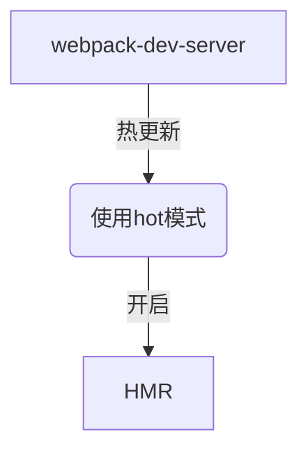

### webpack 引入规范

* ES2015 import export default 语句
* CommonJS require() modules.export 语句
* AMD define 和 require 语句
* css/sass/less 文件中的 @import 语句。
* 样式(url(...))或 HTML 文件()中的图片链接(image url)

1. ES module 模块引入方式
```shell
npx webpack index.js
```
```javascript
// index.js
import Header from './header.js';
import SideBar from './sideBar.js';
import Content from './content.js';
// 实例化
new Header();
new SideBar();
new Content();
```
```javascript
export default function Header(){}
export default function SideBar(){}
export default function Content(){}
```
2. CommonJS 模块引入方式
```javascript
const Header = require('./header.js');
const SideBar = require('./sideBar.js');
const Content = require('./content.js');
new Header();
new SideBar();
new Content();
```
```javascript
function Content() {}
function SideBar() {}
function Header() {}
module.exports = Content;
module.exports = SideBar;
module.exports = Header;
```

### webpack 初始化
webpack的默认配置文件名称是 webpack.config.js
```shell
npm init
yarn add webpack webpack-cli
webpack-cli // 可以通过命令行的方式使用webpack
```


### webpack config 详细介绍

* 入口 entry
* 输出 output
* loader 当需要加载不非js结尾的文件的时候需要使用loader
* plugin

> webpack使用Node.js运行，因此所有的Node.js模块都可以使用，比如文件系统、路径等模块。

```javascript
const path = require('path'); // 导入Node.js的path模块

module.exports = {  
    mode: 'development', // 工作模式  
    entry: {
        main: './src/index', // 入口点  main Chunk Names 对应的 main 
    }
     // 输出配置
    output: {
        path: path.resolve(__dirname, 'dist'), // 输出文件的目录    
        filename: 'scripts/[name].[hash:8].js', // 输出文件的名称   
        chunkFilename: 'scripts/[name].[chunkhash:8].js', // 公共JS配置    
        publicPath:'/' // 资源路径前缀，一般会使用CDN地址，这样图片和CSS就会使用CDN的绝对URL  
    },
    module:{
        rules: [
            {   
                test:/\.(png|gif|jpg)$/, // 图片文件
                use :[
                    {
                        loader: 'file-loader',
                        options: {       
                            name: 'images/[name].[hash:8].[ext]'
                        }
                    }
                ]
            }
        ]
    },
    // 数组
    plugins: [ // 插件配置
        new CleanWebpackPlugin()
    ]};
```

> Webpack自己只管JS模块的输出，也就是output.filename是JS的配置，CSS、图片这些是通过loader来处理输出的

### url-loader 与 file-loader 对比
|  | url-loader | file-loader |
| --- | --- | --- |
| 定义 | Loads files as base64 encoded URL | Instructs webpack to emit the required object as file and to return its public URL |
| 用法 | 在文件大小（单位 byte）低于指定的限制时，可以返回一个 DataURL | 生成的文件的文件名就是文件内容的 MD5 哈希值并会保留所引用资源的原始扩展名 |
| 最佳实践 | 小图标使用url-loader返回 base64位等DataSource | 先使用 url-loader 过滤 再使用file-loader 添加hash值和公共路径 |

### file-loader 占位符

| 名称 | 类型 | 默认值 | 描述 |
| --- | --- | --- | --- |
| [ext] | String | file.extname | 资源的拓展名  |
| [name]  | String | file.basename | 资源的基本名称 |
| [path] | String | file.dirname | 资源相对于 context 的路径 |
| [hash] | String | md5 | 内容的哈希值，下面的hasdes配置中有更多信息 |
| [N] | Number |  | 当前文件名按照查询参数 regExp 匹配后获得到第 N个匹配结果 |


### 项目引入 字体文件 使用 file-loader
```javascript
module: {
    rules: [
        {
            test: /\.(eot|ttf|svg|woff)$/,
            include: path.resolve(__dirname, './src/font'),
            use: [{
                loader: 'file-loader'
            }]
        },
    ]
}
```

### 使用webpack 打包 css代码的 优缺点

使用 webpack 打包 CSS 有许多优点，在开发环境，可以通过 hashed urls 或 模块热替换(HMR) 引用图片和字体资源。而在线上环境，使样式依赖 JS 执行环境并不是一个好的实践。渲染会被推迟，甚至会出现 FOUC，因此在最终线上环境构建时，最好还是能够将 CSS 放在单独的文件中。

* extract-loader 针对 css-loader 的输出
* extract-text-webpack-plugin

### css 加载 loader 用法 比较

| 名称 | 用法 | 插件用法 | 最佳实践 |
| --- | --- | --- | --- |
| css-loader | css-loader 解释(interpret) @import 和 url() ，会 import/require() 后再解析(resolve)它们 | {loader: "css-loader"} | 集合使用 css-loader 与 style-loader 将样式存放在 style tag中 |
| style-loader | Adds CSS to the DOM by injecting a \<style\> tag | { loader: "style-loader" },{ loader: "css-loader" } | style-loader 与 css-loader 结合使用 |
| less-loader | Compiles Less to CSS | {loader: "style-loader" // creates style nodes from JS strings}, {loader: "css-loader" // translates CSS into CommonJS}, {loader: "less-loader" // compiles Less to CSS} | 使用插件 ExtractTextPlugin 提取样式到独立的css文件专业不需要依赖js |
| sass-loader | Loads a SASS/SCSS file and compiles it to CSS. | {loader: "style-loader" // creates style nodes from JS strings}, {loader: "css-loader" // translates CSS into CommonJS}, {loader: "less-loader" // compiles Sass to css | 使用插件 ExtractTextPlugin 提取样式到独立的css文件专业不需要依赖js |
| postcss-loader | Loader for webpack to process CSS with PostCSS css的预处理 新建 postcss.config.js | 如果需要使用到@import 引入css 代码的话 需要 在css-loader中 添加 importLoaders: 前置需要用到的loader数 | 在根目录设置postcss.config.js css-loader 和 style-loader 之后 在 less/sass-loader 之后 |


### webpack devtool 启用不同的打包方式对应构建速度和效率
sourceMap 解决的 目标生成代码和源代码之间的映射
使用dev-tool会导致打包速度变慢，
cheap的意思是 只针对到行 不针对到列，只管理业务代码
module的意思是 业务代码和第三方模块的报错也会管理
eval 打包速度最快的方式之一

> webpack4 设置mode 为production的时候 默认为 ok

| devtool | 构建速度 | 重新构建速度 | 生产环境 | 品质 |
| --- | --- | --- | --- | --- |
| （none） | +++ | +++ | true | 打包后的代码 |
| eval | +++ | +++ | false | 生成后的代码 |
| cheap-eval-source-map | + | ++ | false | 转换过的代码（仅限行） |
| **cheap-module-eval-source-map**  | O | ++ | false | 原始源代码（仅限行）**开发环境最佳实践方式（提示错误全，打包速度相对较快）**  |
| eval-source-map | -- | + | false | 原始源代码 |
| cheap-source-map | + | O | false | 转换过的代码（仅限行）|
| **cheap-module-source-map**  | O | - | false | 原始源代码（仅限行）**生产环境最佳实践** |
| inline-cheap-source-map | + | O | false | 转换过的代码（仅限行） |
| inline-cheap-module-source-map | O | - | false | 原始源代码（仅限行） |
| source-map  | -- | -- | true | 原始源代码  |
| inline-source-map | -- | -- | false | 原始源代码 会将索引map 以base64的方式存放在打包好的js代码中  |
| hidden-source-map  | -- | -- | yes | 原始源代码 |
| nosources-source-map  | -- | -- | yes | 无原始源代码  |

> +++ 非常快速, ++ 快速, + 比较快, o 中等, - 比较慢, -- 慢


```javascript
devtool: 'source-map',
```


### webpack dev server （最佳实践）
1. yarn add webpack-dev-server -D
2. devServer: {contentBase: './dist', open: true} 配置 devServer
3. package.json 添加命令 "start": webpack-dev-server
4. yarn start
5. webpack dev server 打包好的文件存在于内存当中 并不是引用于打包好的文件模块

### webpack dev server 实现原理
1. 利用 webpack-dev-middleware 传入 webpack的编译器 和 配置
2. 通过express 开启 node.js 服务器 

```javascript
const express = require('express');
const webpack = require('webpack');
const webpackDevMiddleware = require('webpack-dev-middleware');
const config = require('./webpack.config.js');
// webpack 编译器
const complier = webpack(config);

const app = express();
app.use(webpackDevMiddleware(complier, {
  publicPath: config.output.publicPath
}));

app.listen(3000, () => {
  console.log('server is running');
});

```

### webpack HMR 热模块更新 
热更新替换的原理

1. 应用程序代码要求 HMR runtime 检查更新。
2. HMR runtime（异步）下载更新，然后通知应用程序代码
3. 应用程序代码要求 HMR runtime 应用更新
4. HMR runtime（同步）应用更新

API [参考文档](https://www.webpackjs.com/api/hot-module-replacement/)


### webpack-dev-server + webpack.HMR 热更新是最佳实践
1. 主要是针对CSS模块加载，调试CSS模式
2. 针对调试JS相对比较麻烦,需要 配合使用 module.hot.accept 方法接受数据变化，然后再变更dom
3. 建议调试CSS的时候开启
4. 开启步骤
5. 引入HotModuleReplacementPlugin 插件 new webpack.HotModuleReplacementPlugin()
6. devServer添加配置 hot: true hotOnly: true



### webpack plugin 常用插件使用归纳
| 名称 | 用法 | 插件用法 | 最佳实践 |
| --- | --- | --- | --- |
| html-webpack-plugin | 打包的时候自动生成 index.html 文件 | new HtmlWebpackPlugin() | new HtmlWebpackPlugin({template: './src/template/index.html'}) |
| CleanWebpackPlugin | 删除上一次打包时候剩余的代码 | new CleanWebpackPlugin({dry: true}) | 打印日志，添加template模板 CleanWebpackPlugin执行在 打包命令之前 |


