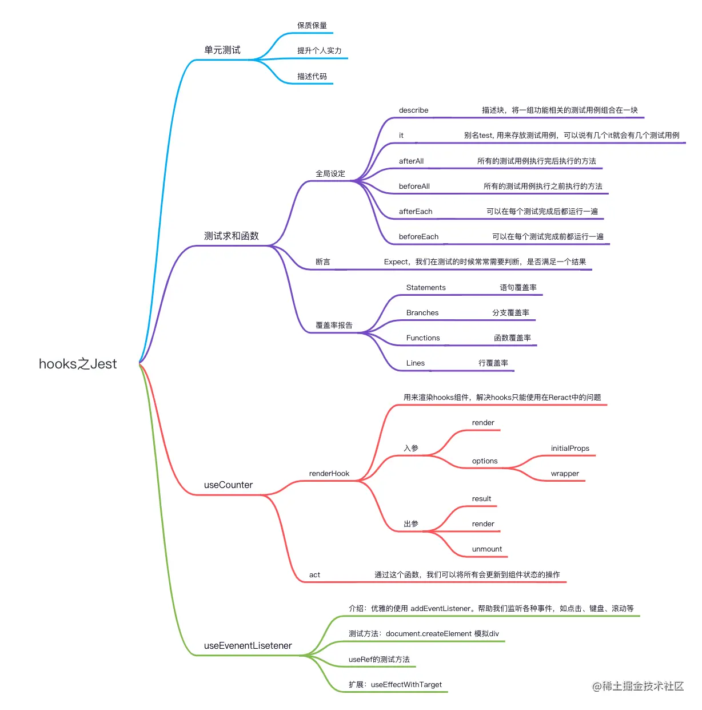
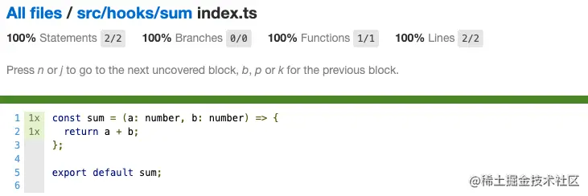
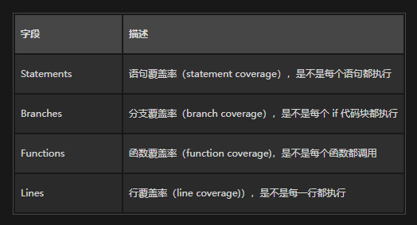
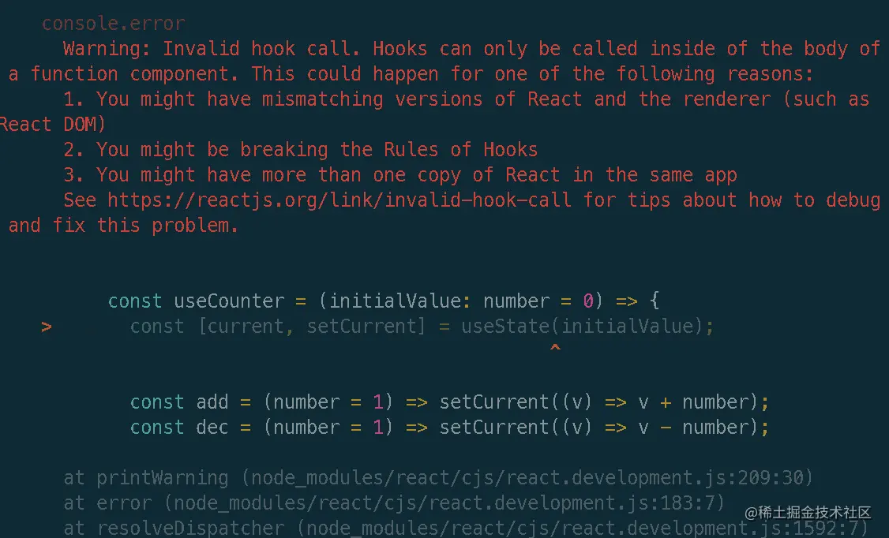
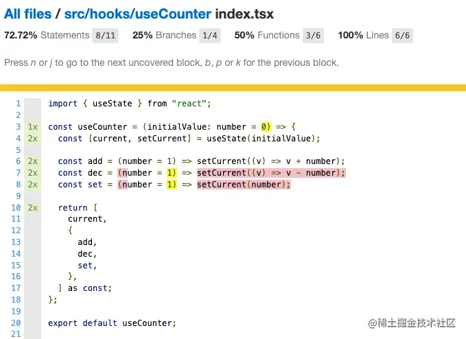
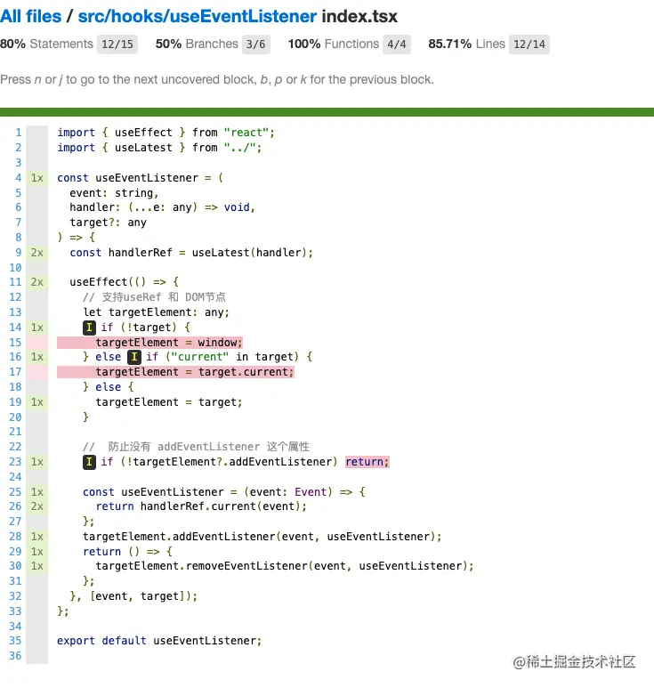
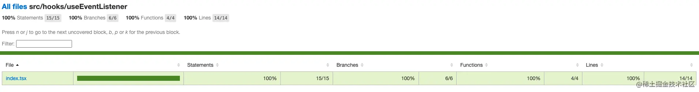
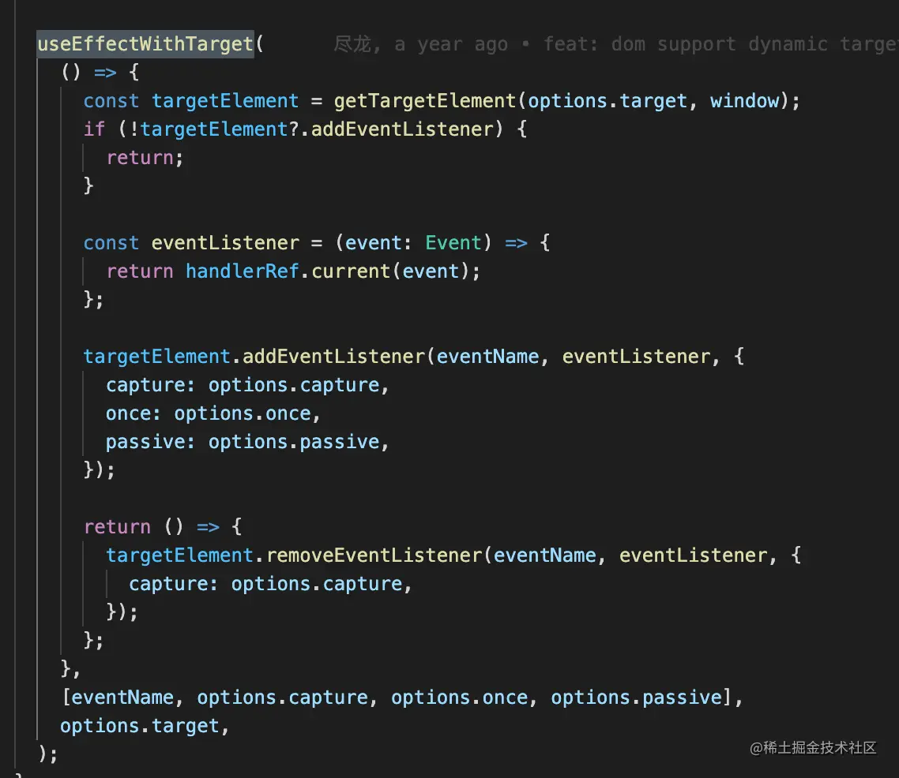
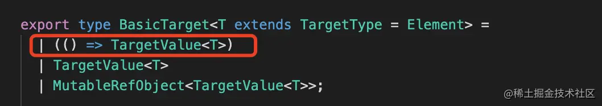

我们先写一个简单的求和函数，来看看是怎样的：

```ts
 // src/hooks/sum/index.ts 
 const sum = (a: number, b: number) => {
  return a + b;
};

export default sum;

// src/hooks/sum/index.test.ts import sum from "./index";

describe("sum", () => {
  it("求和：1 + 2 = 3", () => {
    expect(sum(1, 2)).toEqual(3);
  });
});
```

### 全局设定

在 Jest 中，主要讲解下以下 6 种方法来帮助我们学习 Hooks，更多的方法还请参考：Jest-全局设定。

#### it

describe：描述块，将一组功能相关的测试用例组合在一块。

用法：`describe(name, fn)`

* name：string，描述的话语； 
* fn：() => void，将所有的代码写到这个函数里即可。

#### it

it：别名test，用来存放测试用例，可以说有几个 it 就会有几个测试用例。

用法：`it(name, fn, timeout)` 或 `test(name, fn, timeout)`

* name：string，测试名称； 
* fn：() => void，包含测试期望的函数； 
* timeout：number，默认：5s，可选，测试的超时时间。

#### afterAll 和 beforeAll

`afterAll`：所有的测试用例执行完后执行的方法，如果传入的回调函数返回值是 
`promise` 或者 `generator`，Jest 会等待 promise resolve 再继续执行。

beforeAll： 与 afterAll 相反， 所有的测试用例执行之前执行的方法。

用法：`afterAll(fn, timeout)`

* fn：() => void，执行的函数； 
* timeout：number，默认：`5s`，可选，测试的超时时间。

### 断言

断言：`Expect`，我们在测试的时候常常需要判断，是否满足一个结果，比如像上面的 `expect(sum(1, 2)).toEqual(3)` 就是为了验证，执行完 `sum` 函数后，结果是否等于 3。

接下来我们来看看一些常见的断言，详情：[Expect 断言](https://jestjs.io/zh-Hans/docs/25.x/expect#expectvalue) 。

| 基本断言 | 描述 |
| --- | --- |
| expect(value)	| 要测试一个值进行断言的时候，首先使用 expect 对值进行包裹 |
| expect(value)	| 用于测试相反的结果，也就是不等于 |
| toBeUndefined | 用于检查变量是否未定义，也就是说，只会匹配 undefined，比如说上面的 sum 返回的结果明显不是 undefined，如果使用，则会报错 |
| toBeDefined | 与 toBeUndefined 相反，必须匹配有值的情况 |
| toBe | 使用 Object.is 来进行比较，严格的比较，需要注意的是，如果进行浮点数的比较，要使用 toBeCloseTo，可以理解为 === |
| toEqual(value) | 用于对象的深度，它一般比较的是对象的值，而并非对象本身 |
| toMatch(regexpOrString) | 用来检查字符串是否匹配，可以是正则表达式或者字符串 |
| toContain(item) | 用来判断 item 是否在一个数组中，也可以用于字符串的判断 |
| toBeNull(value)	 | 只匹配 null |
| toBeUndefined(value) | 只匹配 undefined |
| toBeGreaterThan(number) | 大于 |
| toBeGreaterThanOrEqual(number) | 大于等于 |
| toBeLessThan(number)	 | 小于 |
| toBeLessThanOrEqual(number) | 小于等于 |

### 覆盖率报告

运行：`npm run test` 即可看到测试的结果，同时增加 `--coverage`，它可以帮助我们生成对应的覆盖率报告文件，为了效果更加明确，这里使用覆盖率文件的方式进行讲解。

会生成一个 `coverage` 文件（默认），这个文件包含很多种格式，如：`XML`、`JSON`、`HTML` 等，这里我们看 HTML 就可以了。

当我们找到对应的 sum 文件，是这样的：



终端上也是类似的样子，接下来看看四个字段分别是什么意思：



### 测试自定义 Hooks

自定义 Hooks 的本质是纯函数，那么我们可不可以用上述的方法去测试自定义 Hooks 呢？

先来尝试一下，创建一个简单的 Hooks：`useCounter`，里面有：增加、减少和设置三个功能。

```ts
import { useState } from "react";

const useCounter = (initialValue: number = 0) => {
  const [current, setCurrent] = useState(initialValue);

  const add = (number = 1) => setCurrent((v) => v + number);
  const dec = (number = 1) => setCurrent((v) => v - number);
  const set = (number = 1) => setCurrent(number);

  return [
    current,
    {
      add,
      dec,
      set,
    },
  ] as const;
};

export default useCounter;
```

```ts
import useCounter from "./index";

describe("useCounter 测试", () => {
  it("数字加1", () => {
    const [counter, { add }] = useCounter(7);
    expect(counter).toEqual(7);
    add();
    expect(counter).toEqual(8);
  });
});
```

这么一看似乎没什么问题，一开始是 7，触发 add 方法后，counter 变成 8，那么来看看 test 的结果：



可是，此时却报错了，这是因为在 `useCounter` 中运用了 `useState`，但 useState 等 Hooks 只能在 React 中才行，在其他地方引用都会有这个问题，因此我们需要引入 renderHook 和 act 来解决测试问题。

### renderHook

`renderHook`：顾名思义，这个函数就是用来渲染 Hooks，它会帮助我们解决 Hooks 只能在组件中使用的问题（生成一个专门用来测试的 `TestComponent` )。

```ts
function renderHook<Result, Props>(
    render: (props: Props) => Result,
    options?: RenderHookOptions<Props>,
): RenderHookResult<Result, Props>
```

入参：

* `render`： callBack 函数，这个函数会在 TestComponent 每次被重新渲染的时候调用，所以这个函数放入我们想测试的 Hooks 就行；
* `options`：可选的 options，有两个属性，分别是 initialProps 和 wrapper。

options 的参数：

* result：结果，是一个对象结构，包含 current（保存 TestComponent 返回的 callback 值）和 error（所有错误存放的值）； 
* render：用来重新渲染 TestComponent，并且可以接受一个 newProps（参数）传递给 TestComponent； 
* unmount：用来卸载 TestComponent，主要用来覆盖一些 useEffect cleanup 函数的场景。

### act

`act`：这个函数和 React 自带的 test-utils 的 act 函数是同一个函数，通过这个函数，我们可以将所有会更新到组件状态的操作封装在它的 callback 下，简单来说，我们如果对 TestComponent 有操作，改变 result 的值，就需要放到 act 下。

我们用 rebderHook 和 act 来解决下问题：

```ts
    import useCounter from "./index";
    import { act, renderHook } from "@testing-library/react";

    describe("useCounter 测试", () => {
      it("数字加1", async () => {
        const { result } = renderHook(() => useCounter(7));
        expect(result.current[0]).toEqual(7);

        act(() => {
          result.current[1].add();
        });

        expect(result.current[0]).toEqual(8);
      });
    });
```



至于红色效果则代表代码没有执行，只要补齐相关代码即可，就能达到 100%。

### DOM Hooks 核心：useEventListener

`useEventListener`：优雅地使用 `addEventListener`，帮助我们监听各种事件，如点击、键盘、滚动等。

分析：在 `addEventListener` 之上封装，也就是说这个钩子没有返参的情况，我们只需要考虑入参即可。

1. event 事件：需要告诉监听的是事件，如 `click`、`keydown`； 
2. 回调函数：监听后所执行的回调函数； 
3. 目标值：具体监听哪个节点的，还是全局的。

> 为了方便起见，这个 Hooks 就不写对应的 ts 了，因为这里面也会用到函数重载，代码过长不太方便查看。

```ts
    import { useEffect } from "react";
    import { useLatest } from "../";

    const useEventListener = (
      event: string,
      handler: (...e: any) => void,
      target?: any
    ) => {
      const handlerRef = useLatest(handler);

      useEffect(() => {
        // 支持useRef 和 DOM节点
        let targetElement: any;
        if (!target) {
          targetElement = window;
        } else if ("current" in target) {
          targetElement = target.current;
        } else {
          targetElement = target;
        }

        //  防止没有 addEventListener 这个属性
        if (!targetElement?.addEventListener) return;

        const useEventListener = (event: Event) => {
          return handlerRef.current(event);
        };
        targetElement.addEventListener(event, useEventListener);
        return () => {
          targetElement.removeEventListener(event, useEventListener);
        };
      }, [event, target]);
    };

    export default useEventListener;
```

因为 `useRef` 的固定结构为 `current`，所以这里我们做个兼容，让它支持 useRef 和普通 DOM 传递的两种方式。

### 如何测试？

我们要测试 `useEventListener`，首先要创建一个 DOM 节点，然后模拟对应的点击事件。

可以直接通过 `document.createElement('div')` 来创建一个div，并将它绑定在 body 上，然后通过 useEventListener 来监听测试。如：

```ts
    import { renderHook } from "@testing-library/react";
    import useEventListener from "./";

    describe("useEventListener", () => {
      it("should be defined", () => {
        expect(useEventListener).toBeDefined();
      });

      let container: HTMLDivElement;

      beforeEach(() => {
        container = document.createElement("div"); // 创建一个div
        document.body.appendChild(container);
      });

      afterEach(() => {
        document.body.removeChild(container); // 卸载
      });

      it("测试监听点击事件", async () => {
        let count: number = 0;
        const onClick = () => {
          count++;
        };
        const { rerender, unmount } = renderHook(() =>
          useEventListener("click", onClick, container)
        );

        document.body.click(); // 点击 document应该无效
        expect(count).toEqual(0);
        container.click(); // 点击 container count + 1
        expect(count).toEqual(1);
        rerender(); // 重新渲染
        container.click(); // 点击 container count + 1
        expect(count).toEqual(2);
        unmount(); // 卸载
        container.click(); // 点击 container 应该无效
        expect(count).toEqual(2);
      });
    });
```

大概解释步骤：

1. 通过 `beforeEach` 和 `afterEach` 创建 DOM 元素（container）并卸载； 
2. 用 `renderHook` 监听对应的元素的点击事件，如果点击了，`count + 1`； 
3. 首先在 `body` 上进行点击，不应该触发 click 事件，count = 0； 
4. 然后点击 `container`，触发 click 事件，count = 1； 
5. 通过 `rerender()` 将 Hooks 重新渲染一遍，再点 container，看看会不会有影响，此时会触发 click 事件，count = 2； 
6. 最后 `unmount` 卸载函数，再点击 `container`，此时已经卸载，所以无法触发，触发 `click` 事件，`count` 应该等于2。

覆盖率报告：



### useRef 解决

```ts
    if ('current' in target) {
       targetElement = target.current;
    }
```

我们知道，上述代码是处理 useRef 对象的，那么我们在测试的时候是不是要利用 useRef 呢？再通过 ref 对象绑定到对应的 DOM 节点上？

实际上，并不用，因为我们 `useRef` 存储的对象都在 `current` 下，所以我们只需要进行对应的模拟就 OK 了。如：

```ts
  beforeEach(() => {
    containerRef = {
      current: {},
    };
  });
  
  it("测试监听点击事件", async () => {
    let count: number = 0;
    const onClick = () => {
      count++;
    };
    renderHook(() => useEventListener("click", onClick, containerRef));

    document.body.click();
    expect(count).toEqual(0);
  });
```

其他的也是同理，这里就不再介绍了，当所有的条件都走完，就会到达 100%。




### 扩展：useEffectWithTarget

`ahooks` 源码中的 `useEventListener` 实现原理与上述讲的一样，但阅读后发现有一个 `useEffectWithTarget`，如：



通过对应的代码，我们看到这个方法基本就做了一件事，就是兼容 target，如：



那么为什么会多一个函数的呢？实际上是因为 SSR，SSR 的类型为 `() => HTMLElement`， 但如果把函数作为 useEffect 的参数，此时就会当 deps 不存在，也就是有其他变量改变时，`useEffect` 都会执行。

所以，为了全面支持 target 动态变化，才会有 useEffectWithTarget 的诞生～

### 小结

本节学习了有关单元测试的概念，知道测试普通函数与自定义 Hooks 的测试方法，当然本文并没有详细讲解 Jest，只是介绍 Jest 的使用，帮助我们更好地完善自定义 `Hooks`。

除此之外，我还希望大家注意以下几个问题：

1. 本文使用的 renderHook 直接从 `@testing-library/react` 拿出的，这是因为 `@testing-library/react@13.1.0` 以上，把 `renderHook` 内置了，并且这个版本必须配合 React v18 使用，如果是 v18 以下的版本，可以使用 `@testing-library/react-hooks`；
2. 当我们自行配置环境的时候，要注意 Jest 本身的环境是 `node`，如果要配置成浏览器环境需要：`"testEnvironment": "jsdom"`；
3. 调试，我们在直接用 `console.log` 打印数据的时候，是打印不出来的，必须使用 `--debug`，当然也可以直接使用 `vscode` 的插件，这里只是为了效果更加好看，才用文件去看。

本节所介绍的 `useEventListener` 是 DOM 类 Hooks 的核心 API，下一节我们将会围绕 `useEventListener` 介绍其他有关 DOM 类的 `Hooks`，包括如何测试页面的开启与关闭、网络等方面的测试。


