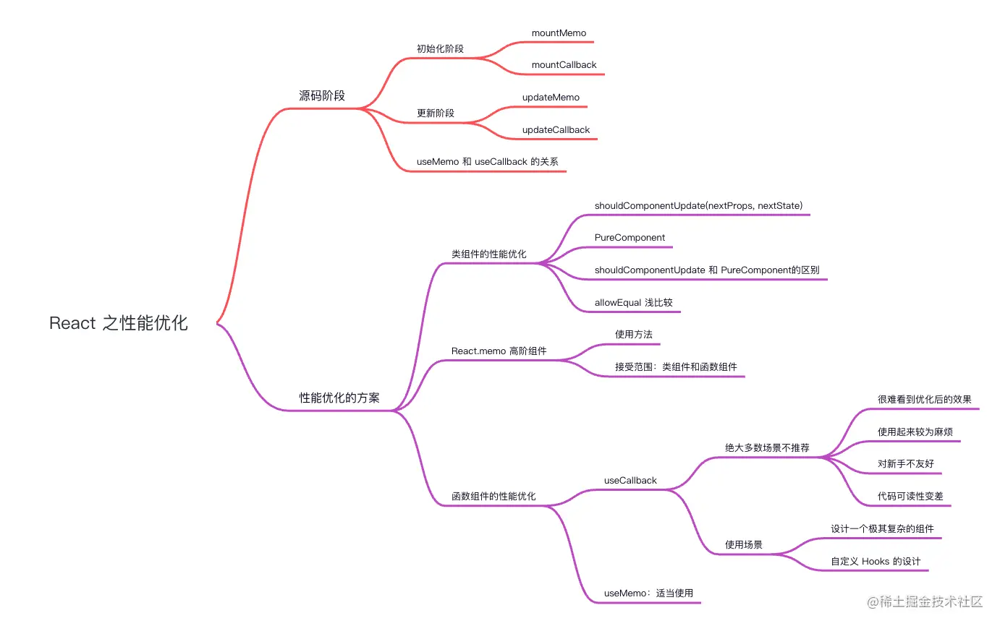

### useMemo、useCallback 源码

从源码角度上来看，`useMemo` 和 `useCallback` 并不复杂，甚至两者的源码十分相似，所以这里我们直接放到一起观看。

### mountMemo/mountCallback（初始化）

```ts
// mountMemo
function mountMemo<T>(
  nextCreate: () => T, 
  deps: Array<mixed> | void | null,
): T {
  const hook = mountWorkInProgressHook();
  const nextDeps = deps === undefined ? null : deps;
  const nextValue = nextCreate();
  hook.memoizedState = [nextValue, nextDeps];
  return nextValue;
}

// mountCallback
function mountCallback<T>(
  callback: T,
  deps: Array<mixed> | void | null
): T {
  const hook = mountWorkInProgressHook();
  const nextDeps = deps === undefined ? null : deps;
  hook.memoizedState = [callback, nextDeps];
  return callback;
}
```

在初始化中，`useMemo` 首先创建一个 `hook`，然后判断 deps 的类型，执行 `nextCreate`，这个参数是需要缓存的值，然后将值与 deps 保存到 memoizedState 上。

而 `useCallback` 更加简单，直接将 `callback` 和 `deps` 存入到 `memoizedState` 里。

### updateMemo/updateCallback（更新）

```ts
// updateMemo
function updateMemo<T>(
  nextCreate: () => T,
  deps: Array<mixed> | void | null,
): T {
  const hook = updateWorkInProgressHook();
  // 判断新值
  const nextDeps = deps === undefined ? null : deps;
  const prevState = hook.memoizedState;
  if (prevState !== null) {
    if (nextDeps !== null) {
      //之前保存的值
      const prevDeps: Array<mixed> | null = prevState[1];
      // 与useEffect判断deps一致
      if (areHookInputsEqual(nextDeps, prevDeps)) {
        return prevState[0];
      }
    }
  }
  const nextValue = nextCreate();
  hook.memoizedState = [nextValue, nextDeps];
  return nextValue;
}

// updateCallback
function updateCallback<T>(callback: T, deps: Array<mixed> | void | null): T {
  const hook = updateWorkInProgressHook();
  const nextDeps = deps === undefined ? null : deps;
  const prevState = hook.memoizedState;
  if (prevState !== null) {
    if (nextDeps !== null) {
        //之前保存的值
      const prevDeps: Array<mixed> | null = prevState[1];
      // 与useEffect判断deps一致
      if (areHookInputsEqual(nextDeps, prevDeps)) {
        return prevState[0];
      }
    }
  }
  hook.memoizedState = [callback, nextDeps];
  return callback;
}
```

在更新过程中，`useMemo` 实际上只做了一件事，就是通过判断两次的 deps 是否发生改变，如果发生改变，则重新执行 `nextCreate()`，将得到的新值重新复制给 `memoizedState`；如果没发生改变，则直接返回缓存的值。

而 `useCallBack` 也是同理。通过判断 deps 是否相等的 `areHookInputsEqual`，与 `useEffect` 中的一致，所以这里不做过多赘述。

`useMemo` 和 `useCallback` 的关系：

从源码角度上来看，无论初始化，亦或者更新，`useMemo` 比 `useCallback` 多了一步，即执行 `nextCreate()` 的步骤，那么说明 `useCallback(fn, deps)` 等价于 `useMemo(() => fn, deps)` 。

> 注意：`useMemo` 中的 `nextCreate()` 中如果引用了 `useState` 等信息，无法被垃圾机制回收（闭包问题），那么访问的属性有可能不是最新的值，所以需要将引用的值传递给 deps，则重新执行 nextCreate()。

### 性能优化的几种方案

我们知道 `useMemo`、 `useCallback` 是函数组件提供的优化方案，除此之外，React 还提供其余两种优化方案，接下来一起来看看，有何异同。

#### 1.类组件的性能优化

在类组件中主要包含两种方式，分别是 `shouldComponentUpdate` 和 `PureComponent` 。

**shouldComponentUpdate(nextProps, nextState)** ：生命周期函数，通过比较nextProps（当前组件的 this.props） 和 `nextState`（当前组件的 this.state），来判断当前组件是否有必要继续执行更新过程。

如果 `shouldComponentUpdate` 返回的结果为 `true`，则继续执行对应的更新；如果为 `false`，则代表停止更新，用于减少组件的不必要渲染，从而优化性能。

`PureComponent`：与 Component 的用法基本一致，但 PureComponent 会对props 和 state 进行浅比较，从而跳过不必要的更新（减少 render 的次数），提高组件性能。

那么浅比较是什么呢？先举个例子来看看：

```ts
import { PureComponent } from "react";
import { Button } from "antd";

class Index extends PureComponent<any, any> {
  constructor(props: any) {
    super(props);
    this.state = {
      data: {
        number: 0,
      },
    };
  }

  render() {
    const { data } = this.state;
    return (
      <>
        <div> 数字: {data.number}</div>
        <Button
          type="primary"
          onClick={() => {
            const { data } = this.state;
            data.number++;
            this.setState({ data });
          }}
        >
          数字加1
        </Button>
      </>
    );
  }
}

export default Index;
```


