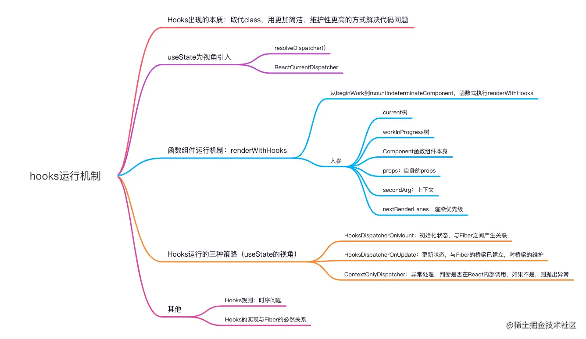

我们知道，如果 React 并没有 Hooks，那么函数式组件只能接收 props，渲染 UI，做一个展示组件，所有的逻辑就要在 Class 中书写，这样势必会导致 Class 组件内部错综复杂、代码臃肿。而函数式组件则不然，它能做 Class 组件的功能，拥有属于自己的状态，处理一些副作用，获取目标元素的属性、缓存数据等，所以有必要做一套函数式组件代替类组件的方案，Hooks 也就诞生了。

Hooks 拥有属于自己的状态，提供了 `useState` 和 `useReducer` 两个 `Hook`，解决自身的状态问题，取代 Class 组件的 this.setState。

在我们日常工作中最常用的就是 useState，我们就从它的源码入手，了解函数式组件是如何拥有自身的状态，如何保存数据、更新数据的。全面掌握 useState 的运行流程，就等同于掌握整个 Hooks 的运行机制。

先附上一张今天的知识图谱：



### 引入 useState 后 发生了什么

```ts
import { Button } from "antd";
import { useState } from "react";
const Index = () => {
  const [count, setCount] = useState(0);
  return (
    <><div>Hooks </div><div>数字：{count}</div><Button onClick={() => setCount((v) => v + 1)}>点击加1</Button></>
  );
};

export default Index;
```

在上述的例子中，我们引入了 useState，并存储 count 变量，通过 setCount 来控制 count。也就是说，count 是函数式组件自身的状态，setCount 是触发数据更新的函数。

在通常的开发中，当引入组件后，会从引用地址跳到对应引用的组件，查看该组件到底是如何书写的。

文件位置：`packages/react/src/ReactHooks.js` 。

```ts
export function useState<S>(
  initialState: (() => S) | S,
): [S, Dispatch<BasicStateAction<S>>] {
  const dispatcher = resolveDispatcher();
  return dispatcher.useState(initialState);
}
```

可以看出 `useState` 的执行就等价于` resolveDispatcher().useState(initialState)`，那么我们顺着线索看下去：

#### resolveDispatcher() ：

```ts
function resolveDispatcher() {
  const dispatcher = ReactCurrentDispatcher.current;
  return ((dispatcher: any): Dispatcher);
}
```

#### ReactCurrentDispatcher：

文件位置：`packages/react/src/ReactCurrentDispatcher.js` 。

```ts
const ReactCurrentDispatcher = {
  current: (null: null | Dispatcher),
};
```

通过类型可以看到 `ReactCurrentDispatcher` 不是 `null`，就是 `Dispatcher`，而在初始化时 `ReactCurrentDispatcher.current` 的值必为 `null`，因为此时还未进行操作。

那么此时就很奇怪了，我们并没有发现 `useState` 是如何进行存储、更新的，`ReactCurrentDispatcher.current` 又是何时为 Dispatcher 的？

既然我们在 useState 自身中无法看到存储的变量，那么就只能从函数执行开始，一步一步探索 useState 是如何保存数据的。

### 函数式组件如何执行的？

在上节 Fiber 的讲解中，了解到我们写的 JSX 代码，是被 `babel` 编译成 `React.createElement` 的形式后，最终会走到 `beginWork` 这个方法中，而 `beginWork` 会走到 `mountIndeterminateComponent` 中，在这个方法中会有一个函数叫 `renderWithHooks`。

renderWithHooks **就是所有函数式组件触发函数**，接下来一起看看：

文件位置：`packages/react-reconciler/src/ReactFiberHooks`。

```ts
export function renderWithHooks<Props, SecondArg>(
  current: Fiber | null,
  workInProgress: Fiber,
  Component: (p: Props, arg: SecondArg) => any,
  props: Props,
  secondArg: SecondArg,
  nextRenderLanes: Lanes,
): any {
  currentlyRenderingFiber = workInProgress;

  // memoizedState: 用于存放hooks的信息，如果是类组件，则存放state信息
  workInProgress.memoizedState = null;
  //updateQueue：更新队列，用于存放effect list，也就是useEffect产生副作用形成的链表
  workInProgress.updateQueue = null;

  // 用于判断走初始化流程还是更新流程
  ReactCurrentDispatcher.current =
    current === null || current.memoizedState === null
      ? HooksDispatcherOnMount
      : HooksDispatcherOnUpdate;

  // 执行真正的函数式组件，所有的hooks依次执行
  let children = Component(props, secondArg);

  finishRenderingHooks(current, workInProgress);

  return children;
}

function finishRenderingHooks(current: Fiber | null, workInProgress: Fiber) {
    
  // 防止hooks乱用，所报错的方案
  ReactCurrentDispatcher.current = ContextOnlyDispatcher;

  const didRenderTooFewHooks =
    currentHook !== null && currentHook.next !== null;

  // current树
  currentHook = null;
  workInProgressHook = null;

  didScheduleRenderPhaseUpdate = false;
}
```


