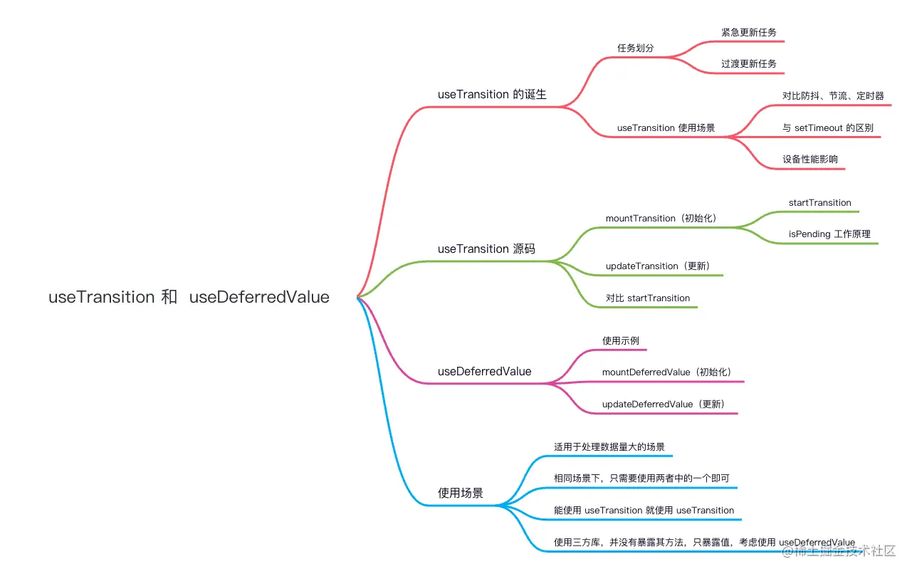

在 React v18 中，引入了 `useTransition` 和 `useDeferredValue` 两个 Hooks，它们都是用来处理数据量大的数据，比如百度的搜索框、散点图等



我们先回顾一下什么是过渡更新任务和紧急更新任务？

* 紧急更新任务：用户立马能够看到效果的任务，如输入框、按钮等操作，在视图上产生效果的任务。
* 过渡更新任务：由其他因素引起的任务，导致无法在视图上看到效果的任务，如请求接口数据，需要一个 `loading...` 的状态

> 这里的任务只是针对单一状态，同一操作可能会有多种任务发生。

为了更好的理解，我们先来看这样一个例子。

假设我们有一个 `input` 输入框，这个输入框的值要维护一个很大列表（假设列表有 2w 条数据），比如说过滤、搜索等情况，这时有两种变化：

1. input 框内的变化；
2. 根据 input 的值，1w 条数据的变化。

`input` 框内的变化是实时获取的，也就是受控的，此时的行为就是紧急更新任务。


而这 2w 条数据的变化，就会有过滤、重新渲染的情况，此时这种行为被称为 **过渡更新任务** 。

了解完紧急更新任务和过渡更新任务后，正式来看看 `useTransition` 究竟是如何处理大数据的。

### useTransition 的诞生

在介绍并发的时候提及到 `useTransition` 内更新的事件会采取 Concurrent 模式，而 `Concurrent` 模式可以中断，让优先级高的任务先进行渲染，让用户有更好的体验。

换言之，`useTransition` 是用于一些不是很急迫的更新上，同时解决并发渲染的问题而诞生的。

> 值得注意的是：useTransition 一定是处理数据量大的数据。

```ts
// utils 
export const count = 20000; // 渲染次数

import { useState } from "react";
import { Input } from "antd";
import { count } from "./utils";

// 正常情况
const Index: React.FC<any> = () => {
  const [list, setList] = useState<string[]>([]);

  return (
    <>
      <Input
        onChange={(e) => {
          const res: string[] = [];
          for (let i = 0; i < count; i++) {
            res.push(e.target.value);
          }
          setList(res);
        }}
      />
      {list.map((item, index) => (
        <div key={index}>{item}</div>
      ))}
    </>
  );
};

export default Index;
```

在案例中，我们有一个输入框，输入内容时会在下方输出 2w 数据。

在 `useTransition` 中，可以看出在输入数字时，input 框内会正常显示，而列表会滞后，同时 useTransition 提供 isPending 来处理更新是否完成。这种效果明显给用户带来了极好的体验。

### 对比防抖、节流、定时器

防抖模式下的效果：

`防抖 (Debouncing)` ：指在一定时间内，多次触发同一个事件，只执行最后一次操作。

在防抖的示例中，我们发现交互效果得到了明显的改善，因为用户在连续输入时，只在最后一次才做处理，在此之前，浏览器的渲染引擎并没有被阻塞，所以可以看到输入框的内容。

节流模式下的效果：

`节流（Throttling` ：指在一定时间内，多次触发同一个事件，只执行第一次操作。

### useTransition 与定时器的异同

我们先看看防抖、节流、setTimeout 存在的问题。

* 防抖：延迟 React 更新操作，换言之，快速长时间输入，列表依旧等不到响应，但列表得到响应后，渲染引擎依旧会出现阻塞，导致页面卡顿。
* 节流：节流在一段时间内开始处理，渲染引擎也会出现阻塞，页面会卡顿，而节流的时间需要手动配置。
* setTimeout：setTimeout 也是同理，依旧会出现阻塞、卡顿，所以依然会阻止页面交互。

我们知道，防抖和节流的本质都是定时器，虽然能在一定的程度上改善交互效果，但依旧不能解决卡顿或卡死的情况。因为 React 的更新不可中断，导致 JS 引擎长时间占据浏览器的主线程，使得渲染引擎被长时间阻塞。


