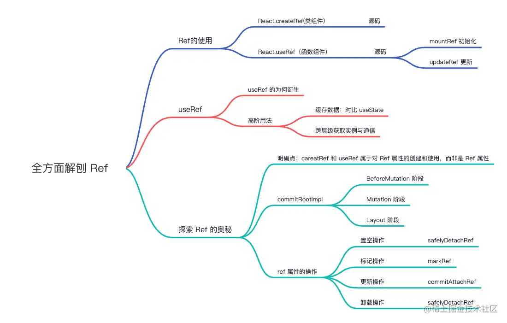
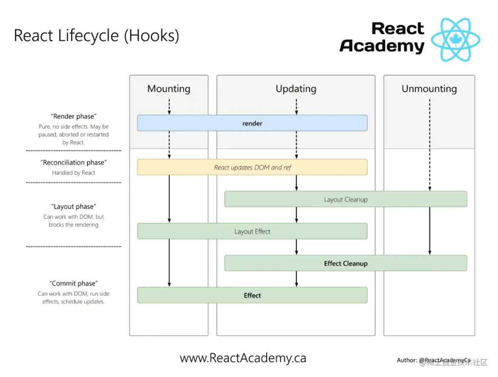
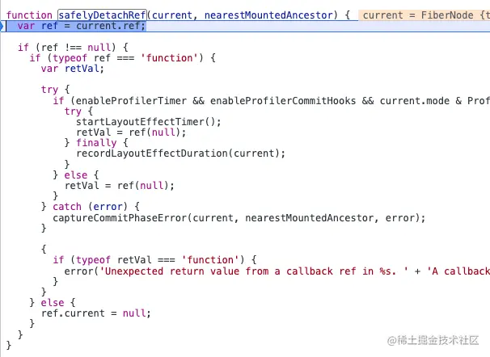

Ref 是我们工作中常用的 API，我们通常用它获取真实 DOM 元素和获取类组件实例层面上，但 Ref 本身还存在进阶的用法。




### Ref 的基本使用

关于 Ref，React 主要提供 `React.createRef`（类组件） 和 `React.useRef`（函数组件） 两种方式进行创建，会生成一个 ref 对象，结构为：

```ts
{
    current: null; 
}
```

current 为 ref 对象获取的实际内容，可以是 DOM 元素、组件实例、其他元素。

具体使用：

```ts
import { Component, createRef, useEffect, useRef } from "react";

// createRef: 类组件
class Index extends Component<any, any> {
  currentRef: any;
  constructor(props: any) {
    super(props);
    this.currentRef = createRef();
  }

  componentDidMount() {
    console.log(this.currentRef);
  }

  render() {
    return <div ref={this.currentRef}>class 中获取 Ref 的实例</div>;
  }
}

// useRef：函数组件
const Data = () => {
  const currentRef = useRef<any>();

  useEffect(() => {
    console.log(currentRef);
  }, []);

  return <div ref={currentRef}>函数中获取 Ref 的实例</div>;
};
```

打印结果：


我们发现类组件中的 `createRef` 和函数组件中的 `useRef` 用法基本相同。

> 问：DOM 元素的获取一定要通过 ref 对象获取吗？


> 可以看到除了 ref 对象的方式，还提供字符串（只能用在 Class 中）和回调函数的情况。但随着时间的发展，字符串的方式逐渐被淘汰。

了解 `createRef` 和 `useRef` 的用法后，再来看看两者在源码中的逻辑是怎样的。

### createRef 源码

```ts
export function createRef(): RefObject {
  const refObject = {
    current: null,
  };
  return refObject;
}
```

### useRef 源码

`useRef` 的源码分为 `mountRef（初始化）` 和 `updateRef(更新）`阶段。

```ts
// 初始化
function mountRef<T>(initialValue: T): {current: T} {
  const hook = mountWorkInProgressHook();
  const ref = {current: initialValue};
  hook.memoizedState = ref;
  return ref;
}

// 更新
function updateRef<T>(initialValue: T): {current: T} {
  const hook = updateWorkInProgressHook();
  return hook.memoizedState;
}
```

从源码的角度来看，`createRef` 和 `useRef` 的逻辑非常简单，两者都是创建了一个对象，对象上的 `current` 属性，用来保存通过 `ref` 属性获取的 DOM 元素、组件实例、数据等，以便后续使用。

但两者的保存位置不同，`createRef` 保存的数据通过实例 `instance` 维护，而 `useRef` 通过 `memoizedState` 维护。

接下来着重看看 `useRef` 诞生的原因，探寻其中的奥秘。

### useRef 的诞生

在上文中，我们发现 ，`createRef` 和 `useRef` 的底层逻辑实际上是相差无几的。那么就产生了这样一个疑问：为什么不能直接在函数组件中使用 createRef 呢？而是会多出一个新的 API 呢？

假设我们在函数组件中使用 `createRef`，来看看它与 `useRef` 具体有什么不同：

```ts
import { useState, useRef, createRef } from "react";
import { Button } from "antd";

const Index = () => {
  const [count, useCount] = useState(0);

  const ref = useRef(0);
  const cRef = createRef(0);

  if (!ref.current) {
    ref.current = count;
  }

  if (!cRef.current) {
    cRef.current = count;
  }

  return (
    <>
      <div>{count}</div>
      <div>useRef 包裹的数字 {ref.current}</div>
      <div>createRef 包裹的数字 {cRef.current}</div>
      <Button type="primary" onClick={() => useCount((v) => v + 1)}>
        点击加1
      </Button>
    </>
  );
};

export default Index;
```

`useRef` 和 `createRef` 创建的 ref 对象只有在没有值的情况下，才会被 count 的赋值，但在实际效果中，每次点击按钮，`createRef` 创建的 `cRef` 仍然在变化，这就说明每次渲染时，cRef 的值始终不存在。

这是因为类组件和函数组件的机制不同，通俗来讲就是生命周期的问题。

在类组件中是将生命周期分离出来的，有明确的 `componentDidMount`、`componentDidUpdate` 等 API，createRef 在初始化的过程中被初始化，在更新过程中并不会初始化类组件的实例，所以在非手动更改的情况下，createRef 的值并不会改变。

但函数组件则不同，虽然被说是组件，但其行为仍是函数，在渲染和更新时，仍然会重新执行、重新创建、对所有的变量和表达式进行初始化。因此，`createRef` 每次都会被执行，对应的值也为 `null`，每次都会被重新赋值。

为了解决这个问题，`useRef` 诞生了。通过与函数组件对应的 Fiber 建立关联，将 `useRef` 创建的 ref 对象挂载到对应的 Fiber上，只要组件不被销毁，对应 Fiber 上的对象就一直存在，无论函数组件如何重新执行，都能拿到对应的 ref 值，这也是函数组件能拥有自己状态的根本原因。

经过上面的总结，我们得出 `createRef` 只能运用在类组件，`useRef` 只能运用在函数组件上。


### useRef 高阶用法

通过上面介绍了 `ref` 的基本用法，`createRef` 在函数组件中出现的问题，所衍生出 `useRef`。除此之外，在一些特定的场合中需要 useRef 配合完成，使项目中写的组件更加灵活多变。

### 缓存数据：对比 useState

`useRef` 除了获取 DOM 元素之外，还可以接受一些其他元素，用来保存数据，比如之前讲解的 `useLatest` 就是活用了这一特性

既然 `useRef` 可以缓存数据，而 `useState` 的作用也是缓存数据，那么可以用 `useRef` 来替换 `useState` 吗？

两者都可以缓存数据，那么又有何区别呢？

先做一个计数器的功能，来对比下：

```ts
import { useState, useRef } from "react";
import { Button } from "antd";

const Index: React.FC<any> = () => {
  const [count, setCount] = useState(0);
  const countRef = useRef<number>(0);

  return (
    <>
      <div>useState的count: {count}</div>
      <Button type="primary" onClick={() => setCount((v) => v + 1)}>
        useState 点击
      </Button>
      <div>ref的count: {countRef.current}</div>
      <Button
        type="primary"
        onClick={() => (countRef.current = countRef.current + 1)}
      >
        useRef 点击
      </Button>
    </>
  );
};

export default Index;
```

我们发现，`useState` 的 `count` 会随着点击按钮的变化而变化，`useRef` 的 `count` 并不会变化，但再次点击 `useState` 时，`useRef` 的 `count` 产生了变化

这说明 `useRef` 点击时，值发生了改变，但视图未发生改变，换句话说 `useRef` 并没有能力去触发 `render`，而 `useState` 能触发 `render`，这是两者最主要的区别。

其次，在更改值的时候，`useState` 是通过 `setCount` 去改变的，这也就说明 `count` 本身是 **不可改变** 的，而 `useRef` 是直接更改值，属于可变值。

那么是否可变，是否影响 React 的渲染呢？ 答案是肯定的，因为在渲染阶段时，React 并没有办法发现 `ref.current` 是何时发生改变的，这样在读取值的时候就会变得难以预测，所以在渲染阶段时，尽量使用 `state` 。

总的来说，`useState` 适用于自身组件的状态值，而 `useRef` 更适合存储外部通信的值，并且这些值不会影响 `render` 的逻辑。

比如在 `setTimeout`、`setInterval` 用到的值。

### 跨层级获取实例与通信

我们可以通过 `forwardRef` 转发 `ref` 来获取子组件的实例，获取一些方法、值，并且可以自定义设置 ref 的值。

```ts
import { useRef, useEffect, Component, forwardRef } from "react";

class Son extends Component {
  render() {
    return <div>我是孙组件</div>;
  }
}

class Child extends Component<any, any> {
  constructor(props: any) {
    super(props);
    this.state = {
      count: 0,
    };
  }

  div: any = null;
  son: any = null;
  componentDidMount() {
    this.props.forwardRef.current = {
      div: this.div, // 子组件的div
      child: this, // 子组件的实例
      son: this.son, // 孙组件的实例
    };
  }

  render() {
    return (
      <>
        <div ref={(node) => (this.div = node)}>我是子组件</div>
        <Son ref={(node) => (this.son = node)} />
      </>
    );
  }
}

const ForwardChild = forwardRef((props, ref) => (
  <Child {...props} forwardRef={ref} />
));

const Index = () => {
  const ref = useRef(null);

  useEffect(() => {
    console.log(ref.current);
  }, []);

  return ( <ForwardChild ref={ref} /> );
};

export default Index;
```

打印下 Index 中的 `ref.current`：


在此场景中，在 `Index` 中获取到子组件 `Child` 的信息，包括 `props、state` 等信息，同时也可以获取到孙组件 Son 的信息。

当我们拿到对应的实例后，就可以做一些特定的事情，比如跨层级通信。

> 注意：这里使用的 Child 和 Son 是 Class 组件，不能为函数式组件，原因是函数式组件并没有实例，如果想要获取函数式组件的方法，可使用 `useImperativeHandle`，具体的使用在第三章中介绍过，就不做过多的赘述。

### 探索 Ref 的奥秘

首先，我们要特别明确一点：`createRef` 和 `useRef` 属于对 Ref 属性的创建和使用，而非是 `Ref 属性`。 
换言之，`ref` 属性和 `useRef` 是两个完全不同的东西，我们不能混为一谈。

当然，为了更好地掌握 `useRef`，我们应该探索 Ref 属性，在 React 中是如何处理 ref 的，以此彻底掌握相关的 Ref 问题。

关于 ref 属性，大体分为四段操作，分别是：`置空操作`、`标记操作`、`更新操作`、`卸载操作`。

在上文中提及到 ref 共用三种方式来获取，其中通过回调函数的情况有一个特殊的现象，我们先来看看：

```ts
import { Button } from "antd";
import { useState } from "react";

const Index = () => {
  const [_, setCount] = useState<number>(0);

  return (
    <>
      <div
        ref={(node) => {
          console.log(node);
        }}
      >
      </div>
      <Button type="primary" onClick={() => setCount((v) => v + 1)}>
        点击
      </Button>
    </>
  );
};

export default Index;
```

从函数式组件的时机来看，其根本还是因为生命周期的问题，我们看下 Hooks 的生命周期图：



可以看到，在 `Render phase`（渲染阶段） 是不允许做副作用，原因是在此阶段可能会被 React 引擎随时取消或重新渲染。

而修改 Ref 属于副作用操作，因此不能在 `Render` 阶段，而是在 `Commit` 阶段处理，或者在 `setTimeout` 中处理（脱离 React 的机制）。

换言之，所有关于 `Ref` 的操作，处理的方式都在 `Commit` 阶段。

> 但特别要注意，函数式组件是不允许 `ref` 属性的，也就是说，处理 `Ref` 的逻辑在 `Class` 组件和原生组件上。


### 浅谈 commitRootImpl

在 `useEffect` 源码的时候涉及过 `commitRootImpl`，从 `commit` 阶段的入口 `commitRoot` 到达 `commitRootImpl` 。

`commitRootImpl` 包含很多东西，主要包含三个阶段（这里只是提及下，感兴趣的可自行研究，在这里主要看 Ref 的处理逻辑）：

```ts
function commitRootImpl(){
    ...
    // BeforeMutation 阶段
    commitBeforeMutationEffects(root, finishedWork);
    
    // Mutation 阶段
    commitMutationEffects(root, finishedWork, lanes);
    
    // Layout 阶段
    commitLayoutEffects(finishedWork, root, lanes);
}
```

1. **BeforeMutation 阶段**： 进行 深度优先遍历，找到最后一个带有标识的 Fiber 作为起点（子 => 父 查找），然后会调用一个实例 `instance` 的 `getSnapshotBeforeUpdate` 方法，并生成快照对象，之后作为 `componentDidUpdate` 的第三个参数，这里主要针对的是 Class 组件的操作，对其他类型的组件并不做处理。
2. **Mutation 阶段**： 此阶段为核心阶段，是真正进行更新 DOM 树的阶段。 是真正处理 Class 组件、函数式组件以及原生组件的地方，同时也是增加、删除、更新的处理阶段。
3. **Layout 阶段**： 它与 **BeforeMutation** 阶段一样，也是先进行 深度优先遍历，找到最后一个带有标识的 Fiber 作为起点。之后会根据不同的组件处理不同的逻辑，比如函数式组件处理 useLayoutEffect 的回调函数。经历过此步骤后就会更新 ref，最终处理 `useEffect`，也就是在 useEffect 章节中的 Scheduler（异步） 调度器了

画个简易版的图，来帮助我们理解：


接下来，我们继续探索 React 对 ref 的处理方式。

### safelyDetachRef 置空/卸载操作

在更新的过程中，首先在 commit 的 Mutation 阶段，会将 ref 重置为 null，最终在 `safelyDetachRef` 函数中处理，如：



同时，`safelyDetachRef` 也是卸载操作，有关 Ref 的卸载也是在此函数中完成。在 v16 的版本中，置空操作是 `commitDetachRef` 函数，这点有所不同。

> 问：ref 的获取有字符串、函数、 ref 对象三种情况，但在 safelyDetachRef 函数中，只判断了是函数和 ref 对象的情况，那么字符串的形式，是如何走的？
> 答：当 ref 是字符串的情况时，实际上会走函数的方式，这是因为之前有统一处理 ref 的地方。

```ts
const ref = function(value: mixed) {
  const refs = resolvedInst.refs;
  if (value === null) {
    delete refs[stringRef];
  } else {
    refs[stringRef] = value;
  }
};
```

### markRef 标记操作

我们要知道 Ref 的更新是有条件的，并不是每一次 Fiber 更新都会让 ref 进行更新，只有具备 Ref tag 的时候才会更新。

所以，我们首先要明白 React 是如何打上 Ref tag 的。主要是在 `markRef` 函数中。

```ts
function markRef(current: Fiber | null, workInProgress: Fiber) {
  const ref = workInProgress.ref;
  if (
    (current === null && ref !== null) || // 初始化
    (current !== null && current.ref !== ref) // 更新时
  ) {
    // Schedule a Ref effect
    workInProgress.flags |= Ref;
    workInProgress.flags |= RefStatic;
  }
}
```

当然，`markRef` 是在 Class 组件或原生组件的更新过程中进行调用，同时分为两种情况，一种是初始化，另一种是更新中发生变化。

### commitAttachRef 更新操作

Ref 的更新操作在 `Layout` 阶段，在更新真实元素节点之后，会进行有关 Ref 的更新。 我们先来看下源码：

```ts
// 更新条件
if (flags & Ref) {
  safelyAttachRef(finishedWork, finishedWork.return);
}

// safelyAttachRef
function safelyAttachRef(current: Fiber, nearestMountedAncestor: Fiber | null) {
  try {
    commitAttachRef(current);
  } catch (error) {
    captureCommitPhaseError(current, nearestMountedAncestor, error);
  }
}

// commitAttachRef 更新操作
function commitAttachRef(finishedWork: Fiber) {
  const ref = finishedWork.ref;
  if (ref !== null) {
    const instance = finishedWork.stateNode;
    let instanceToUse;
    switch (finishedWork.tag) {
      case HostResource:
      case HostSingleton:
      case HostComponent: // 原生元素
        instanceToUse = getPublicInstance(instance);
        break;
      default: // 类组件
        instanceToUse = instance;
    }
    if (enableScopeAPI && finishedWork.tag === ScopeComponent) {
      instanceToUse = instance;
    }
    if (typeof ref === 'function') {
      if (shouldProfile(finishedWork)) {
        try {
          startLayoutEffectTimer();
          finishedWork.refCleanup = ref(instanceToUse);
        } finally {
          recordLayoutEffectDuration(finishedWork);
        }
      } else {
        finishedWork.refCleanup = ref(instanceToUse);
      }
    } else {
      ref.current = instanceToUse;
    }
  }
}
```

当具备更新条件后会走到 `safelyAttachRef` 中，而 `safelyAttachRef` 中的主体是 `commitAttachRef` 函数。

`commitAttachRef` 函数主要判断是类组件还是原生组件，通过 tag 去判断，其中 `HostComponent` 是原生组件（在之前的 Fiber 中介绍过），Class 组件是直接使用的实例 `instance`，剩余的步骤与 `safelyDetachRef` 类似。

### 出现的原因

之所以会打印两次，是因为一次在 DOM 更新之前（即置空操作），另一次是 DOM 更新之后（即更新操作）。

说白了，在每次更新的时候，`markRef` 认为 `current.ref !== ref`，就会打上新的标签，导致在 `commit` 阶段会更新 ref，从而会打印两次。

### 小结

本章我们通过 `createRef` 和 `useRef` 的对比引出两者的底层逻辑相差无几，两者区别点在于存储的位置不同，通过 `createRef` 是否能在函数组件中使用的案例，总结出 `useRef` 诞生的原因。

之后我们学习 `useRef` 的高阶用法，对比 `useState`，明确两者的区别，以及为何不能用 `useRef` 替换 `useState`。

最后我们探索 ref 属性的奥秘，掌握 React 是如何处理 ref，其大体分为四段操作：置空操作、标记操作、更新操作、卸载操作。


