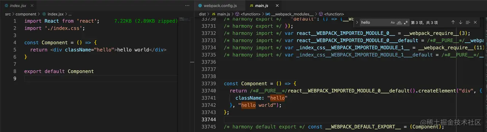
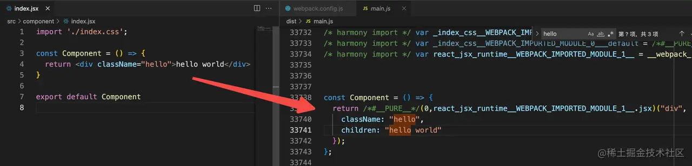
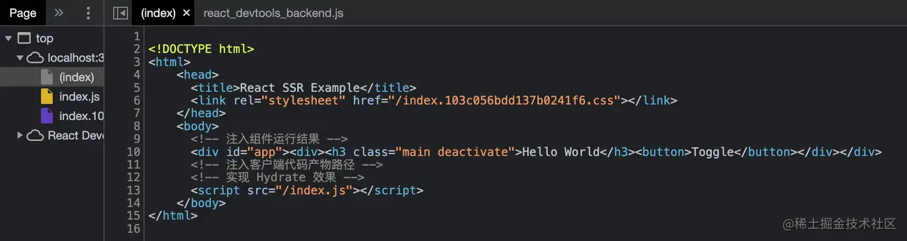

为支持这一特性，我们需要搭建一套使用的工程化环境，将 JSX 及 React 组件转换为能够在浏览器上运行的 JavaScript 代码。本文将递进介绍使用 Webpack 搭建 React 应用开发环境的主要方法，包括：

* 如何使用 `Babel` 处理JSX文件？ 
* 如何使用 `html-webpack-plugin`、`webpack-dev-server` 运行 `React` 应用？ 
* 如何在 React 中复用 `TypeScript`、Less 等编译工具？ 
* 如何搭建 React SSR 环境？ 
* 如何使用 `Create React App`？

### 使用 Babel 加载 JSX 文件

绝大多数情况下，我们都会使用 JSX 方式编写 React 组件，但问题在于浏览器并不支持这种代码，为此我们首先需要借助构建工具将 JSX 等价转化为标准 JavaScript 代码。

在 Webpack 中可以借助 `babel-loader`，并使用 React 预设规则集 `@babel/preset-react` ，完成 JSX 到 JavaScript 的转换，具体步骤：

```
yarn add -D webpack webpack-cli babel-loader @babel/core @babel/preset-react
```

修改 Webpack 配置，加入 babel-loader 相关声明：


```js
module.exports = {
  mode: 'none',
  module: {
    rules: [
      {
        test: /\.jsx$/,
        loader: "babel-loader",
        options: {
          presets: ["@babel/preset-react"],
        }
      },
    ],
  },
};
```

执行构建命令，如 npx webpack 

经过 babel-loader 处理后，JSX 将被编译为 JavaScript 格式的 React.createElement 函数调用，如：



此外，JSX 支持新旧两种转换模式，一是上图这种 React.createElement 函数，这种模式要求我们在代码中引入 React，如上图的 import React from "react"；二是自动帮我们注入运行时代码，此时需要设置 runtime:automatic，如：

```js
{
  test: /\.jsx$/,
  loader: 'babel-loader',
  options: {
    "presets": [
      ["@babel/preset-react", {
        "runtime": "automatic"
      }]
    ]
  }
}
```



这种模式会自动导入 react/jsx-runtime，不必开发者手动管理 React 依赖。

```js
module.exports = {
  mode: 'none',
  module: {
    rules: [
      {
        test: /\.jsx$/,
        loader: 'babel-loader',
        options: {
          'presets': [["@babel/preset-react", {
            "runtime": "automatic"
          }]]
        }
      },
      {
        test: /\.css$/,
        use: ["style-loader", "css-loader"],
      }
    ],
  },
};
```

### 运行页面

`babel-loader` 使得 `Webpack` 能够正确理解、翻译 JSX 文件的内容，接下来我们还需要用 `html-webpack-plugin` 和 `webpack-dev-server` 让页面真正运行起来，配置如下：

```js
const HtmlWebpackPlugin = require('html-webpack-plugin')

module.exports = {
  module: {/*...*/},
  devServer: {
    hot: true,
    open: true
  },
  plugins: [
    new HtmlWebpackPlugin({
      templateContent: `
<!DOCTYPE html>
<html>
  <head>
    <meta charset="utf-8">
    <title>Webpack App</title>
  </head>
  <body>
    <div id="app" />
  </body>
</html>
    `
    })
  ]
};
```

之后，运行 npx webpack serve 命令，即可自动打开带热更功能的页面：

### 复用其它编译工具

* 使用 babel-loader、ts-loader 加载 TSX 代码；
* 使用 less-loader、sass-loader 预处理样式代码。

社区有两种主流的 TSX 加载方案，一是使用 Babel 的 @babel/preset-typescript 规则集；二是直接使用 ts-loader。先从 Babel 规则集方案说起：

```js
yarn add -D typescript @babel/preset-typescript
```

```js
module.exports = {
  module: {
    rules: [
      {
        test: /\.tsx$/,
        loader: 'babel-loader',
        options: {
          'presets': [["@babel/preset-react", {
            "runtime": "automatic"
          }],
          '@babel/preset-typescript']
        }
      },
    ],
  },
}
```

之后，将组件文件后缀修改 .tsx，Babel 就会帮我们完成 TypeScript 代码编译。ts-loader 用法也很相似：

```js
yarn add -D typescript ts-loader
```

```js
module.exports = {
  resolve: {
    extensions: ['.js', '.jsx', '.ts', '.tsx'],
  },
  module: {
    rules: [
      {
        test: /\.tsx$/,
        use: 'ts-loader',
      },
    ],
  }
};
```

```json
{
  "compilerOptions": {
    //...
    "jsx": "react-jsx"
  }
}
```

完毕。两种方式功能效果相似，相对而言我个人更倾向于 babel-loader，因为 Babel 是一种通用的代码编译工具，配置适当 Preset 后能做的事情更多，相关经验更容易复用到其它场景。

```
yarn add -D less less-loader css-loader style-loader
```

其次，修改 Webpack 配置，添加 Less 文件相关处理规则：

```js
module.exports = {
  resolve: {
    extensions: ['.js', '.jsx', '.ts', '.tsx'],
  },
  module: {
    rules: [
      {
        test: /\.tsx$/,
        use: 'ts-loader',
      },
      {
        test: /\.less$/,
        use: ["style-loader", "css-loader", "less-loader"],
      },
    ],
  },
};
```

### 实现 Server Side Render

React 有许多实现 SSR 的方案，例如：[Next.js](https://github.com/vercel/next.js) 、[egg-react-ssr](https://github.com/zhangyuang/egg-react-ssr) 、[ssr（基于egg-react-ssr）](https://github.com/zhangyuang/ssr) 等，接下来我们尝试使用 Webpack、React、Express 搭建一套 React SSR 应用环境，一步步剖析关键技术点

```
├─ react-ssr-example
│  ├─ package.json
│  ├─ server.js
│  ├─ src
│  │  ├─ App.css
│  │  ├─ App.jsx
│  │  ├─ entry-client.jsx
│  │  ├─ entry-server.jsx
│  ├─ webpack.base.js
│  ├─ webpack.client.js
│  └─ webpack.server.js
```


1. 首先，需要为客户端环境准备项目入口文件 —— entry-client.js，内容：

```js
import { createRoot } from 'react-dom/client';
import App from './App';

const container = document.getElementById('app');
const root = createRoot(container);
root.render(<App />);
```

2. 为服务端环境准备入口文件 —— server-client.js，内容：

```js
import React from 'react'
import express from 'express';
import App from './App'
import { renderToString } from 'react-dom/server';

// 通过 manifest 文件，找到正确的产物路径
const clientManifest = require("../dist/manifest-client.json");

const server = express();

server.get("/", (req, res) => {

  const html = renderToString(<App/>);

  const clientCss = clientManifest["client.css"];
  const clientBundle = clientManifest["client.js"];

  res.send(`
<!DOCTYPE html>
<html>
    <head>
      <title>React SSR Example</title>
      <link rel="stylesheet" href="${clientCss}"></link>
    </head>
    <body>
      <!-- 注入组件运行结果 -->
      <div id="app">${html}</div>
      <!-- 注入客户端代码产物路径 -->
      <!-- 实现 Hydrate 效果 -->
      <script src="${clientBundle}"></script>
    </body>
</html>
    `);
});

server.use(express.static("./dist"));

server.listen(3000, () => {
  console.log("ready");
});
```

代码核心逻辑

* 引入客户端 React 根组件，调用 renderToString 将其渲染为 HTML 字符串； 
* 获取客户端打包产物映射文件 manifest 文件，然后将组件 HTML 字符串与 entry-client.js 产物路径注入到 HTML 中，并返回给客户端。

3. 分别为客户端、服务端版本编写 Webpack 配置文件，即上述目录中的三个 webpack.*.js 文件。其中：
   1. base 用于设定基本规则；
   2. webpack.client.js 用于定义构建客户端资源的配置：
   
```js
const Merge = require("webpack-merge");
const path = require("path");
const HtmlWebpackPlugin = require("html-webpack-plugin");
const MiniCssExtractPlugin = require("mini-css-extract-plugin");
const { WebpackManifestPlugin } = require("webpack-manifest-plugin");
const base = require("./webpack.base");

// 继承自 `webpack.base.js`
module.exports = Merge.merge(base, {
  entry: {
    // 入口指向 `entry-client.js` 文件
    client: path.join(__dirname, "./src/entry-client.jsx"),
  },
  output: {
    filename: 'index.js',
    publicPath: "/",
  },
  module: {
    rules: [{ test: /\.css$/, use: [MiniCssExtractPlugin.loader, "css-loader"] }],
  },
  plugins: [
    // 这里使用 webpack-manifest-plugin 记录产物分布情况
    // 方面后续在 `server.js` 中使用
    new WebpackManifestPlugin({ fileName: "manifest-client.json" }),
    // 生成CSS文件
    new MiniCssExtractPlugin({
      filename: 'index.[contenthash].css'
    }),
    // 自动生成 HTML 文件内容
    new HtmlWebpackPlugin({
      templateContent: `
    <!DOCTYPE html>
    <html>
    <head>
  <meta charset="utf-8">
  <title>Webpack App</title>
    </head>
    <body>
  <div id="app" />
    </body>
    </html>
  `,
    }),
  ],
});
```

* 这里我们需要使用 webpack-manifest-plugin 插件记录产物构建路径，之后才能在 server.js 中动态注入 HTML 代码中；
* 示例代码还用到 mini-css-extract-plugin ，将 CSS 从 JS 文件中抽离出来，成为一个单独的文件。

5. 在 webpack.server.js 定义构建服务端资源的配置：

```js
const Merge = require("webpack-merge");
const path = require("path");
const { WebpackManifestPlugin } = require("webpack-manifest-plugin");
const base = require("./webpack.base");

module.exports = Merge.merge(base, {
  entry: {
    server: path.join(__dirname, "./src/entry-server.jsx"),
  },
  target: "node",
  output: {
    // 打包后的结果会在 node 环境使用
    // 因此此处将模块化语句转译为 commonjs 形式
    libraryTarget: "commonjs2",
    filename: 'server.js'
  },
  module: {
    rules: [{
      test: /.css$/,
      loader: './loader/removeCssLoader'
    }]
  },
});
```

```js
module.exports = () => {
  return 'module.exports = null';
};
```

接下来，我们只需要调用适当命令即可分别生成客户端、服务端版本代码：

```
# 客户端版本：
npx webpack --config ./webpack.client.js
# 服务端版本：
npx webpack --config ./webpack.server.js 
```

```js
import React, { useState } from 'react';
import './App.css';

const App = () => {
  const [isActivity, setIsActivity] = useState(false);

  const handleClick = () => {
    setIsActivity(!isActivity);
  };

  return (
    <div>
      <h3 className={`main ${isActivity ? 'activate' : 'deactivate'}`}>Hello World</h3>
      <button onClick={handleClick}>Toggle</button>
    </div>
  );
};

export default App;
```


之后，编译并执行 node ./dist/server.js 启动 Node 应用，访问页面时服务端将首先返回如下 HTML 内容：



总的来说，React 的 SSR 实现逻辑与 Vue 极为相似，都需要搭建对应的 Client、Server 端构建环境，之后在 Server 端引入组件代码并将其渲染为 HTML 字符串，配合 manifest 记录的产物信息组装出完整的 Web 页面代码，从而实现服务端渲染能力。


### 使用 Create React App

* Create React App：是官方支持的创建 React 应用程序的方式，提供免配置的现代构建开发环境； 
* [Modern JS](https://modernjs.dev/) ：字节跳动开源的现代 Web 工程体系。

```js
npx create-react-app my-app
```

之后，Create React App 会自动安装项目依赖，项目环境就算是搭建完毕了。

Create React App 提供的默认配置已经能够满足许多场景下的开发需求，必要时开发者还可以通过customize-cra 和 [react-app-rewired](https://github.com/timarney/react-app-rewired) 修改工程化配置，例如：

```js
const { override, addLessLoader } = require("customize-cra");

module.exports = override(
  addLessLoader({
    strictMath: true,
    noIeCompat: true,
    cssLoaderOptions: {}, 
    cssModules: {
      localIdentName: "[path][name]__[local]--[hash:base64:5]", 
    },
  }) 
));
```

然后修改 Script 运行脚本：

```json
"scripts": {
-   "start": "react-scripts start",
+   "start": "react-app-rewired start",
-   "build": "react-scripts build",
+   "build": "react-app-rewired build",
-   "test": "react-scripts test",
+   "test": "react-app-rewired test",
    "eject": "react-scripts eject"
}
```


### 总结

本文介绍如何使用 Webpack 开发 React 应用，从最基础的 JSX 代码编译；到如何使用 TypeScript、Less 等基础编译工具；再到如何搭建 React SSR 应用；最后介绍如何使用 Create React App 迅速搭建开发环境。


