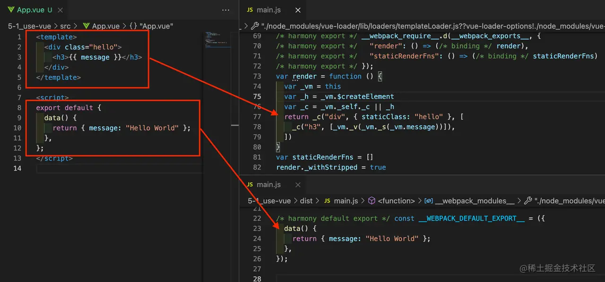
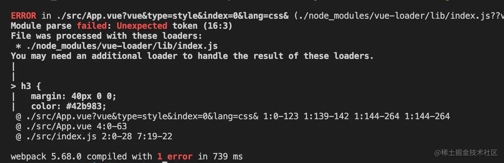
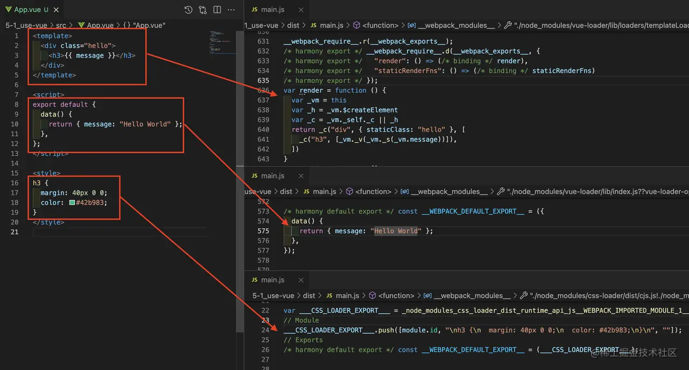
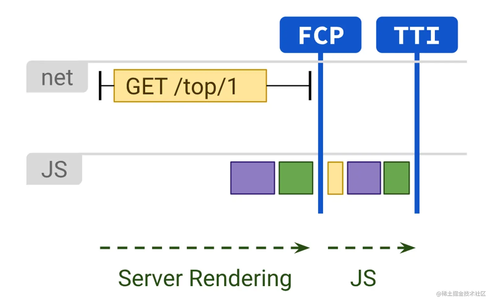
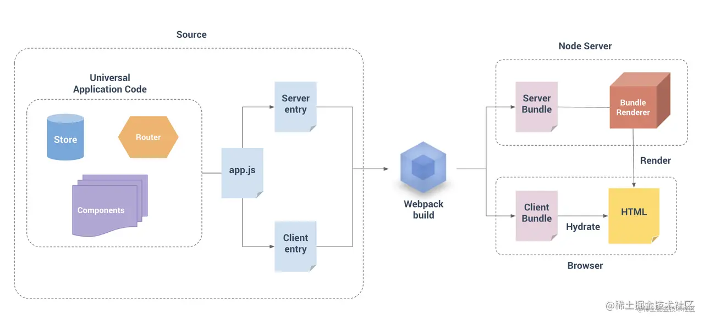
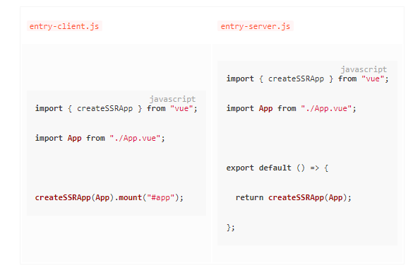
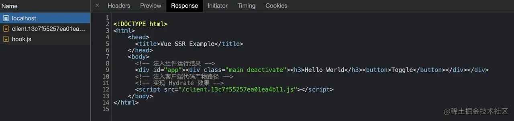

使用 Webpack 搭建 Vue 应用开发环境的主要方法，包括：

* 如何使用 `vue-loader` 处理 Vue SFC 文件？
* 如何使用 `html-webpack-plugin`、`webpack-dev-server` 运行 Vue 应用？
* 如何在 Vue SFC 中复用 TypeScript、Less、Pug 等编译工具？
* 如何搭建 Vue SSR 环境？
* 如何使用 Vue CLI？

### 使用 Vue-loader 处理 SFC 代码

形态上，Vue SFC(Single File Component) 文件(*.vue)是使用类 HTML 语法描述 Vue 组件的自定义文件格式，文件由四种类型的顶层语法块组成：

* `<template\>`：用于指定 Vue 组件模板内容，支持类 HTML、Pug 等语法，其内容会被预编译为 JavaScript 渲染函数；
* `<script\>`：用于定义组件选项对象，在 Vue2 版本支持导出普通对象或 defineComponent 值；Vue3 之后还支持 <script setup\> 方式定义组件的 setup() 函数；
* `<style\>`：用于定义组件样式，通过配置适当 Loader 可实现 Less、Sass、Stylus 等预处理器语法支持；也可通过添加 scoped、module 属性将样式封装在当前组件内； 
* `Custom Block`：用于满足领域特定需求而预留的 SFC 扩展模块，例如 <docs\>；Custom Block 通常需要搭配特定工具使用，详情可参考 Custom Blocks | Vue Loader 。

原生 Webpack 并不能处理这种内容格式的文件，为此我们需要引入专用于 Vue SFC 的加载器：vue-loader。首先，依然是安装依赖：

```
yarn add -D webpack webpack-cli vue-loader
```

之后，修改 Webpack 配置，加入 vue-loader 相关声明：

```js
const { VueLoaderPlugin } = require("vue-loader");

module.exports = {
  module: {
    rules: [
      {
        test: /\.vue$/,
        use: ["vue-loader"],
      },
    ],
  },
  plugins: [new VueLoaderPlugin()],
};
```


> 提示：vue-loader 库同时提供用于处理 SFC 代码转译的 Loader 组件，与用于处理上下文兼容性的 Plugin 组件，两者需要同时配置才能正常运行。



可以看到，<template/> 内容会被转译为用于构造 Virtual Dom 结构的 render 函数；<script/> 标签导出的对象会被转译为 JavaScript 对象字面量形式。

注意，上例 Webpack 配置还无法处理 CSS 代码，若此时添加 <style/> 模块将导致报错：



为此需要添加处理 CSS 的规则，完整配置：

```js
const { VueLoaderPlugin } = require("vue-loader");

module.exports = {
  module: {
    rules: [
      { test: /\.vue$/, use: ["vue-loader"] },
      {
        test: /\.css$/,
        use: ["style-loader", "css-loader"],
      },
    ],
  },
  plugins: [new VueLoaderPlugin()],
};
```

同样的，<style/> 模块也将被转译为 JavaScript 内容：



### 运行页面

`vue-loader` 使得 Webpack 能够正确理解、翻译 Vue SFC 文件的内容，接下来我们还需要让页面真正运行起来，这里会用到：


* 使用 html-webpack-plugin 自动生成 HTML 页面；
* 使用 webpack-dev-server 让页面真正运行起来，并具备热更新能力。


其中 `html-webpack-plugin` 是一款根据编译产物自动生成 HTML 文件的 Webpack 插件，
借助这一插件我们无需手动维护产物数量、路径、hash 值更新等问题。使用时，首先安装依赖：

```
yarn add -D html-webpack-plugin
```


```js
const path = require("path");
const { VueLoaderPlugin } = require("vue-loader");
const HtmlWebpackPlugin = require("html-webpack-plugin");

module.exports = {
  module: {
    rules: [
      { test: /\.vue$/, use: ["vue-loader"] }
    ],
  },
  plugins: [
    new VueLoaderPlugin(),
    new HtmlWebpackPlugin({
      templateContent: `
<!DOCTYPE html>
<html>
  <head>
    <meta charset="utf-8">
    <title>Webpack App</title>
  </head>
  <body>
    <div id="app" />
  </body>
</html>
    `,
    }),
  ],
};
```

之后，运行编译命令 npx webpack ，即可自动生成 HTML 文件：

```html
<!-- dist/index.html -->
<!DOCTYPE html>
<html>
  <head>
    <meta charset="utf-8">
    <title>Webpack App</title>
  <script defer src="main.js"></script></head>
  <body>
    <div id="app" />
  </body>
</html>
```

接入 `html-webpack-plugin` 后，还需要使用 `webpack-dev-server` 启动一套本地开发服务器。 `webpack-dev-server` 主要提供两种功能：

* 结合 Webpack 工作流，提供基于 HTTP(S) 协议的静态资源服务；
* 提供资源热更新能力，在保持页面状态前提下自动更新页面代码，提升开发效率。

```
yarn add -D webpack-dev-server
```


```html
const path = require('path')
const { VueLoaderPlugin } = require('vue-loader')
const HtmlWebpackPlugin = require('html-webpack-plugin')

module.exports = {
  devServer: {
    hot: true,
    open: true
  },
  module: {
    rules: [
      { test: /\.vue$/, use: ['vue-loader'] },
      { test: /\.css$/, use: ["style-loader", "css-loader"] },
    ]
  },
  plugins: [
    new VueLoaderPlugin(),
    new HtmlWebpackPlugin({
      templateContent: `
<!DOCTYPE html>
<html>
  <head>
    <meta charset="utf-8">
    <title>Webpack App</title>
  </head>
  <body>
    <div id="app" />
  </body>
</html>
    `
    })
  ]
}
```

* devServer.hot：用于声明是否使用热更新能力，接受 bool 值。
* devServer.open：用于声明是否自动打开页面，接受 bool 值。

之后，运行 npx webpack serve 命令，即可自动打开带热更功能的页面：


### 复用其它编译工具

到这里，我们还是在用原生 JavaScript、CSS 编写 Vue 组件代码，
在现代 Web 开发中，我们通常还会搭配其它工程化工具力求提升开发效率、质量。好消息是经过精妙的设计，
vue-loader 能够复合使用其它 Webpack Loader 的能力处理各个模块内容，包括：

* 使用 babel-loader、ts-loader 等处理 SFC 的 <script\> 模块；
* 使用 less-loader、sass-loader 等处理 <style\> 模块；
* 使用 pug-plain-loader 等处理 <template\> 模块。


为了达到这种效果，用法上我们需要为每种模块配置相应的 Webpack 处理规则，并正确设置模块的 lang 属性值。

```
npm install -D typescript ts-loader
```

其次，修改 Webpack 配置，添加用于处理 TypeScript 代码的规则：

```js
const { VueLoaderPlugin } = require("vue-loader");

module.exports = {
  module: {
    rules: [
      { test: /\.vue$/, use: ["vue-loader"] },
      { test: /\.ts$/, use: ["ts-loader"] },
    ],
  },
  plugins: [new VueLoaderPlugin()],
};
```

之后，设置 <script\> 标签的 lang = "typescript"：

```js
<script lang="typescript">
    export default {
    data() {
    return { message: "Hello World" };
},
};
</script>
```
此后，`vue-loader` 会根据 lang 属性值，按 Webpack 配置的 TypeScript 规则，调用 ts-loader 处理这部分代码。

与处理普通 .ts 文件类似，我们还可以通过 tsconfig.json 文件修改 TypeScript 编译配置，此处不再赘述。


> 提示：同理，与处理普通 .ts、.js 文件类似的，我们还可以通过 Webpack 的 module.rule 配置项继续接入 ESLint、Babel、Flow 等工具，这些规则也都会对 Vue SFC 文件模块生效。

类似的，我们还可以使用 Less/Sass/Stylus 等语言开发 CSS 代码，接入过程与上述 TypeScript 相似，以 Less 为例，首先安装依赖：

```js
const path = require("path");
const { VueLoaderPlugin } = require("vue-loader");

module.exports = {
  module: {
    rules: [
      { test: /\.vue$/, use: ["vue-loader"] },
      {
        test: /\.less$/,
        use: ["style-loader", "css-loader", "less-loader"],
      },
    ],
  },
  plugins: [new VueLoaderPlugin()],
};
```

之后，设置 <style\> 标签的 lang = "less"：

```js
<style lang="less">
h3 {
  margin: 40px 0 0;
  color: #42b983;
  span {
    font-weight: normal;
  }
}
</style>
```

至此，Webpack 就会像处理其它 .less 文件一般，使用 less-loader 加载这一模块内容。

`<template>` 的处理规则会稍微不同，因为绝大部分 Webpack 模板类 Loader 都会返回一个模板函数，而不是编译好的 HTML 片段，这与 Vue SFC 将 `<template>` 编译为 render 函数的规则相冲突，此时通常需要使用一个返回原始的 HTML 字符串的 loader，例如使用 pug-plain-loader，而不是 pug-loader。

```
yarn add -D pug pug-plain-loader
```

```js
const { VueLoaderPlugin } = require("vue-loader");

module.exports = {
  module: {
    rules: [
      { test: /\.pug$/, use: ["pug-plain-loader"] },
      { test: /\.vue$/, use: ["vue-loader"] }
    ],
  },
  plugins: [new VueLoaderPlugin()],
};
```

之后，设置 `<template>` 标签的 lang = " pug"：

```js
<template lang="pug">
  div.hello
    h3 {{message}}
  </div>
</template>
```

至此，`Webpack` 就会像处理其它 .pug 文件一般使用 `pug-plain-loader` 加载这一模块内容。完整示例：

```js
const { VueLoaderPlugin } = require("vue-loader");

module.exports = {
  module: {
    rules: [
      { test: /\.pug$/, use: ["pug-plain-loader"] },
      { test: /\.vue$/, use: ["vue-loader"] },
      { test: /\.ts$/, use: ["ts-loader"] },
      {
        test: /\.less$/,
        use: ["style-loader", "css-loader", "less-loader"],
      },
    ],
  },
  plugins: [new VueLoaderPlugin()],
};
```


### 使用 Server Side Render

通常，Vue.js 程序会被构建为一套纯客户端运行的 SPA(Single Page Application) 应用，相比于传统的 JSP、ASP.Net 等技术栈，SPA 已经能解决许多前后端协作的开发效率、性能、分工、工程化问题，但却很自然地引入一些新的问题：

* SEO 不友好：大多数搜索引擎对网页内容的解读都依赖于同步 HTML 内容 —— 假设你的应用最开始只是展示了一个加载动画，然后通过 Ajax 获取异步数据进行渲染，爬虫并不会等待异步操作完成后才解析页面的内容，所以 SPA 应用通常无法向爬虫提供任何有用信息；
* Time-To-Content 更长：由于客户端需要等待所有 JavaScript 资源都加载完毕后，才会开始渲染页面真正有意义的内容，所以 TTC 时间相对更长。

SSR(Server Side Render) 正是为了解决这些问题而出现的技术。本质上，SSR 是一种在服务端将组件渲染 HTML 字符串并发送到浏览器，最后在浏览器上将这些 HTML 片段“激活”为客户端上可交互的应用技术。




在 Vue 场景下，通常可以选择 [Nuxt.js](https://nuxtjs.org/)、[Quasar](https://quasar.dev/)、[@vue/server-renderer](https://vuejs.org/guide/scaling-up/ssr.html) 等方案实现 SSR，这些技术的底层逻辑都包含三个大的步骤：


* 编译时，将同一组件构建为适合在客户端、服务器运行的两份副本； 
* 服务端接收到请求时，调用 Render 工具将组件渲染为 HTML 字符串，并返回给客户端； 
* 客户端运行 HTML，并再次执行组件代码，“激活(Hydrate)” 组件。



接下来，我们使用 Webpack、Vue3、Express、@vue/server-renderer 框架搭建一套完备的 Vue SSR 引用，示例目录结构：

```
├─ 5-2_use-ssr
│  ├─ package.json
│  ├─ server.js
│  ├─ src
│  │  ├─ App.vue
│  │  ├─ entry-client.js
│  │  ├─ entry-server.js
│  ├─ webpack.base.js
│  ├─ webpack.client.js
│  └─ webpack.server.js
```


1. 需要为客户端、服务端环境分别准备项目 Entry 文件，即上述目录中的 entry-client.js 与 entry-server.js，内容：



两者区别在于：客户端版本会立即调用 mount 接口，将组件挂载到页面上；而服务端版本只是 export 一个创建应用的工厂函数。

2. 分别为客户端、服务端版本编写 Webpack 配置文件，即上述目录中的三个 webpack.*.js 文件。其中：
   1. base 用于设定基本规则；
   2. webpack.client.js 用于定义构建客户端资源的配置：


3. webpack.server.js 用于定义构建服务端资源的配置：

```js
// webpack.client.js
const Merge = require("webpack-merge");
const path = require("path");
const HtmlWebpackPlugin = require("html-webpack-plugin");
const { WebpackManifestPlugin } = require("webpack-manifest-plugin");
const base = require("./webpack.base");

// 继承自 `webpack.base.js`
module.exports = Merge.merge(base, {
  mode: "development",
  entry: {
    // 入口指向 `entry-client.js` 文件
    client: path.join(__dirname, "./src/entry-client.js"),
  },
  output: {
    publicPath: "/",
  },
  module: {
    rules: [{ test: /\.css$/, use: ["style-loader", "css-loader"] }],
  },
  plugins: [
    // 这里使用 webpack-manifest-plugin 记录产物分布情况
    // 方面后续在 `server.js` 中使用
    new WebpackManifestPlugin({ fileName: "manifest-client.json" }),
    // 自动生成 HTML 文件内容
    new HtmlWebpackPlugin({
      templateContent: `
<!DOCTYPE html>
<html>
<head>
  <meta charset="utf-8">
  <title>Webpack App</title>
</head>
<body>
  <div id="app" />
</body>
</html>
  `,
    }),
  ],
});
```
至此，我们只需要调用适当命令即可分别生成客户端、服务端版本代码：

```
# 客户端版本：
npx webpack --config ./webpack.client.js
# 服务端版本：
npx webpack --config ./webpack.server.js 
```

4. 编写 Node 应用代码 server.js，简单起见，此处仅实现基础功能：

```js
// server.js
const express = require("express");
const path = require("path");
const { renderToString } = require("@vue/server-renderer");

// 通过 manifest 文件，找到正确的产物路径
const clientManifest = require("./dist/manifest-client.json");
const serverManifest = require("./dist/manifest-server.json");
const serverBundle = path.join(
  __dirname,
  "./dist",
  serverManifest["server.js"]
);
// 这里就对标到 `entry-server.js` 导出的工厂函数
const createApp = require(serverBundle).default;

const server = express();

server.get("/", async (req, res) => {
  const app = createApp();

  const html = await renderToString(app);
  const clientBundle = clientManifest["client.js"];
  res.send(`
<!DOCTYPE html>
<html>
    <head>
      <title>Vue SSR Example</title>
    </head>
    <body>
      <!-- 注入组件运行结果 -->
      <div id="app">${html}</div>
      <!-- 注入客户端代码产物路径 -->
      <!-- 实现 Hydrate 效果 -->
      <script src="${clientBundle}"></script>
    </body>
</html>
    `);
});

server.use(express.static("./dist"));

server.listen(3000, () => {
  console.log("ready");
});
```

可以看出，Node 服务的核心逻辑在于：

* 调用 entry-server.js 导出的工厂函数渲染出 Vue 组件结构； 
* 调用 @vue/server-renderer 将组件渲染为 HTML 字符串； 
* 拼接 HTML 内容，将组件 HTML 字符串与 entry-client.js 产物路径注入到 HTML 中，并返回给客户端。

至此，一个基本的 SSR 架构就搭建完毕了，接下来可以开始编写任何 Vue 代码，例如：

```vue
<!-- App.vue -->
<template>
  <div :class="['main', cls]">
    <h3>{{ message }}</h3>
    <button @click="handleClick">Toggle</button>
  </div>
</template>

<script>
import { ref, computed } from "@vue/reactivity";

export default {
  setup() {
    const isActivity = ref(false);
    const cls = computed(() => (isActivity.value ? "activate" : "deactivate"));
    const handleClick = () => {
      isActivity.value = !isActivity.value;
    };

    return {
      isActivity,
      message: "Hello World",
      cls,
      handleClick,
    };
  },
};
</script>

<style>
h3 {
  color: #42b983;
}
.main {
  position: fixed;
  top: 0;
  left: 0;
  bottom: 0;
  right: 0;
  padding: 20px 12px;
  transition: background 0.3s linear;
}
.activate {
  background: #000;
}
.deactivate {
  background: #fff;
}
</style>
```

之后，编译并执行 node server.js 启动 Node 应用，访问页面时服务端将首先返回如下 HTML 内容：



这里用到的方案是 @vue、server-renderer 实际应用中，建议用成熟的架构

### 使用 Static Site Generation


* 更高的架构复杂度，这意味着更高的维护、扩展、学习成本； 
* Node 与浏览器环境不完全匹配，部分浏览器特定的代码，只能在某些生命周期钩子函数中使用；一些外部扩展库 (external library) 可能需要特殊处理，才能在 SSR 中运行； 
* 组件要求更高，需要兼容 Node.js Server 运行环境； 
* 服务端负载更高，毕竟相较于纯粹提供静态资源的 SPA 形式，SSR 需要在 Node 进程中执行大量 CPU 运算以渲染 HTML 片段。

因此，对于用户不敏感的应用，如公司官网、营销活动页等，还可以使用 `Static Site Generation` (或叫 Pre-renderer) 方式，在编译构建阶段提前生成各页面的静态 HTML 代码，这样技能满足 SEO 需求，又尽可能降低架构、编码复杂度。

在 Webpack4 环境下，可选择 [prerender-spa-plugin](https://github.com/chrisvfritz/prerender-spa-plugin) 实现 SSG 功能，但实测发现该插件并不兼容 Webpack5，且社区目前没有成熟的替代方案，因此感兴趣的同学可自行查阅相关说明，此处不再赘述。

### 使用 Vue CLI

综上，手动配置 Vue 开发环境的过程是非常复杂且繁琐的，如果每次构建项目都需要从零开始使用 Webpack、Babel、TypeScript、Less、Mocha 等工具搭建项目环境，那对新手、老手来说都是极高的门槛和心智负担。

好在社区已经将大量重复、被验证有效的模式封装成开箱即用的脚手架工具，包括：

* [Vue CLI](https://cli.vuejs.org/) ：基于 Webpack 搭建的 Vue 项目脚手架工具，提供多媒体资源处理、SFC 文件处理、dev-server、HMR、自动化测试、ESLint、Babel 等功能；
* [create-vue](https://github.com/vuejs/create-vue) ： 基于 Vite 搭建的 Vue 项目脚手架工具，功能与 Vue-cli 基本对齐。

这些工具能够快速生成一套健壮、可扩展的 Vue 开发环境，以 Vue CLI 为例，只需执行一条简单命令：

```
npx @vue/cli create [项目名]

Vue CLI v4.5.15
? Please pick a preset: (Use arrow keys)
❯ Default ([Vue 2] babel, eslint)
  Default (Vue 3) ([Vue 3] babel, eslint)
  Manually select features
```

```js
// vue.config.js
module.exports = {
  chainWebpack: config => {
    config.module
      .rule('vue')
      .use('vue-loader')
        .tap(options => {
          // modify the options...
          return options
        })
  }
}
```


Vue CLI 能帮助我们迅速搭建一套符合业界最佳实践的 Vue 应用开发环境，但它底层主要还是依赖于 Webpack 的编译、打包能力以及生态，因此建议同学们还是需要注重学习原生 Webpack 的各种用法，这能帮助我们迅速完成更深层次的定制，或解决开发过程遇到的各种疑难杂症。


