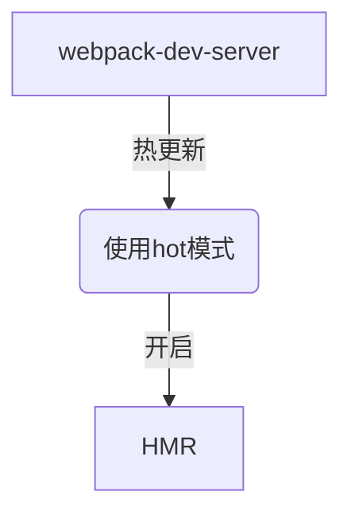

## webpack 
### 1. webpack 引入规范

* ES2015 import export default 语句
* CommonJS require() modules.export 语句
* AMD  define  和  require 语句
* css/sass/less 文件中的 @import 语句。
* 样式(url(...))或 HTML 文件()中的图片链接(image url)

1.ES module 模块引入方式
```shell
npx webpack index.js
```

```javascript
//index.js
import Header from  './header.js';
import  SideBar  from  './sideBar.js';
import  Content  from  './content.js';
//  实例化
new  Header();
new  SideBar();
new  Content();
```
```javascript
export  default  function  Header(){}
export  default  function  SideBar(){}
export  default  function  Content(){}
```
2.  CommonJS  模块引入方式
```javascript
const  Header  =  require('./header.js');
const  SideBar  =  require('./sideBar.js');
const  Content  =  require('./content.js');
new  Header();
new  SideBar();
new  Content();
```
```javascript
function  Content()  {}
function  SideBar()  {}
function  Header()  {}
module.exports  =  Content;
module.exports  =  SideBar;
module.exports  =  Header;
```

### 1.1 webpack 初始化
webpack的默认配置文件名称是 webpack.config.js
```shell
npm init
yarn add webpack webpack-cli
webpack-cli // 可以通过命令行的方式使用webpack
```


### 1.2 webpack 概念理解

* 入口 entry
* 输出 output
* Module：提供完整的离散功能模块，编写良好的规范提供可靠的抽象和封装边界，构成一个连贯的设计和明确的目的
* loader 当需要加载不非js结尾的文件的时候需要使用loader
* plugin 插件
* Chunks chunks 根据 webpack功能来拆分。Bundles 是由多个 Chunks 组成 其中有不同的类型，入口或者它的引入文件，splitChunks 拆分的代码
* Bundle Bundle是webpack打包以后的各个文件，一般与chunk 一对一的关系，bundle是对chunk进行编译压缩以后的产出结果

> webpack使用Node.js运行，因此所有的Node.js模块都可以使用，比如文件系统、路径等模块。

```javascript
const path = require('path'); // 导入Node.js的path模块

module.exports = {  
    mode: 'development', // 工作模式  
    entry: {
        main: './src/index', // 入口点  main Chunk Names 对应的 main 
    }
     // 输出配置
    output: {
        libraryTarget: 'umd', // 打包出来的是第三方的库，几乎都能满足正常引入
        libraray: 'library',
        path: path.resolve(__dirname, 'dist'), // 输出文件的目录    
        filename: 'scripts/[name].[hash:8].js', // 输出文件的名称   
        chunkFilename: 'scripts/[name].[chunkhash:8].js', // 公共JS配置    
        publicPath:'/' // 资源路径前缀，一般会使用CDN地址，这样图片和CSS就会使用CDN的绝对URL  
    },
    module:{
        rules: [
            {   
                test:/\.(png|gif|jpg)$/, // 图片文件
                use :[
                    {
                        loader: 'file-loader',
                        options: {       
                            name: 'images/[name].[hash:8].[ext]'
                        }
                    }
                ]
            }
        ]
    },
    // 数组
    plugins: [ // 插件配置
        new CleanWebpackPlugin()
    ]};
```

> Webpack自己只管JS模块的输出，也就是output.filename是JS的配置，CSS、图片这些是通过loader来处理输出的

### 1.3 output

| 参数名称 | 用法 | 实践 |
| --- | --- | --- |
| path  | 配置输出目录地址 | path.resolve(\_\_dirname,  \"..\/dist\"), |
| filename | 输出的文件名 | [hash].js webpack占位符的应用 |
| library | 输出的全局变量 | library:  'root' root 是全局变量名 |
| libraryTarget | 输出的引用形式 | libraryTarget: 'umd' 一般正常的库使用umd，nodeJS 环境下面使用  globa，this 的话 将内容挂载到this的上下文中l |

### 1.4 externals
> externals  配置选项提供了「从输出的 bundle 中排除依赖」的方法


## 2. Module Loader

### 2.1 Loader
1. loader 解析顺序是从下到上，从右边到左边
2. loader的作用是解析webpack不知道如何解析的文件

### 2.2 url-loader 与 file-loader 对比
|  | url-loader | file-loader |
| --- | --- | --- |
| 定义 | Loads files as  base64  encoded URL | Instructs webpack to emit the required object as file and to return its public URL |
| 用法 | 在文件大小（单位 byte）低于指定的限制时，可以返回一个 DataURL | 生成的文件的文件名就是文件内容的 MD5 哈希值并会保留所引用资源的原始扩展名 |
| 最佳实践 | 小图标使用url-loader返回 base64位等DataSource | 先使用 url-loader 过滤 再使用file-loader 添加hash值和公共路径 |

### 2.3 file-loader 占位符

| 名称 | 类型 | 默认值 | 描述 |
| --- | --- | --- | --- |
| [ext] | String | file.extname | 资源的拓展名  |
| [name]  | String | file.basename | 资源的基本名称 |
| [path] | String | file.dirname | 资源相对于 context 的路径 |
| [hash] | String | md5 | 内容的哈希值，下面的hasdes配置中有更多信息 |
| [N] | Number |  | 当前文件名按照查询参数 regExp 匹配后获得到第 N个匹配结果 |


### 2.32 项目引入 字体文件 使用 file-loader
```javascript
module: {
    rules: [
        {
            test:  /\.(eot|ttf|svg|woff)$/,
            include:  path.resolve(__dirname,  './src/font'),
            use:  [{
                loader:  'file-loader'
            }]
        },
    ]
}
```

### 2.33 使用webpack 打包 css代码的 优缺点

使用 webpack 打包 CSS 有许多优点，在开发环境，可以通过 hashed urls 或  模块热替换(HMR)  引用图片和字体资源。而在线上环境，使样式依赖 JS 执行环境并不是一个好的实践。渲染会被推迟，甚至会出现  FOUC，因此在最终线上环境构建时，最好还是能够将 CSS 放在单独的文件中。

* extract-loader 针对 css-loader 的输出
* extract-text-webpack-plugin

### 2.34 css 加载 loader 用法 比较

| 名称 | 用法 | 插件用法 | 最佳实践 |
| --- | --- | --- | --- |
| css-loader | css-loader  会解释(interpret)  @import  和  url()  ，会  import/require()  后再解析(resolve)它们 | {loader: "css-loader"} | 集合使用 css-loader 与 style-loader 将样式存放在 style tag中 |
| style-loader | Adds CSS to the DOM by injecting a  <style\>  tag | { loader: "style-loader" },{ loader: "css-loader" } | style-loader 与 css-loader 结合使用 |
| less-loader | Compiles Less to CSS | {loader: "style-loader" // creates style nodes from JS strings}, {loader: "css-loader" // translates CSS into CommonJS}, {loader: "less-loader" // compiles Less to CSS} | 使用插件 ExtractTextPlugin 提取样式到独立的css文件专业不需要依赖js |
| sass-loader | Loads a SASS/SCSS file and compiles it to CSS. | {loader: "style-loader" // creates style nodes from JS strings}, {loader: "css-loader" // translates CSS into CommonJS}, {loader: "less-loader" // compiles Sass to css | 使用插件 ExtractTextPlugin 提取样式到独立的css文件专业不需要依赖js |
| postcss-loader | Loader for  webpack  to process CSS with  PostCSS css的预处理 新建 postcss.config.js | 如果需要使用到@import 引入css 代码的话 需要 在css-loader中 添加 importLoaders: 前置需要用到的loader数 | 在根目录设置postcss.config.js css-loader  和  style-loader  之前  在  less/sass-loader  之后 |

### 2. 4 babel loader 配置 支持最基础ES6语法
1. 针对开发组件库或者类库使用方式
```javascript
"plugins":  [["@babel/plugin-transform-runtime",  {
    "corejs":  2,
    "helpers":  true,
    "regenerator":  true,
    "useESModules":  false
}]]
```
2. 针对常用的转ES6的语法
```javascript
{
  "presets":  [["@babel/preset-env",  {
    // 针对不用版本的浏览器使用 判断是否小于当前版本 再开启es6编译
    "targets":  {
        "edge":  "17",
        "firefox":  "60",
        "chrome":  "67",
        "safari":  "11.1"
    },
    "useBuiltIns":  "usage",
    "corejs":  "2"
  }]]
}
```

3. useBuiltIns 按需加载 需要配合使用 core-js@2 或者 core-js@3
4. @babel-plugin-dynamic-import-webpack 可以让开发的时候使用实验性质的语法 (不支持 魔法注释)
5. @babel/plugin-syntax-dynamic-import （支持魔法注释）
6. @babel/preset-react 针对 React语法 进行编译解释

### 2.5 typescript引用
1. npm i ts-loader typescript -D
2. 编写 tsconfig.json
3. 基础的 tsconfig.json
```javascript
{
  "compilerOptions":  {
    "outDir":  "./dist", // 生成js的目录路径
    "module":  "es6", // 模块
    "target":  "es5",// 打包出来的es版本
    "allowJs":  true // 是否ts 引入 js
  }
}
```
4. 编写 ts 代码

### 2.9 常用loader汇总

| 名称 | 用法 | 插件用法 | 最佳实践 |
| --- | --- | --- | --- |
| imports-loader | 改变全局this的指向 | loader:  "imports-loader?this=>window" | 改变当前文件的上下文 |
| exports-loader | exports loader module for webpack  | {test: require.resolve('globals.js'),use: 'exports-loader?file,parse=helpers.parse'}  | 将代码导出全局变量 import { file, parse } from './globals.js'（**用处不大**） |
| tsloader | 引入ts编译器的时候需要tsloader | loader: 'ts-loader' | 需要同步安装 typescript tsconfig.json 配置文件 类似babel |
| eslint-loader | 检查语法是否正确 | use: ['babel-loader', 'eslint-loader'] | 配合 .eslintrc.js 配置 步骤也是npx eslint init 加上 overlay: true overlay 弹窗提醒 |
| thread-loader | Runs the following loaders in a worker pool. | use: ['thread-loader'] | https://www.webpackjs.com/loaders/thread-loader/ |


### 3. devtool

#### 3.1 devtool 启用不同的打包方式对应构建速度和效率
sourceMap 解决的 目标生成代码和源代码之间的映射
使用dev-tool会导致打包速度变慢，
cheap的意思是 只针对到行 不针对到列，只管理业务代码
module的意思是 业务代码和第三方模块的报错也会管理
eval 打包速度最快的方式之一

> webpack4 设置mode 为production的时候 默认为 ok

| devtool | 构建速度 | 重新构建速度 | 生产环境 | 品质 |
| --- | --- | --- | --- | --- |
| （none） | +++ | +++ | true | 打包后的代码 |
| eval | +++ | +++ | false | 生成后的代码 |
| cheap-eval-source-map | + | ++ | false | 转换过的代码（仅限行） |
| **cheap-module-eval-source-map**  | O | ++ | false | 原始源代码（仅限行）**开发环境最佳实践方式（提示错误全，打包速度相对较快）**  |
| eval-source-map | -- | + | false | 原始源代码 |
| cheap-source-map | + | O | false | 转换过的代码（仅限行）|
| **cheap-module-source-map**  | O | - | false | 原始源代码（仅限行）**生产环境最佳实践** |
| inline-cheap-source-map | + | O | false | 转换过的代码（仅限行） |
| inline-cheap-module-source-map | O | - | false | 原始源代码（仅限行） |
| source-map  | -- | -- | true | 原始源代码  |
| inline-source-map | -- | -- | false | 原始源代码 会将索引map 以base64的方式存放在打包好的js代码中  |
| hidden-source-map  | -- | -- | yes | 原始源代码 |
| nosources-source-map  | -- | -- | yes | 无原始源代码  |

> +++  非常快速,  ++  快速,  +  比较快,  o  中等,  -  比较慢,  --  慢

```javascript
devtool:  'source-map',
```

#### 3.2 webpack dev server （最佳实践）
1. yarn add webpack-dev-server -D
2. devServer:  {contentBase:  './dist', open: true} 配置 devServer
3. package.json 添加命令 "start": webpack-dev-server
4. yarn start
5. webpack dev server 打包好的文件存在于内存当中 并不是引用于打包好的文件模块

#### 3.3 webpack dev server 实现原理
1. 利用 webpack-dev-middleware 传入 webpack的编译器 和 配置
2. 通过express 开启 node.js 服务器 

```javascript
const  express  =  require('express');
const  webpack  =  require('webpack');
const  webpackDevMiddleware  =  require('webpack-dev-middleware');
const  config  =  require('./webpack.config.js');
//  webpack  编译器
const  complier  =  webpack(config);

const  app  =  express();
app.use(webpackDevMiddleware(complier,  {
  publicPath:  config.output.publicPath
}));

app.listen(3000,  ()  =>  {
  console.log('server  is  running');
});

```

#### 3.31 webpack-dev-server proxy 配置
```javascript
proxy:  {
    // 匹配到现在的路由 然后 代理到目标的 target 地址
    "/react/api":  {
        target:  "http://www.dell-lee.com",
        changeOrigin: true, // 突破origin 的限制
        secure: false, // https: 才能正常转发
        // pathRewrite:  {"^/react/api"  :  "/react/api"}
        bypass: function(req, res, proxyOptions) { // 过滤判断是否使用代理
            if (req.headers.accept.indexOf("html") !== -1) {
                console.log("Skipping proxy for browser request.");
                return "/index.html";
            }
        }
        headers: {} // 修改headers的请求头信息
    }
}
```

#### 3.32 webpack-dev-server --history-api-fallback 
BrowserRouter 路由开发环境配置方式
```json
"deve":  "webpack-dev-server  --inline  --history-api-fallback  --config  ./build/webpack.dev.js"


devServer:  {
    publicPath:  '/'
}
```

#### 3.4 HMR 热模块更新 Hot Module Replacement
热更新替换的原理

1. 应用程序代码要求 HMR runtime 检查更新。
2. HMR runtime（异步）下载更新，然后通知应用程序代码
3. 应用程序代码要求 HMR runtime 应用更新
4. HMR runtime（同步）应用更新

API [参考文档](https://www.webpackjs.com/api/hot-module-replacement/)


#### 3.5 webpack-dev-server + webpack.HMR 热更新是最佳实践
1. 主要是针对CSS模块加载，调试CSS模式
2. 针对调试JS相对比较麻烦,需要 配合使用 module.hot.accept 方法接受数据变化，然后再变更dom
3. 建议调试CSS的时候开启
4. 开启步骤
5. 引入HotModuleReplacementPlugin 插件 new  webpack.HotModuleReplacementPlugin()
6. devServer添加配置 hot: true hotOnly: true
7. hotOnly: 代码加载以后也不会全局刷新网页，只是对修改过的代码进行刷新，局部刷新



#### 3.6 配置eslint设置规范
* npm install eslint -D
* npx eslint init
* 按需配置
* npx eslint 目标文件夹

## 4. webpack 打包速度优化
1. loader 中使用 exclude 或者 include 明确 loader 使用的范围 eg: style, js
2. 尽可能少使用plugins 使用可靠的plugins
3. yarn webpack npm 的版本尽量比较新
4. sourceMap 合理使用
5. 结合 stats 分析打包结果
6. 开发环境剔除无用的插件 例如 开发环境压缩代码
7. loader 配置 options 提高打包效率

### 4.1 package.json 传递参数判断当前环境变量
```javascript
// 传入 env 环境变量 production
webpack  --env.production --config  ./build/webpack.config.js
```


## 5. optimization webpack 优化方法

### 5.1 webpack tree Shaking 剪枝 打包的时候不打包多余的代码
1. tree shaking ES module 模块的引入方式
2. **最佳实践** webpack.config.js optimization:  {usedExports:  true} 
3. package.json 设置 sideEffects: ["\*.css\"]
4. 配置模式适用于 development 模式
5. producition 模式下 devtool 设置 cheap-module-source-map tree shaking生效
6. development 模式下 devtool 设置 cheap-module-eval-source-map tree shaking生效

### 5.2 splitChunksPlugin 配置 分割代码
#### 5.21 代码不分割出现的问题
1. 将业务代码和第三方代码混合在一起，加载一个JS file 文件变慢 文件增大，load时间变长
2. 业务代码和第三方组件代码混淆，不利于调试问题，不能很好区分业务代码出错，还是第三方出现问题
3. 重新访问的时候需要重新加载第三方的业务代码，又要重新加载
4. 浏览器可以缓存部分的第三方部分代码

#### 5.22 实现方式
1. entry 多入口打包 第三方内容（不是最佳实践）多入口的形式打包
2. optimization splitChunks:  {chunks:  'all'} 简单的代码分割
3. 异步的代码分割 自动加载
4. magic comment 魔法注释 添加打包以后文件的名称 \/*  webpackChunkName:"lodash"  \*\/

#### 5.23 代码的分割同步与异步
1. 同步代码在 optimization 中 splitChunks 中配置
2. 异步代码 会自动分割独立放置

### 5.3 splitChunks 默认参数详细

1. 匹配模式 有三个可选值，分别是 async（默认），initial 和 all。async 即只提取异步的chunk，initial只对入口的chunk生效，all 是所有
2. 匹配条件 minChunks minSize maxSize maxAsyncRequests

```javascript
splitChunks: {
    chunks: "async", // 代码分割的时候。只对异步代码有效 同步的代码不分割 all 同步异步都进行代码分割
    minSize: 30000, // 引入的模块 大于 minSize 的时候才进行代码分割 大于30kb 才进行代码分割
    maxSize: 0, //判断代码是否需要进一步拆分 来保证 不超过maxSize 默认为 0 
    minChunks: 1,
    maxAsyncRequests: 5,
    maxInitialRequests: 3,
    automaticNameDelimiter: '~',
    name: true, // SplitChunks 可以根据CacheGroups 和 作用范围自动为新生成的chunk命名 例如 vendor~a~b~c.js 意思是 cacheGroup 是 vendor 是由 a,b,c 三个入口所产生
    // vendors node_modules 中的模块 default 是被多次引用的模块
    cacheGroups: {
        vendors: {
            test: /[\\/]node_modules[\\/]/, // 同步的代码分割的时候 匹配到正则就会把 正则文件中的代码 打包到
            priority: -10, // 根据这个确定优先级 priority 值越大 优先级越高
            filename: 'vendors.js' // 注意这里不要和魔法注释之间产生冲突
        },
        default: {
            minChunks: 2,
            priority: -20,
            reuseExistingChunk: true
        }
    }}
```

### 5.4 使用 webpack.Dllplugin 第三方库 与 业务代码的映射
1. 组织第三方业务代码入口，生成统一的第三方业务代码库
```javascript
const  path  =  require('path');
const  webpack  =  require("webpack");
module.exports  =  {
  entry:  {
     :  ['react',  'react-dom',  'lodash']
  },
  output:  {
    filename:  '[name].dll.js',
    path:  path.resolve(__dirname,  '../dll'),
    library:  '[name]'
  },
  plugins:  [
    new  webpack.DllPlugin({
      name:  '[name]',
      path:  path.resolve(__dirname,  '../dll/[name].manifest.json')
    }),
  ]
}
```
2. 生成manifest.json 第三方库对应的映射
```javascript
const webpack = requiure('webpack');
new  webpack.DllPlugin({
  name:  '[name]',
  path:  path.resolve(__dirname,  '../dll/[name].manifest.json')
}),
```

3. 引用映射的manifest
```javascript
new  webpack.DllReferencePlugin({
  manifest:  path.resolve(__dirname,  '../dll/vendors.manifest.json')
})
```
4. dll 动态引入
```javascript
const plugins = [];
const  files  =  fs.readdirSync(path.resolve(__dirname,  '../dll'));
files.forEach(file  =>  {
  if  (/.*\.dll.js/.test(file))  {
    plugins.push(new  AddAssetHtmlPlugin({
      filepath:  path.resolve(__dirname,  '../dll',  file)
    }))
  }
  if  (/.*\.manifest.json/.test(file))  {
    plugins.push(new  webpack.DllReferencePlugin({
      manifest:  path.resolve(__dirname,  '../dll',  file)
    }))
  }
})
module: {
    plugin: plugins
}
```

5 优化代码打包的速速，提高webpack的打包速度


| 名称 | 参数 | 用法  |
| --- | --- | --- |
| chunks | "async" "all" "initial" | 只对异步的代码进行代码分割 同步的代码不进行分割 all 是指全部都进行  |
| cacheGroups  |  组名 eg: vendors  | 对代码分组的命名和入口的定义（哪些代码模块打包成什么代码） |
| minSize | 数字 | 引入的库或者代码大小 大于 minSize的时候就会使用代码分割 约束条件  |
| maxSize | 数字 | 引入的库如果超过maxSize 将会考虑是否使用二次拆分(一般第三方的库不会进行多次拆分) |
| minChunks | 数字 | 当引用次数>= minChunks时候 会使用拆分的功能  |
| maxAsyncRequests | 数字 | 同时加载的模块数量 如果一个文件引入5个以上的模块的话，分割次数就过多，超过5个不会进行代码分割 |
| maxInitialRequests | 数字 | 入口文件分割的模块数量，entry的入口文件最多只能分割成3个文件 |
| automaticNameDelimiter | 数字 | 打包出来文件引用关系之间的链接符号 |
| name | 布尔值 |  |
| cacheGroup | 对象 | priority 值越大 加入到打包的权限就越高，test 检测模块正则表达式 filename 分包以后的文件名称 reuseExistingChunk 是指之前的代码已经打包引用过，后面的代码将不会引用这部分代码(权限小的部分) |

#### 5.4 webpack打包分析 
1. webpack  --profile  --json  >  stats.json 配置
2. 异步的代码加载提高性能 比 缓存 对网页性能提交更好 所以splitChunks 推荐的加载方式是 异步的 async
3. 打包分析一般使用 webpack-bundle-analyzer 进行分析 打包可视化

#### 5.5 预取/预加载模块(prefetch/preload module)  
1. 需要异步加载的 模块 引入 /*  webpackPrefetch:  true  \*\/
2. 主进程加载以后再加载 /*  webpackPreloaded:  true  \*\/ 
3. 关键点在如何提交代码的利用率上，通过懒加载
4. [参考文档](https://webpack.docschina.org/guides/code-splitting/#%E9%A2%84%E5%8F%96-%E9%A2%84%E5%8A%A0%E8%BD%BD%E6%A8%A1%E5%9D%97-prefetch-preload-module-)


## 6. Plugin 常用插件整理
### plugin 常用插件使用归纳
| 名称 | 用法 | 插件用法 | 最佳实践 |
| --- | --- | --- | --- |
| html-webpack-plugin | 打包的时候自动生成 index.html 文件 | new HtmlWebpackPlugin() | new  HtmlWebpackPlugin({template:  './src/template/index.html'}) |
| CleanWebpackPlugin | 删除上一次打包时候剩余的代码 | new  CleanWebpackPlugin({dry:  true}) | 打印日志，添加template模板 CleanWebpackPlugin执行在 打包命令之前 |
| new  webpack.HotModuleReplacementPlugin() | 代码热加载 | new  webpack.HotModuleReplacementPlugin() | 配合devServer 新增 hot: true |
| webpack-bundle-analyzer | webpack 打包分析 | new BundleAnalyzerPlugin() | process.env 是否使用 analysis |
| DefinePlugin | 配置全局变量 | new webpack.DefinePlugin() | 允许创建一个在编译时可以配置的全局常量。这可能会对开发模式和发布模式的构建允许不同的行为非常有用。如果在开发构建中，而不在发布构建中执行日志记录，则可以使用全局常量来决定是否记录日志。获取全局配置好的config参数等 |
| webpack.ProvidePlugin({}) | 匹配关键词，自动引入对应的依赖 | webpack.ProvidePlugin({$: 'jquery'}) | 高频常用的东西，可以放在这里  |
| workbox-webpack-plugin | pwa 渐进式应用框架的实现主动缓存 | new WorkboxWebpackPlugin.GenerateSW({clientsClaim: true,skipWaiting: true}) |
| MiniCssExtractPlugin | | | |
| Optimize CSS Assets Webpack Plugin | optimize \ minimize the CSS | optimization:  {minimizer:  [new  OptimizeCSSAssetsPlugin({})],} |  |
| happypack | 多开线程池加速打包 多个进程一起打包 | | |
| parallel-webpack | 多页面同时一起打包的功能 | | |
