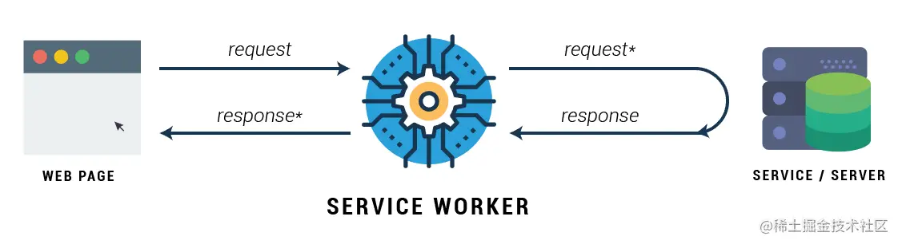
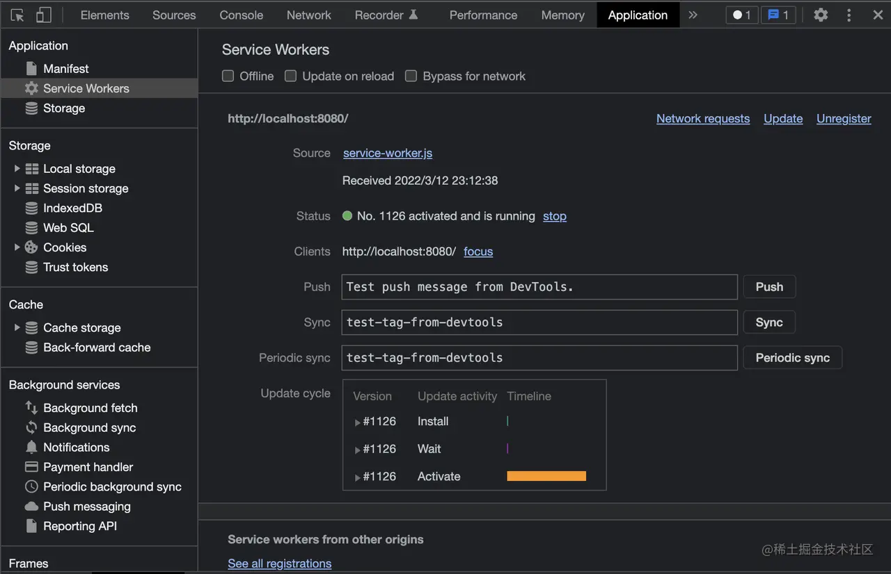
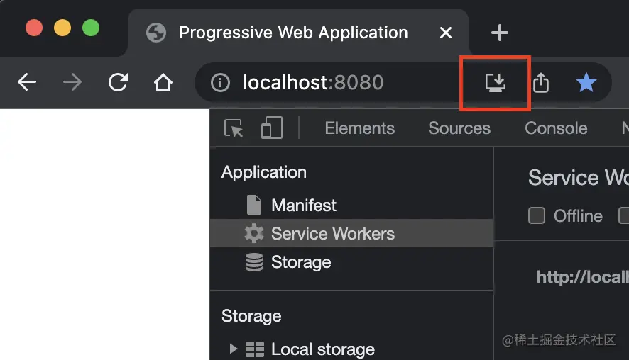
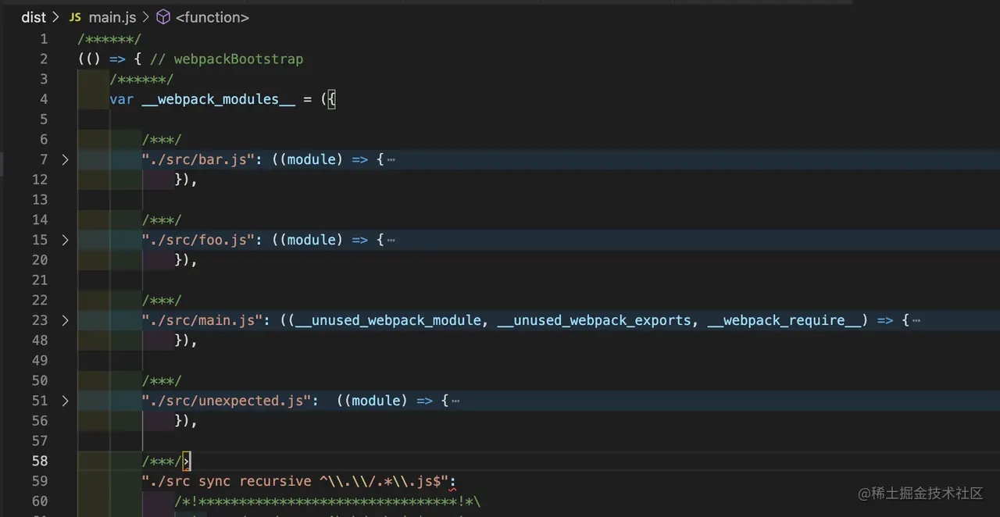
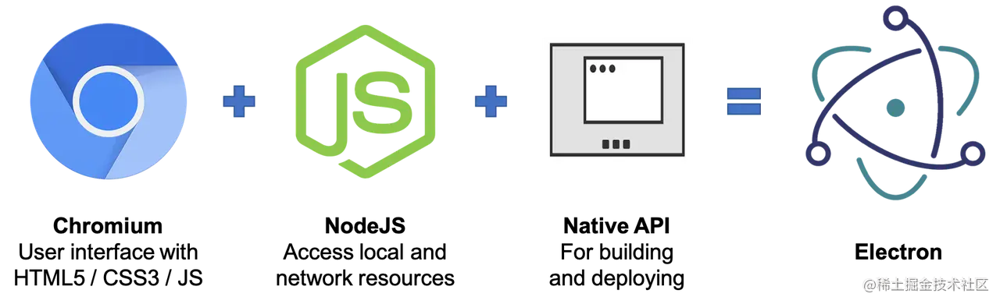

### 构建 PWA 应用

PWA 全称 Progressive Web Apps (渐进式 Web 应用)，原始定义很复杂，可以简单理解为 **一系列将网页如同独立 APP 般安装到本地的技术集合** ，借此，我们即可以保留普通网页轻量级、可链接(SEO 友好)、低门槛（只要有浏览器就能访问）等优秀特点，又同时具备独立 APP 离线运行、可安装等优势。

实现上，PWA 与普通 Web 应用的开发方法大致相同，都是用 CSS、JS、HTML 定义应用的样式、逻辑、结构，两者主要区别在于，PWA 需要用一些新技术实现离线与安装功能：

* [ServiceWorker](https://developer.mozilla.org/en-US/docs/Web/API/Service_Worker_API) ： 可以理解为一种介于网页与服务器之间的本地代理，主要实现 PWA 应用的离线运行功能。例如 ServiceWorker 可以将页面静态资源缓存到本地，用户再次运行页面访问这些资源时，ServiceWorker 可拦截这些请求并直接返回缓存副本，即使此时用户处于离线状态也能正常使用页面；



* [manifest](https://web.dev/add-manifest/?utm_source=devtools) 文件：描述 PWA 应用信息的 JSON 格式文件，用于实现本地安装功能，通常包含应用名、图标、URL 等内容，例如：


```json
// manifest.json
{
  "icons": [
    {
      "src": "/icon_120x120.0ce9b3dd087d6df6e196cacebf79eccf.png",
      "sizes": "120x120",
      "type": "image/png"
    }
  ],
  "name": "My Progressive Web App",
  "short_name": "MyPWA",
  "display": "standalone",
  "start_url": ".",
  "description": "My awesome Progressive Web App!"
}
```

我们可以选择自行开发、维护 `ServiceWorker` 及 `manifest` 文件 ，也可以简单点使用 Google 开源的 `Workbox` 套件自动生成 PWA 应用的壳，首先安装依赖：

```
yarn add -D workbox-webpack-plugin webpack-pwa-manifest
```

* workbox-webpack-plugin：用于自动生成 ServiceWorker 代码的 Webpack 插件；
* webpack-pwa-mainifest：根据 Webpack 编译结果，自动生成 PWA Manifest 文件的 Webpack 插件。

之后，在 `webpack.config.js` 配置文件中注册插件：

```js
const HtmlWebpackPlugin = require("html-webpack-plugin");
const { GenerateSW } = require("workbox-webpack-plugin");
const WebpackPwaManifest = require("webpack-pwa-manifest");

module.exports = {
  // ...
  plugins: [
    new HtmlWebpackPlugin({
      title: "Progressive Web Application",
    }),
    // 自动生成 Manifest 文件
    new WebpackPwaManifest({
      name: "My Progressive Web App",
      short_name: "MyPWA",
      description: "My awesome Progressive Web App!",
      publicPath: "/",
      icons: [
        {
          // 桌面图标，注意这里只支持 PNG、JPG、BMP 格式
          src: path.resolve("src/assets/logo.png"),
          sizes: [150],
        },
      ],
    }),
    // 自动生成 ServiceWorker 文件
    new GenerateSW({
      clientsClaim: true,
      skipWaiting: true,
    }),
  ],
};
```

之后，执行编译命令如 npx webpack 就可以生成如下资源：

```lua
├─ 8-1_pwa
│  ├─ src
│  │  ├─ xxx
│  ├─ dist
│  │  ├─ icon_150x150.119e95d3213ab9106b0f95100015a20a.png
│  │  ├─ index.html
│  │  ├─ main.js
│  │  ├─ manifest.22f4938627a3613bde0a011750caf9f4.json
│  │  ├─ service-worker.js
│  │  ├─ workbox-2afe96ff.js
│  └─ webpack.config.js
```


接下来，运行并使用 Chrome 打开页面，打开开发者工具，切换到 `Applicatios` > `Service Workers` 面板，可以看到：



这表明 Service Worker 已经正常安装到浏览器上。此外，地址栏右方还会出现一个下载图标：



点击该图标可将应用下载到本地，并在桌面创建应用图标 —— 效果如同安装独立 App 一样。

> 拓展阅读
> https://developer.chrome.com/docs/workbox/modules/workbox-webpack-plugin/
> https://developers.google.com/web/fundamentals/primers/service-workers

### 构建 Node 应用

注意，**在开发 Node 程序时使用 Webpack 的必要性并不大** ，因为 Node 本身已经有完备的模块化系统，并不需要像 Web 页面那样把所有代码打包成一个（或几个）产物文件！即使是为了兼容低版本 Node 环境，也可以使用更简单的方式解决 —— 例如 Babel，引入 Webpack 反而增加了系统复杂度以及不少技术隐患。

* 需要 Webpack 的 target 值设置为 node ，这能让 Webpack 忽略 fs/path 等原生 Node 模块； 
* 需要使用 externals 属性过滤 node_modules 模块，简单起见，也可以直接使用 webpack-node-externals 库； 
* 需要使用 node 属性，正确处理 __dirname、__filename 值。

```js
const nodeExternals = require("webpack-node-externals");

module.exports = merge(WebpackBaseConfig, {
  // 1. 设置 target 为 node
  target: "node",
  entry: ...,
  module: [...],
  // 2. 过滤 node_modules 模块
  externals: [nodeExternals()],
  // 3. 设置 __dirname, __filename 值
  node: {
    __filename: false,
    __dirname: false,
  },
});
```

不过，需要特别注意，在 Node 代码中请务必慎用动态 require 语句，你很可能会得到预期之外的效果！例如对于下面的示例目录：

```lua
├─ example
│  ├─ src
│  │  ├─ foo.js
│  │  ├─ bar.js
│  │  ├─ unused.js
│  │  └─ main.js
│  ├─ package.json
│  └─ webpack.config.js
```

其中 main.js 为入口文件，代码：

```js
const modules = ['foo', 'bar'].map(r => require(`./${r}.js`));
```

可以看到在 main.js 中并没有引用 unused.js ，但打包产物中却包含了 src 目录下所有文件：



这是因为 Webpack 遇到示例中的 require 语句时，仅仅依靠词法规则、静态语义、AST 等手段并不能推断出实际依赖情况，只能退而求其次粗暴地将所有可能用到的代码一股脑合并进来，这种处理手段很可能会带来许多意想不到的结果，很可能触发 BUG！

综上，建议尽量不要使用 Webpack 构建 Node 应用。


### 构建 Electron 应用

`Electron` 是一种使用 `JavaScript`、`HTML`、`CSS` 等技术构建跨平台桌面应用开发框架，这意味着我们能用我们熟悉的大部分 Web 技术 —— 例如 `React`、`Vue`、`Webpack` 等开发桌面级应用程序。实际上，许多大名鼎鼎的应用如 `VSCode`、`Facebook` `Messenger`、`Twitch`，以及国内诸多小程序 `IDE` 都是基于 Electron 实现的。

与 `Web` 页面不同，Electron 应用由一个 主进程 及若干 渲染进程 组成，进程之间以 IPC 方式通讯，其中：

* 主进程是一个 Node 程序，能够使用所有 Node 能力及 Electron 提供的 Native API，主要负责应用窗口的创建与销毁、事件注册分发、版本更新等；
* 渲染进程本质上是一个 Chromium 实例，负责加载我们编写的页面代码，渲染成 Electron 应用界面。




> 提示：Chromium 是一个非常简洁的开源浏览器，许多浏览器都基于 Chromium 二次开发而成，例如 Chrome、Microsoft Edge、Opera 等。

Electron 这种多进程机构，要求我们能在同一个项目中同时支持主进程与若干渲染进程的构建，两者打包需求各有侧重。接下来我们将通过一个简单示例，逐步讲解如何使用 Webpack 搭建一套完备的 Electron 应用构建环境，示例文件结构如下：

```lua
8-3_electron-wp
├─ package.json
├─ webpack.main.config.js       // 主进程构建配置
├─ webpack.renderer.config.js   // 渲染进程构建配置
├─ src
│  ├─ main.js
│  ├─ pages
│  │  ├─ home
│  │     ├─ index.js
│  │  ├─ login
│  │     ├─ index.js
```


* src/main.js 为主进程代码； 
* src/pages/${page name}/ 目录为渲染进程 —— 即桌面应用中每一个独立页面的代码； 
* 由于主进程、渲染进程的打包差异较大，这里为方便演示，直接写成两个配置文件：`webpack.main.config.js` 与 `webpack.renderer.config.js`。


### Electron 主进程打包配置

主进程负责应用窗口的创建销毁，以及许多跨进程通讯逻辑，可以理解为 Electron 应用的控制中心，简单示例：

```js
// src/main.js
const { app, BrowserWindow } = require("electron");

// 应用启动后
app.whenReady().then(() => {
  // 创建渲染进程实例
  const win = new BrowserWindow({
    width: 800,
    height: 600
  });
  // 使用 BrowserWindow 实例打开页面
  win.loadFile("home.html");
});
```


