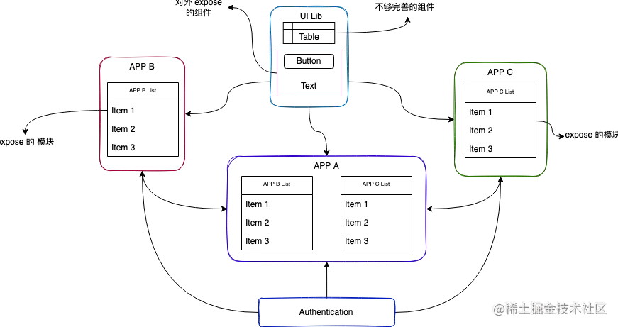

英文社区对 Webpack Module Federation 的响应非常热烈，甚至被誉为“A game-changer in JavaScript architecture”，相对而言国内对此热度并不高，这一方面是因为 MF 强依赖于 Webpack5，升级成本有点高；另一方面是国内已经有一些成熟微前端框架，例如 qiankun。不过我个人觉得 MF 有不少实用性强，非常值得学习、使用的特性，包括：

* 应用可按需导出若干模块，这些模块最终会被单独打成模块包，功能上有点像 NPM 模块；
* 应用可在运行时基于 HTTP(S) 协议动态加载其它应用暴露的模块，且用法与动态加载普通 NPM 模块一样简单；
* 与其它微前端方案不同，MF 的应用之间关系平等，没有主应用/子应用之分，每个应用都能导出/导入任意模块；





### 简单例子

Module Federation 的基本逻辑是一端导出模块，另一端导入、使用模块，实现上两端都依赖于 Webpack 5 内置的 `ModuleFederationPlugin` 插件：

1. 对于模块生成方，需要使用 `ModuleFederationPlugin` 插件的 `expose` 参数声明需要导出的模块列表；
2. 对于模块使用方，需要使用 `ModuleFederationPlugin` 插件的 `remotes` 参数声明需要从哪些地方导入远程模块。

接下来，我们按这个流程一步步搭建一个简单的 Webpack Module Federation 示例，相关代码已上传到 小册仓库。首先介绍一下示例文件结构：


```lua
MF-basic
├─ app-1
│  ├─ dist
│  │  ├─ ...
│  ├─ package.json
│  ├─ src
│  │  ├─ main.js
│  │  ├─ foo.js
│  │  └─ utils.js
│  └─ webpack.config.js
├─ app-2
│  ├─ dist
│  │  ├─ ...
│  ├─ package.json
│  ├─ src
│  │  ├─ bootstrap.js
│  │  └─ main.js
│  ├─ webpack.config.js
├─ lerna.json
└─ package.json
```

其中，app-1、app-2 是两个独立应用，分别有一套独立的 Webpack 构建配置，类似于微前端场景下的“微应用”概念。

在本示例中，app-1 负责导出模块 —— 类似于子应用；app-2 负责使用这些模块 —— 类似于主应用。

我们先看看模块导出方 —— 也就是 app-1 的构建配置：

```js
const path = require("path");
const { ModuleFederationPlugin } = require("webpack").container;

module.exports = {
  mode: "development",
  devtool: false,
  entry: path.resolve(__dirname, "./src/main.js"),
  output: {
    path: path.resolve(__dirname, "./dist"),
    // 必须指定产物的完整路径，否则使用方无法正确加载产物资源
    publicPath: `http://localhost:8081/dist/`,
  },
  plugins: [
    new ModuleFederationPlugin({
      // MF 应用名称
      name: "app1",
      // MF 模块入口，可以理解为该应用的资源清单
      filename: `remoteEntry.js`,
      // 定义应用导出哪些模块
      exposes: {
        "./utils": "./src/utils",
        "./foo": "./src/foo",
      },
    }),
  ],
  // MF 应用资源提供方必须以 http(s) 形式提供服务
  // 所以这里需要使用 devServer 提供 http(s) server 能力
  devServer: {
    port: 8081,
    hot: true,
  },
};
```
