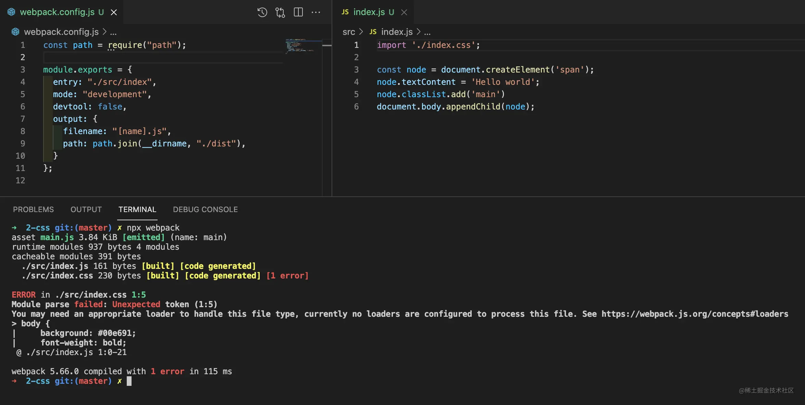
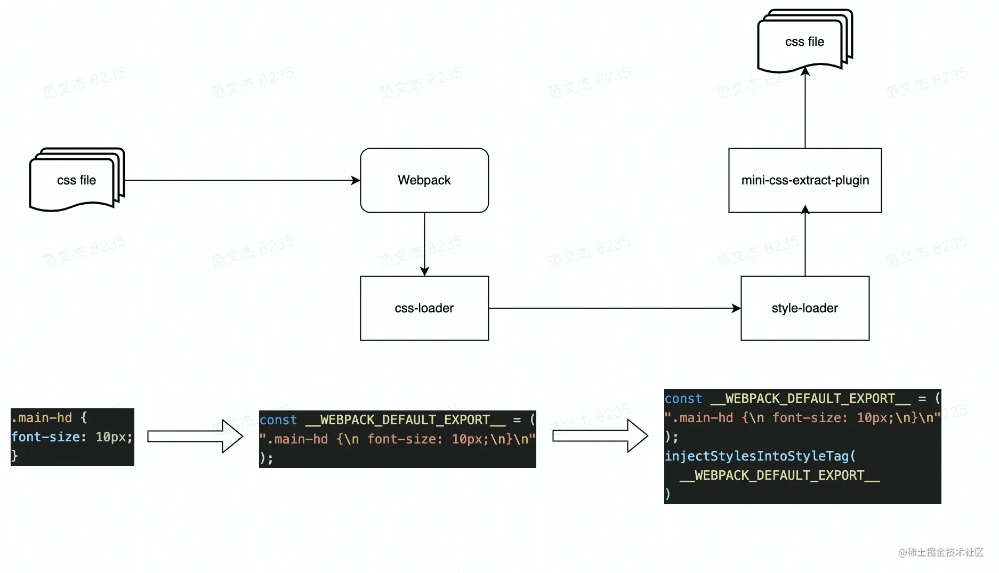
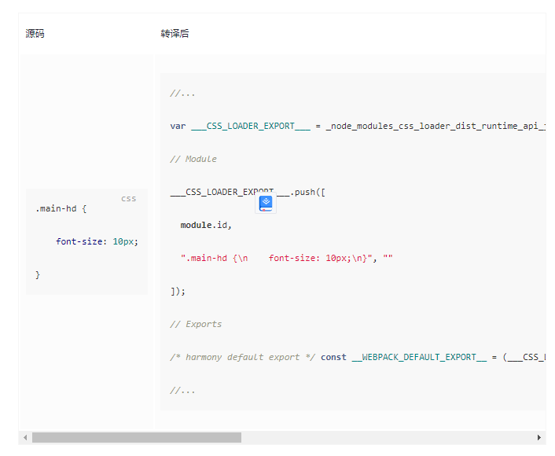
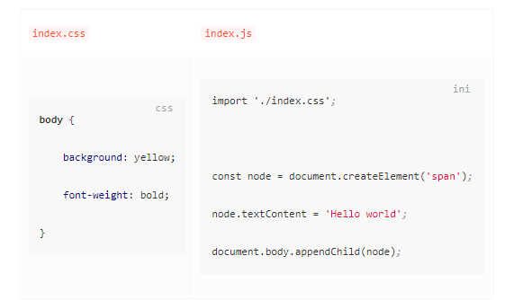
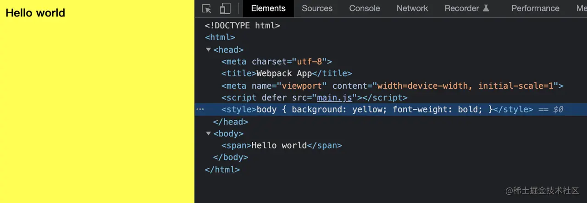
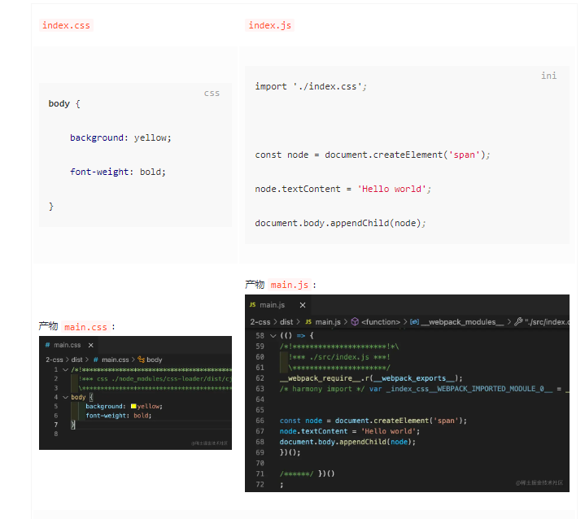
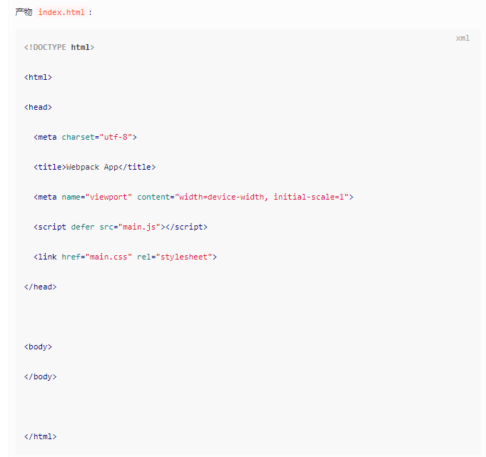
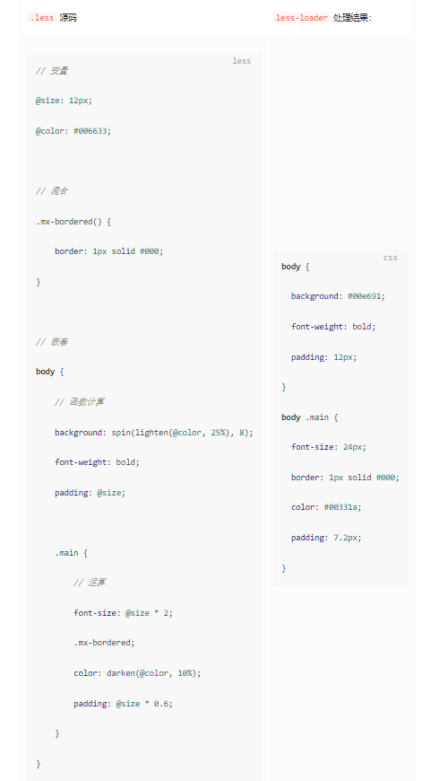
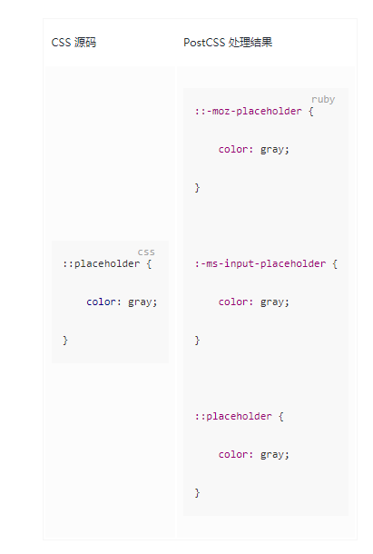

在开发 Web 应用时，我们通常需要编写大量 JavaScript 代码 —— 用于控制页面逻辑；编写大量 CSS 代码 —— 用于调整页面呈现形式。问题在于，CSS 语言在过去若干年中一直在追求样式表现力方面的提升，工程化能力薄弱，例如缺乏成熟的模块化机制、依赖处理能力、逻辑判断能力等。为此，在开发现代大型 Web 应用时，通常会使用 Webpack 配合其它预处理器编写样式代码。

### 如何处理 CSS 资源

原生 Webpack 并不能识别 CSS 语法，假如不做额外配置直接导入 .css 文件，会导致编译失败：




为此，在 Webpack 中处理 CSS 文件，通常需要用到：

* css-loader：该 Loader 会将 CSS 等价翻译为形如 ```module.exports = "${css}"``` 的JavaScript 代码，使得 Webpack 能够如同处理 JS 代码一样解析 CSS 内容与资源依赖
* style-loader：该 `Loader` 将在产物中注入一系列 runtime 代码，这些代码会将 `CSS` 内容注入到页面的 <style\> 标签，使得样式生效
* mini-css-extract-plugin：该插件会将 CSS 代码抽离到单独的 .css 文件，并将文件通过 <link\> 标签方式插入到页面中


三种组件各司其职：css-loader 让 Webpack 能够正确理解 CSS 代码、分析资源依赖；style-loader、mini-css-extract-plugin 则通过适当方式将 CSS 插入到页面，对页面样式产生影响：





下面我们先从 css-loader 聊起，css-loader 提供了很多处理 CSS 代码的基础能力，包括 CSS 到 JS 转译、依赖解析、Sourcemap、css-in-module 等，基于这些能力，Webpack 才能像处理 JS 模块一样处理 CSS 模块代码。接入时首先需要安装依赖：


```js
module.exports = {
  module: {
    rules: [
      {
        test: /\.css$/i,
        use: ["css-loader"],
      },
    ],
  },
};
```

此后，执行 npx webpack 或其它构建命令即可。经过 css-loader 处理后，样式代码最终会被转译成一段 JS 字符串：




但这段字符串只是被当作普通 JS 模块处理，并不会实际影响到页面样式，后续还需要：

1. 开发环境：使用 style-loader 将样式代码注入到页面 <style\> 标签；
2. 生产环境：使用 mini-css-extract-plugin 将样式代码抽离到单独产物文件，并以 <link\> 标签方式引入到页面中。

经过 css-loader 处理后，CSS 代码会被转译为等价 JS 字符串，但这些字符串还不会对页面样式产生影响，需要继续接入 style-loader 加载器。


与其它 Loader 不同，style-loader 并不会对代码内容做任何修改，而是简单注入一系列运行时代码，用于将 css-loader 转译出的 JS 字符串插入到页面的 style 标签。接入时同样需要安装依赖：

```
yarn add -D style-loader css-loader
```


之后修改 Webpack 配置，定义 .css 规则：

> PS：注意保持 style-loader 在前，css-loader 在后

```
module.exports = {
  module: {
    rules: [
      {
        test: /\.css$/i,
        use: ["style-loader", "css-loader"],
      },
    ],
  },
};
```

上述配置语义上相当于 style-loader(css-loader(css)) 链式调用，执行后样式代码会被转译为类似下面这样的代码：

```js
// Part1: css-loader 处理结果，对标到原始 CSS 代码
const __WEBPACK_DEFAULT_EXPORT__ = (
"body {\n    background: yellow;\n    font-weight: bold;\n}"
);
// Part2: style-loader 处理结果，将 CSS 代码注入到 `style` 标签
injectStylesIntoStyleTag(
 __WEBPACK_DEFAULT_EXPORT__
)
```

至此，运行页面触发 `injectStylesIntoStyleTag` 函数将 CSS 代码注入到 <style\> 标签，样式才真正开始生效。例如：





经过 style-loader + css-loader 处理后，样式代码最终会被写入 Bundle 文件，并在运行时通过 style 标签注入到页面。这种将 JS、CSS 代码合并进同一个产物文件的方式有几个问题：

* JS、CSS 资源无法并行加载，从而降低页面性能； 
* 资源缓存粒度变大，JS、CSS 任意一种变更都会致使缓存失效。

因此，生产环境中通常会用 mini-css-extract-plugin 插件替代 style-loader，将样式代码抽离成单独的 CSS 文件。使用时，首先需要安装依赖：

```
yarn add -D mini-css-extract-plugin
```

```js
const MiniCssExtractPlugin = require('mini-css-extract-plugin')
const HTMLWebpackPlugin = require('html-webpack-plugin')

module.exports = {
    module: {
        rules: [{
            test: /\.css$/,
            use: [
                // 根据运行环境判断使用那个 loader
                (process.env.NODE_ENV === 'development' ?
                    'style-loader' :
                    MiniCssExtractPlugin.loader),
                'css-loader'
            ]
        }]
    },
    plugins: [
        new MiniCssExtractPlugin(),
        new HTMLWebpackPlugin()
    ]
}
```

这里需要注意几个点：

* mini-css-extract-plugin 库同时提供 Loader、Plugin 组件，需要同时使用
* mini-css-extract-plugin 不能与 style-loader 混用，否则报错，所以上述示例中第 9 行需要判断 process.env.NODE_ENV 环境变量决定使用那个 Loader
* mini-css-extract-plugin 需要与 html-webpack-plugin 同时使用，才能将产物路径以 link 标签方式插入到 html 中

至此，运行 Webpack 后将同时生成 JS、CSS、HTML 三种产物文件，如：





可以看到，样式代码会被抽离到单独的 CSS 文件，并且在最终生成的 html 中包含了指向 JS、CSS 两种资源的标签：

```html
<script defer src="main.js"></script>
<link href="main.css" rel="stylesheet">
```


综上，在 Webpack 中处理 CSS，通常需要使用 css-loader + style-loader 或 css-loader + mini-css-extract-plugin 组合，
两种方式最终都能实现加载样式代码的效果。但鉴于原生 CSS 语言的种种缺陷，我们还可以在此基础上增加更多 Webpack 组件，更优雅、高效地编写页面样式，下面一一展开介绍。


### 预处理器

社区在 CSS 原生语法基础上扩展出一些更易用，功能更强大的 CSS 预处理器(Preprocessor)，比较知名的有 Less、Sass、Stylus 。这些工具各有侧重，但都在 CSS 之上补充了扩展了一些逻辑判断、数学运算、嵌套封装等特性，基于这些特性，我们能写出复用性、可读性、可维护性更强，条理与结构更清晰的样式代码，以 Less 为例：

```less
// 变量
@size: 12px;
@color: #006633;

// 混合
.mx-bordered() {
    border: 1px solid #000;
}

// 嵌套
body {
    // 函数计算
    background: spin(lighten(@color, 25%), 8);
    font-weight: bold;
    padding: @size;

    .main {
        // 数学运算
        font-size: @size * 2;
        .mx-bordered;
        color: darken(@color, 10%);
        padding: @size * 0.6;
    }
}
```

```
yarn add -D less less-loader
```

其次，修改 Webpack 配置，添加 .less 处理规则：

```js
module.exports = {
    module: {
        rules: [{
            test: /\.less$/,
            use: [
                'style-loader',
                'css-loader',
                'less-loader'
            ]
        }]
    }
}
```

可以看到这里需要同时使用三种 Loader，其中 less-loader 用于将 Less 代码转换为 CSS 代码，上述示例转换结果：




这段 CSS 随后会被 css-loader 与 style-loader 处理，最终在页面生效。

目前，社区比较流行的预处理器框架有：Less、Sass、Stylus，它们接入 Webpack 的方式非常相似：

大家可根据项目背景选择接入适当的预处理器框架。

### 使用 post-css

```
yarn add -D postcss postcss-loader
```

```js
module.exports = {
  module: {
    rules: [
      {
        test: /\.css$/,
        use: [
          "style-loader", 
          "css-loader", 
          "postcss-loader"
        ],
      },
    ],
  }
};
```

不过，这个时候的 PostCSS 还只是个空壳，下一步还需要使用适当的 PostCSS 插件进行具体的功能处理，例如我们可以使用 autoprefixer 插件自动添加浏览器前缀，首先安装依赖：

```
yarn add -D autoprefixer
```

```js
module.exports = {
  module: {
    rules: [
      {
        test: /\.css$/,
        use: [
          "style-loader", 
          {
            loader: "css-loader",            
            options: {
              importLoaders: 1
            }
          }, 
          {
            loader: "postcss-loader",
            options: {
              postcssOptions: {
                // 添加 autoprefixer 插件
                plugins: [require("autoprefixer")],
              },
            },
          }
        ],
      },
    ],
  }
};
```

之后，再次运行 Webpack 即可为 CSS 代码自动添加浏览器前缀，例如：



值得一提的是，`PostCSS` 与预处理器并非互斥关系，我们完全可以在同一个项目中同时使用两者，例如：

```js
module.exports = {
  module: {
    rules: [
      {
        test: /\.less$/,
        use: [
          "style-loader", 
          {
            loader: "css-loader",            
            options: {
              importLoaders: 1
            }
          }, 
          "postcss-loader",
          "less-loader"
        ],
      },
    ],
  }
};
```

基于这一特性，我们既能复用预处理语法特性，又能应用 PostCSS 丰富的插件能力处理诸如雪碧图、浏览器前缀等问题。

PostCSS 最大的优势在于其简单、易用、丰富的插件生态，基本上已经能够覆盖样式开发的方方面面。

实践中，经常使用的插件有：

* autoprefixer：基于 Can I Use 网站上的数据，自动添加浏览器前缀
* postcss-preset-env：一款将最新 CSS 语言特性转译为兼容性更佳的低版本代码的插件
* postcss-less：兼容 Less 语法的 PostCSS 插件，类似的还有：postcss-sass、poststylus
* stylelint：一个现代 CSS 代码风格检查器，能够帮助识别样式代码中的异常或风格问题

### 总结

本文介绍 css-loader、style-loader、mini-css-extract-plugin、less-loader、postcss-loader 等组件的功能特点与接入方法，内容有点多，重点在于：

* Webpack 不能理解 CSS 代码，所以需要使用 css-loader、style-loader、mini-css-extract-plugin 三种组件处理样式资源；
* Less/Sass/Stylus/PostCSS 等工具可弥补原生 CSS 语言层面的诸多功能缺失，例如数值运算、嵌套、代码复用等。


