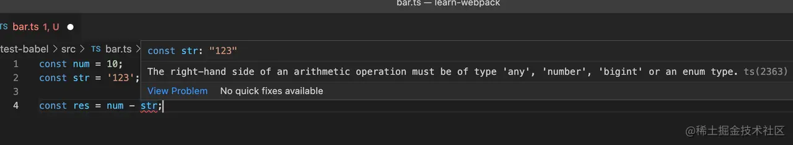
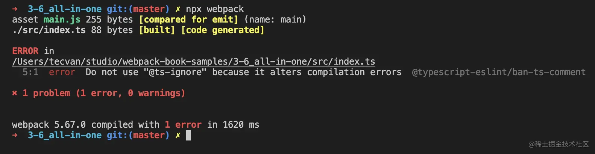

JavaScript 的三种常用工具：Babel、TypeScript、ESLint 的历史背景、功能以及接入 Webpack 的步骤，借助这些工具，我们能构建出更健壮、优雅的 JavaScript 应用。


### 使用Babel

Webpack 场景下，只需使用 babel-loader 即可接入 Babel 转译功能：

```
npm i -D @babel/core @babel/preset-env babel-loader
```


```
module.exports = {
  /* ... */
  module: {
    rules: [
      {
        test: /\.js$/,
        use: ['babel-loader'],
      },
    ],
  },
};
```

示例中，module 属性用于声明模块处理规则，module.rules 子属性则用于定义针对什么类型的文件使用哪些 Loader 处理器，上例可解读为：

* test: /\.js$/：用于声明该规则的过滤条件，只有路径名命中该正则的文件才会应用这条规则，示例中的 /\.js$/ 表示对所有 .js 后缀的文件生效
* use：用于声明这条规则的 Loader 处理器序列，所有命中该规则的文件都会被传入 Loader 序列做转译处理

```
npx webpack
```

接入后，可以使用 .babelrc 文件或 rule.options 属性配置 Babel 功能逻辑，例如：

```
// 预先安装 @babel/preset-env
// npm i -D @babel/preset-env
module.exports = {
  /* ... */
  module: {
    rules: [
      {
        test: /\.js$/,
        use: [
          {
            loader: 'babel-loader',
            options: {
              presets: ['@babel/preset-env'],
            },
          },
        ],
      },
    ],
  },
};
```

特别提一下，示例中的 @babel/preset-env 是一种 Babel 预设规则集 —— Preset， 这种设计能按需将一系列复杂、数量庞大的配置、插件、Polyfill 等打包成一个单一的资源包， 从而简化 Babel 的应用、学习成本。


Preset 是 Babel 的主要应用方式之一，社区已经针对不同应用场景打包了各种 Preset 资源，例如：

* babel-preset-react：包含 React 常用插件的规则集，支持 preset-flow、syntax-jsx、transform-react-jsx 等；
* @babel/preset-typescript：用于转译 TypeScript 代码的规则集
* @babel/preset-flow：用于转译 Flow 代码的规则集

> 提示：关于 Babel 的功能、用法、原理还有非常大的学习空间，感兴趣的同学可以前往阅读官方文档：babeljs.io/docs/en/ ，这里点到为止，把注意力放回 Webpack + Babel 协作上。

### 使用 TypeScript

其中，TypeScript 借鉴 C# 语言，在 JavaScript 基础上提供了一系列类型约束特性，例如：



示例中，用一个数字类型的变量 num 减去字符串类型的变量 str，这在 TypeScript 的代码编译过程就能提前发现问题，而 JavaScript 环境下则需要到启动运行后才报错。

这种类型检查特性虽然一定程度上损失了语言本身的灵活性，但能够让问题在编译阶段提前暴露，确保运行阶段的类型安全性，特别适合用于构建多人协作的大型 JavaScript 项目，也因此，时至今日 TypeScript 依然是一项应用广泛的 JavaScript 超集语言。

Webpack 有很多种接入 TypeScript 的方法，包括 ts-loader、awesome-ts-loader、 babel-loader。通常可使用 ts-loader 构建 TypeScript 代码：

```
npm i -D typescript ts-loader
```

```
const path = require('path');

module.exports = {
  /* xxx */
  module: {
    rules: [
      {
        test: /\.ts$/,
        use: 'ts-loader'
      },
    ],
  },
  resolve: {
    extensions: ['.ts', '.js'],
  }
};
```

* 使用 module.rules 声明对所有符合 /\.ts$/ 正则 —— 即 .ts 结尾的文件应用 ts-loader 加载器
* 使用 resolve.extensions 声明自动解析 .ts 后缀文件，这意味着代码如 import "./a.ts" 可以忽略后缀声明，简化为 import "./a" 文件

创建 tsconfig.json 配置文件，并补充 TypeScript 配置信息

```
// tsconfig.json
{
  "compilerOptions": {
    "noImplicitAny": true,
    "moduleResolution": "node"
  }
}
```

```
npx webpack
```

注意，如果项目中已经使用 babel-loader，你也可以选择使用 @babel/preset-typescript 规则集，借助 babel-loader 完成 JavaScript 与 TypeScript 的转码工作：

```
npm i -D @babel/preset-typescript
```


```
// 预先安装 @babel/preset-env
// npm i -D @babel/preset-env
module.exports = {
  /* ... */
  module: {
    rules: [
      {
        test: /\.js$/,
        use: [
          {
            loader: 'babel-loader',
            options: {
              presets: ['@babel/preset-typescript'],
            },
          },
        ],
      },
    ],
  },
};
```

不过，@babel/preset-typescript 只是简单完成代码转换，并未做类似 ts-loader 的类型检查工作，大家需要根据实际场景选择适当工具。


### 使用 ESLint

ESLint 是一种扩展性极佳的 JavaScript 代码风格检查工具，它能够自动识别违反风格规则的代码并予以修复，例如对于下面的示例：

| 源码 | ESLint 修复后 |
| --- | --- |
| const foo ='foo'; let bar='bar'; console.log(foo,bar) | const foo = 'foo' const bar = 'bar' console.log(foo, bar) |

ESLint 配置：

```
module.exports = {

    "extends": "standard"

}
```

Webpack 下，可以使用 eslint-webpack-plugin 接入 ESLint 工具，步骤：

```
# 安装 webpack 依赖
yarn add -D webpack webpack-cli

# 安装 eslint 
yarn add -D eslint eslint-webpack-plugin

# 简单起见，这里直接使用 standard 规范
yarn add -D 
eslint-config-standard
eslint-plugin-promise
eslint-plugin-import
eslint-plugin-node
eslint-plugin-n
```


```
// .eslintrc
{
  "extends": "standard"
}
```

```
// webpack.config.js
const path = require('path')
const ESLintPlugin = require('eslint-webpack-plugin')

module.exports = {
  entry: './src/index',
  mode: 'development',
  devtool: false,
  output: {
    filename: '[name].js',
    path: path.resolve(__dirname, 'dist')
  },
  // 添加 eslint-webpack-plugin 插件实例
  plugins: [new ESLintPlugin()]
}
```

```
npx webpack
```

* eslint-config-airbnb：Airbnb 提供的代码风格规则集，算得上 ESLint 生态第一个成名的规则集合
* eslint-config-standard：Standard.js 代码风格规则集，史上最便捷的统一代码风格的方式
* eslint-plugin-vue：实现对 Vue SFC 文件的代码风格检查
* eslint-plugin-react：实现对 React 代码风格检查
* @typescript-eslint/eslint-plugin：实现对 TypeScript 代码风格检查
* eslint-plugin-sonarjs：基于 Sonar 的代码质量检查工具，提供圈复杂度、代码重复率等检测功能


### 综合实例

```
npm i -D webpack webpack-cli \
    # babel 依赖
    @babel/core @babel/cli @babel/preset-env babel-loader \
    # TypeScript 依赖
    typescript @typescript-eslint/parser @typescript-eslint/eslint-plugin \
    @babel/preset-typescript \
    # ESLint 依赖
    eslint eslint-webpack-plugin
```

```js
const path = require('path')
const ESLintPlugin = require('eslint-webpack-plugin')

module.exports = {
  entry: './src/index.ts',
  mode: 'development',
  devtool: false,
  output: {
    filename: '[name].js',
    path: path.resolve(__dirname, 'dist')
  },
  module: {
    rules: [
      {
        test: /\.ts$/,
        use: {
          loader: 'babel-loader',
          options: { presets: ['@babel/preset-typescript'] }
        }
      }
    ]
  },
  plugins: [new ESLintPlugin({ extensions: ['.js', '.ts'] })]
}
```

```
{
  "parser": "@typescript-eslint/parser",
  "plugins": ["@typescript-eslint"],
  "extends": ["plugin:@typescript-eslint/recommended"]
}
```

之后只需执行 npx webpack 命令即可完成编译操作，例如：



至此，我们就搭建了一个支持 Babel + TypeScript + ESLint 的开发环境，读者可在此基础上修改各项工具配置，定制适合自己项目的开发环境。


### 总结

本文介绍了 ESLint、TypeScript、Babel 三类工程化工具的历史背景、功能，以及在 Webpack 中接入这些工具的具体步骤。这三种工具各自补齐了 JavaScript 语言某些薄弱环节：

* Babel 提供的语言转译能力，能在确保产物兼容性的同时，让我们大胆使用各种新的 ECMAScript 语言特性；
* TypeScript 提供的类型检查能力，能有效提升应用代码的健壮性；
* ESLint 提供的风格检查能力，能确保多人协作时的代码一致性。


* 它们已成为构建现代 JavaScript 应用的基础设施，建议读者遵循文章提及的学习建议，扩展学习各个工具的功能细节。


