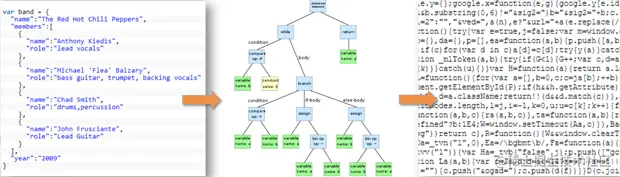
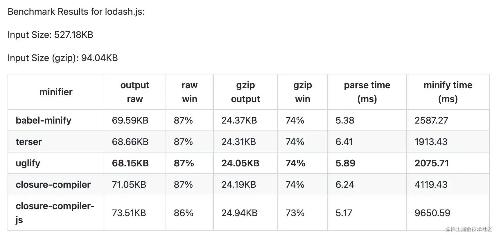

代码压缩 是指在不改变代码功能的前提下，从声明式（`HTML`、`CSS`）或命令式（`JavaScript`）语言中删除所有不必要的字符（备注、变量名压缩、逻辑语句合并等），减少代码体积的过程，这在 Web 场景中能够有效减少浏览器从服务器获取代码资源所需要消耗的传输量，降低网络通讯耗时，提升页面启动速度，是一种非常基础且性价比特别高的应用性能优化方案。

在 `Webpack` 生态下，我们可以借助各种插件轻松实现应用代码压缩，本文将从代码压缩的基本原理开始讲起，之后介绍若干适用于 JavaScript、CSS、HTML 的代码压缩工具。

### 代码压缩原理

“代码压缩”最关键的问题是：如何用“**更精简**”的代码表达“同一套”程序逻辑？这并不是什么黑魔法，底层逻辑简单的甚至有点粗暴，拆开来看：

“**更精简**”意味着可以适当 —— 甚至完全牺牲可读性、语义、优雅度而力求用最少字符数的方式书写代码。

比如说 `const name = 'tecvan'`;，这个看起来非常简单的赋值语句就有不少可以精简的字符：


1. 变量名 `name` 语义很明确，大多数“人”看到就基本明白是干什么用的，但这对计算机并没有什么意义，我们完全可以将 `name` 修改为 a —— 从 4 个字符精简为 1 个字符，但仍保持改动前后逻辑、功能效果完全一致；
2. 赋值操作符 `=` 前后都有空格，这种格式对阅读代码的“人”很友好，视觉效果非常舒适、整齐，但对计算机而言同样毫无意义，我们可以将这前后两个空格删掉 —— 精简了两个字符；
3. 虽然 `const` 与 `let` 关键词的功能不同，但特定情况下我们同样能牺牲一部分功能性，用 `let` 替换 `const`，从 5 个字符精简为 1 个字符。

经过上面三个步骤之后，代码从 `const name = 'tecvan';` —— 22 个字符，精简为` let a='tecvan';` —— 18 个字符，往大了说是节省了 18% 的代码体积。其它语言的代码压缩规则也基本都是按照上面这种套路实现的。

其次，“同一套”意味着修改前后必须保持一致的代码逻辑、执行流程、功能效果等，例如：

```js
const a = 1;
const b = 2;
const c = a + b;
```

代码中，`a/b` 都是字面量常量，那么整段代码完全可以精简为 `const c = 3` ，省略掉 `a/b` 变量的声明语句，前后还能保持功能完全一致。

为了应对这两个挑战，很自然的我们可以先将字符串形态的代码转换为结构化、容易分析处理的 AST（抽象语法树）形态，之后在 AST 上应用上面的规则做各种语法、语义、逻辑推理与简化替换，最后按精简过的 AST 生成结果代码。



社区曾经出现过非常非常多 `JavaScript`、`HTML`、`CSS` 代码压缩工具，基本上都是按照上面这种套路实现的，包括：[Terser](https://github.com/terser/terser) 、[ESBuild](https://esbuild.github.io/) 、[CSS-Nano](https://cssnano.co/) 、 [babel-minify](https://github.com/babel/minify) 、 [htmlMinifierTerser](https://github.com/terser/html-minifier-terser)  等，幸运的是，我们可以在 Webpack 中轻松接入这些工具，实现代码压缩。

### 使用 TerserWebpackPlugin 压缩 JS

[Terser](https://github.com/terser/terser) 是当下 最为流行 的 ES6 代码压缩工具之一，支持 [Dead-Code Eliminate](https://en.wikipedia.org/wiki/Dead-code_elimination) 、删除注释、删除空格、代码合并、变量名简化等等 [一系列](https://github.com/terser/terser#compress-options) 代码压缩功能。Terser 的前身是大名鼎鼎的 UglifyJS，它在 [UglifyJS](https://github.com/mishoo/UglifyJS) 基础上增加了 ES6 语法支持，并重构代码解析、压缩算法，使得执行效率与压缩率都有较大提升：



Webpack5.0 后默认使用 `Terser` 作为 `JavaScript` 代码压缩器，简单用法只需通过 `optimization.minimize` 配置项开启压缩功能即可：

Terser 支持许多压缩 [配置](https://github.com/terser/terser#compress-options) ：

Terser 支持许多压缩 配置：

* `dead_code`：是否删除不可触达的代码 —— 也就是所谓的死代码； 
* `booleans_as_integers`：是否将 Boolean 值字面量转换为 0、1； 
* `join_vars`：是否合并连续的变量声明，如 `var a = 1; var b = 2;` 合并为 `var a=1,b=2;；`

多数情况下使用默认 `Terser` 配置即可，必要时也可以手动创建 [terser-webpack-plugin](https://github.com/webpack-contrib/terser-webpack-plugin) 实例并传入压缩配置实现更精细的压缩功能，例如：


```js
const TerserPlugin = require("terser-webpack-plugin");

module.exports = {
  // ...
  optimization: {
    minimize: true,
    minimizer: [
      new TerserPlugin({
        terserOptions: {
          compress: {
            reduce_vars: true,
            pure_funcs: ["console.log"],
          },
          // ...
        },
      }),
    ],
  },
};
```

> 提示：示例中的 `minimize` 用于控制是否开启压缩，只有 `minimize = true'` 时才会调用 `minimizer` 声明的压缩器数组（没错，这是数组形式）执行压缩操作。 
> 另外，Webpack4 默认使用 [uglifyjs-webpack-plugin](https://www.npmjs.com/package/uglifyjs-webpack-plugin) 压缩代码，也可以通过 `minimizer` 数组替换为 Terser 插件。

[terser-webpack-plugin](https://github.com/webpack-contrib/terser-webpack-plugin) 是一个颇为复杂的 Webpack 插件，提供下述 配置项：

* `test`：只有命中该配置的产物路径才会执行压缩，功能与 `module.rules.test` 相似； 
* `include`：在该范围内的产物才会执行压缩，功能与 `module.rules.include` 相似； 
* `exclude`：与 `include` 相反，不在该范围内的产物才会执行压缩，功能与 module.rules.exclude 相似； 
* `parallel`：是否启动并行压缩，默认值为 `true`，此时会按 `os.cpus().length - 1` 启动若干进程并发执行； 
* `minify`：用于配置压缩器，支持传入自定义压缩函数，也支持 `swc/esbuild/uglifyjs` 等值，下面我们再展开讲解； 
* `terserOptions`：传入 `minify` —— “压缩器”函数的配置参数； 
* `extractComments`：是否将代码中的备注抽取为单独文件，可配合特殊备注如 `@license` 使用。

这些配置项总结下来有两个值得关注的逻辑：

1. 可以通过 `test/include/exclude` 过滤插件的执行范围，这个功能配合 `minimizer` 的数组特性，可以实现针对不同产物执行不同的压缩策略，例如：

```js
const TerserPlugin = require("terser-webpack-plugin");

module.exports = {
  entry: { foo: "./src/foo.js", bar: "./src/bar.js" },
  output: {
    filename: "[name].js",
    // ...
  },
  optimization: {
    minimize: true,
    minimizer: [
      new TerserPlugin({
        test: /foo\.js$/i,
        extractComments: "all",
      }),
      new TerserPlugin({
        test: /bar\.js/,
        extractComments: false,
      }),
    ],
  },
};
```

2. [terser-webpack-plugin](https://github.com/webpack-contrib/terser-webpack-plugin) 插件并不只是 `Terser` 的简单包装，它更像是一个代码压缩功能骨架，底层还支持使用 `SWC、UglifyJS、ESBuild` 作为压缩器，使用时只需要通过 `minify` 参数切换即可，例如：

```js
module.exports = {
  optimization: {
    minimize: true,
    minimizer: [
      new TerserPlugin({
        minify: TerserPlugin.swcMinify,
        // `terserOptions` 将被传递到 `swc` (`@swc/core`) 工具
        // 具体配置参数可参考：https://swc.rs/docs/config-js-minify
        terserOptions: {},
      }),
    ],
  },
};
```

> 提示：TerserPlugin 内置如下压缩器：
> * `TerserPlugin.terserMinify`：依赖于 terser 库；
> * `TerserPlugin.uglifyJsMinify`：依赖于 uglify-js，需要手动安装 `yarn add -D uglify-js`；
> * `TerserPlugin.swcMinify`：依赖于 @swc/core，需要手动安装 `yarn add -D @swc/core`；
> * `TerserPlugin.esbuildMinify`：依赖于 esbuild，需要手动安装 `yarn add -D esbuild`。
> 另外，`terserOptions` 配置也不仅仅专供 terser 使用，而是会透传给具体的 `minifier`，因此使用不同压缩器时支持的配置选项也会不同。

不同压缩器功能、性能差异较大，据我了解，ESBuild 与 SWC 这两个基于 Go 与 Rust 编写的压缩器性能更佳，且效果已经基本趋于稳定，虽然功能还比不上 Terser，但某些构建性能敏感场景下不失为一种不错的选择。

### 使用 CssMinimizerWebpackPlugin 压缩 CSS

CSS 是一种灵活多变得略显复杂的声明式语言，同样的样式效果可以被表达成非常多样的代码语句，例如一个非常典型的案例：`margin: 10px`，可以被写成：

* margin: 10px 10px; 
* margin-left: 10px; margin-right: 10px;...

```css
h1::before,
h1:before {
  /* 下面各种备注都可以删除 */
  /* margin 值可简写 */
  margin: 10px 20px 10px 20px; 
  /* 颜色值也可以简写 */
  color: #ff0000; 
  /* 删除重复属性 */
  font-weight: 400;
  font-weight: 400; 
  /* position 字面量值可简化为百分比 */
  background-position: bottom right;
  /* 渐变参数可精简 */
  background: linear-gradient(
    to bottom,
    #ffe500 0%,
    #ffe500 50%,
    #121 50%,
    #121 100%
  ); 
  /* 初始值也可精简 */
  min-width: initial;
}
```

上述代码就有不少地方可以精简优化，使用 [cssnano](https://cssnano.co/) 压缩后大致上可简化为：

```css
h1:before {
  margin: 10px 20px;
  color: red;
  font-weight: 400;
  background-position: 100% 100%;
  quotes: "«" "»";
  background: linear-gradient(180deg, #ffe500, #ffe500 50%, #121 0, #121);
  min-width: 0;
}
```

从原来的 422 个字符精简为 212 个字符，接近 50%，我们日常编写的 CSS 语句也跟上述示例类似，通常都会有不少可以优化压缩的地方。

Webpack 社区中有不少实现 CSS 代码压缩的插件，例如：[css-minimizer-webpack-plugin](https://github.com/terser/terser#compress-options) ，用法：

```js
yarn add -D css-minimizer-webpack-plugin
```

```js
const CssMinimizerPlugin = require("css-minimizer-webpack-plugin");
const MiniCssExtractPlugin = require("mini-css-extract-plugin");

module.exports = {
  //...
  module: {
    rules: [
      {
        test: /.css$/,
        // 注意，这里用的是 `MiniCssExtractPlugin.loader` 而不是 `style-loader`
        use: [MiniCssExtractPlugin.loader, "css-loader"],
      },
    ],
  },
  optimization: {
    minimize: true,
    minimizer: [
      // Webpack5 之后，约定使用 `'...'` 字面量保留默认 `minimizer` 配置
      "...",
      new CssMinimizerPlugin(),
    ],
  },
  // 需要使用 `mini-css-extract-plugin` 将 CSS 代码抽取为单独文件
  // 才能命中 `css-minimizer-webpack-plugin` 默认的 `test` 规则
  plugins: [new MiniCssExtractPlugin()],
};
```


