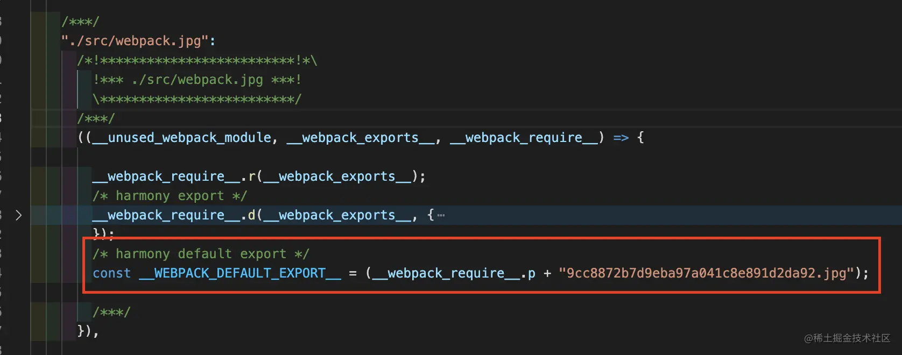
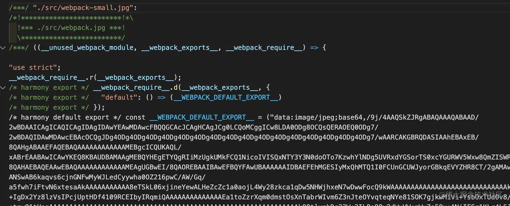
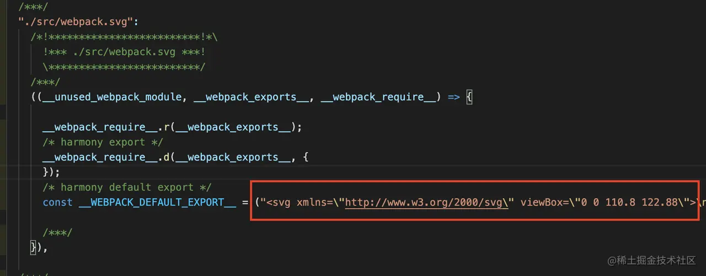

图形图像资源是当代 Web 应用的最常用、实惠的内容、装饰元素之一，但在 Webpack 出现之前对图像资源的处理复杂度特别高，需要借助一系列工具(甚至 Photoshop)完成压缩、雪碧图、hash、部署等操作。

而在 Webpack 中，图像以及其它多媒体资源都被提升为一等公民 —— 能够像引用普通 JavaScript 模块一样通过 import/require 语句导入资源模块，这种开发模式允许我们将图像相关的处理合入统一的心智模型中，提升开发效率。

本文将集中介绍 Webpack 体系下处理图像资源的常见方法，包括：

* 如何使用适当的 Loader 处理图像资源； 
* 如何借助 Loader 或插件实现图像优化，包括压缩、雪碧图、响应式图片。

### 在 Webpack 4 中导入图像

原生 Webpack 4 只能处理标准 `JavaScript` 模块，因此需要借助 `Loader` —— 例如 `file-loader`、`url-loader`、`raw-loader` 等完成图像加载操作，实践中我们通常需要按资源类型选择适当加载器，简单介绍：

* file-loader：将图像引用转换为 url 语句并生成相应图片文件，例如使用如下配置：

```js
// webpack.config.js
module.exports = {
  // ...
  module: {
    rules: [{
      test: /\.(png|jpg)$/,
      use: ['file-loader']
    }],
  },
};
```

经过 `file-loader` 处理后，原始图片会被重命名并复制到产物文件夹，同时在代码中插入图片 `URL` 地址，形如：



* [url-loader](https://v4.webpack.js.org/loaders/url-loader/) ：有两种表现，对于小于阈值 `limit` 的图像直接转化为 `base64` 编码；大于阈值的图像则调用 `file-loader` 进行加载，例如如下配置：



对于超过 `limit` 值的图片则直接调用 `file-loader` 完成加载。

`url-loader` 同样适用于大多数图片格式，且能将许多细小的图片直接内嵌进产物中，减少页面运行时需要发出的网络请求数，在 HTTP 1.1 及之前版本中能带来正向的性能收益。

* [raw-loader](https://v4.webpack.js.org/loaders/raw-loader) ：不做任何转译，只是简单将文件内容复制到产物中，适用于 SVG 场景，例如如下配置：

```js
// webpack.config.js
module.exports = {
  // ...
  module: {
    rules: [
      {
        test: /\.svg$/i,
        use: ['raw-loader'],
      },
    ],
  },
};
```

经过 `raw-loader` 处理后，SVG 资源会被直接复制成字符串形式：



提示：除 raw-loader 外，我们还可以使用如下 Loader 加载 SVG 资源：

* [svg-inline-loader](https://www.npmjs.com/package/svg-inline-loader) ：能够自动删除 SVG 图片中与显式无关的各种原信息，达到压缩效果；
* [svg-url-loader](https://www.npmjs.com/package/svg-url-loader) ：以 DataURL 方式导入 SVG 图片，相比于 Base64 更节省空间；
* [react-svg-loader](https://www.npmjs.com/package/react-svg-loader) ：导入 SVG 图片并自动转化为 React 组件形态，效果类似 @svgr/webpack；
* [vue-svg-loader](https://www.npmjs.com/package/vue-svg-loader) ：导入 SVG 图片并自动转化为 Vue 组件形态。


### 在 Webpack 5 中导入图像

上述 `file-loader`、`url-loader`、`raw-loader` 都并不局限于处理图片，它们还可以被用于加载任意类型的多媒体或文本文件，使用频率极高，几乎已经成为标配组件！所以 `Webpack5` 直接内置了这些能力，开箱即可使用。


用法上，原本需要安装、导入 `Loader`，`Webpack5` 之后只需要通过 `module.rules.type` 属性指定资源类型即可，对比来看：

* `file-loader` 对标到 `type = "asset/resource"'`：

```js
// webpack.config.js
module.exports = {
  // ...
  module: {
    rules: [{
      test: /\.(png|jpg)$/,
-     use: ['file-loader']
+     type: 'asset/resource'
    }],
  },
};
```

> 提示：默认情况下，asset/resource 生成的文件会以 \[hash]\[ext]\[query] 方式重命名，可以通过 [output.assetModuleFilename](https://webpack.js.org/configuration/output/#outputassetmodulefilename) 属性控制。

* `url-loader` 对标到 `type = "asset"` 或 `type = "asset/inline"`：

```js
module.exports = {
  // ...
  module: {
    rules: [{
      test: /\.(png|jpg)$/,
-     use: [{
-       loader: 'url-loader',
-       options: {
-         limit: 1024
-       }
-     }]
+     type: "asset",
+     parser: {
+        dataUrlCondition: {
+          maxSize: 1024 // 1kb
+        }
+     }
    }],
  },
};
```

其中，[module.rules.parser.dataUrlCondition](https://webpack.js.org/configuration/module/#ruleparserdataurlcondition) 用于限定文件大小阈值，对标 `url-loader` 的 `limit` 属性。

* `raw-loader` 对标到 `type = "asset/source"`：

```js
module.exports = {
  // ...
  module: {
    rules: [
      {
        test: /\.svg$/i,
-       use: ['raw-loader']
+       type: "asset/source"
      },
    ],
  },
};
```

补充一下，引入 `module.rules.type` 并不只是为了取代 Loader 那么简单，更重要的目的是在 JavaScript Module 之外增加对其它资源 —— Asset Module 的原生支持， 让 Webpack 有机会介入这些多媒体资源的解析、生成过程，从而有机会实现更标准、高效的资源处理模型。

目前 `module.rules.type` 已经支持 `JSON、WebAssemsbly` 、二进制、文本等资源类型，相信在下一个 Webpack 版本中，必然会基于 Asset Module 实现更丰富的资源处理能力。

### 图像优化：压缩

前面介绍的 `Loader` 与 `Asset Modules` 都只是解决了图像资源加载 —— 也就是让 `Webpack` 能够理解、处理图像资源，现实中我们还需要为 Web 页面中的图片做各种优化，提升页面性能，常见的优化方法包括：

* 图像压缩：减少网络上需要传输的流量； 
* 雪碧图：减少 HTTP 请求次数； 
* 响应式图片：根据客户端设备情况下发适当分辨率的图片，有助于减少网络流量； 
* CDN：减少客户端到服务器之间的物理链路长度，提升传输效率；

这其中有不少可以在开发、构建阶段借助 Webpack 搭建自动优化工作流，例如：图像压缩。

在 `Webpack` 生态中有不少优秀的图像压缩组件，包括：`image-webpack-loader`、 `imagemin-webpack-plugin`、 `image-minimizer-webpack-plugin` 等，以我的使用经验来看，`image-webpack-loader` 组件功能齐全且用法简单，更推荐使用。基本用法首先安装依赖：


