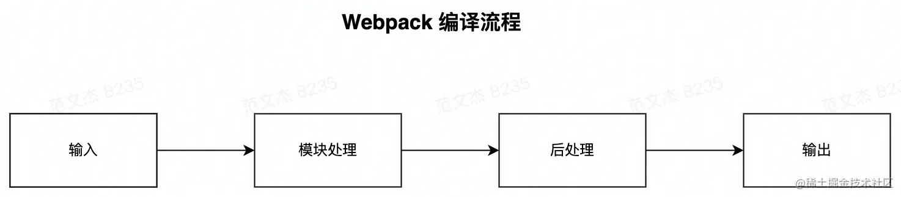
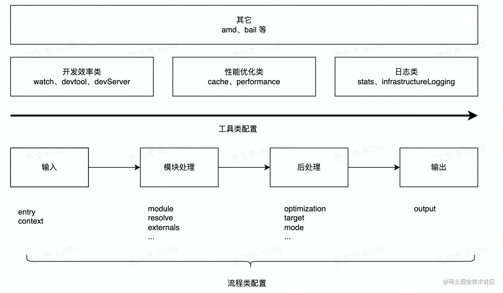
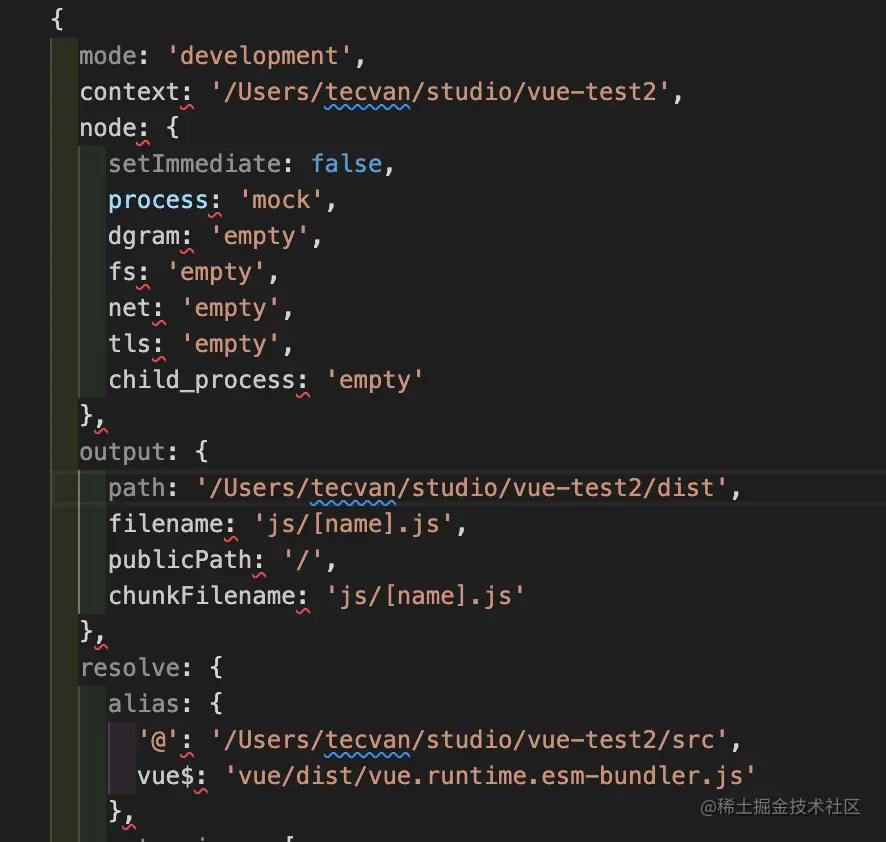

### 结构化理解 Webpack 配置项

Webpack 的打包过程非常复杂，但大致上可简化为：




* 输入：从文件系统读入代码文件；
* 模块递归处理：调用 Loader 转译 Module 内容，并将结果转换为 AST，从中分析出模块依赖关系，进一步递归调用模块处理过程，直到所有依赖文件都处理完毕；
后处理：所有模块递归处理完毕后开始执行后处理，包括模块合并、注入运行时、产物优化等，最终输出 Chunk 集合；
* 输出：将 Chunk 写出到外部文件系统；

从上述打包流程角度，Webpack 配置项大体上可分为两类：

* 流程类：作用于打包流程某个或若干个环节，直接影响编译打包效果的配置项
* 工具类：打包主流程之外，提供更多工程化工具的配置项

#### 流程类配置项

* 输入输出：
  * entry：用于定义项目入口文件，Webpack 会从这些入口文件开始按图索骥找出所有项目文件；
  * context：项目执行上下文路径；
  * output：配置产物输出路径、名称等；
* 模块处理：
  * resolve：用于配置模块路径解析规则，可用于帮助 Webpack 更精确、高效地找到指定模块
  * module：用于配置模块加载规则，例如针对什么类型的资源需要使用哪些 Loader 进行处理
  * externals：用于声明外部资源，Webpack 会直接忽略这部分资源，跳过这些资源的解析、打包操作
* 后处理： 
  * optimization：用于控制如何优化产物包体积，内置 Dead Code Elimination Scope Hoisting、代码混淆、代码压缩等功能
  * target：用于配置编译产物的目标运行环境，支持 web、node、electron 等值，不同值最终产物会有所差异
  * mode：编译模式短语，支持 development、production 等值，可以理解为一种声明环境的短语


#### 概括总结

Webpack 首先需要根据输入配置(entry/context) 找到项目入口文件；
之后根据按模块处理(module/resolve/externals 等) 所配置的规则逐一处理模块文件，处理过程包括转译、依赖分析等；
模块处理完毕后，最后再根据后处理相关配置项(optimization/target 等)合并模块资源、注入运行时依赖、优化产物结构等。

这些配置项与打包流程强相关，建议学习时多关注它们对主流程的影响，
例如 entry 决定了项目入口，而 output 则决定产物最终往哪里输出；resolve 决定了怎么找到模块，而 module 决定了如何解读模块内容，等等。


### 工具类配置项

* 开发效率类：
  * watch：用于配置持续监听文件变化，持续构建
  * devtool：用于配置产物 Sourcemap 生成规则
  * devServer：用于配置与 HMR 强相关的开发服务器功能
* 性能优化类：
  * cache：Webpack 5 之后，该项用于控制如何缓存编译过程信息与编译结果
  * performance：用于配置当产物大小超过阈值时，如何通知开发者
* 日志类：
  * stats：用于精确地控制编译过程的日志内容，在做比较细致的性能调试时非常有用
  * infrastructureLogging：用于控制日志输出方式，例如可以通过该配置将日志输出到磁盘文件


例如

逻辑上，每一个工具类配置都在主流程之外提供额外的工程化能力，例如 devtool 用于配置产物 Sourcemap 生成规则，与 Sourcemap 强相关；devServer 用于配置与 HMR 相关的开发服务器功能；watch 用于实现持续监听、构建。
工具类配置内聚性较强，通常一个配置项专注于解决一类工程问题，学习时建议先对配置项按其功能做个简单分类，例如上述开发效率类、性能优化类等，之后再展开研究其可选值与效果。



综上，虽然 Webpack 提供了上百项复杂配置，但大体上都可以归类为流程类配置或工具类配置，对于流程类配置应该多关注它们对编译主流程的影响；而工具类则更加内聚，基本上一种配置项解决一种工程化问题。

### 配置逻辑综合解析

```
.
├── src
|   └── index.js
└── webpack.config.js
```

其中，src/index.js 为项目入口文件，webpack.config.js 为 Webpack 配置文件。在配置文件中，首先我们需要声明项目入口：

```js
// webpack.config.js
module.exports = {
  entry: "./src/index"
};
```

```js
// webpack.config.js
const path = require("path");

module.exports = {
  entry: "./src/index",
  output: {
    filename: "[name].js",
    path: path.join(__dirname, "./dist"),
  }
};
```

至此，已经足够驱动一个最简单项目的编译工作。但是，在前端项目中经常需要处理 JS 之外的其它资源，包括 css、ts、图片等，此时需要为这些资源配置适当的加载器：

这一步是完成了入口和出口，对应上图的输入

```js
// webpack.config.js
const path = require("path");

module.exports = {
  entry: "./src/index",
  output: {
    filename: "[name].js",
    path: path.join(__dirname, "./dist"),
  },
  module: {
    rules: [{
      test: /\.less$/i,
      include: {
        and: [path.join(__dirname, './src/')]
      },
      use: [
        "style-loader",
        "css-loader",
        // "./loader",
        {
          loader: "less-loader",
        },
      ],
    }],
  },
};
```

到这里已经是一个简单但足够完备的配置结构了，接下来还可以根据需要使用其它工程化工具

### 脚手架工具

[Vue CLI](https://cli.vuejs.org/guide/)

* [Vue CLI](https://cli.vuejs.org/guide/) ：用于帮助用户快速创建、运行 Vue.js 项目脚手架的命令行工具； 
* [create-react-app](https://reactjs.org/docs/create-a-new-react-app.html) ：用于创建 React 项目脚手架的命令行工具； 
* [@angular/cli](https://angular.io/cli) ：用于创建 angular 项目的命令行工具； 
* [webpack-cli](https://www.npmjs.com/package/webpack-cli) ：Webpack 官方提供的命令行工具，提供了一套交互式生成配置文件的指令集，以及项目编译、开发、迁移等功能； 
* [Neutrino](https://neutrinojs.org/installation/create-new-project/) ：用于快速创建、运行现代 JavaScript 应用的工具，同时支持 React、Preact、Vue、Web、Node.js、Library 等场景； 
* [react-starter-kit](https://github.com/kriasoft/react-starter-kit) ：用于创建 React + Relay + GraphQL 应用的脚手架工具，内置 SSR 支持。

#### 使用 Vue CLI 搭建项目脚手架

Vue CLI 全称 Vue.js Command-Line Interface，是由 Vue 核心团队开发，用于帮助用户快速创建、运行 Vue.js 项目脚手架的命令行工具。实现上，Vue CLI 底层调用 Webpack 实现针对 .vue 等资源的编译打包功能；调用 webpack-dev-server 实现包含 HMR 功能的开发服务器功能；还能通过插件方式整合 ESLint、Babal、Less 等工具。


```node
npm install -g @vue/cli

# 或者使用 yarn
yarn global add @vue/cli
```

```
vue create [项目名]

Vue CLI v4.5.15
? Please pick a preset: (Use arrow keys)
❯ Default ([Vue 2] babel, eslint)
Default (Vue 3) ([Vue 3] babel, eslint)
Manually select features
```
经过上述步骤后，Vue CLI 最终都会生成对应的文件并自动安装依赖，之后就可以使用 serve 命令启动项目：

```
npm run serve
# 或者
yarn serve
```

Vue CLI 底层依赖于 Webpack 实现编译打包等工程化能力，开发者可通过 configureWebpack 与 chainWebpack 配置项修改 Webpack 配置信息。

以 configureWebpack 为例，使用时需要在 vue.config.js 文件中写入配置：

```js
// vue.config.js
module.exports = {
  configureWebpack: {
    plugins: [
      new MyAwesomeWebpackPlugin()
    ]
  }
}
```

configureWebpack 的配置规则与 Webpack 一致， 同样支持 plugins/module/resolve 等配置项。
实际上，Vue CLI 内部最终会调用 webpack-merge 将 configureWebpack 值与其它上下文配置合并，生成最终的 Webpack 配置信息。

**chainWebpack** 的用法与 **configureWebpack** 一致，区别仅在于此处支持 [webpack-chain](https://github.com/neutrinojs/webpack-chain) 语法 —— 即以函数方式链式修改 Webpack 配置：

```
// vue.config.js
module.exports = {
  chainWebpack: config => {
    config.module
      .rule('vue')
      .use('vue-loader')
        .tap(options => {
          // modify the options...
          return options
        })
  }
}
```

Vue CLI 在 Webpack 基础上包装多一层更易用的功能结构，这确实能极速提升研发效率与体验，
但代价则是我们完全不清楚其内部运作细节，这会导致开发者比较难做一些深度定制或者性能优化，此时可使用 inspect 命令生成完整的 Webpack 配置信息：


```
vue inspect > output.js
```




此外，inspect 还提供许多根据不同条件生成配置的参数，例如针对编译环境生成配置：

```
vue inspect --mode production > output.prod.js
```


### 使用 CRA 搭建项目脚手架

CRA 全称 Create React Application，同样是用于帮助用户快速创建、运行 React 项目脚手架的命令行工具，功能、底层实现、用法都与 Vue CLI 相似，都提供了全套开箱即用的 React 项目开发、调试环境。

```
npx create-react-app my-app
```

```
my-app
├── README.md
├── node_modules
├── package.json
├── .gitignore
├── public
│   ├── favicon.ico
│   ├── index.html
│   └── manifest.json
└── src
    ├── App.css
    ├── App.js
    ├── App.test.js
    ├── index.css
    ├── index.js
    ├── logo.svg
    └── serviceWorker.js
    └── setupTests.js
```

之后，进入 my-app 目录执行 npm start 命令即可运行项目。


> 提示：更多用法，请参考 CRA 官网： https://github.com/facebook/create-react-app%E3%80%82

默认规则创建的脚手架包含如下工程能力：

* SX、ES6、TypeScript、Flow 语法支持
* CSS 自动添加 --webkit-- 前缀
* 基于 Jest 的自动化测试能力
* 支持 HMR 的开发服务器

```
npm run eject
```

```
y-app
├─ .gitignore
├─ README.md
├─ config
│  ├─ env.js
│  ├─ getHttpsConfig.js
│  ├─ jest
│  │  ├─ babelTransform.js
│  │  ├─ cssTransform.js
│  │  └─ fileTransform.js
│  ├─ modules.js
│  ├─ paths.js
│  ├─ webpack
│  │  └─ persistentCache
│  │     └─ createEnvironmentHash.js
│  ├─ webpack.config.js
│  └─ webpackDevServer.config.js
├─ package-lock.json
├─ package.json
├─ node_modules
├─ ...
└─ src
   ├─ ...
```

导出配置后，直接修改 webpack.config.js 等相关配置文件即可控制各项功能行为。

### 总结

Webpack 配置项的用法虽然比较复杂难懂，但通常可以分为流程类或工具类，流程类配置项通常会直接影响 Webpack 打包编译的规则；而工具类相对比较独立，通常用于在编译主流程之外提供额外的工程化能力。


