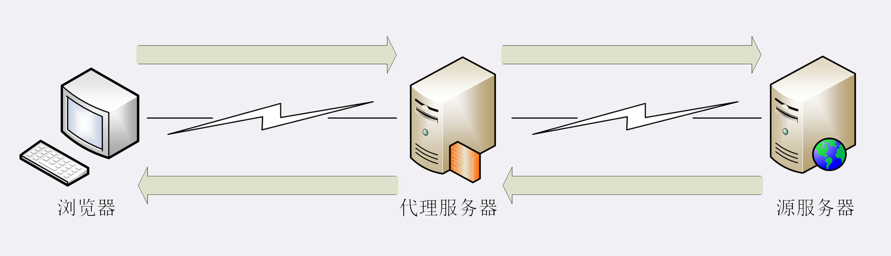
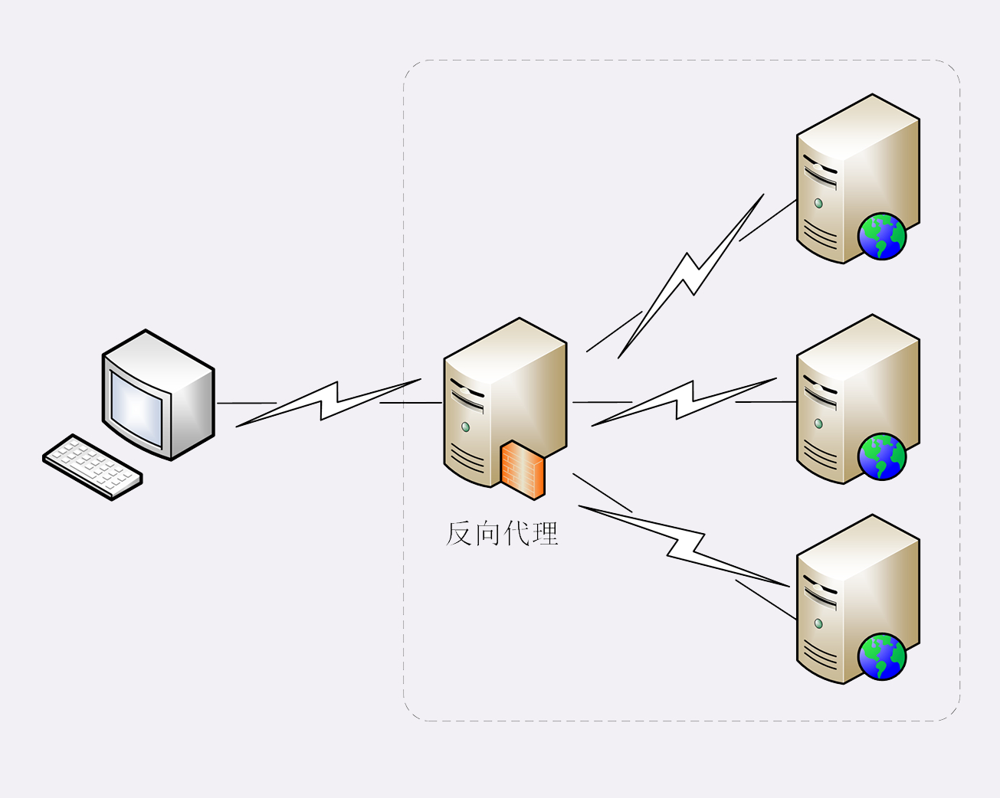
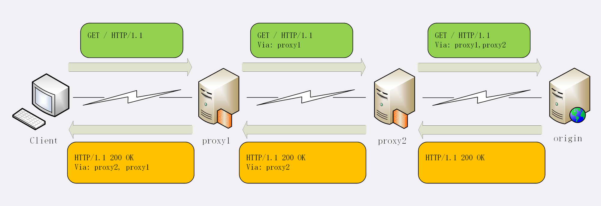

基础的 HTTP 代理模式



### 代理服务

客户端和服务器原本的通信链路中的一个中间环节，也是一台服务器，提供的是“代理服务”

“代理服务”指服务本身不产生内容，而是处于中间位置转发上下游的请求和响应，具有双重分身。

“代理”面向下游的用户时，表现为服务器，代表源服务器响应客户端的请求；面向上游的源服务器时，又表现为客户端，代表客户端发送请求

持有资源实体的服务器称为源服务器。从原服务器返回的响应经过代理服务器后再传给客户端

实际工作中最常见的反向代理，它在传输链路中更靠近源服务器，为源服务器提供代理服务

### 反向代理



### 代理的作用

最基本功能是负载均衡 因为在面向客户端时屏蔽了源服务器，客户端看到的只是代理服务器，源服务器究竟有多少台、是哪些 IP 地址都不知道 于是，代理服务器就可以掌握分发权，决定由后面的哪台服务器来响应请求


代理服务还可以执行更多的功能，比如：

* 健康检查： 使用“心跳”等机制监控后端服务器，发现有故障就及时“踢出”集群，确保服务高可用

* 安全防护： 保护被代理的后端服务器，限制 IP 地址或流量，抵御网络攻击和过载

* 加密卸载： 对外网使用 SSL/TLS 加密通信认证，而在安全的内网不加密，消除加密成本

* 数据过滤： 拦截上下行的数据，任意指定策略修改请求或响应

* 内容缓存： 暂存、复用服务器响应

### 代理相关头字段

| 名称 | 描述 |
| --- | --- |
| Via | Via 是一个通用字段，在请求头和响应头里都可以出现。每当报文经过一个代理节点，代理服务器就会把自身的信息追加到字段的末尾 |
| X-Forwarded-For | 形式上和“Via”差不多，也是每经过一个代理节点就会在字段里追加一个信息。但是追加的是请求方的 IP 地址，所以字段最左边的 IP 地址就是客户端的地址 |
| X-Real-IP | 有种获取客户端真实 IP 的手段，也就是记录客户端 IP 地址，没有中间的代理信息 |




Via 字段只解决了客户端和源服务器判断是否存在代理问题，还不能知道对方的真实信息


### 代理协议

因为通过“X-Forwarded-For”操作代理信息必须要解析 HTTP 报文头，而且“X-Forwarded-For”等头字段必须要修改原始报文，在某些情况下是不允许甚至是不可能（比如使用 HTTPS 通信被加密）

所以就出现了一个专门的“代理协议”，就是由 HAProxy 定义，是一个“事实标准”，被广泛采用（而非 RFC）

“代理协议”有 v1 和 v2 两个版本，v1 和 HTTP 差不多，也是明文，而 v2 是二进制格式。v1，它在 HTTP 报文前增加一行 ASCII 码文本，相当于多了一个头字段

“代理协议”这一行，开头必须是“PROXY”这五个大写字母，然后是“TCP4”或者"TCP6"标明客户端的 IP 地址类型，再后面是请求方地址、应答方地址、请求方端口号、应答方端口号，最后用一个回车换行（\r\n）结束

格式：PROXY + TCP4/TCP6 + 请求方地址 + 接收方地址 + 请求端口 + 接收端口

```
PROXY TCP4 1.1.1.1 2.2.2.2 55555 80\r\n
GET / HTTP/1.1\r\n
Host: www.xxx.com\r\n
\r\n
```

### 小结

* HTTP 代理就是客户端和服务器通信链路中的一个环节，为两段提供“代理服务”
* 代理处于中间层，为 HTTP 处理增加了更多的灵活性，可以实现负载均衡、安全防护、数据过滤等功能
* 代理服务器需要使用字段“Via”标记自己的身份，多个代理会形成一个列表
* 如果想要知道客户端的真实 IP 地址，可以使用字段“X-Forwarded-For”和“X-Real-IP”
* 专门的“代理协议”可以在不改动原始报文的情况下传递客户端的真实 IP

### 问题

1. 代理有什么缺点？实际应用时如何避免？
   1. 增加链路长度
   2. 代理做复杂的处理时，会耗费性能，增加响应时间
   3. 如果代理出问题了，那么请求就会失败，也就是出现单点问题
   4. 尽量减少代理数量
   5. 让代理做较为简单的处理，比如：转发、缓存、加密卸载、防护

2. 你知道多少反向代理中使用的负载均衡算法？他们有什么缺点？
   1. 随机 
   2. 简单，是否均匀看随机情况 
   3. 轮询 
   4. 相对简单，但为了考虑资源和性能的均衡性，付出相当大代价 
   5. hash 
   6. 相对复杂，但越要求公平越复杂 
   7. 最小连接数 
   8. 灵活、智能，但设计和实现较为繁琐

