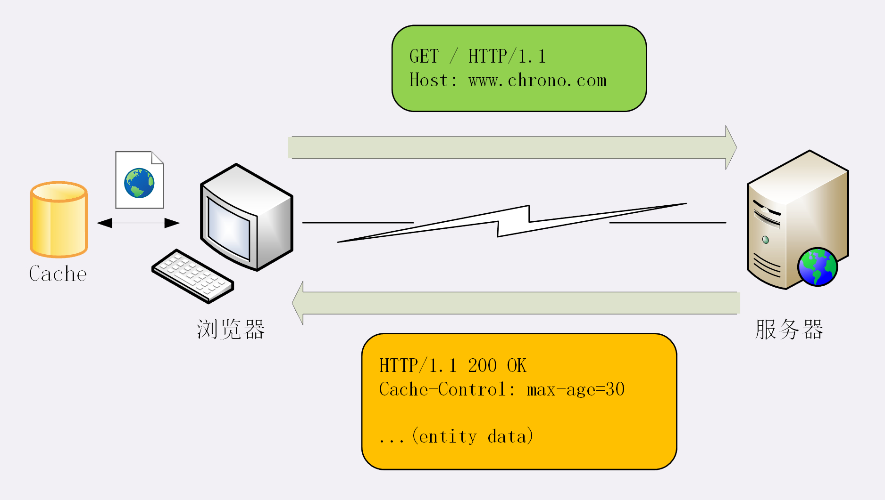
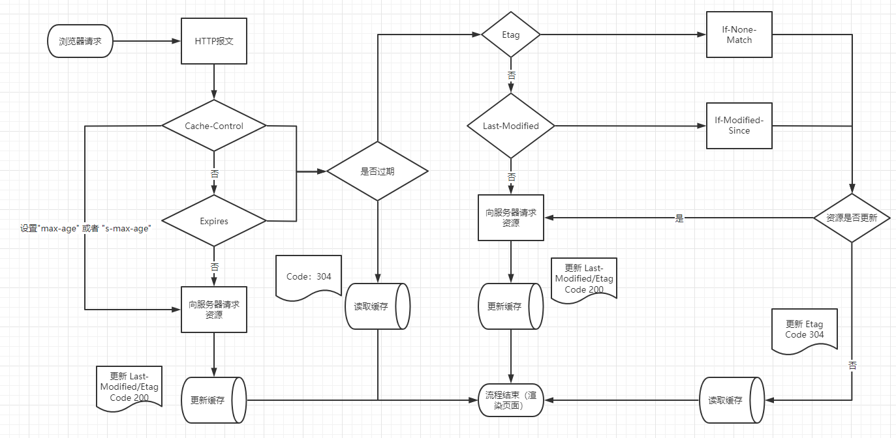
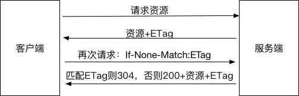

### 服务器和客户端的缓存控制

缓存的工作流程：

1. 浏览器发现缓存无数据，于是发送请求，向服务器获取资源
2. 服务器响应请求，返回资源，同时标记资源的有效期
3. 浏览器缓存资源，等待下次重用




缓存控制使用的头字段是“Cache-Control”，响应报文和请求报文都可以使用

| 范围 | 名称 | 描述 |
| --- | --- | --- |
| 响应报文,请求报文 | no-store | 不允许缓存，用于某些变化非常频繁的页面，如秒杀页面 |
| 响应报文,请求报文 | no-cache | 可以缓存，但在使用之前 要去服务器验证是否过期，是否修改过 |
| 响应报文,请求报文 | max-age=<seconds> | 资源的有效期，单位是秒。在服务器端，时间起算起点是响应报文创建时间，而不是客户端收到报文的时间，也就是包含了链路传输过程花费的时间 |
| 响应报文,请求报文 | no-transform | 缓存不能改变实体主体的媒体类型，可用来防止缓存或代理压缩图片等操作 |
| 响应报文 | public | 可以被任何对象（代理、客户端等）缓存，即使通常不可被缓存的内容（如：POST 请求、该响应没有 max-age 或 Expires 的请求头）|
| 响应报文 | private | 只能被单个用户缓存，不能作为共享缓存（代理服务器不能缓存，用户本地的浏览器可以缓存）|
| 响应报文 | must-revalidate | 代理向源服务器验证即将返回的响应请求是否过期。一旦资源过期（比如已超过 max-age），在成功向源服务器验证之前，缓存都不能用该资源响应后续请求 |
| 响应报文 | proxy-revalidate | must-revalidate 作用相同，但他仅适用于缓存服务器。缓存服务器向源服务器验证返回的响应请求是否过期 |
| 响应报文 | s-maxage=<seconds> | 覆盖 max-age 或者 Expires 头，仅作用域共享缓存（比如代理服务器），私有缓存会被忽略。单位是秒 |
| 请求报文 | max-stale | 表示客户端愿意接受一个已过期的资源。响应不能超过给定的时间。单位是秒 |
| 请求报文 | min-fresh | 表示客户端要求获取一个能在指定的秒数内保持其最新状态的响应。单位是秒 |
| 请求报文 | only-if-cached | 表示客户端只接受 已缓存的响应，并且不会向源服务器检查是否有更新。如果代理没有缓存或者缓存过期，就给客户端返回 504 状态码 |



### 条件请求

利用缓存校验资源

1. 浏览器用“Cache-Control”做缓存控制职能是刷新数据，不能有效利用缓存数据，而由于缓存会失效，使用前必须要去服务器校验是否最新
2. 用两个连续的请求组成“验证”，先发一个 HEAD，获取资源的元信息，和缓存数据比较，没有改动就用缓存，否则再发一个 GET 请求

通过两个请求验证资源的方法使得网络成本太高，所以 HTTP 协议定义了一系列“If”开头的“条件请求”字段，专门用来检验资源是否过期，把验证的责任也交给服务器

5 个常用的条件请求头字段：

| 名称 | 描述 |
| --- | --- |
| If-Match | 告知服务器匹配资源所用的实体标记（Etage）值，仅当请求的资源满足 ETag 值才会返回资源，否则返回 412（Precondition Failed）状态码 |
| If-Modified-Since | 资源最近修改的时间。服务器会检查 Last-Modified 和请求头 If-Modified-Since 的值，如果 Last-Modified 早于或等于（即<=） If-Modified-Since，则返回不带 body 的 304 状态码 |
| If-None-Match | 与 If-Match 作用相反。对于 GET 和 HEAD 请求，当请求头 If-None-Match 的 ETag 与请求资源的 ETag 不一致时，就告知服务器处理该请求并返回 200 状态码，否则返回 304 状态码 |
| If-Range | 用来是的 Range 头字段在一定条件下起作用。当 If-Range 的值（Etag 或者时间）和请求资源的 ETag 值或时间一致时，则 Range 头字段起作用，即作为范围请求处理返回 206 状态码，否则返回 200 状态码和完整的请求资源 If-Range 通常用于断点续传的下载过程中，用来自从上次中断后，确保下载的资源没有发生改变 |
| If-Unmodified-Since | 只有当资源在指定时间之后没有进行修改的情况下，服务器才会返回请求的资源，或是接受 POST 或其他“不安全”的方法的请求。 如果所请求的资源在指定的时间之后发生了修改，那么返回 412 状态码 |

#### If-Match
```
If-Match: "abc-123"
# 意思是如果匹配到 ETag = abc-123的资源，就返回

If-Match: *
# 只要资源存在就处理请求
```

#### If-Modified-Since

```
last-modified: Fri, 26 Nov 2021 11:01:23 GMT // 最近一次修改是什么时候 响应头中

If-Modified-Since: <day-name>, <day> <month> <year> <hour>:<minute>:<second> GMT // 请求头中

如果 请求头中的 If-Modified-Since 时间 >= Last-Modified 时间 返回 304
如果 请求头中的 If-Modified-Since 时间 < Last-Modified 时间 返回 200 重新请求
```




### Etag & Last-Modified
| 名称 | 描述 |
| --- | --- |
| Etag | 实体标签（Entity Tag），是资源的一个唯一标识，主要用来解决修改时间无法准确区分文件变化的问题 |
| Last-Modified | 资源修改的日期时间，精度比 ETag 要低，所以是备用机制。配合条件请求 If-Modified-Since 或 If-Unmodified-Since 使用 |


```
ETag: "abc-123"
Etag：W/"abc-123"

Last-Modified: Wed, 21 Oct 2015 07:28:00 GMT
```

### 强缓存和协商缓存

强缓存命中的话不会发请求到服务器，比如 chrome 中的 200 (from memory cache)

协商缓存一定会发请求到服务器，通过资源的请求头字段验证资源是否命中协商缓存，如果命中则不会返回资源的实体，状态码返回 304，并且通知客户端从缓存中加载这个资源

以下两种缓存字段按各自优先级排序从高到低 强缓存字段：Pragma、Cache-Control、Expires 协商缓存字段：ETag/If-None-Match、 Last-Modified/If-Modified-Since

[Pragma 科普](https://developer.mozilla.org/zh-CN/docs/Web/HTTP/Headers/Pragma)

### 小结

* 缓存是优化系统性能的重要手段，HTTP 传输的每一个环节中都可以有缓存
* 服务器使用“Cache-Control”设置缓存策略，常用的是“max-age”，表示资源的有效期
* 浏览器收到数据就会存入缓存，如果没过期就可以直接使用，过期就要去服务器验证是否仍然可用
* 验证资源是否失效需要使用“条件请求”，常用的是“If-Modified-Since”和“If-None-Match”，收到 304 就可以复用缓存里的资源
* 验证资源是否被修改的条件有两个：“Last-Modified”和“Etag”，需要服务器预先在响应报文里设置，搭配条件请求使用
* 浏览器可以发送“Cache-Control”字段，使用“max-age=0”或“no_cache”刷新数据
* 缓存分为强缓存和协商缓存，先处理强缓存再处理协商缓存，强缓存不发送请求，协商缓存通过头字段验证返回 304 或其他


### 问题

1. Cache 和 Cookie 都是服务器发给客户端并存储的数据，你能比较一下两者的异同

相同：都保存在浏览器里，可以设置过期时间
不同: 
* Cookie 会随着报文发送到服务器，而 Cache 不会，但会携带 ETag 值或者最后修改时间进行验证
* Cookie 可以通过脚本获取，而 Cache 无法获取
* 用途不同。Cookie 常用于身份验证，而 Cache 作用于资源，为了加快响应速度和节省带宽
* Cookie 的 max-age 是从浏览器拿到响应报文开始计算，而 Cache-Control 是从服务器生成响应报文（Date 头字段）开始计算

2. 即使有“Last-modified”和“ETag”，强制刷新（Ctrl+F5）也能够从服务器获取最新数据（返回 200 而不是 304），请你在实验环境里试一下，观察请求头和响应头，解释原因

强刷新下的请求头字段 If-None-Match 变成了 Cache-Control: no-cache
