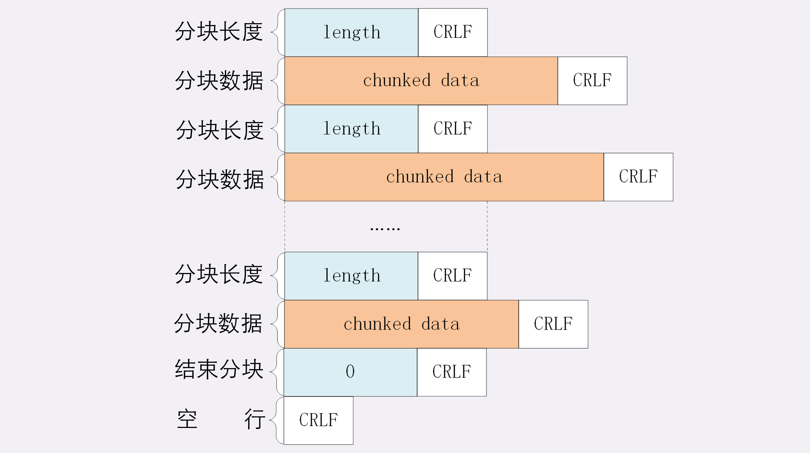
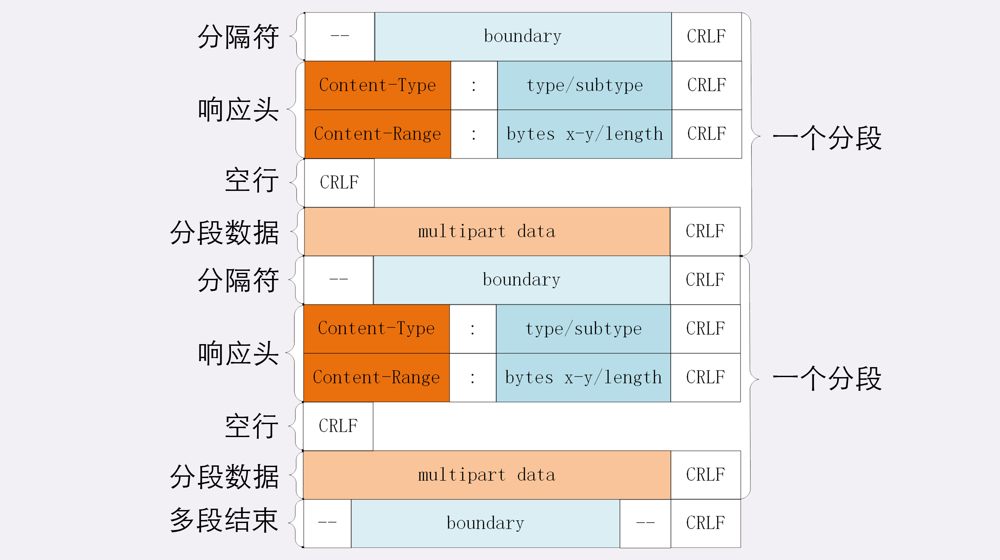

### 数据压缩

请求携带 “Accept-Encoding” 头字段，服务器选择一种压缩算法放进 “Content-Encoding” 就可以把原数据压缩后发给浏览器

这个方法的缺点是，这些压缩算法通常只能对文本文件有较好压缩率，而图片，音频等多媒体数据本身已高压缩，这样的话压缩算法等于失效了

### 分块传输

HTTP 协议使用 “chunked” 分块传输编码，在响应报文里面用 头字段 “Transfer-Encoding：chunked” 来表示，意思是报文里的 body 不是一次性发送过来，而是分成许多块逐个发送

分块传输也可以用于 “流式数据”，例如数据库动态生成表单页面，这种情况下 body 数据的长度是位置是未知的，无法在头字段 “Content-Length” 给出 确切的长度，要么长度是未知的（chunked）

分块传输的编码规则：
  1. 每个分块包含两个部分，长度头和数据块
  2. 长度头是以 CRLF（回车换行，即\r\n）结尾的一行明文，用 16 进制数字表示长度
  3. 数据块紧跟在长度后、最后也用 CRLF 结尾，但数据不包含 CRLF
  4. 最后用一个长度为 0 的快表示结束，即“0\r\n\r\n”

### 范围请求
范围请求（range request）的概念，允许客户端在请求头里使用专用字段来表示只获取文件的一部分，相当于是客户端的“化整为零”

例如，看电视剧，想拖动进度条快进几分钟，其实就是获取片段数据，而分块传输没有这个能力

如果服务器支持范围请求的话，必须在响应头使用字段 “Accept-Ranges: bytes”，否则不发送字段或者发送 “Accept-Ranges: none”

请求头 Range 是 HTTP 范围请求的额专用字段，格式是“bytes=x-y”，其中 x 和 y 是以字节单位表示偏移量的数据范围

Range 的格式也很灵活，起点 x 和终点 y 可以省略，能够很方便地表示正数或者倒数的范围。假设文件是 100 个字节，那么：

* “0-”表示从文档起点到文档终点，相当于“0-99”，即整个文件
* “10-”是从第 10 个字节开始到文档末尾，相当于“10-99”
* “-1”是文档的最后一个字节，相当于“99-99”
* “-10”是从文档末尾倒数 10 个字节，相当于“90-99”

服务器处理 Range 字段后，需要做的四件事：

1. 检查范围是否合法，如果范围越界，返回状态码 416，意思是”你的范围请求有误，无法处理“ 比如文件只有 100 字节，请求是”200-300“，就是范围越界
2. 根据 Range 头计算偏移量，读取文件的片段，返回状态码206
3. 添加响应头字段 Content-Range，告诉片段实际偏移量和资源的总长度，格式是“bytes x-y/length”，和 Range 头区别是没有“=”并且范围后多了总长度 例如，对于“0-10”的范围请求，值就是“bytes 0-10/100”
4. 把片段用 TCP 发送给客户端

常见的多段下载、断点续传的实现：

* 先发个 HEAD，看服务器是否支持范围请求，同时获取文件的大小
* 开 N 个线程，每个线程使用 Range 字段划分出各自负责下载的片段，发请求传输数据
* 下载意外中断也不怕，不必重头再来一遍，只要根据上次的下载记录，用 Range 请求剩下的那一部分即可

### 多段数据

请求一次获取多个片段数据，这时候需要使用特殊的 MIME 类型：“multipart/byteranges”，表示报文的 body 是由多段字节序列组成，
并且还要用参数“boundary=xxx”给出段之间的分隔标记

### 小结

1. 压缩 HTML 等文本文件是传输大文件最基本的方法

2. 分块传输可以流式收发数据，节约内存和贷款，使用响应头字段“Transfer-Encoding: chunked”来表示，分块的格式是 16 进制长度头+数据块

3. 范围请求可以直获取部分数据，即“分块请求”，实现视频拖拽或者断点续传，使用请求头字段“Range”和响应头字段“Content-Range”，响应状态吗必须是 206

4. 也可以一次请求多个范围，这时候响应报文的数据类型 MIME 是“multipart/byteranges”，body 里的多个范围部分用 boundary 字符串分割

### 问题

1. 分块传输数据的时候，如果数据里包含回车换行（\r\n）是否会影响分块的处理呢？
不影响，因为 chunked 数据格式里有 length

2. 如果对一个被 gzip 的文件执行范围请求，比如“Range: bytes=10-19”，那么这个范围是应用于原文件还是压缩后的文件呢？
需要分情况，如果源文件是 gzip 的，那就是用于压缩后的文件，如果原文件是文本，那就应用于原文件