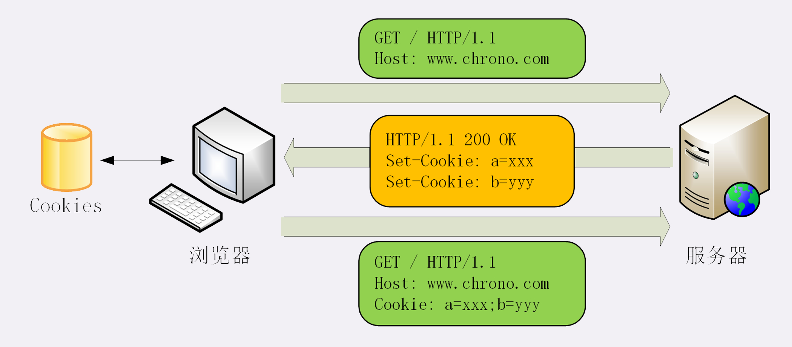

### Cookie

由于 HTTP 是“无状态”的，服务器处理完请求就会像“失忆”一样，不记得之前的用户是谁
HTTP 的 Cookie 机制，想等于服务器给客户端贴上小纸条，上面写了一些只有服务器才能理解的数据，需要的时候客户端把这些信息发给服务器，服务器看到 Cookie，就能认出对方是谁

Cookie 的工作过程 使用两个字段：响应头字段 Set-Cookie 和 请求头字段 Cookie

用户通过浏览器第一次访问服务器的时候，服务器不知道他的身份，所以创建一个独特的身份标识数据，
格式是“key=value”，然后放进 Set-Cookie 字段里，随着响应报文一同发给浏览器

浏览器收到响应报文，看到 Set-Cookie，知道是服务器给的身份标识，于是保存起来，下次请求时候自动把值放进 Cookie 字段里发给服务器

第二次请求服务器时，有了 Cookie 字段，服务器就能拿出 Cookie 的值识别用户的身份，提供个性化服务

有时，服务器需要响应头里添加多个 Set-Cookie，存储多个“key=vale”，
以获取更多样的身份信息，但浏览器不需要使用多个 Cookie 字段，只要在一行里用 “;” 隔开就行

### Cookies 属性
1. Cookie 的有效期

Cookie 可以用 Expires 和 Max-Age 两个属性来设置

Expires，俗称“过期时间”，用的是绝对时间，可以理解为“截止日期”（deadline）

Max-Age，用的是相对时间，单位是秒，浏览器用收到报文的时间点再加上 Max-Age，就可以得到失效的绝对时间

Expires 和 Max-Age 可以同时存在，失效时间可以一致，也可以不一致，浏览器优先采用 Max-Age 计算失效时间

2. Cookie 的作用域
   用 Domain 和 Path 指定 Cookie 所属的域名和路径，浏览器在发送 Cookie 前会从 URI 中提取出 host 和 path 部分，对比 Cookie 的属性，如果不满足，就不会在请求头里发送 Cookie
3. Cookie 的安全性
   1. Cookie 可以通过 Javascript 脚本用 document.domain 来读写 Cookie 数据，这就带来了隐患，可能导致“跨站脚本（XSS）”攻击窃取数据 “HttpOnly”属性会告诉浏览器，此 Cookie 只能通过浏览器 HTTP 协议传输，禁止其他方式访问，浏览器的 JS 就会禁用 document.cookie
   2. “SameSite”属性可以防范“跨站请求伪造（CSRF）”攻击，设置成“SameSite=Strict”可以严格规定 Cookie 不能随着跳转链接跨站发送，而“SameSite=Lax”则相对宽松，允许 GET/HEAD 等安全方法，但禁止 POST 跨站发送
   3. “Secure”属性，表示这个 Cookie 仅能用 HTTPS 协议加密传输，明文的 HTTP 协议会禁止发送，但在浏览器里 Cookie 还是以明文形式存在

   
### Cookie 的应用

