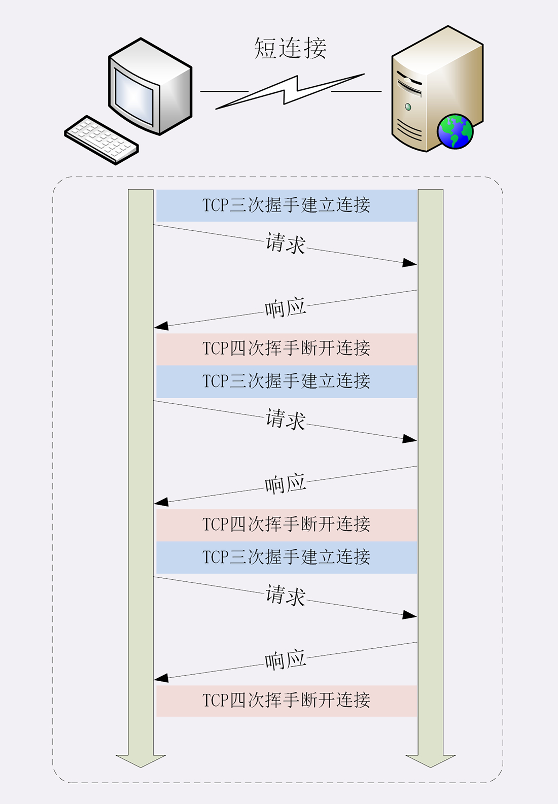
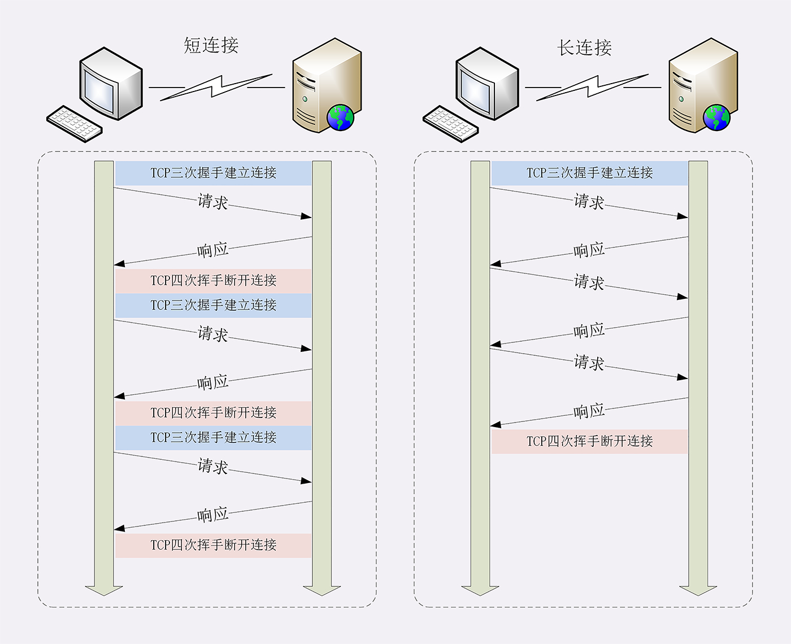
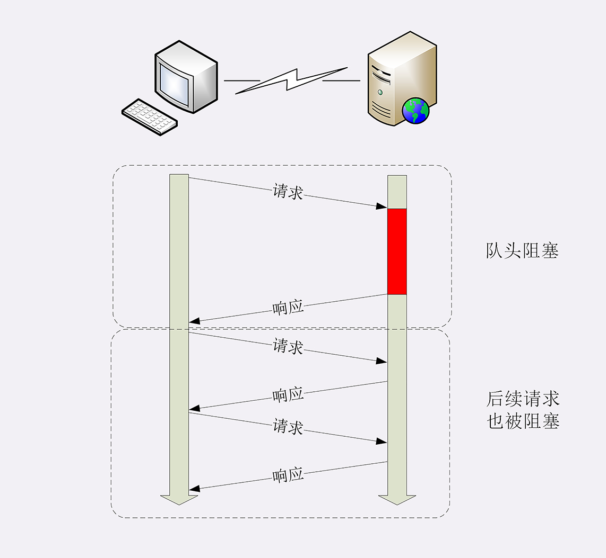

### 短连接

短连接（short-lived connections），意思是客户端和服务器的整个连接过程很短暂，不会与服务器保持长时间的连接状态 早期的（HTTP1.0 那时候还不是协议） HTTP 协议被称为“无连接”的协议

短连接的缺点： TCP 协议里，建立连接和关闭连接都需要多个操作才执行完毕 TCP 建立连接“三次握手”，发送三个数据包，关闭连接“四次挥手”，需要发 4 个数据包
缺点是 浪费性能

### 长连接

长连接，也叫“持久连接”（persistent connections）、“连接保活”（keep alive）、“连接复用”（connection reuse）

这种解决办法的思路是“成本均摊”，TCP 连接和关闭非常耗时，那就在一次时间成本内，由原来一个“请求 - 应答”均摊到多个“请求 - 应答”上

### 连接相关的头字段

HTTP/1.1 的连接默认启用长连接，也可以在请求头里明确要求使用长连接机制，字段是 Connection，值是“keep-alive”

如果服务器支持长连接，它总是会在响应报文放一个“Connection: keep-alive”字段

但是长连接也有缺点。 因为 TCP 连接长时间不关闭，服务器必须在内存里保存它的状态，也就占用了服务器的资源

所以，长连接需要在恰当的时间关闭。 在客户端发送的请求头加上“Connection: close”字段。服务器看到这个字段，就知道客户端要主动关闭连接，于是响应报文也会加上这个字段，然后关闭 TCP 连接

服务器通常不会主动关闭连接，但也可以使用一些策略。如 Nginx，有两种方式：

1. 使用“keepalive_timeout”，设置长连接的超时时间，如果在一段时间内连接上没有任何数据收发，就主动断开连接
2. 使用“keepalive_requests”，设置长连接上可发送的最大请求次数。比如设置成 1000，那么当 Nginx 在这个连接上处理了 1000 个请求后，主动断开连接

另外，客户端和服务器都可以在报文里附加通用头字段“Keep-Alive: timeout=value”，限定长连接的超时时间。但这个字段的约束力并不强，通信的双方可能并不会遵守，所以不太常见。

### 队头阻塞

由于 HTTP 规定报文必须是“一发一收”，就形成了一个先进先出的“串行”队列

队列只有先后顺序，没有权重，最前面先处理

所以，如果队首因为花费的处理时间太长，后续请求也不得不等待，结果就是其他请求承担了不应有的时间成本 这个发生在 HTTP 1.1 中

### 性能优化

HTTP 的“并发连接”（concurrent connections），就是同时对一个域名发起多个长连接，用数量来解决质量问题

但是这种方式也存在缺陷，客户端越多，连接越多，服务器资源就扛不住，或者被认为是恶意攻击，造成服务器拒绝服务

目前大多数浏览器的并发上限是 6~8 个

还有其他类似的办法，比如“域名分片”（domain sharding）技术，就是多开几个域名而指向同一台服务器

### 小结

1. 1.0 版本 HTTP 协议使用短连接，收到响应后就立即关闭连接，效率很低 
2. HTTP/1.1 默认使用长连接，在一个连接上收发多个请求响应，提高了传输效率
3. 服务器会发送“Connection: keep-alive”字段表示使用了长连接
4. 报文头里如果有“Connection: close”就意味着长连接即将关闭
5. 过多的长连接会占用服务器资源，所以服务器会用一些策略有选择地关闭长连接
6. 队头阻塞 问题会导致性能下降，可以用“并发连接”和“域名分片”技术缓解

### 问题
1. 在开发基于 HTTP 协议的客户端时应该如何选择使用的连接模式呢？短连接还是长连接
   根据请求的频繁度选择，如果请求一次即可，那就选择短连接，如果需要多次请求完成就选择长连接
2. 应当如何降低长连接对服务器的负面影响呢？
   根据服务器的性能，对服务器做连接数和超时时间限制，保证服务器的性能处于正常范围内

