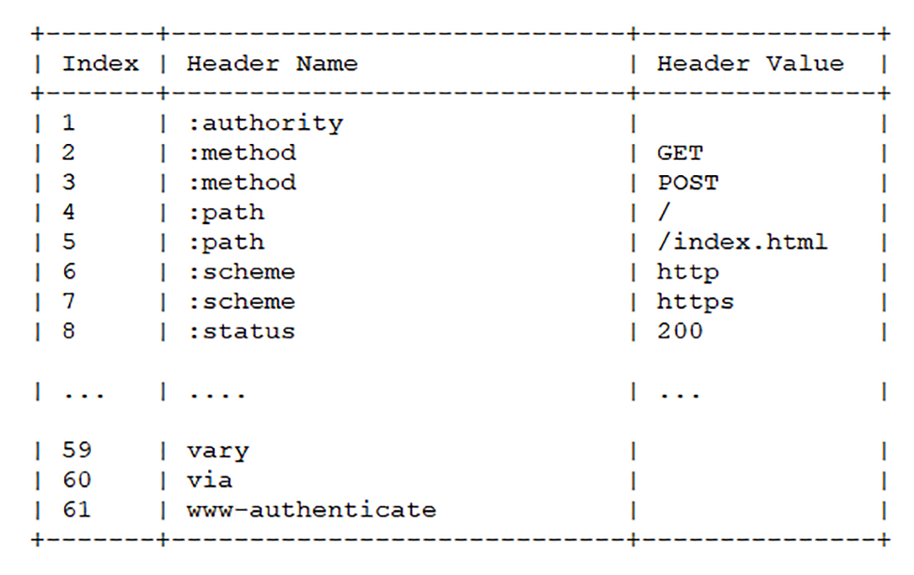
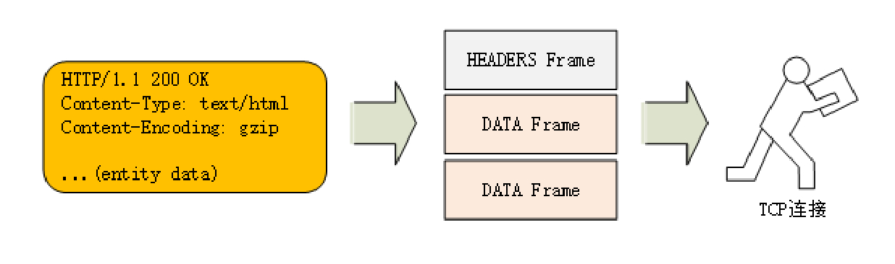
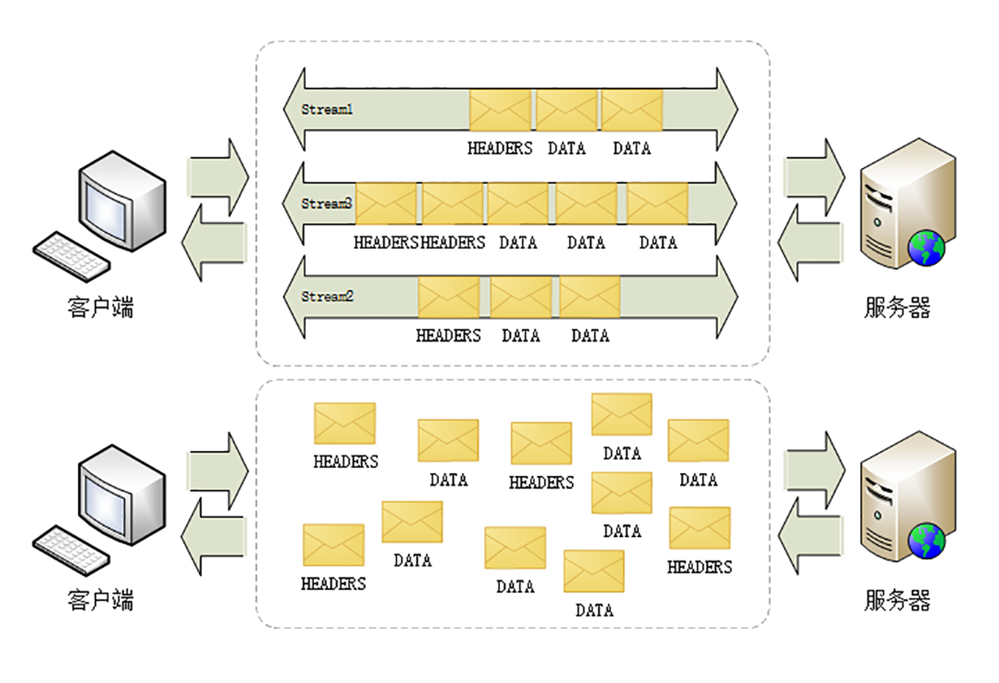
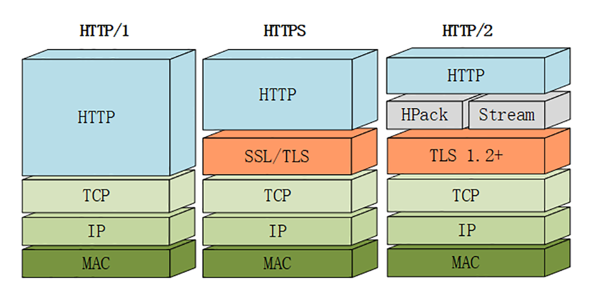

## HTTP/2.0

对于 HTTP/2 而言，它对于性能的提升主要在于两点:

* 头部压缩
* 多路复用
* 二进制分帧

当然还有一些颠覆性的功能实现:

* 设置请求优先级
* 服务器推送

### 兼容 HTTP/1

因为必须要保持功能上的兼容，所以 HTTP/2 把 HTTP 分解成了“语义”和“语法”两个部分，

“语义”层不做改动，与 HTTP/1 完全一致（即 RFC7231）。比如请求方法、URI、状态码、头字段等概念都保留不变

### 头部压缩

在 HTTP/1.1 及之前的时代，请求体一般会有响应的压缩编码过程， 通过 Content-Encoding 头部字段来指定。

当请求字段复杂，尤其是 GET 请求，请求头几乎等于整个请求报文

所以，HTTP/2 使用“HPACK”算法，有以下内容：

* 静态字典表 
  * 在客户端和服务器端建立“字典”，用索引表示重复的字符串，只发送索引给对方，从而提高速度

* 哈夫曼编码
  釆用哈夫曼编码来压缩整数和字符串。其原理是先将所有出现的字符建立一张索引表，然后让出现次数多的字符对应的索引尽可能短，传输的时候也是传输这样的索引序列

除此以外，还有“动态字典表”是为了自定义字段服务，在下一章节讲解

### 二进制分帧

在 HTTP/1.1，请求头信息都是文本（ASCII 编码），因为文本会有多一星的字符，不方便计算机的解析，于是 HTTP/2 把报文改为二进制格式，并且统称为“帧”

把原来“Headers+Body”拆散为一个个二进制的帧，Headers 帧存放头部字段，Data 帧存放请求实体数据

### 多路复用

流（Stream），是二进制帧的双向传输序列，同一个消息往返的帧会分配一个唯一的流 ID

多路复用，就是用流来在一个 TCP 连接上来进行多个数据帧的通信

在“流”的层面上看，消息（数据包）是一些有序的“帧”序列，而在“连接”的层面上看，消息（数据包）却是乱序收发的“帧”

多个请求 / 响应之间没有了顺序关系，不需要排队等待，也就不会再出现“队头阻塞”问题

二进制帧到达后对方会将 Stream ID 相同的二进制帧组装成完整的请求报文和响应报文

为了更好利用连接，HTTP/2 还添加了一些字段，实现了优先级和流量控制等功能

举例来说，在一个 TCP 连接里面，服务器同时收到了 A 请求和 B 请求，于是先回应 A 请求，结果发现处理过程非常耗时，于是就发送 A 请求已经处理好的部分， 接着回应 B 请求，完成后，再发送 A 请求剩下的部分

### 服务器推送

在 HTTP/2，服务器不再是完全被动地响应请求，它也能新建“流”来给客户端发送消息

比如：当 TCP 连接建立后，浏览器请求一个 HTML 文件，而这时候服务器就可以把这个 HTML 文件会引用到 JS、CSS 文件发给客户端，减少客户端的等待

### 强化安全

因为兼容的考虑，HTTP/2 延续了 HTTP/1.1“明文”的特点，可以使用明文传输，不过格式是二进制

而为了区分“加密”和“明文”这两个不同的版本，HTTP/2 协议定义了两个字符串标识符：“h2”表示加密的 HTTP/2，“h2c”表示明文的 HTTP/2，多出的那个字母“c”的意思是“clear text”

HTTP/2 要求通信协议必须是 TLS1.2 以上，还要支持前向安全和 SNI，还禁用了许多弱密码套件

由于 HTTPS 已经是大势所趋，而且主流的浏览器 Chrome、Firefox 等都公开宣布只支持加密的 HTTP/2，所以“事实上”的 HTTP/2 是加密的。也就是说，互联网上通常所能见到的 HTTP/2 都是使用“https”协议名，跑在 TLS 上面

### 小结

* HTTP 协议取消了小版本号，所以 HTTP/2 的正式名字不是 2.0
* HTTP/2 在“语义”上兼容 HTTP/1，保留了请求方法、URI 等传统概念
* HTTP/2 使用“HPACK”算法压缩头部信息，消除冗余数据节约宽带
* HTTP/2 的消息不再是“Headers+Body”的姓氏，而是拆散为多个二进制“帧”
* HTTP/2 使用虚拟的“流”传输信息，解决了 HTTP“队头阻塞”问题，同时实现了多路复用，提高了连接的利用率
* HTTP/2 实现了服务器推送
* HTTP/2 增加了安全性，要求至少是 TLS1.2，而且禁用了很多不安全密码套件。

### 问题

1. 你觉得明文形式的 HTTP/2（h2c）有什么好处，应该如何使用呢？

不需要握手 省去 TLS加密算法

2. 理解 HTTP/2 里的“流”，为什么它是“虚拟”的？

流是二进制帧的双向传输序列
客户端在请求切成一个个二进制以帧为单位的数据包，并分配 Stream ID，而每个 Stream ID 代表一个流
虚拟是因为没有具体实现这样的数据结构，是因为这些帧分配了相同的 Stream ID

3. 你能对比一下 HTTP/2 与 HTTP/1、HTTPS 的相同点和不同点吗？
相同：基于 TCP、TLS，语义相同
不同：解决了头部阻塞，优化了头部信息、传输的数据格式，服务器端可以主动推送消息
