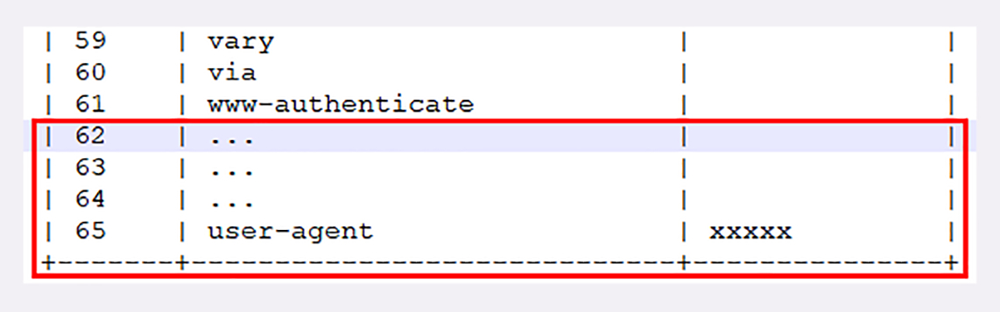
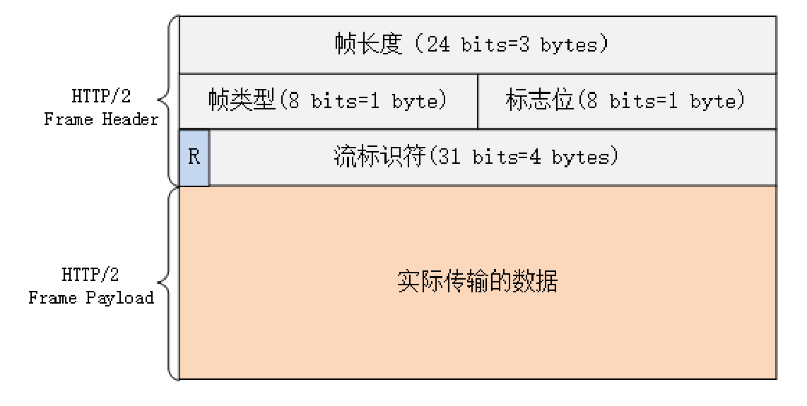
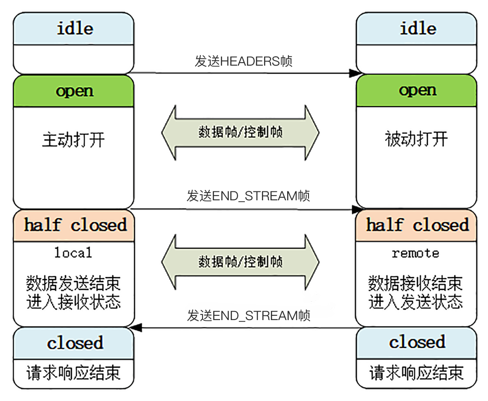

### 连接前言

由于 HTTP/2“事实上”是基于 TLS，TLS 握手成功后，客户端必须发送一个“连接前言”（connection preface），用来去人建立 HTTP/2 连接

“连接前言”是标准的 HTTP/1 请求报文，使用纯文本的 ASCII 码格式，请求方法是特别注册的一个关键字“PRI”，全文只有 24 个字节：

```
PRI * HTTP/2.0\r\n\r\nSM\r\n\r\n
```

### 头部压缩

“HPACK”算法是专门为压缩 HTTP 头部定制的算法，它是一个“有状态”的算法，需要客户端和服务器各自维护一份“索引表”，也可以说是“字典”（这有点类似 brotli），压缩和解压缩就是查表和更新表的操作

HTTP/2 废除了原有的起始行概念、还废除了版本号和错误原因短语，把起始行里的请求方法、URI、状态码等转换成头字段形式，叫做“伪头字段”（pseudo-header fields）

而“伪头字段”会在名字前加一个“:”表示，比如：“:authority” “:method” “:status”，分别表示的是域名、请求方法和状态码

这样一来，HTTP 报文头就都是“Key-Value”形式，于是 HTTP/2 把床用的头字段定了一个只读的“静态字典表”，所以只要查表就可以知道字段名和对应的值

而自定义字段，则使用“动态字典表”，添加在静态表后面，结构相同，在编码解码时随时更新

比如说，第一次发送请求时的“user-agent”字段长是一百多个字节，用哈夫曼压缩编码发送之后，客户端和服务器都更新自己的动态表，添加一个新的索引号“65”。那么下一次发送的时候就不用再重复发那么多字节了，只要用一个字节发送编号就好




### 二进制帧

HTTP/2 的帧结构有点类似 TCP 的段或者 TLS 里的记录，但报头很小，只有 9 字节，非常地节省（可以对比一下 TCP 头，它最少是 20 个字节）



每帧分为：帧头和帧体

帧先是 3 个字节的帧长度，这个长度表示的是帧体的长度

然后是帧类型，大概可以分为数据帧和控制帧两种：
* 数据帧用来存放 HTTP 报文，HEADERS 帧和 DATA 帧属于数据帧
* 控制帧用来管理流的传输，控制帧有 SETTINGS、PING、PRIORITY 等

接下来是，帧标志信息，可以保存 8 个标志位，携带简单的控制信息，常用的标志位有 END_HEADERS 表示头数据结束，END_STREAM 表示单方向数据发送结束 END_HEADERS，相当于 HTTP/1 里头后的空行（“\r\n”） END_STREAM 相当于 HTTP/1 里 Chunked 分块结束标志（“0\r\n\r\n”）

后 4 个字节是 Stream ID，也就是流标识符，接收方使用它就可以从乱序的帧里识别出具有相同流 ID 的帧，按顺序组装成请求/响应报文

流标识符的上限是 2^31，大约是 21 亿


### 多路复用
流是二进制帧的双向传输序列

在 HTTP/2 连接上，虽然帧是乱序收发的，但只要它们都拥有相同的流 ID，就都属于一个流，而且在这个流里帧不是无序的，而是有着严格的先后顺序


HTTP/2 的流有以下特点：

* 可并发性
  * 一个 HTTP/2 连接上可以同时发出多个流传输数据，也就是并发多请求，实现“多路复用”
* 双向性
  * 一个流里面客户端和服务器都可以发送或接收数据帧，也就是一个“请求 - 应答”来回，而且客户端和服务器都可以创建流，双方互不干扰
* 独立性
  * 流之间没有固定关系，彼此独立，但流内部的帧是有严格顺序的
* 可设置优先级
  * 可以设置数据帧的优先级，让服务器优先处理，比如先传 HTML/CSS，后传图片，优化用户体验
* 自增性
  * 流 ID 不能重用，只能顺序递增，客户端发起的 ID 是奇数，服务器端发起的 ID 是偶数，达到上限之后又新开 TCP 连接从头开始
* 在流上发送“RST_STREAM”帧可以随时终止流，取消接收或发送
* 第 0 号流比较特殊，不能关闭，也不能发送数据帧，只能发送控制帧，用于流量控制

### 流的状态转换

HTTP/2 其实也是借鉴了 TCP 状态变化的思想，根据帧的标志位来实现具体的状态改变



以普通的“请求-响应”过程为例来说明： 最开始两边都是“空闲”状态

当客户端发送 Headers 帧后，开始分配 Stream ID, 此时客户端的流打开, 服务端接收之后服务端的流也打开，两端的流都打开之后，就可以互相传递数据帧和控制帧了

当客户端要关闭时，向服务端发送 END_STREAM 帧，进入“半关闭”状态, 这个时候客户端只能接收数据，而不能发送数据，也就是客户端已经发送完数据，需要接收响应数据，服务器端接受完数据，要内部处理，再发送响应数据

服务器端发送响应数据完毕也向客户端发送 END_STREAM 帧，表示数据发送完毕，双方进入关闭状态

流关闭就是一次通信结束，由于流 ID 不能重用，下一次再发请求就要开一个新流（而不是新连接），流 ID 不断增加，直到到达上限，发送“GOAWAY”帧开一个新的 TCP 连接，流 ID 就又可以重头计数

### 小结

1. HTTP/2 必须先发送一个“连接前言”字符串，然后才能建立正式连接
2. HTTP/2 废除了起始行，统一使用头字段，两端维护字段形式为“Key-Value”的索引表，使用“HPACK”算法压缩头部
3. HTTP/2 把报文且分为多种类型的二进制帧，报文头里最重要的字段是流标识符，标记帧属于哪种流
4. 流是 HTTP/2 虚拟的概念，是帧的双向传输序列，相当于 HTTP/1 里的一次“请求 - 应答”
5. 在一个 HTTP/2 连接上可以并发多个流，也就是多个“请求 - 响应”报文，这就是“多路复用”

### 问题

1. HTTP/2 的动态表维护、流状态转换很复杂，你认为 HTTP/2 还是“无状态”的吗？
   可以说是语义无状态，语法有状态
   流状态是表示流是否建立、单次请求响应的状态
   动态表维护是用于头部压缩
   而“无状态”是指会话事务的信息保存，而 HTTP/2 依然是请求之间相互独立
2. HTTP/2 的帧最大可以达到 16M，你觉得大帧好还是小帧好？
   大帧和小帧，要看场景，如果网络不稳定，小帧可以减少丢失重传的成本，也可以传输更多的数据提高并行速度，而如果网络稳定，尤其是针对大文件下载的场景，那小帧就更加耗时
3. 谈谈 HTTP/2 是如何解决“队头阻塞”问题的？
   队头阻塞是因为 HTTP/1.1 的请求是串行队列，前一个处理花费大量时间，那么后面的请求就需要等待更多的时间
   而 HTTP/2 通过把请求拆分为帧，分配流 ID 并通过流传输
   可以理解为每个请求响应都是一个流，而流相互独立且可并发，从而达到解决“对头阻塞”问题


