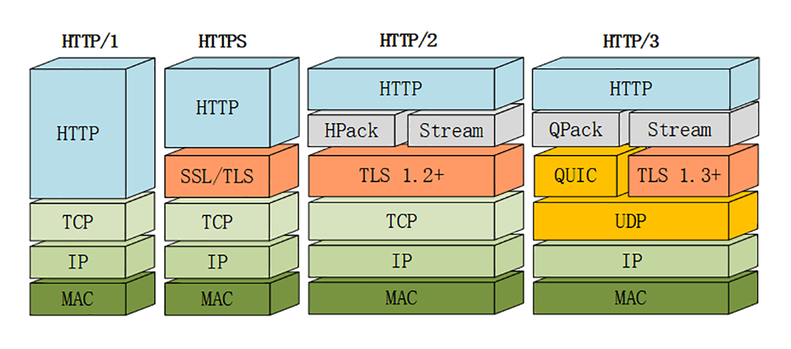
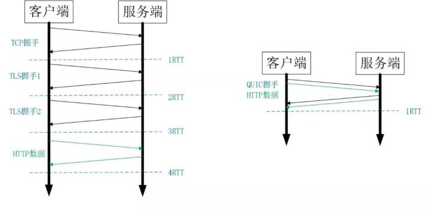
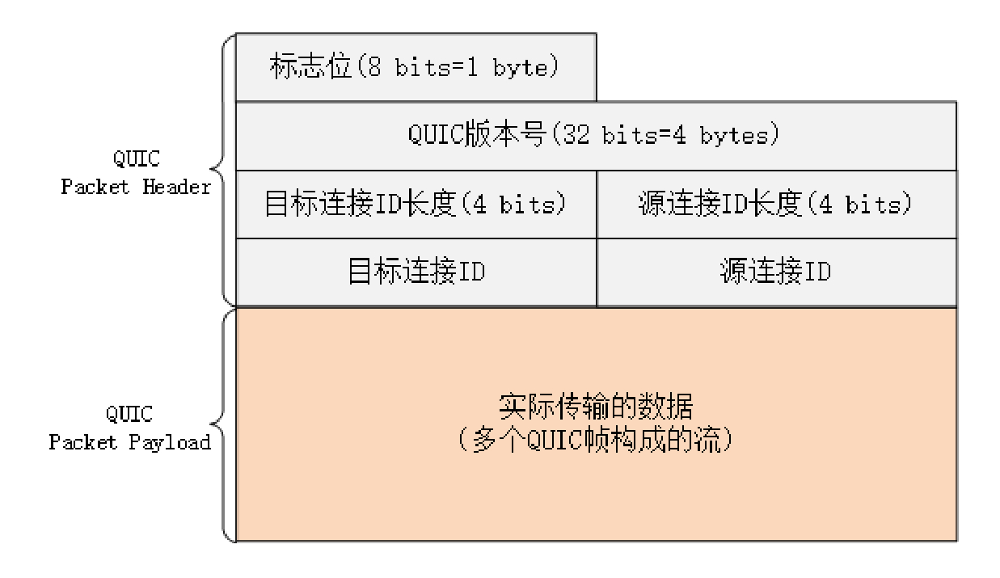
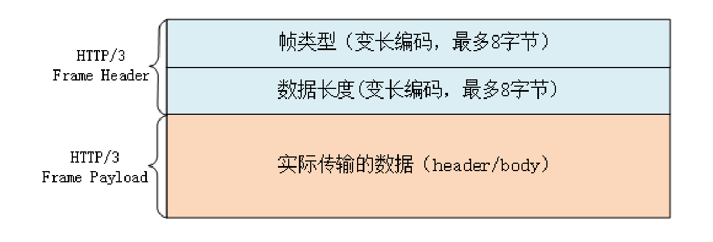

### HTTP/2 的队头阻塞

HTTP/2 在应用层上解决了“队头阻塞”，而在下层，TCP 协议里，还是会发生“队头阻塞”

在网络良好的情况下，包可以很快送达目的地。但如果网络质量比较差，像手机上网的时候，就有可能会丢包。而 TCP 为了保证可靠传输，有个特别的“丢包重传”机制，丢失的包必须要等待重新传输确认，其他的包即使已经收到了，也只能放在缓冲区里，上层的应用拿不出来，只能“干着急”

由于这种“队头阻塞”是 TCP 协议固有的，所以 HTTP/2 即使设计出再多的“花样”也无法解决

于是就又发明了一个新的“QUIC”协议，让 HTTP 跑在 QUIC 上而不是 TCP 上

而这个“HTTP over QUIC”就是 HTTP 协议的下一个大版本，HTTP/3

HTTP/2 依然有队头阻塞的问题 在协议层 TCP 上依然存在

### QUIC 协议

HTTP/3 把下层 TCP 换成了 UDP，而 UDP 是无序的，包之间没有依赖关系，从根本上解决了“队头阻塞”

UDP 是一个简单、不可靠的传输协议，不需要建连和端连，通信成本低

QUIC 最早是由 Google 发明的，被称为 gQUIC。而当前正在由 IETF 标准化的 QUIC 被称为 iQUIC，两者的差异非常大

QUIC 都是指 iQUIC，要记住，它与早期的 gQUIC 不同，是一个传输层的协议，和 TCP 是平级的

### QUIC 的特点

QUIC 基于 UDP，而 UDP 是“无连接”，所以天生要比 TCP 快

QUIC 基于 UDP 实现了可靠传输，保证数据一定能够抵达目的地。它还引入了类似 HTTP/2 的“流”和“多路复用”，单个“流”是有序的，可能会因为丢包而阻塞，但其他“流”不会受到影响

为了防止网络上的中间设备（Middle Box）识别协议的细节，QUIC 全面采用加密通信，可以很好地抵御窜改和“协议僵化”（ossification）

QUIC 最大的优势是实现了 0-RTT 的建连：

### QUIC 内部细节

QUIC 的基本数据传输单位是包（packet）和帧（frame），一个包由多个帧组成，包面向的是“连接”，帧面向的是“流”。

QUIC 使用不透明的“连接 ID”来标记通信的两个端点，客户端和服务器可以自行选择一组 ID 来标记自己，这样就解除了 TCP 里连接对“IP 地址 + 端口”（即常说的四元组）的强绑定，支持“连接迁移”（Connection Migration）。

QUIC 的帧里有多种类型，PING、ACK 等帧用于管理连接，而 STREAM 帧专门用来实现流

QUIC 里的流与 HTTP/2 的流非常相似，也是帧的序列。但 HTTP/2 里的流都是双向的，而 QUIC 则分为双向流和单向流。

QUIC 帧普遍采用变长编码，最少只要 1 个字节，最多有 8 个字节。流 ID 的最大可用位数是 62，数量上比 HTTP/2 的 2^31 大大增加

流 ID 还保留了最低两位用作标志，第 1 位标记流的发起者，0 表示客户端，1 表示服务器；第 2 位标记流的方向，0 表示双向流，1 表示单向流

所以 QUIC 流 ID 的奇偶性质和 HTTP/2 刚好相反，客户端的 ID 是偶数，从 0 开始计数

### HTTP/3 协议

HTTP/3 把流控制都交给 QUIC 去做。调用的不再是 TLS 的安全接口，也不是 Socket API，而是专门的 QUIC 函数

HTTP/3 里仍然使用流来发送“请求 - 响应”，但它自身不需要像 HTTP/2 那样再去定义流，而是直接使用 QUIC 的流，相当于做了一个“概念映射”

HTTP/3 里的“双向流”可以完全对应到 HTTP/2 的流，而“单向流”在 HTTP/3 里用来实现控制和推送，近似地对应 HTTP/2 的 0 号流

HTTP/3 的帧结构只有两个字段：类型和长度，而且同样都采用变长编码，最小只需要两个字节

HTTP/3 里的帧仍然分成数据帧和控制帧两类，HEADERS 帧和 DATA 帧传输数据，但其他一些帧因为在下层的 QUIC 里有了替代，所以在 HTTP/3 里就都消失了

头部压缩算法在 HTTP/3 里升级成了“QPACK”，使用方式上也做了改变。虽然也分成静态表和动态表，但在流上发送 HEADERS 帧时不能更新字段，只能引用，索引表的更新需要在专门的单向流上发送指令来管理，解决了 HPACK 的“队头阻塞”问题

QPACK 的字典也做了优化，静态表由之前的 61 个增加到了 98 个，而且序号从 0 开始，也就是说“:authority”的编号是 0

### HTTP/3 服务发现

HTTP/3 没有指定默认的端口号，需要用 HTTP/2 的“扩展帧”

浏览器需要先用 HTTP/2 协议连接服务器，然后服务器可以在启动 HTTP/2 连接后发送一个“Alt-Svc”帧，包含一个“h3=host:port”的字符串，告诉浏览器在另一个端点上提供等价的 HTTP/3 服务

浏览器收到“Alt-Svc”帧，会使用 QUIC 异步连接指定的端口，如果连接成功，就会断开 HTTP/2 连接，改用新的 HTTP/3 收发数据

### 小结

1. HTTP/3 基于 QUIC 协议，完全解决了“队头阻塞”问题，弱网环境下的表现会优于 HTTP/2
2. QUIC 是一个新的传输层协议，建立在 UDP 之上，实现了可靠传输
3. QUIC 支持 0-RTT 快速建连
4. QUIC 的连接使用“不透明”的连接 ID，不绑定在“IP 地址 + 端口”上，支持“连接迁移” 
5. QUIC 的流与 HTTP/2 的流很相似，但分为双向流和单向流 
6. HTTP/3 没有指定默认端口号，需要用 HTTP/2 的扩展帧“Alt-Svc”来发现

### 问题

1. IP 协议要比 UDP 协议省去 8 个字节的成本，也更通用，QUIC 为什么不构建在 IP 协议之上呢？
   QUIC 不基于 IP 协议，是因为没有设备认识它
2. 理解的 QUIC、HTTP/3 的好处
   HTTP/3 端口不固定、内容天然加密、无握手快速建连等特性
