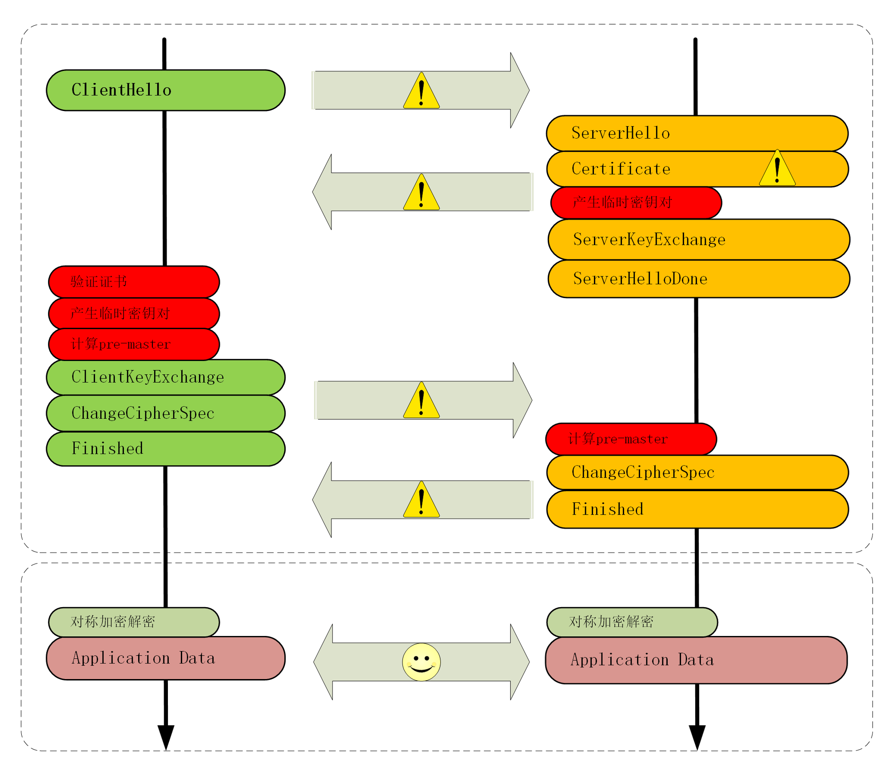
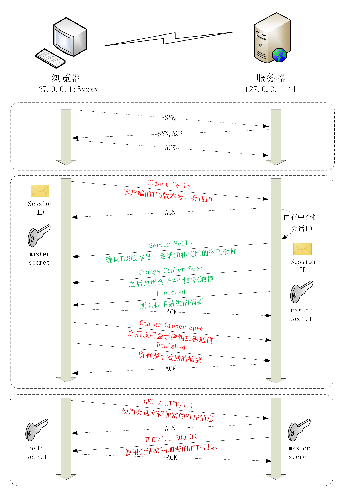

## 序

因为 HTTPS 比 HTTP 增加了一个 TLS 握手，还会花费 2-RTT，除此之外，还有用于生成临时公私钥对、验证证书、加密解密“Pre-Master”的消耗

所以不做优化情况下，HTTPS 可能比 HTTP 慢上几百毫秒甚至几秒

不过现在已经有很多有效的 HTTPS 优化手段，以下用一张图把 TLS 握手过程中影响性能部分标记出来

### 硬件优化

* 选择更快的 CPU，最好内建 AES 优化，这样可以加速握手，也可以加速传输 
* 选择“SSL 加速卡”，加密时调用它的 API，让专门的硬件做非对称加密，分担 CPU 的计算压力 
* SSL 加速服务器，用专门的服务器集群来彻底“卸载”TLS 握手时的加密解密计算

### 软件优化

软件优化分成两部分：软件升级和协议优化

### 软件升级

软件升级
把现在正在使用的软件尽量升级到最新版本，比如把 Linux 内核由 2.x 升级到 4.x，把 Nginx 由 1.6 升级到 1.16，把 OpenSSL 由 1.0.1 升级到 1.1.0/1.1.1

### 协议优化

尽量采用 TLS1.3，它大幅度简化握手过程，完全握手只要 1-RTT，而且更安全

即使只能用 1.2，那握手时使用的密钥交换协议应当选用 ECDHE 算法，因为运算快、安全性高，还支持“False Start”。椭圆曲线也选择高性能曲线，最好是 x25519，其次 P-256。对称加密算法，可以选择比“AES_256_GCM”略快一点点的“AES_128_GCM”

### 证书优化

证书优化有两个优化点：证书传输和证书验证

服务器的证书可以选择 ECDSA 证书而不是 RSA，因为 224 位 ECC 相当于 2028 位的 RSA，这样带宽和计算量都能降低

由于 CRL 是由 CA 定期发布，所以 CRL 有“时间窗口”安全隐患和累积无用证书的问题，所以证书验证可以使用“OCSP Stapling”（OCSP 装订），可以让服务器预先访问 CA 获取 OCSP 响应，然后再握手时随着证书一起发给客户端，免去了客户端连接 CA 服务器查询的时间

### 会话复用

会话复用（TLS session resumption），和 HTTP Cache 一样，把“Master Secret”进行缓存“重用”，减少握手和计算成本

会话复用分为“Session ID”和“Session Ticket”

#### Session ID

客户端和服务器首次连接后各自保存一个会话的 ID 号，内存里存储主密钥和其他相关的信息

当客户端再次连接时发一个 ID 过来，服务器就在内存里找，找到就直接用主密钥恢复会话状态，跳过证书验证和密钥交换，只用 1-RTT 就可以建立安全通信

#### Session Ticket

由于服务器必须保存每一个客户端的会话数据，所以千百万级别的网站来说，这样的会话数据存储就成了大问题

于是“Session Ticket”方案出现了，有点类似 HTTP 的 Cookie，存储的责任由服务器转移到客户端，服务器加密会话信息用“New Session Ticket”消息发给客户端，让客户端保存

重连的时候，客户端使用扩展“session_ticket”发送“Ticket”而不是“Session ID”，服务器解密后验证有效期，就可以恢复会话，开始加密通信

不过“Session Ticket”方案需要使用一个固定的密钥文件（ticket_key）来加密 Ticket，为了防止密钥被破解，保证“前向安全”，密钥文件需要定期轮换，比如设置为一小时或者一天

#### 预共享密钥

TLS1.3 利用“Pre-shared Key”（PSK），进一步实现 0-RTT。实现方法是在发送 Session Ticket 的同时带上应用数据（Early Data），不用等到服务端确认

但这样的方式也带来了安全问题，黑客可以截获“PSK”的数据，反复向服务器发送，增加了服务器被攻击的风险

解决办法是只允许使用安全的 GET/HEAD 方法，在消息里假如时间戳、“nonce”验证，或者“一次性票证”限制重放

#### 小结

可以有多重硬件和软件手段减少网络耗时和计算耗时，让 HTTPS 变得和 HTTP 一样快，最可行的是软件优化

应当尽量使用 ECDHE 椭圆曲线密码套间，节约带宽和计算量，还能实现 “False Start”

服务器应当开启 “OCSP Stapling” 功能，避免客户端访问 CA 去验证证书

会话复用的效果类似 Cache，前期是客户端必须之前成功建立连接，后面就可以用“Session ID”“Session Ticket”等票据跳过密码交换、证书验证等步骤，直接开始加密通信

### 问题
能比较一下“Session ID”“Session Ticket”“PSK”这三种会话复用手段的异同吗？

Session ID：把会话信息存储在服务端
Session Ticket：会话信息由服务器生成，发送并存储在客户端
PSK：是 Session Ticket 的升级版，使用 Early Data 发送应用数据到服务器，省去服务器和客户端确认步骤。
