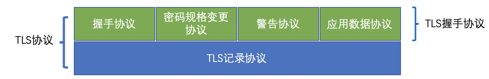
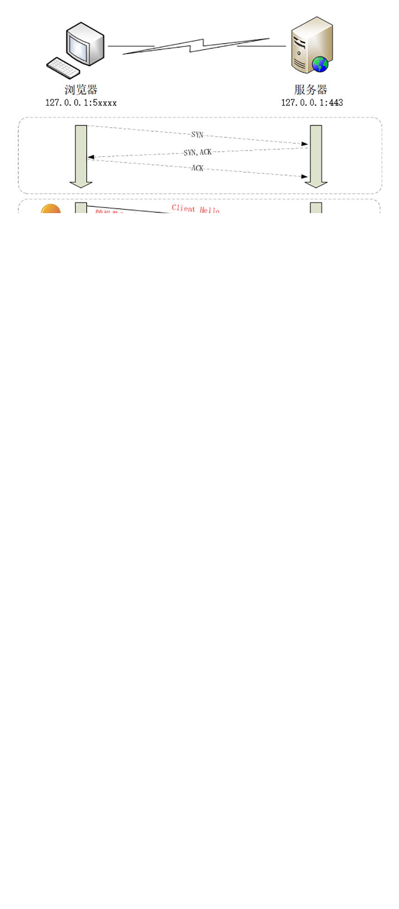
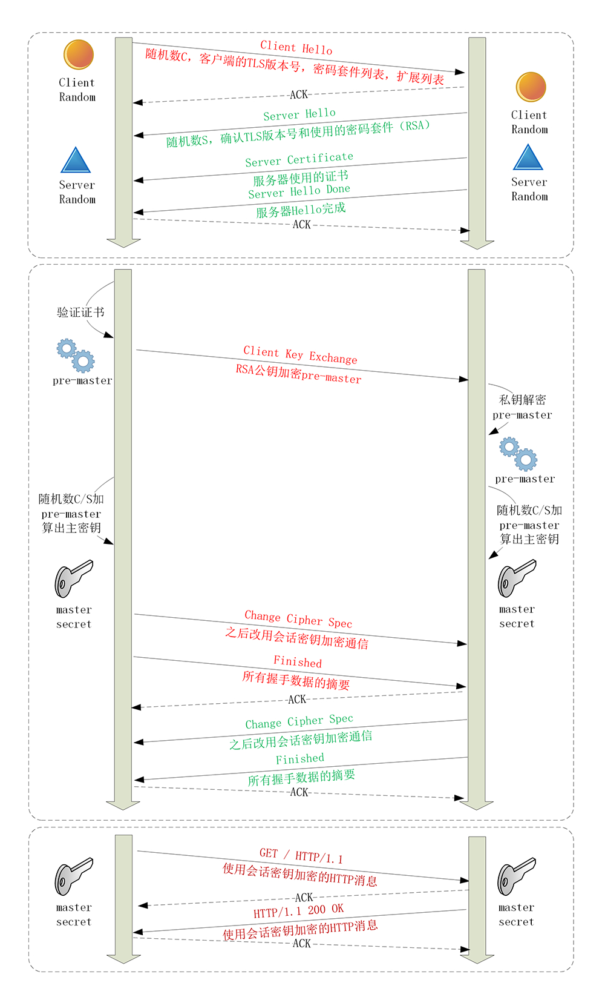

### HTTPS 建立连接

和 HTTP 连接稍有不同的是， HTTP 在 TCP 握手完成之后，浏览器就会立即发送请求报文

而 HTTPS 在 TCP 三次握手之后，还要发起 TLS 连接，然后才是发送请求报文

### TLS 协议的组成



TLS 由握手协议、记录协议组成，而 TLS 携手协议包含几个子协议。介绍几个常用协议：

* 记录协议（Record Protocol） 规定了 TLS 收发数据的基本单位：记录（Record）
* 警报协议（Alert Protocol） 职责是向对方发出警报信息
* 握手协议（Handshake Protocol） TLS 最复杂的子协议，浏览器和服务器握手过程中协商 TLS 版本号、随机数、密码套间等信息，然后交换证书和密钥参数，最终双方协商得到会话密钥，用于后续的混合加密系统
* 变更密码规范协议（Change Cipher Spec Protocol） 相当于一个“通知”，告诉对方，后续的数据都将使用加密保护。所以在它之前，数据是明文的

### ECDHE 握手过程

ECDHE 是主流的握手方式

1. Client Hello 浏览器向服务器发送一个 “Client Hello” 的消息，包括以下信息：可用版本号（Version）、当前时间、客户端随机数（Random）、会话 ID（Session ID）、可用的密码套件清单（Cipher Suite）、可用的压缩方式清单（Compression Methods） 客户端随机数是一个由客户端生成的随机数（Client Random），用来生成对称密钥 加密套件列表是什么？我举个例子，加密套件列表一般张这样:
```
TLS_ECDHE_WITH_AES_128_GCM_SHA256
```

2. Server Hello 服务器返回“Server Hello”的消息，包括以下信息：使用的版本号、当前时间、服务器随机数、会话 ID、使用的密码套件、使用的压缩方式、服务器证书、客户端证书（服务器可要求客户端提供）
使用的版本号，使用的密码套件，使用的压缩方式是对“Client Hello”的回答
服务器随机数是一个由服务器端生成的随机数（Server Random），用来生成对称密钥
服务器选择了 ECDHE 算法，所以它会在证书后发送“Server Key Exchange”消息，里面是椭圆曲线的公钥（Server Params），用来实现密钥交换算法，再加上自己的私钥签名认证

3. Client 验证证书，生成 Master Secret 客户端验证证书、签名，通过后，也生成椭圆曲线的公钥（Client Params），发送“Client Key Exchange”消息给服务器 客户端、服务器根据 ECDHE 算法，传入 Server Params 和 Client Params，计算出 Pre-Master 然后客户端、服务器通过 Client Random、Server Random、Pre-Master，各自生成用于加密会话的主密钥“Master Secret”

4. Change Cipher Spec 和 Finished 客户端发送“Change Cipher Spec”通知服务器后续的通信都采用协商的通信密钥和加密算法进行加密通信 
客户端发送“Finished”，把之前发送的内容做个摘要（hash）并加密，发给服务器验证
服务器也同样发送“Change Cipher Spec”表示后面的消息将会以前面协商的密钥进行加密，以及发送“Finished”把内容做摘要并加密，发给客户端验证
5. 至此，握手结束，之后服务器和客户都都将使用加密方式沟通




### RSA 握手过程

和上面 ECDHE 有三点不同：

1. ECDHE 握手，因为使用 ECDHE 算法实现密钥交换而不是 RSA，所以服务器端会发送“Server Key Exchange”
2. 使用 ECDHE，客户端可以不用等到服务器发回“Finished”确认完毕，立刻发 HTTP 报文，省去了一个消息往返的时间浪费（RTT），这个叫“TLS False Start”，可以理解为“提前抢跑”
3. 流程上，RSA 握手过程 Pre-Master 不需要用算法生成，而是客户端直接生成随机数，用服务器的公钥加密，通过“Client Key Exchange”发送给服务器，服务器用私钥解密，这样达到双方共享三个随机数，生成主密钥



### 双向认证
以上实际上是“单向认证”的过程，只客户端认证了服务器的身份，而服务器没有认证客户端身份

而有的时候（如网银），会使用 U 端给用户颁发客户端证书，实现“双向认证”

双向认证流程上，只是在“Server Hello Done”之后，“Client Key Exchange”之前，弧度短发送“Client Certificate”消息，服务器收到后把证书链跑一遍验证客户端的身份

### 小结

1. HTTPS 协议会先与服务器执行 TCP 握手，然后执行 TLS 握手，才能建立安全连接

2. 握手的目标是安全地交换对称密钥，需要三个随机数，第三个随机数“Pre-Master”必须加密传输，绝对不能让黑客破解

3. “Hello”消息交换随机数，“Key Exchange”消息交换“Pre-Master”

4. “Change Cipher Spec”之前传输都是明文，之后都是对称加密的密文

### 问题
1. 密码套件里的那些算法分别在握手过程中起了什么作用？

客户端按照偏好顺序发送它支持的密码套间列表，提供服务器端从中选择