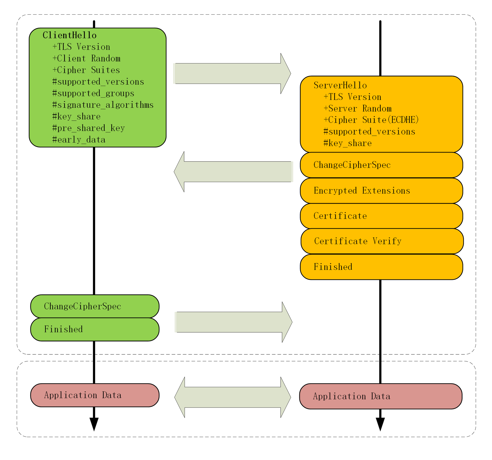

### 序

TLS 1.2 存在了 10 个年头，直到 2018 年退出 TLS1.3，主要针对 TLS1.2 做了改进，主要分为：兼容、安全、性能


### 最大化兼容性

TLS1.3 为了保证“老设备”能继续使用，进行了向下兼容

保证记录头 Version 不变情况下，使用一个新的扩展协议（Extension Protocol），在记录末位添加扩展字段来添加新功能

以下是一个例子，因为服务器不支持 1.3，使用“supported_version”做“向下兼容”

```
Handshake Protocol: Client Hello
    Version: TLS 1.2 (0x0303)
    Extension: supported_versions (len=11)
        Supported Version: TLS 1.3 (0x0304)
        Supported Version: TLS 1.2 (0x0303)
```

TLS1.3 还有其他扩展功能，比如“supported_groups” “key_share” “signature_algorithms” “server_name”等


### 强化安全

TLS1.3 废除了很多算法、模式，保留了 AES、ChaCha20 对称加密算法，分组模式只剩 GCM、CCM 和 Poly1305，摘要算法剩下 SHA256、SHA384，密钥交换算法只有 ECDHE 和 DHE

而密码套件变得更少了：

* TLS_AES_128_GCM_SHA256 
* TLS_AES_256_GCM_SHA384 
* TLS_CHACHA20_POLY1305_SHA256 
* TLS_AES_128_GCM_SHA256 
* TLS_AES_128_GCM_8_SHA256


而 RSA 被废除了是因为它不具备“前向安全”。因为，RSA 握手过程中会出现，当中间人拿到服务器私钥，通过截获历史报文，拿到 Pre-Master、Server Random 和 Client Random 并生成 Master Secret，也就能破解所有历史报文

但 ECDHE 在每次握手的时候都会临时生成公钥和私钥，每次通信的密钥都是不同的，所以即使私钥被破解，也只是这一次的破解，而不是历史报文被破解


### 提高性能

TLS1.3 压缩了以前的“Hello”协商过程，删除了“Key Exchange”消息，把握手时间减少到了“1-RTT

做1法是利用了扩展。

客户端在“Client Hello” 消息里直接用“supported_groups” 带上支持的曲线，

比如 P-256、x25519，用“key_share”带上曲线对应的客户端公钥参数，用“signature_algorithms”带上签名算法

服务器收到后在这些扩展里选定一个曲线和参数，再用“key_share”扩展返回服务器这边的公钥参数，就实现了双方的密钥交换



### 小结

1. 为了兼容 1.1、1.2 等“老”协议，TLS1.3 会“伪装”成 TLS1.2，新特性在“扩展”里实现

2. 1.1、1.2 在实践中发现了很多安全隐患，所以 TLS1.3 大幅度删减了加密算法，只保留了 ECDHE、AES、ChaCha20、SHA-2 等极少数算法，强化了安全

3. TLS1.3 也简化了握手过程，完全握手只需要一个消息往返，提升了性能。

### 问题

1. TLS1.3 里的密码套件没有指定密钥交换算法和签名算法，那么在握手的时候会不会有问题呢？
只需要在扩展属性添加 supports_groups、key_share、signature_algorithms 就能指定密钥交换算法、签名算法

2. 结合 RSA 握手过程，解释一下为什么 RSA 密钥交换不具有“前向安全”？

RSA 握手过程中，客户端会生成 Pre-Master 传给服务端，而且服务器私钥不会变，所以一旦黑客拿到私钥，
并且截取之前所有密文，就能拿到每次会话中的对称密钥，从而获取到客户端和服务器端的所有历史会话记录

3. TLS1.3 的握手过程与 TLS1.2 的“False Start”有什么异同？

相同点：都在未收到 Finished 确认消息时就已经向对方发送加密信息了
不同点：
1. TLS1.3 将 change cipher spec 合并到了 hello 中 
2. TLS1.2 是客户端率先算出 secret，然后发送 Application data 而 TLS1.3 是服务端优先算出 secret，发送 Application data
