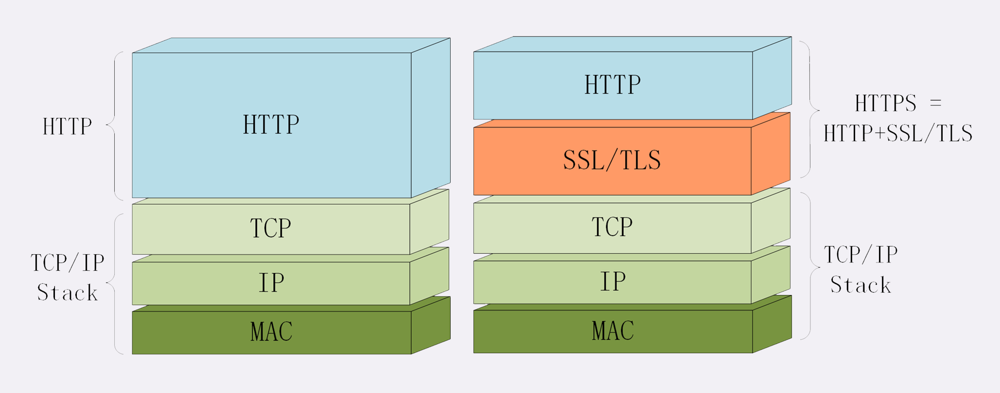

### 为什么要有 HTTPS？

由于 HTTP 协议是“明文”的特点，整个传输过程完全透明，任何人都能够在链路中截获、修改、伪造响应/请求报文，数据不具有可信性

比如，购物、网上银行、证券交易，需要安全保护性高的手段应付这些应用场景

再比如，新闻、视频、搜索，如有有恶意用户、恶意代理强行嵌入广告、分流用户这样的流量劫持

### 什么是安全？

通常认为，如果通信过程具备了四个特性，就可以认为是“安全”的，分别是： 机密性、完整性、身份认证和不可否认

* 机密性，是指对数据的“保密”，只能由可信的人访问，对他人是不可见的
* 完整性，也叫一致性，是指数据在传输过程中没有被篡改
* 身份认证，是指确认对方真实身份，保证消息只能发送给可信的人
* 不可否认，意思是不能否认已经发生过的行为

### 什么是 HTTPS？

协议名"https"，默认端口号 443，语法、语义和 HTTP 完全一样

HTTPS 与 HTTP 最大的区别，它能够鉴别危险的网站，并且尽最大可能保证你的上网安全，防御黑客对信息的窃听、篡改或者“钓鱼”、伪造

其实 HTTPS，特点就在于名字里的“S”，它把 HTTP 下层的传输协议由 TCP/IP 换成了 SSL/TLS，即“HTTP over TCP/IP”变成了“HTTP over SSL/TLS”，

让 HTTP 运行在安全的 SSL/TLS 协议上，不再使用 Socket API，而是调用专门的安全接口

TCP/IP => SSL/TLS

### SSL/TLS

SSL，安全套接层（Secure Sockets Layer），处于 OSI 模型中第 5 层（会话层）

TLS，传输层安全（Transport Layer Security）

SSL 发展到 v3 时候，由互联网工程组 IETF 把它改名为 TLS，正式标准化

目前应用最广泛的是 TLS 1.2

TLS 由记录协议、握手协议组成

浏览器和服务器在使用 TLS 建立连接时需要选择一组恰当的加密算法来实现安全通信，这些算法的组合被称为“密码套件”（cipher suite，也叫加密套件）

TLS 的密码套件命名非常规范，格式很固定。基本的形式是“密钥交换算法 + 签名算法 + 对称加密算法 + 摘要算法”

### OpenSSL

注明的开源密码学程序库和工具包，已成为事实上的标准，并被许多 Web 服务器作为底层库实现 TLS 功能

### 小结

* 因为 HTTP 是明文传输，所以不安全，容易被窃听、冒认、篡改
* 通信安全必须同时具备机密性、完整性、身份认证和不可否认这四个特性
* HTTPS 的语法、语义仍然是 HTTP，但把下层的协议由 TCP/IP 换成了 SSL/TLS
* SSL/TLS 是信息安全领域中的权威标准，采用多种先进的加密技术保证通信安全
* OpenSSL 是注明的开源密码学工具包，是 SSL/TLS 的具体实现

