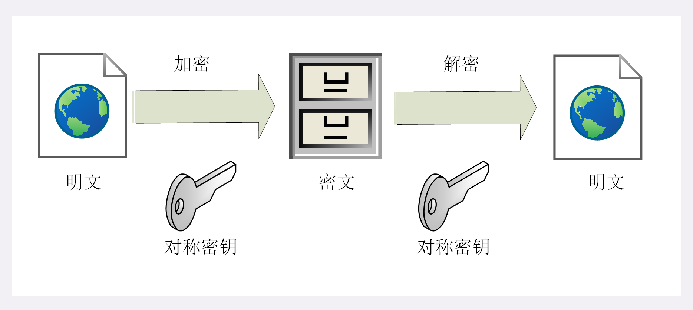
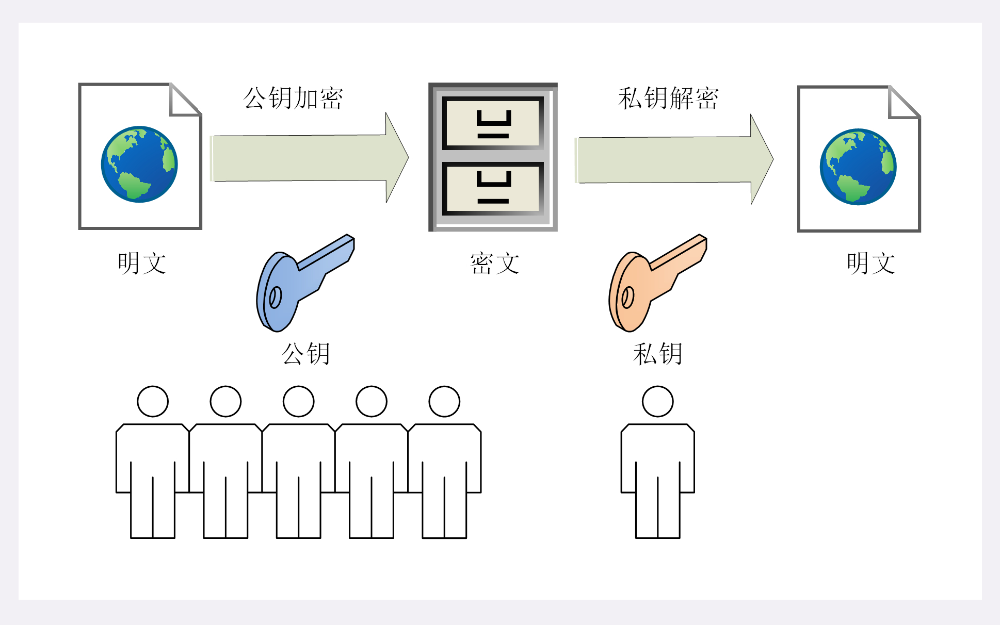
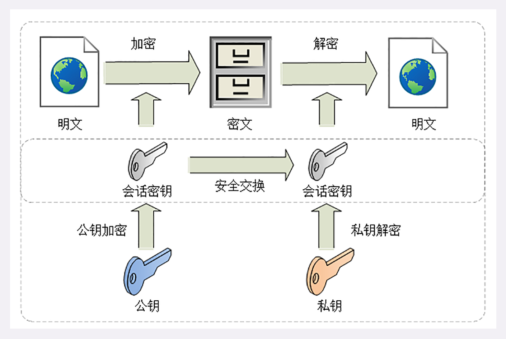

### 对称加密

指加密和解密时使用的密钥都是同一个，是“对称”的 只要保证了密钥的安全，那整个通信过程就可以说具有了机密性

TLS 常用的对称加密算法有：

* AES
* ChaCha20

AES，高级加密标准（Advanced Encryption Standard），长度可以是 128.192 或 256，是 DES 算法的替代者，安全强度高，性能也很好，而且有的硬件还会做特殊优化，是应用最广泛的对称加密算法

ChaCha20，是 Google 设计的，密钥长度 258 位，纯软件运行性能要超过 AES

### 加密分组模式

“分组模式”，让算法用固定长度的密钥加密任意长度的明文，把小秘密（即密钥）转化为大秘密（即密文）

最新的分组模式被称为 AEAD（Authenticated Encryption with Associated Data）,在加密的同时增加了认证功能，常用的是 GCM、CCM 和 Poly1305

比如，AES128-GCM，意思是密钥长度为 128 位的 AES 算法，使用的分组模式是 GCM

### 非对称加密

对称加密带来了另外一个问题，如何把密码安全地传递给对方，术语叫“密钥交换”

总不能把密钥再加密，那加密再加密，一层套一层，就始终无法解决密钥交换的问题

所以，出现了非对称加密

非对称加密，有两个密钥，一个叫“公钥”，一个叫“私钥”，两个密钥是不同的，公钥可以公开给任何人使用，而私钥必须严格保密

公钥和私钥有个“单向”性的特点，虽然都可以用来加密解密，但公钥加密后只能用私钥解密，私钥加密后也只能用公钥解密

这样就解决了“密钥交换”的问题，网站保管私钥，在网上任意分发公钥，想要登录网站只要用公钥加密就行了，密文只能由私钥持有者才能解密

TLS 有几种非对称加密算法，如 DH、DSA、RSA、ECC 等

### 混合加密

由于非对称加密都是基于数学难题，所以运算速度很慢，ECC 比 AES 要慢上很多

所以混合加密出现了，混合算法使用非对称算法解决密钥交换问题，然后后续都使用对称加密

### 小结
1. 加密算法的核心思想是密钥转化为密文消息
2. 对称加密只使用一个密钥，运算速度快，密钥必须保密，无法做到安全的密钥交换，常用的有 AES 和 ChaCha20
3. 非对称加密使用两个密钥：公钥和私钥，公钥可以任意分发而私钥保密，解决了密钥交换问题，但速度很慢，常用的有 RSA 和 ECC
4. 把对称加密和非对称加密结合起来使用就是混合加密，也是 TLS 里使用的加密方式

