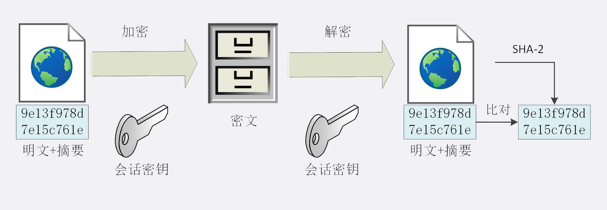
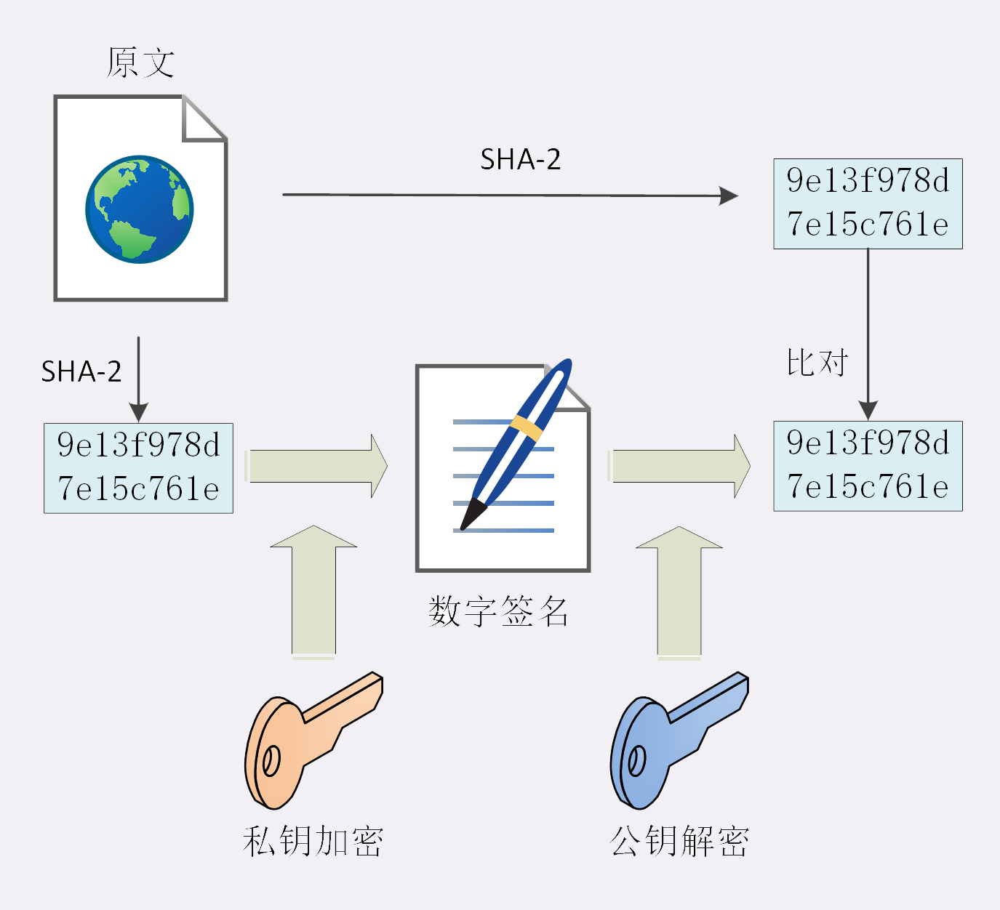
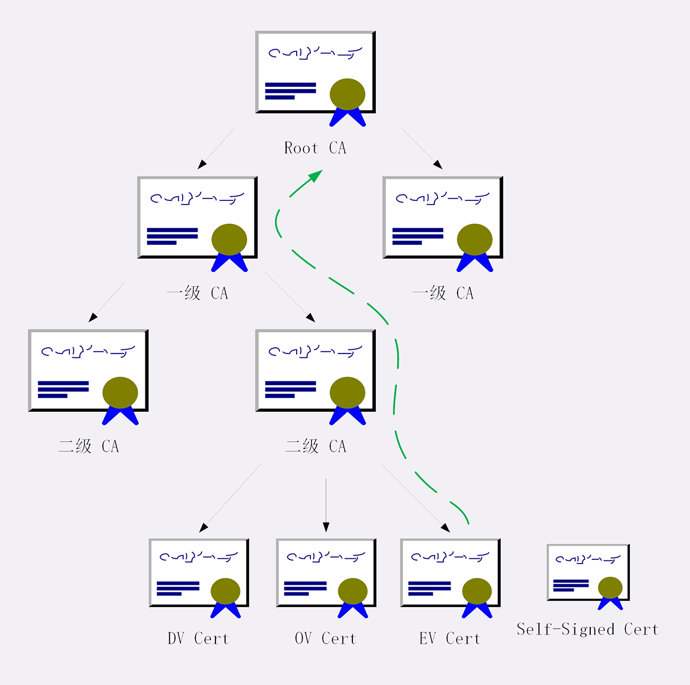

### 完整性，身份认证
除了机密性，还需要完整性、身份认证等，才能实现“安全”

### 摘要算法

实现完整性的手段主要是摘要算法（Digest Algorithm），也就是散列函数、哈希函数

摘要算法对输入具有“单向性”和“雪崩效应”，输入的微小不同会导致输出的剧烈变化，所以也被 TLS 用来生成伪随机数（PRF，pseudo random function）

MD5（Message-Digest 5）和 SHA-1（Secure Hash Algorithm 1）是常用的两个摘要算法，能够生成 16 字节和 20 字节长度的数字摘要，但这两个算法的安全强度比较低，不够安全，在 TLS 里已经被禁止使用了

目前 TLS 推荐使用的是 SHA-2，而 SHA-2 实际上是 6 种算法的统称，其中有：

* SHA224：生成 28 字节
* SHA256：生成 32 字节
* SHA384：生成 48 字节

### 完整性

摘要算法保证了“数字摘要”和原文是完全等价的。所以，我们只要在原文后附上它的摘要，就能够保证数据的完整性

真正的完整性必须要建立在机密性之上，在混合加密系统里用会话密钥加密消息和摘要，这样黑客无法得知明文，也就没有办法动手脚了，这又个术语，叫哈希消息认证码（HMAC）

### 数字签名

使用非对称加密里的“私钥”再加上摘要算法，就能够实现“数字签名”，同时实现“身份认证”和“不可否认”

数字签名的原理是将之前公钥私钥用法的反过来，也就是私钥加密，公钥解密

私钥加密原文的摘要叫做“签名”

公钥解密，拿到摘要后，再对比原文验证完整性的过程叫做“验签”

只要你和网站互相交换公钥，就可以用“签名”和“验签”来确认消息的真实性，因为私钥保密，黑客不能伪造签名，就能够保证通信双方的身份

### 数字证书和CA
首先说明“公钥的信任”问题，是因为公钥是任意分发，但是需要防止黑客伪造公钥的手段

通过公认的可信第三方，作为“信任的起点，递归的终点”，构建起公钥的信任链

这个“第三方”就是 CA（Certificate Authority，证书认证机构）

“数字证书”（Certificate）需要包含序列号、用途、颁发者、有效时间等等，打成一个包再签名，完整地证明公钥关联的各种信息

证书分 DV、OV、EV 三种可信程度

DV 最低，只是域名级别可信。EV 最高，经过法律、审计的严格核查，可以证明网站拥有者的身份

信任链每一级，需要让上一级 CA 签名认证，而链条的最后，Root CA 只能证明自己，这就叫“自签名证书”（Self-Signed Certificate）或者“根证书”（Root Certificate）

### 证书体系的弱点

弱点有两种：
1. 如果 CA 失误或者被欺骗而签发了错误的证书
2. CA 被黑客攻陷（或恶意 CA）

* 针对第一种，开发出了 CRL（证书吊销列表，Certificate revocation list）和 OCSP（在线证书状态协议，Online Certificate Status Protocol），及时废止有问题的证书 
* 针对第二种，因为涉及的证书太多，就只能操作系统或者浏览器从根上“下狠手”了，撤销对 CA 的信任，列入“黑名单”，这样它颁发的所有证书就都会被认为是不安全的

### 小结
1. 摘要算法用来实现完整性，能够为数据生成独一无二的“指纹”，常用的算法是 SHA-2

2. 数字签名是私钥对摘要的加密，可以由公钥解密后验证，实现身份认证和不可否认

3. 公钥的分发需要使用数字证书，必须由 CA 的信任链来完整，否则就是不可信的

4. 作为信任链的源头 CA 有时也会不可信，解决办法有 CRL、OCSP，还有终止信任

### 问题

1. 为什么公钥能够建立信任链，用对称加密算法里的对称密钥行不行呢？ 

因为非对称加密算法需要公开公钥，从而让客户端能解密 对称加密的密钥不可以，因为一是会把密钥公开，二是无法鉴别密文由谁加密，无法实现身份认证

2. 假设有一个三级的证书体系（Root CA=> 一级 CA=> 二级 CA），你能详细解释一下证书信任链的验证过程吗？

先查找后验证

1. 查找过程：服务器发来的是二级证书，那么客户端先找他的上一级颁发者（一级证书），然后查找一级证书的上一级证书（根证书），由于根证书是预先加载到客户端的
2. 验证过程：通过根证书的公钥解密以及证书的数字签名，通过指纹验证以及证书的合法性，同理，一级证书以同样方式验证二级证书，直到最后都验证成功，就证明站点可信
