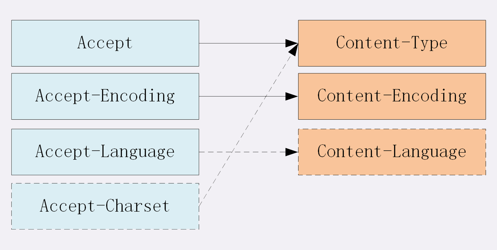
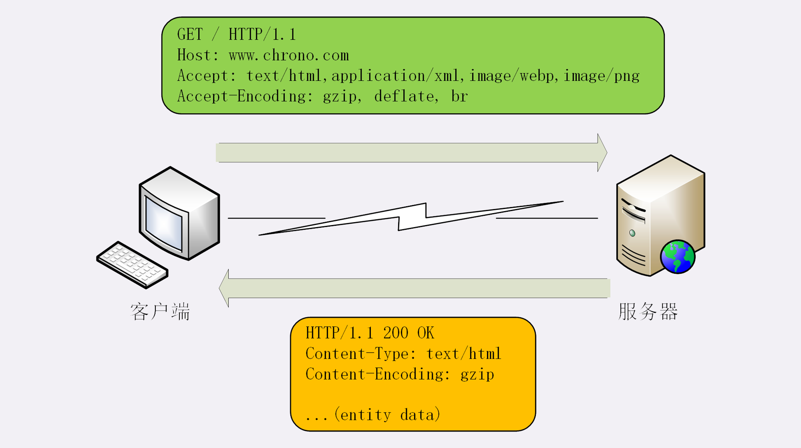

## 数据类型与编码
首先介绍 MMIE（Multipurpose Internet Mail Extensions），多用途互联网邮件扩展 MIME 把数据分成八大类，每个大类下再细分出多个子类，形式是“type/subtype”的字符串

HTTP 经常遇到的类别：

* text 文本格式，有 text/html（超文本文档）、text/plain（纯文本）、text/css（样式表）
* image 图像文件，有 image/gif、image/jpeg、image/png 等
* audio / video 音频和视频数据，例如 audio/mpeg、video/mp4 等
* application 数据格式不固定，可能是二进制，必须由上层应用程序来解释 常见的有：application/json、application/javascript、application/pdf

为了配合 MIME type，节省带宽、压缩数据，还需要“Encoding type”，标识数据用什么编码格式进行解压、解码 常用的 Encoding type 有三种：

1. gzip：GNU zip 压缩格式，互联网上最流行的压缩格式
2. deflate：zlib 压缩格式，流行度仅次于 gzip
3. br：专门为 HTTP 优化的新压缩算法（Brotli）

|  |  客户端 |  服务器端（响应头字段） |
| --- | --- | --- |
| 数据类型使用的头字段 | Accept: text/html,application/xml,image/webp,image/png | Content-Type: text/html; Content-Type: image/png; |
| 数据编码用的头字段 | Accept-Encoding: gzip, deflate, br |  Content-Encoding: gzip  |
| 语言类型与编码 | Accept-Language: zh-CN, zh, en | Content-Language: zh-CN  |
| 字符集实体数据的编码 | Accept-Charset: gbk, utf-8 | Content-Type: text/html; charset=utf-8 |
| 内容协商 | Accept: text/html, application/xml; q=0.9,*/*; q=0.8 | Vary: Accept-Encoding,User-Agent,Accept |



### 数据类型使用的头字段
HTTP 协议为了轻松识别 body 的类型，定义了两个 Accept 请求头字段和两个 Content 实体头字段，
用于客户端和服务器进行“内容协商”




Accept 字段标记的是客户端可理解的 MIME type，用“,”作为分隔符列出多种类型，让服务器有更多选择余地，例如：

```http
Accept: text/html,application/xml,image/webp,image/png
```

相应的，服务器会在响应报文里用头字段 Content-Type 告诉实体数据的真实类型：
```http
Content-Type: text/html
Content-Type: image/png
```

Accept-Encoding 字段标记的是客户端支持的压缩格式，如上面说的 gzip、deflate 等，
同样也可以用“,”列出多个，服务器可以选择其中一种来压缩数据，实际使用的压缩格式放在响应头字段 Content-Encoding 里

```http
Accept-Encoding: gzip, deflate, br
Content-Encoding: gzip
```

不过这两个字段是可以省略的，如果请求报文里没有 Accept-Encoding 字段，就表示客户端不支持压缩数据；如果响应报文里没有 Content-Encoding 字段，就表示响应数据没有被压缩

### 语言类型与编码
“语言类型”就是人类使用的自然语言，如英语、汉语等 所以需要明确区分的时候也要使用“type-subtype”的形式，分隔符是“-”

举几个例子：en 表示任意的英语，en-US 表示美式英语，en-GB 表示英式英语，而 zh-CN 就表示我们最常使用的汉语。

### 语言类型使用的头字段
Accept-Language 字段标记了客户端可理解的自然语言，也允许用“,”分隔符，例如：

```http
Accept-Language: zh-CN, zh, en
```

相应的，服务器应该在响应报文里用头字段 Content-Language 告诉客户端实体数据使用的实际语言类型：

```http
Content-Language: zh-CN
```

字符集在 HTTP 里使用的请求头字段是 Accept-Charset，
但响应头里没有对应的 Content-charset，
而是在 Content-Type 字段的数据类型后面用“chartset=xxx” 来表示 
例如，浏览器请求 GBK 或 UTF-8 的字符集，然后服务器返回的是 UTF-8 编码，就是下面这样：

```http
Accept-Charset: gbk, utf-8
Content-Type: text/html; charset=utf-8
```

现在的浏览器都支持多种字符集，通常不会发送 **Accept-Charset**，而服务器也不会发 **Content-Language**，
因为使用的语言能由字符集腿短出来，所以请求头一般只会有 Accept-Language 字段，响应头只会有 Content-Type 字段


## 内容协商的质量值
在 HTTP 协议里用 Accept、Accept-Encoding、Accept-Language 等请求头字段进行内容协商的时候，还可以用一种特殊的“q”参数表示权重来设定优先级，
这里的“q”是“quality factor”的意思

权重的最大值是 1，最小值是 0.01，默认值是 1，如果值是 0 就表示拒绝。具体的形式是在数据类型或语言代码后面加一个“;”，然后是“q=value”

```http
Accept: text/html, application/xml; q=0.9,*/*; q=0.8
```

意思是浏览器最希望使用的是 HTML 文件，权重是 1，其次是 XML 文件，权重是 0.9，其他任意类型的权重值是 0.8


## 内容协商的结果
服务器会在响应头加多一个 Vary 字段，记录服务器在内容协商时参考的请求头字段，给出一点信息，例如：

```http
Vary: Accept-Encoding,User-Agent,Accept
```

表示服务器依据 Accept-Encoding、User-Agent 和 Accept 三个头字段，
决定了返回的响应报文 每当 Accept 等请求头变化时，Vary 会随着响应报文发生变化


### 小结

1. 数据类型表示实体数据的内容是什么，使用的是 MIME type，相关的头字段是 Accept 和 Content-Type
2. 数据编码表示实体数据的压缩方式，相关的头字段是 Accept-Encoding 和 Content-Encoding
3. 语言类型表示实体数据的自然语言，相关的头字段是 Accept-Language 和 Content-Language
4. 字符集表示实体数据的编码方式，相关的头字段是 Accept-Charset 和 Content-Type
5. 客户端需要在请求里使用 Accept 等头字段鱼服务器进行“内容协商”，要求服务器返回最合适的数据
6. Accept 等头字段可以用“,”顺序列出多个可能的选项，还可以用“;q=”参数来精确指定权重

### 问题
1. 解释一下这个请求头“Accept-Encoding: gzip, deflate;q=1.0, *;q=0.5, br;q=0”，再模拟一下服务器的响应头
   解释：客户端支持压缩格式分别是 gzip、deflate 以及其他但不包括 br 压缩。而最希望的是 gzip 和 deflate，其次是其他压缩
   可能的服务器响应头
   
```http
Content-Encoding: gzip
```

2. 假设你要使用 POST 方法向服务器提交一些 JSON 格式的数据，里面包含有中文，请求头应该是什么样子的呢？

```http
POST /json HTTP/1.1
Accept: application/json
Accept-Language: zh-CN, zh
Accept-Charset: gbk, utf-8
```

3. 试着用快递发货收货比喻一下 MIME、Encoding 等概念
   
MIME：快递的物品类型（衣服、信件、生鲜） 
Encoding：打包的方式，比如衣服一般包装，生鲜需要冰袋等保鲜手段，信件用文件袋

