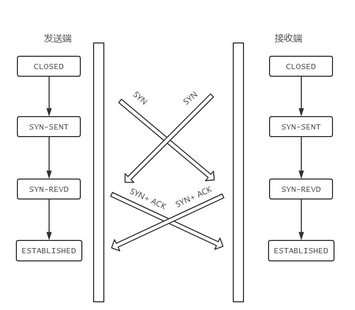

### 握手过程

所谓三次握手(Three-way Handshake)，是指建立一个 TCP 连接时，需要客户端和服务器总共发送 3 个包。

三次握手的目的是连接服务器指定端口，建立 TCP 连接， 并同步连接双方的序列号和确认号，交换 TCP 窗口大小信息。

在 socket 编程中，客户端执行 connect() 时。将触发三次握手。

### 过程解析：
从最开始双方都处于CLOSED状态。然后服务端开始监听某个端口，进入了LISTEN状态。

* 第一次握手（SYN=1，seq=x） 客户端发送一个 TCP 的 SYN=1 的包，随机产生初始序号 seq=x 到服务器，请求连接， 客户端进入SYN-SENT状态。
* 第二次握手（SYN=1，ACK=1，seq=y，ack=x+1） 服务器收到数据包，并将 SYN=1、ACK=1（对应客户端发来的 SYN）、ack（Ack Number）设置为客户端的 ISN+1 即 ack=x+1、随机产生序号 seq=y 的数据包发给客户端以示确认连接请求， 服务器进入SYN_RCVD状态
* 第三次握手（ACK=1，seq=x+1，ack=y+1） 客户端收到确认，再次发送确认包，SYN 标志为 0，ACK=1、seq=x+1、ack=y+1， 客户端发送完成后，客户端进入ESTABLISHED状态。
* 服务器收到第三次握手的 ACK 之后，也进入ESTABLISHED状态，随后客户端和服务器之间开始传输数据。

### 为什么不是两次？

原因：无法确认客户端的接收能力。

好处：为了减少连接资源的浪费。

假设两次握手场景：客户端发送一个连接请求A，而这时网络超时，而TCP重传机制会再发送一个链接请求B。B请求顺利到达服务器，服务器应答完就建立了请求，而后接收数据后释放了连接。而此时请求A到达服务器，服务器认为客户端又需要建立TCP连接，从而应答请求并进入ESTABLISHED状态，而客户端其实是CLOSED，就导致服务器一直等待，造成服务器端资源浪费。

### 三次握手过程中可以携带数据么？

第三次握手时可以携带数据，前两次不可以。

如果前面可以携带数据，相当于服务器会需要在握手过程中缓存数据。那么在第一次握手时，SYN报文放大量数据，那么服务器就会消耗相当多的时间和内存去处理数据，这样就增大了服务器被攻击的风险。

第三次握手时，客户端已处于ESTABLISHED状态，并且已经能确认服务器的接收、发送能力正常，这时候相对安全，可以携带数据。

### 双方同时打开会怎样？

在发送方给接收方发SYN报文的同时，接收方也给发送方发SYN报文，两个人刚上了!

发完SYN，两者的状态都变为SYN-SENT。

在各自收到对方的SYN后，两者状态都变为SYN-REVD。

接着会回复对应的ACK + SYN，这个报文在对方接收之后，两者状态一起变为ESTABLISHED

