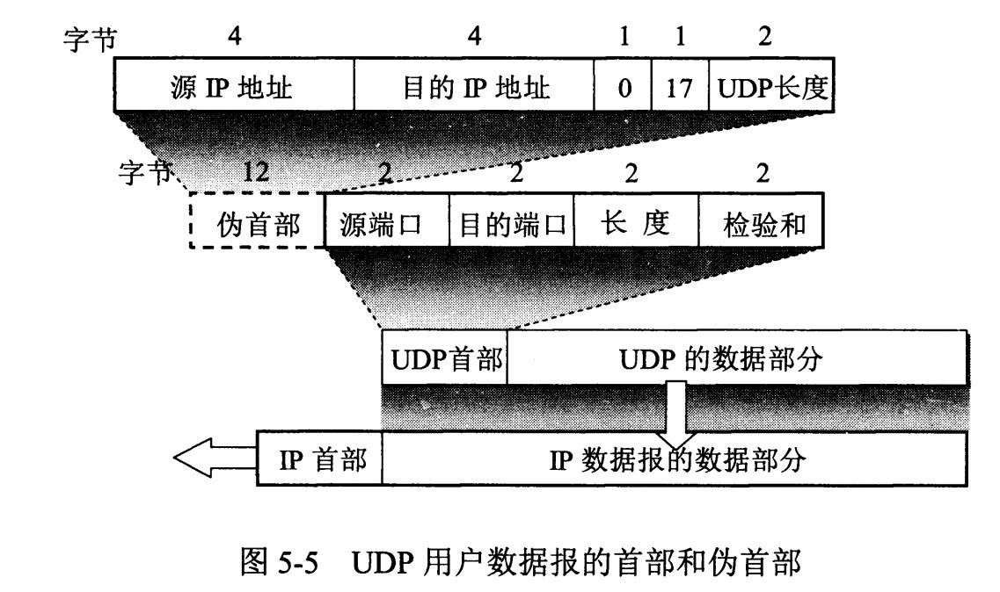
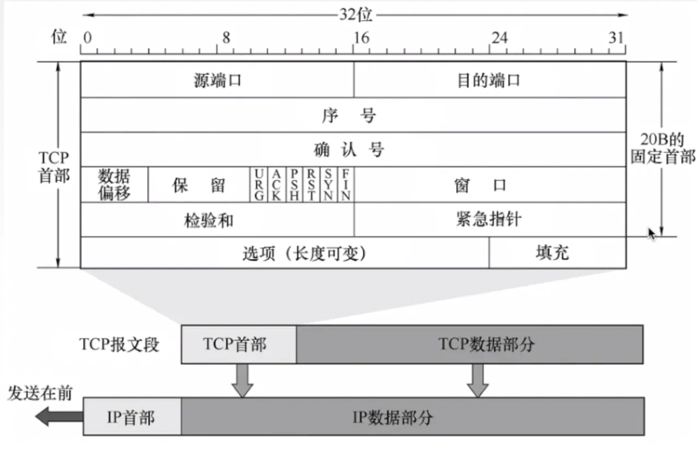

### UDP

用户数据协议（User Datagram Protocol），是无连接的，尽最大可能交付（即不可靠），没有拥塞控制（不提供复杂的控制机制），面向报文（对于应用层的报文不合并也不拆分，只添加 UDP 头部），支持多种传输方式（一对一、一对多、多对一、多对多）的通信。

### UDP 首部格式

首部字段只有 8 个字节，包括源端口、目的端口、长度、检验和。 
12 字节的伪首部是为了计算检验和临时添加的。

### 应用场景

* 视频 
* 音频 
* 广播

### TCP

传输控制协议（Transmission Control Protocol），是面向连接的、可靠的、基于字节流的传输层通信协议。 
而且有流量控制，拥塞控制，提供全双工通信，每一条 TCP 连接只能是点对点的（一对一）。

### 特点

* 面向连接
  * 指客户端和服务器的连接，在双方通信之前，TCP 需要三次握手建立连接。
* 可靠性
  * 可靠有序，不丢不重。 
  * TCP 为了保证传输的可靠性给每一个包一个序号，同时也保证了传输到接收方的包是按序排列。接收方对于已经接受的包会回传一个相应的确认（ACK），如果发送方在确认的往返时延（RTT）没有收到确认，就会重新发送
* 基于字节流
  * TCP 不像 UDP 一个一个报文传输，而是在不保存报文边界的情况下以字节流的形式传输。

### TCP 首部格式

#### 序号
Sequence number，用于对字节流进行编号。

序列号的作用：

* 在 SYN 报文中交换彼此的初始序列号；
* 保证数据包按正确的顺序组装。

例如序号为 301，表示本报文的第一个字节的编号为 301，如果携带的数据长度为 100 字节，那么下一个报文段的序号应为 401

#### ISN
即 Initial Sequence Number（初始序列号）,在三次握手的过程当中，双方会用过 SYN 报文来交换彼此的 ISN。

#### 确认号
ACK（Acknowledgment Number），用来告知对方下一个期望接收的序列号，小于 ACK 的所有字节已经全部收到。

例如 B 正确收到 A 发送来的一个报文段，序号为 501，携带的数据长度为 200 字节，因此 B 期望下一个报文段的序号为 701，B 发送给 A 的确认报文段中确认号就为 701。

#### 数据偏移
指的是数据部分距离报文段起始处的偏移量，实际上指的是首部的长度。

#### 标志位

常见的有：SYN、ACK、FIN、RST、PSH、URG

| 标志 | 作用 |
| --- | --- |
| ACK | 置 1 时，确认应答的字段变为有效 |
| SYN | 置 1 时，表示希望建立连接 |
| PSH | 置 1 时，请求数据在接收方得到后立刻传给上层应用协议；置 0 时，则不需要立即传而是先进行缓存 |
| RST | 置 1 时，强制断开连接，表示 TCP 连接中出现异常 |
| FIN | 置 1 时，发送方的数据发送完毕，要求断开连接 |
| URG | 置 1 时，表示包中有需要紧急处理的数据 |

#### 窗口大小
字段长度 16 位，也就是 2 个字节。 表示接收缓冲区的空闲空间，用来告诉对方自己能够接收的最大数据长度。

#### 检验和
占用 16 位，也就是 2 个字节。 用来校验传输过程中数据是否被破坏。

#### TCP 和 UDP 的区别

1. 面向连接。TCP 面向连接，UDP 面向无连接。
2. 可靠性。TCP 是可靠传输，而 UDP 不是。
3. 面向节流。UDP 的数据传输是面向数据报，而 TCP 是面向字节流。

