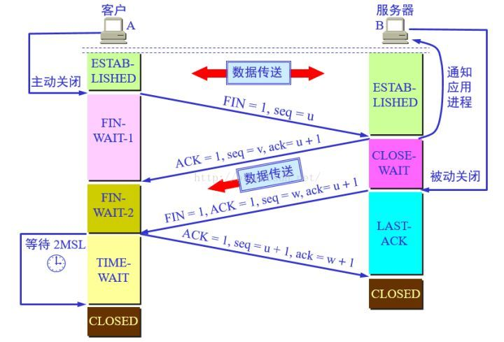
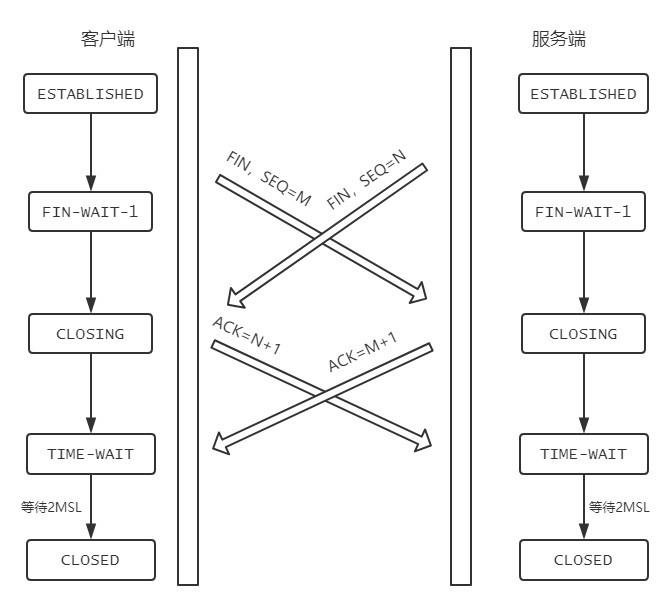

### 挥手过程

客户端或服务器均可主动发起挥手动作，在 socket 编程中，任何一方执行 close() 操作即可产生挥手操作。

### 过程解析

* 第一次挥手（FIN=1,seq=u） 客户端发送连接释放报文，并停止发送数据，主动关闭TCP连接。 发送完毕后，客户端进入FIN_WAIT_1状态。
* 第二次挥手（ACK=1,ack=u+1,seq=v） 服务器端回送一个确认报文，客户到服务器的这个方向的连接就释放了，进入半关闭状态。 发送完毕后，服务器端进入CLOSE_WAIT状态，客户端接收到这个确认包之后，进入FIN_WAIT_2状态，等待服务器端关闭连接。
* 第三次挥手（FIN=1,ACK=1,seq=w,ack=u+1） 服务器端发完数据，就发出连接释放报文，主动关闭TCP连接。 发送完毕后，如服务器端进入LAST_ACK状态，等待来自客户端的最后一个ACK。
* 第四次挥手（ACK=1,seq=u+1,ack=w+1） 客户端回送一个确认报文，并进入TIME_WAIT状态，等到时间等待计算器设置的2MSL（最长报文寿命）后，连接彻底关闭，进入CLOSED状态。

服务器端接收到确认报文之后，关闭连接，进入CLOSED状态。

### 等待2MSL的意义

理由有两个：

* 需要保证服务器端收到了客户端的最后一条确认报文。 1个 MSL 确保四次回收中主动关闭防最后的 ACK 报文最终能到达对端； 1个 MSL 确保对端没有收到 ACK，重传的 FIN 报文可以到达。
* 避免“已失效的连接请求报文段”报文端出现在本连接中，造成异常。 为了让本连接持续时间内所产生的所有报文都从网络中消失，使得下一个新的连接不会出现旧的连接请求报文。 假设，最初的请求报文如果没有丢失，只是网络问题发生了滞留，随后这个最初的报文到达服务器端，使得服务器误以为客户端发出了新的请求，造成混乱。

### 为什么挥手是四次而不是三次？

服务器收到 FIN 时，仅表示客户端不在发送数据但还能接收数据，而服务器需要把所有报文都发送完毕，才能发 FIN。所以服务器端先发一个 ACK 表示已经收到 FIN，等到数据发完，再发FIN给对方表示同意现在关闭连接。

如果服务端将 ACK 和 FIN 的发送合并为一次挥手，这个时候长时间的延迟可能会导致客户端误以为 FIN 没有到达客户端，从而让客户端不断的重发 FIN。所以需要一端发 FIN，另一端回传 ACK 确认，导致四次挥手。

### 同时关闭会怎样

