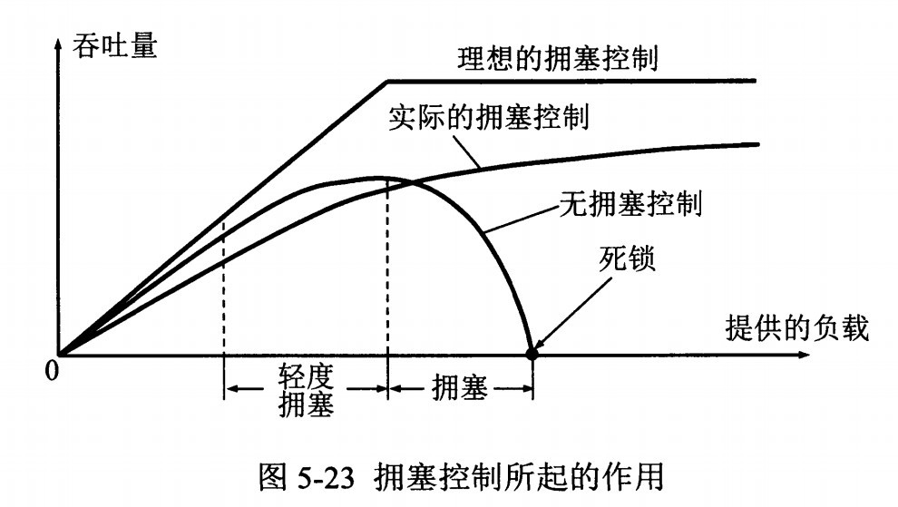
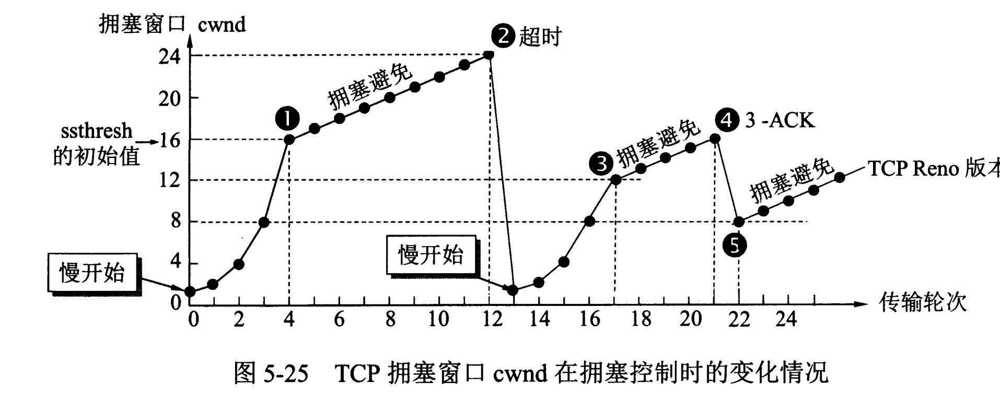

### 拥塞控制

如果网络出现拥塞，分组将会丢失，此时发送方会继续重传，从而导致网络拥塞程度很高。 

因此当出现拥塞时，应当控制发送方的速率。这一点和流量控制很像，但是出发点不同。 

流量控制是为了让接收方能来得及接收，而拥塞控制是为了降低整个网络的拥塞程度。

### 拥塞控制，TCP 每条连接都需要维护两个核心状态：

* 拥塞窗口（Congestion Window，cwnd）
* 慢启动阈值（Slow Start Threshold，ssthresh）

### 涉及算法

* 慢开始 
* 拥塞避免 
* 快重传 
* 快恢复

### 拥塞窗口

指目前自己还能传输的数据量大小。

限制的是：发送窗口的大小。

拥塞窗口（cwnd）是状态变量，与发送方窗口的区别是，实际决定发送方能发送多少数据是发送方窗口。

### 慢开始

拥塞控制首先采用一种保守的算法来慢慢适应整个网路，这种算法叫做 慢启动。

运作过程：

* 握手，宣告自己的接收窗口大小
* 双方初始化自己的拥塞窗口大小
* 发送端每收到一个 ACK，拥塞窗口大小 + 1，也就是每一个 RIT，cwnd 翻倍。如果初始窗口是 10，那么每一轮10个报文传完发送端收到 ACK

如果出现超时，则令 ssthresh = cwnd / 2，然后重新执行慢开始。

### 拥塞避免

当 cwnd >= ssthresh（慢开始阈值）时，进入拥塞避免。

每个轮次只将 cwnd 加 1。

慢启动和拥塞避免是一起作用的。

### 快重传

TCP 传输过程中，如果发生了丢包，即接收端发现数据段不是按序到达的时候，接收端的处理是重复发送之前的 ACK。

比如第 5 个包丢了，即使第 6、7 个包到达的接收端， 接收端也一律返回第 4 个包的 ACK。
当发送端收到 3 个重复的 ACK 时，意识到丢包了，于是马上进行重传，不用等到一个 RTO 的时间到了才重传。

### 快恢复

发送端收到三次重复 ACK 之后，发现丢包，觉得现在的网络已经有些拥塞了，自己会进入快速恢复阶段。

发送端作出如下变化：

* ssthresh = cwnd / 2
* cwnd = ssthresh

也就是说，快恢复阶段，直接进入拥塞避免，cnwd 线性增加。

