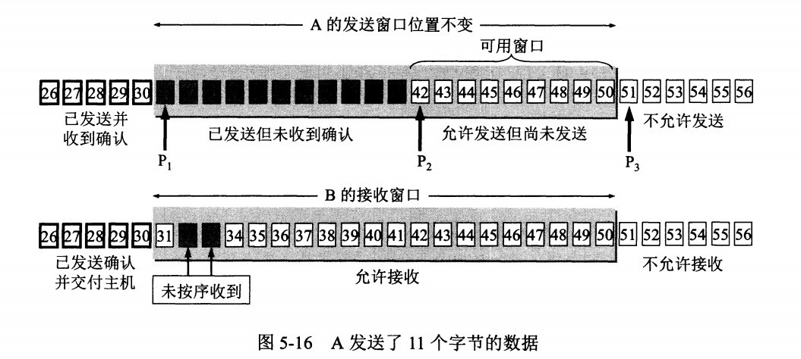

### 滑动窗口

滑动窗口协议在在发送方和接收方之间各自维持一个滑动窗口，发送方是发送窗口，接收方是接收窗口，而且这个窗口是随着时间变化可以向前滑动的。 它允许发送方发送多个分组而不需等待确认。TCP的滑动窗口是以字节为单位的。

发送窗口中有四个概念：

* 已发送并收到确认的数据（不在发送窗口和发送缓冲区之内） 
* 已发送但未收到确认的数据（位于发送窗口之内） 
* 允许发送但尚未发送的数据（位于发送窗口之内） 
* 发送窗口之外的缓冲区内暂时不允许发送的数据

接收窗口中也有四个概念：

已发送确认并交付主机的数据（不在接收窗口和接收缓冲区之内）
未按序收到的数据（位于接收窗口之内）
允许接收的数据（位于接收窗口之内）
不允许接收的数据（位于发送窗口之内）