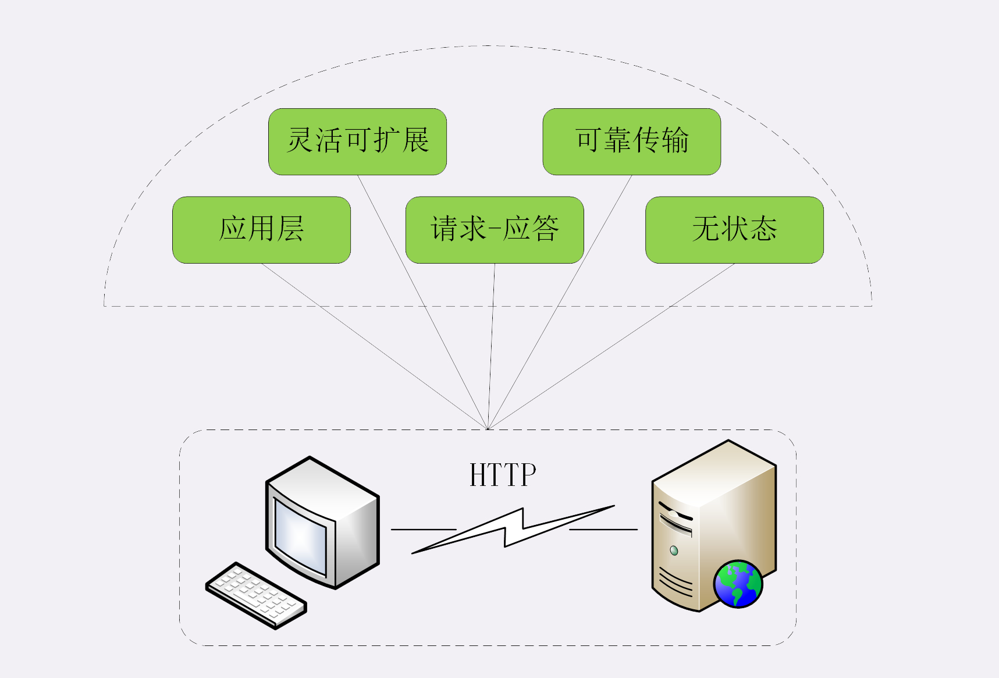

## 序言
HTTP 的特点，如图：

### 灵活可扩展
HTTP 协议只规定了报文的基本格式、一些请求方法、版本号、状态码，头字段，并没有严格的语法语义限制 body 从文本形式到不再仅限于文本形式，而以上的提到的状态码、头字段、请求方法，都是可以让用户自行扩展

### 可靠传输
因为 HTTP 是基于 TCP/IP 的，而 TCP 本身是“可靠”的传输协议

### 应用层协议
HTTP 可携带任意头字段和实体数据的报文结构、实现缓存代理以及连接控制等应用

### 请求-应答
请求-应答，是 HTTP 协议最根本的通信模式，明确发起和应答双方的定位

### 无状态
状态是客户端或服务器里保存的一些数据或标志，记录了通信过程中的一些变化，比如 TCP 协议是有状态的 而 HTTP 每次收发的报文都是互相独立，没有任何的联系 每次之间独立没有相互依赖关系

### 小结
1. HTTP 是灵活可扩展的，可以任意添加头字段实现任意功能
2. HTTP 是可靠传输协议，基于 TCP/IP 协议“可靠性”保证数据的送达
3. HTTP 是应用层协议，比 FTP、SSH 等通用功能更多，能够传输任意数据
4. HTTP 使用请求 - 应答模式，客户端主动发起请求，服务器被动回复请求
5. HTTP 本质上是无状态的，每个请求都是互相独立、毫无关联的，协议不要求客户端或服务器记录请求相关的信息

### 问题
1. 能说一下今天列出的这些 HTTP 的特点中哪些是优点，哪些是缺点吗？
特点在不同场景展现优缺。

* 无状态。如果一些场景需要保存上下文，那么无状态就是缺点，而一般情况下，不需要保存上下文，那就可以减少资源消耗，就是优点
* 明文传输。报文使用的是文本形式，不使用二进制
* 队头阻塞

2. 不同的应用场合有不同的侧重方面，你觉得哪个特点对你来说是最重要的呢？
可靠性相对重要

