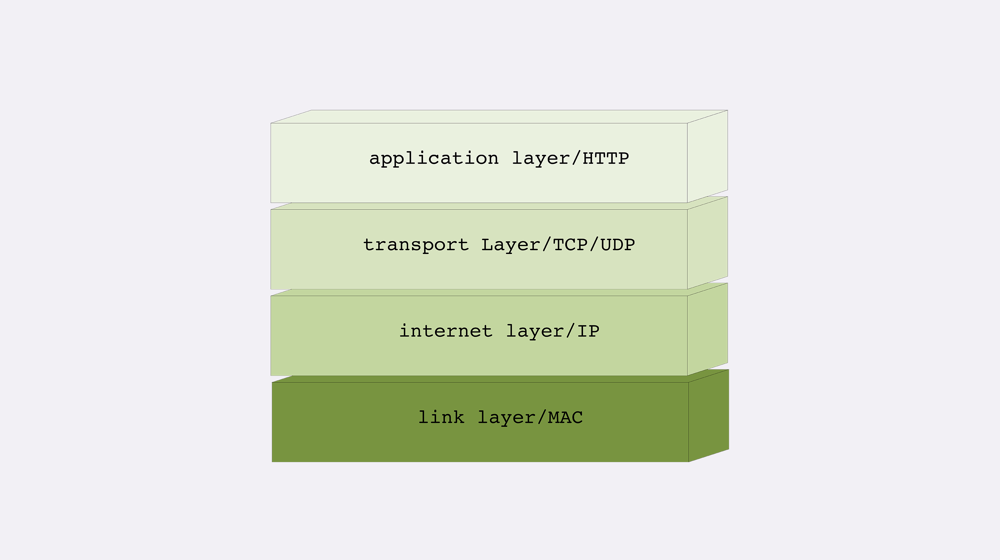
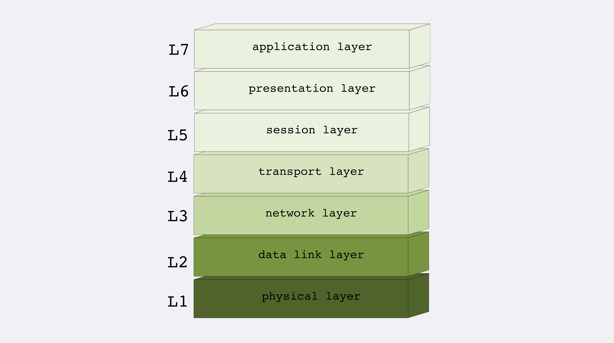
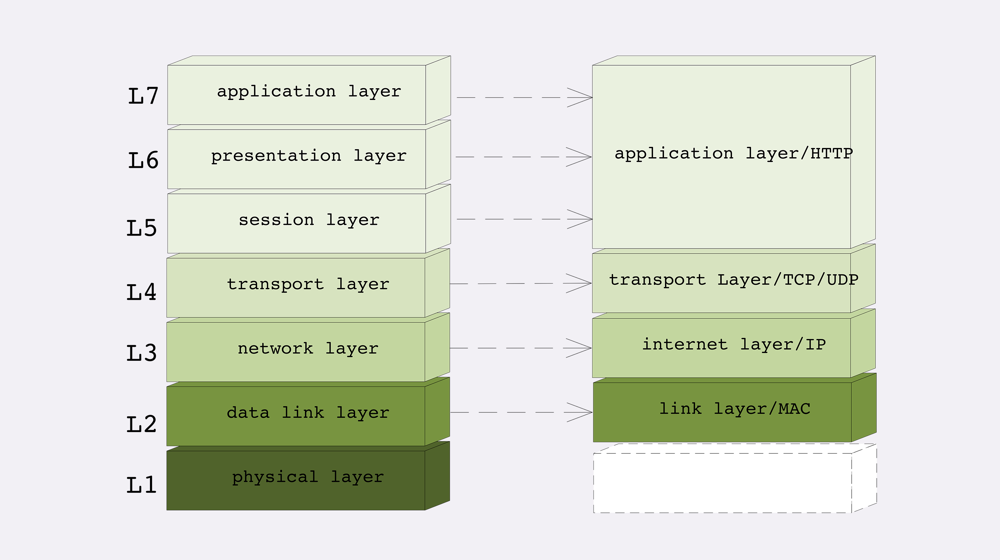
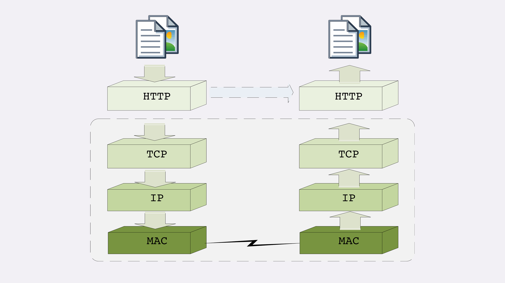

### TCP/IP 网络分层模型

第一层：链接层（link layer）
负责在以太网、WiFi 这样的底层网络上发送原始数据包，工作在网卡这个层次，使用 MAC 地址来标记网络上的设备，有时也叫 MAC

第二层：“网际层”（internet layer）
IP 协议处在这一层。用 IP 地址取代 MAC 地址，把许许多多的局域网、广域网连接成一个虚拟的巨大网络，在这个网络里找设备时只要把 IP 地址翻译成 MAC 地址就可以

第三层：“传输层”（transport layer）
这个层次的协议的职责是保证数据在 IP 地址标记的两点之间“可靠”睇传说，是 TCP 协议工作的层次

第四层：“应用层”（application layer）
各种面向具体应用的协议，如：Telnet、SSH、FTP、SMTP 和 HTTP 等

### OSI 网络分层模型

第一层：物理层，网络的物理形式，如电缆、光纤、网卡、集线器等
第二层：数据链路层，相当于 TCP/IP 的链接层
第三层：网络层，相当于 TCP/IP 里的网际层
第四层：传输层，相当于 TCP/IP 里的传输层
第五层：会话层，维护网络中的连接状态，即保持会话和同步
第六层：表示层，把数据转换为合适、可理解的语法和语义
第七层：应用层，面向具体的应用传输数据

### 两个分层模型的映射关系

### TCP/IP 协议栈的工作方式

HTTP 协议的传输过程就是通过协议栈层向下，每一层都添加本层的专有数据，层层打包，然后通过下层发送过去 接受数据则是相反的操作，
从下往上穿过协议栈，逐层拆包，每层去掉本层的专有头，上层就会拿到自己的数据

### 小结

1. TCP/IP 分为四层，核心是二层的 IP 和三层的 TCP，HTTP 在第四层
2. OSI 分为七层，基本对应 TCP/IP，TCP 在第四层，HTTP 在第七层
3. OSI 可以映射到 TCP/IP，但这期间的一、五、六就消失了
4. 日常交流的时候我们通常使用 OSI 模型，用四层、七层等术语
5. HTTP 利用 TCP/IP 协议栈束层打包再拆包，实现了数据传输，但下面的细节并不可见 小窍门： “两个凡是”，凡是由操作系统负责处理的就是四层或四层以下，否则，凡是需要由应用程序负责处理就是七层

