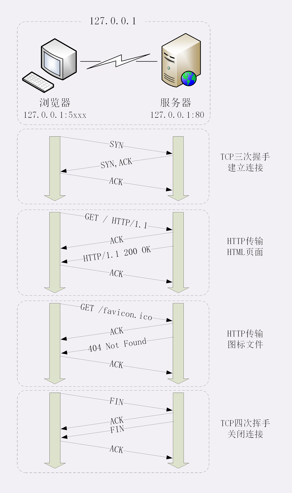
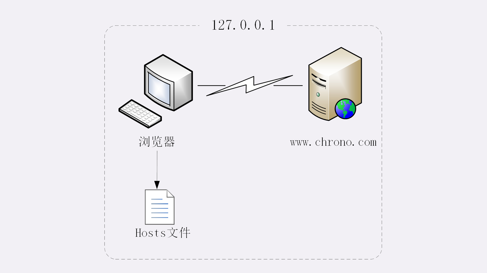
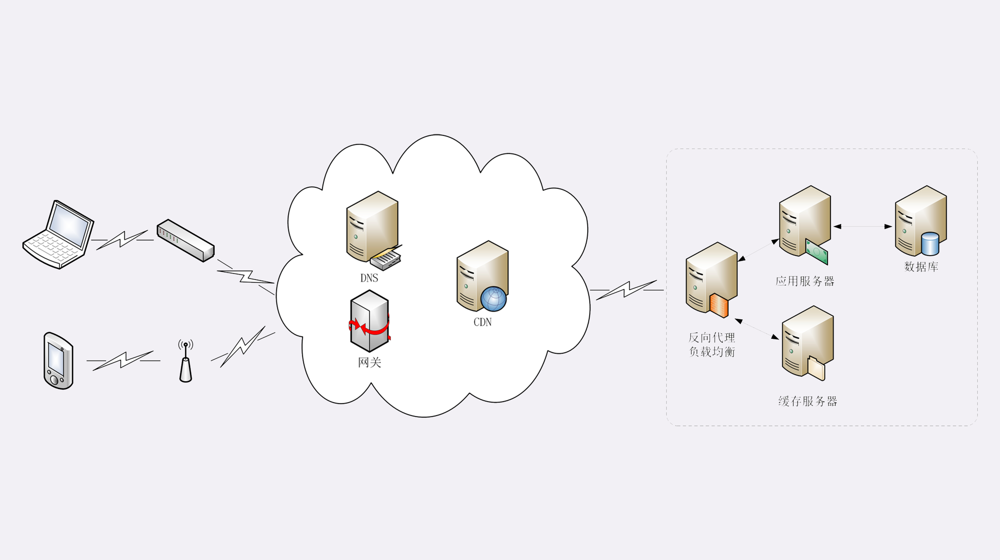

### 抓包分析

### 简述过程：

* 浏览器从地址栏的输入中获得服务器的 IP 地址和端口号
* 浏览器 TCP 三次握手 与 服务器建立连接
* 浏览器 向服务器拼好的报文
* 服务器收到报文后处理请求，返回报文给浏览器
* 浏览器解析报文 渲染页面

### 真实的网络世界

### 小结

HTTP 协议基于底层的 TCP/IP 协议，所以必须要用 IP 地址建立连接

如果不知道 IP 地址，就要用 DNS 协议去解析得到 IP 地址，否则就会连接失败

建立 TCP 连接后悔按顺序收发数据，请求方和应答方都必须依据 HTTP 规范构建和解析报文

为了减少响应时间，整个过程中的每一环节都会有缓存，能够实现“短路”操作

虽然现实中的 HTTP 传输过程非常复杂，但理论上仍然可以简化为实验里的“两点”模型
