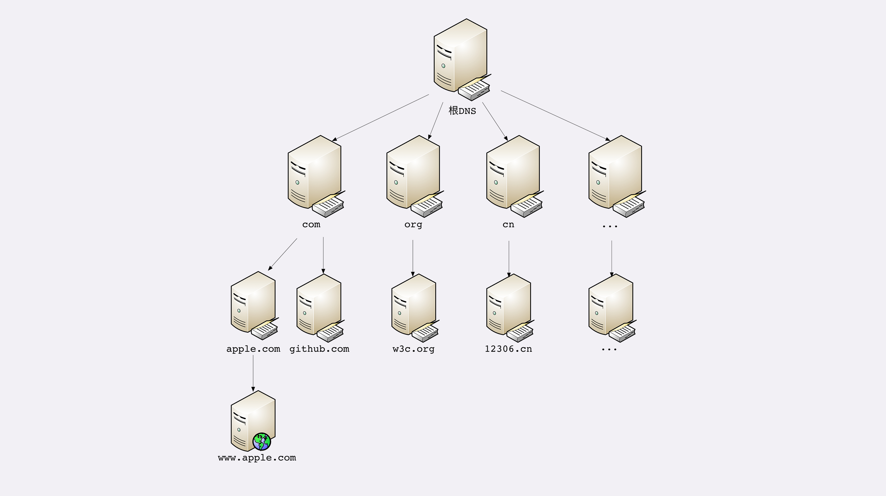
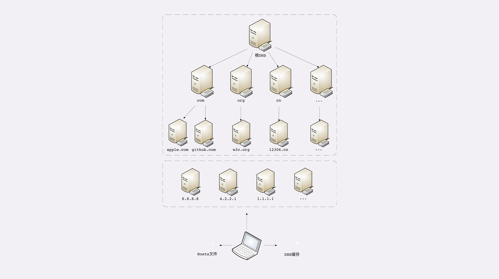

### 域名形式

域名是一个有层次的结构，是一串用“.”分割的多个单词，最右边是“顶级域名”，然后是“二级域名”，最左是主机名，层级关系从右往左依次降低

比如：域名“time.geekbang.org”，这里的“org”就是顶级域名，“geekbang”是二级域名，“time”则是主机名。

在 Apache、Nginx 这类 Web 服务器里，域名可以用来表示虚拟主机，决定由哪个虚拟主机来对外提供服务，比如在 Nginx 里使用“server name”：

```
server {
    listen 80;                                       #监听80端口
    server_name time.geekbang.org  #主机名是time.geekbang.org
}
```

域名本质上只是名字空间系统，使用多级域名就可以划分出不同的国家、地区、组织、公司、部门，每个域名都是独一无二的，可以作为一种身份标识


### 域名解析

域名解析是指将域名转换成 IP 地址的过程

DNS 核心系统是一个三层树状、分布式服务，基本对应域名的结构：

1. 根域名服务器（Root DNS Server）：管理顶级域名服务器，返回“com”“net”“cn”等顶级域名服务器的 IP 地址
2. 顶级域名服务器（Top-level DNS Server）：管理各自域名下的权威域名服务器，比如 com 顶级域名服务器可以返回 apple.com 域名服务器的 IP 地址
3. 权威域名服务器（Authoritative DNS Server）：管理自己域名下主机的 IP 地址，比如 apple.com 权威域名服务器返回 www.apple.com 的 IP 地址



目前全世界共有 13 组跟域名服务器，又有数百台的镜像，保证一定能够被访问到

域名解析过程： 例如，你要访问“www.apple.com”，就要进行下面的三次查询：

1. 访问根域名服务器，它会告诉你“com”顶级域名服务器的地址
2. 访问“com”顶级域名服务器，它再告诉你“apple.com”域名服务器的地址
3. 最后访问“apple.com”域名服务器，就得到了“www.apple.com”的地址

在 DNS 系统之外，还有两种手段来减轻域名解析的压力，并且能够更快获取结果，基本思路就是“缓存”：

1. 缓存
   1. 网络运营商、大公司建立自己的 DNS 服务器，作为用户 DNS 查询的代理，代理用户访问核心 DNS 系统，这些系统成为“非权威域名服务器”，可以缓存之前的查询结果
   2. 操作系统对 DNS 解析结果做缓存 (浏览器 DNS 缓存)
2. hosts 文件
   1. 操作系统的“主机映射”文件，在 Linux 里是“/etc/hosts”，在 Windows 里是“C:\WINDOWS\system32\drivers\etc\hosts”，如果操作系统在缓存里找不到 DNS 记录，就会找这个文件
   2. 
   3. Nginx 里有一条配置指令“resolver”，它就是用来配置 DNS 服务器的，如果没有它，那么 Nginx 久无法查询域名对应的 IP，也就无法反向代理到外部的网站

```
resolver 8.8.8.8 valid=30s; #指定Google的DNS，缓存30秒
```

### 域名“新玩法”

1. 重定向 让对外服务的域名不变，而主机的 IP 地址任意变动 当主机有情况需要下线、迁移时，可以更改 DNS 记录，让域名指向其他的机器

2. 内部服务使用域名

3. 负载均衡 
   1. 因为域名解析可以返回多个 IP 地址，所以一个域名可以对应多台主机，客户端收到多个 IP 地址后，就可以使用轮询算法依次向服务器发起请求，实现负载均衡 
   2. 域名解析可以配置内部策略，返回离客户端最近的主机，或者返回当前服务质量最好的主机，DNS 端把请求分发到不同服务器

### 问题

1. 在浏览器地址栏输入一个不存在的域名，比如“www.不存在.com”，试着解释塔的 DNS 解析过程

* 先从浏览器缓存查找 
* 再去操作系统缓存中查找 
* 接着查找本地 hosts 文件是否有对应的记录 
* 到非权威 DNS 服务器中查找是否有这样的缓存记录 
* 访问根域名服务器中查找“com”顶级域名服务器的地址 
* 访问顶级域名服务器查询“不存在.com”，找不到，抛出错误，逐级返回，告诉用户无法找到这个域名对应的 IP 地址 
* 假设 5 找到了，继续去二级域名服务器查找，根据“www.不存在.com”找到权威 DNS 服务器地址 
* 然后访问权威 DNS 服务器找到“www.不存在.com”找到对应的 IP 地址 
* 然后逐级返回并更新操作系统缓存、浏览器缓存 

2. 如果因为某些原因，DNS 失效或者出错了，会出现什么后果
无法访问网站，客户端报错“Failed host lookup”
