### OSI 七层模拟

Open System Interconnection OSI 理想化模型

* 应用层 用户最终使用的接口 微信 qq 网页
* 表示层 数据进行描述 或者 压缩
* 会话层 建立会话和管理会话
* 传输层 把数据传递给对方 丢了需要重新传递吗
* 网络层 网络层 寻址
* 数据链路层 主要关心两个设备 连接起来 连接数据
* 物理层 关心传输数据 0 1 传输的是比特流

写信

* 具体的实际内容
* 整理话术 表达出来
* 怎么传 丢了要不要冲洗你传递 504 -> 301
* 增加具体位置，对方地址
* 传输信 交给不同的邮局
* 最终的交通工具

### 七层协议真正做了什么
- 报文 应用层
- 数据段 传输层 + 数据 + 端口
- 数据包 网络层 + 数据 + 端口 + ip
- 数据帧 链路层 + 数据 + 端口 + ip + mac地址

> 

### 地址
#### ip 地址

例子 192.168.1.1

最大 255.255.255.255
IPV4 IP地址的第四个版本 最大值 42亿
IPV6 本地链接 IPv6 地址 : fe80::f530:c49d:bcbe:4d3c%14

#### mac 地址

原则是唯一 每个网卡都有一个 mac 地址

### 物理层有哪些设备？
- 光纤 电话线

### 链路层设备

- 交换机 （局域网通信）mac 地址概念

### 网络层设备

- 路由器 默认两个不同的网络 不能相互通信 想让两个不同的区域的设备来通信
- 没有wan口的路由器可以看成交互及 默认两个不同的网络 不能相互通信
- 想让两个不同的区域的设备来通信 要经过网关

## 网络中的协议
- 协议约定和规范 (在OSI 模型中 只有 三层以上的才能成为 协议)

应用层 HTTP DNS DHCP协议
传输层协议 TCP UDP
网络层协议 IP协议 ARP协议 下层为上层提供服务的

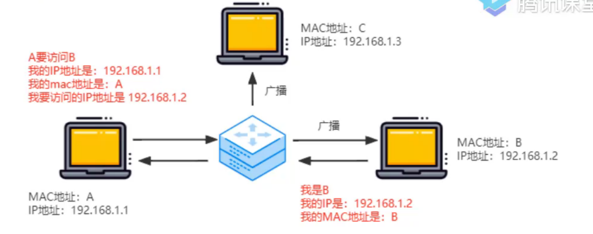

ARP协议 有歧义的 核心价值在于将 ip 地址转化为 mac 地址 ip => mac 地址

DHCP 协议 动态 IP分配，动态主机配置协议 自动分配IP，基于UDP的 不需要可靠的

## DNS 协议

DNS 是 Domain Name System 缩写 ，DNS服务器进行域名和与之对应的 IP地址转换的服务器

* 顶级域名 .cn .cn ip 返回
* 二级域名 .com.cn ip 返回，三级域名 www.zf.com.cn 有多少个点 就是几级域名

访问过程 zf.com.cn

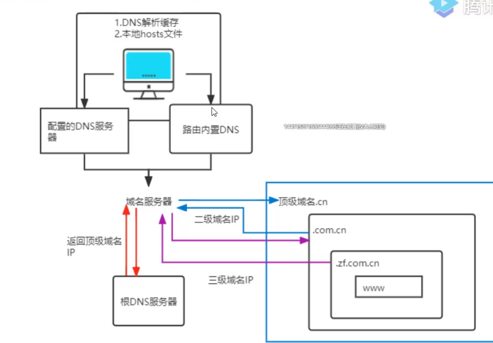

### TCP & UDP
 两个协议都在 传输层，我们经常说 TCP 是面向连接的而 UDP是面向无连接的
 
* UDP 发送请求后，不考虑对方是否接受到，内容是否完整，顺序是否正确。收到数据后也不会进行通知
* 首部结构简单，在数据传输时能实现最小开销

#### TCP
tcp 传输控制协议 Transition 可靠 面向连接的协议，传输效率低（不可靠的IP层上面建立 可靠的传输层）
tcp 提供双工服务，即数据可以互相发送

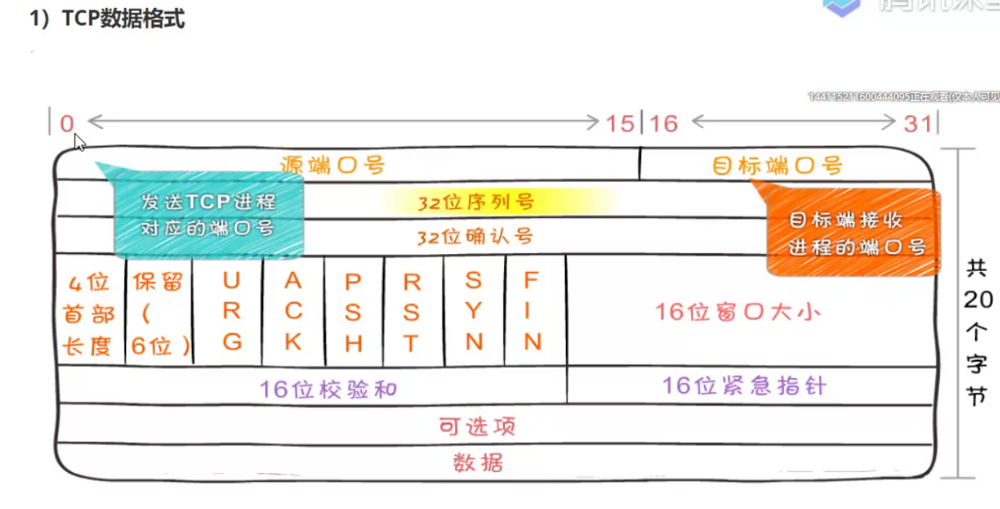

#### TCP 三次握手 四次挥手
SYN 是发送消息
ACK 是接受到消息

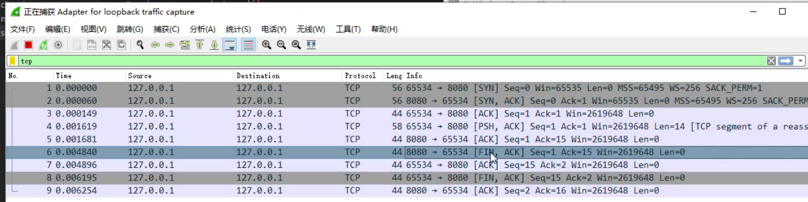

### 建立连接
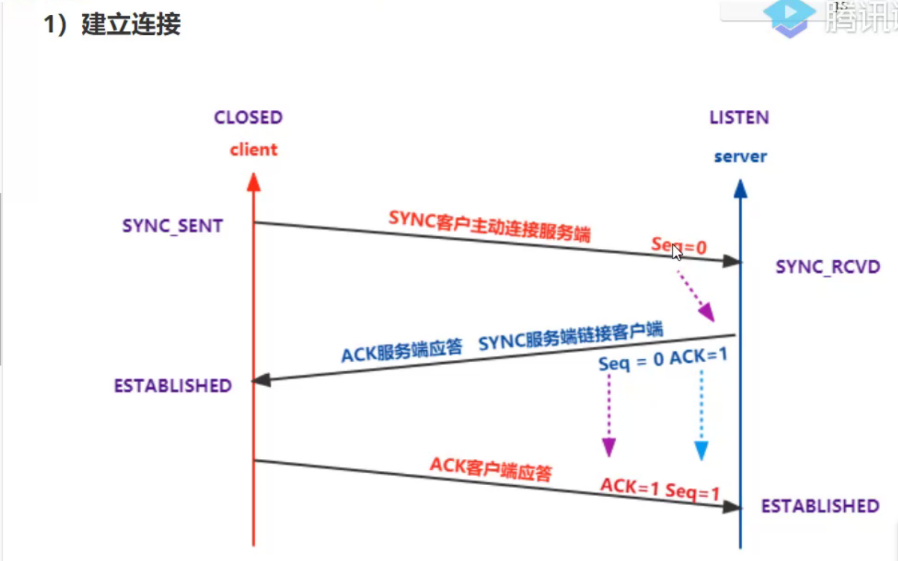

### 数据传输
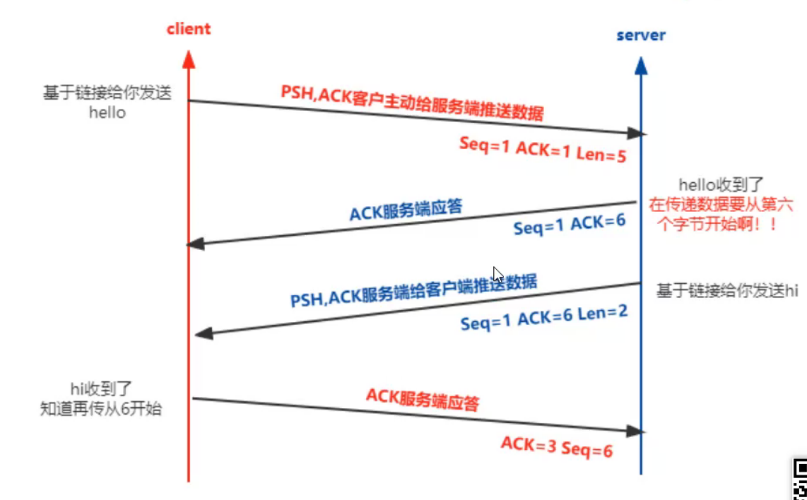

### 断开连接
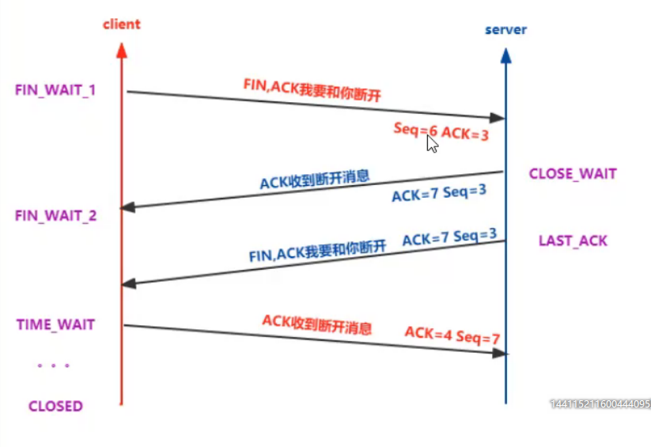

因为有可能有数据没有发送完毕，所以需要4次挥手

4次挥手
* 客户端发送给服务端我们断开连接吧
* 服务器端收到断开连接
* 服务器端 发送给 客户端 断开连接吧
* 客户端不能立即发送后就关闭 要等着。看有没有服务器端 重新发送的包。如果没有就可以断开了
* 等着就会占用端口 65563 端口 是有限的 所以 http 1.0 是不适合高并发
* time-wait的的持续时间为2MSL. MSL是Maximum Segment Lifetime,译为“报文最大生存时间”

### 滑动窗口

* 滑动窗口：TCP 是全双工的，发送缓存区，会跟怒网络状况调整发送数据的多少
* 发送数据的时候是乱序发送的，但是当我们收到某个包后，可能之前的包还没收到，此时需要等待前面序号的包接收完成才行
* 队头阻塞的问题，需要等待前面序号的包接收完成才行
* 服务端会告诉客户端 数据的个数长度
* 如果某个数据丢包了，需要重新发送（超时重传 RTO）
* 当接受放的缓存区收满了 每隔一段时间 发送方会发送一个探测包 来询问是否调整窗口大小，上层协议消耗掉了接收方的数据，接收方也会主动通知发送方调整窗口
* 流量控制 
* WIN 来确定窗口大小

### 粘包

nagle 算法 确认任意时刻，只能有一个未确认的小段
包累计到一定程度才会发送过去
Cork 算法 当包的大小到达一定值以后一并发送过去

### TCP 拥塞控制
问题
* 
* TCP 顺序问题 后面的包先到达需要等待前面的包返回之后才能继续传输 队头阻塞
* time wait 客户端连接服务器最后不会立即断开 在高并发 短连接的情况下 会出现端口全被占用的问题 非长链接的情况会有大量端口被占用的问题
* 慢启动 非常消耗性能

* TCP维护一个拥塞窗口 cwnd 变量 在传输的过程中

* cwnd < ssthresh 慢开始算法
* cwnd > ssthresh 使用拥塞避免算法
* ROT时 更新 ssthresh 值为当前窗口的一半 更新 cwnd = 1

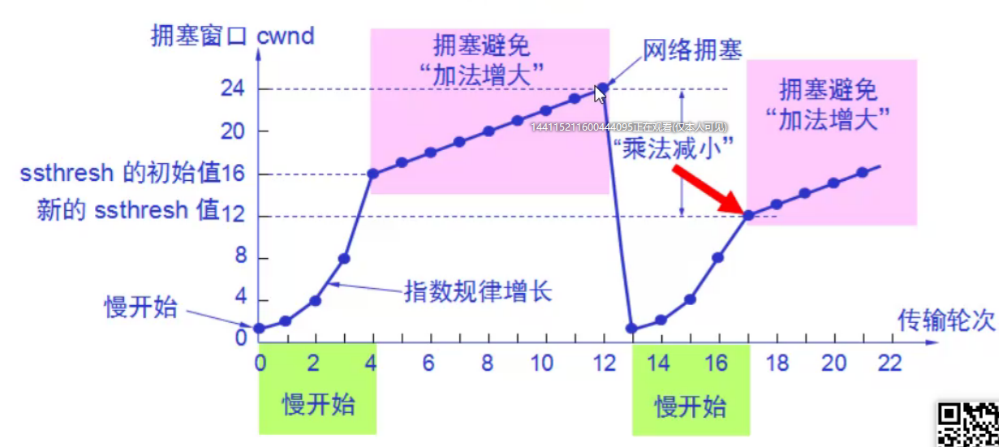

* 传输轮次 RTT Round Trip time 从发送到确认信号的时间

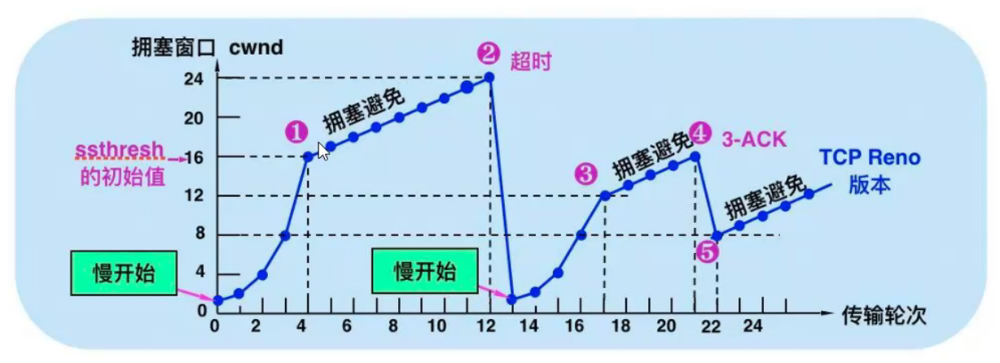

快重传，可能在发送的过程中出现丢包情况。此时不要立即回退到慢开始阶段，而是对已经收到的报文重复确认，
如果确认次数达到3次，则立即进行重传 快恢复算法(减少超时重传机制的出现)，降低重置 cwnd 频率

### HTTP 发展历史

### HTTP 1.1

- 基于 tcp 传输层 半双工通信 请求应答模式 http 默认是是无状态的（默认 tcp 不能再没有应答的完成后复用通道继续发）
- tcp 规范 固定的组成结构
  - 请求行 响应行 请求行 响应行 主要目的是描述我做什么事 服务端告诉客户端ok
  - 请求头 响应头 描述传输的数据内容 自定义 header HTTP 中 所做的规范
  - 请求体 响应体 两者的数据

纯文本协议 安全问题 没有加密的明文

#### 内容协商
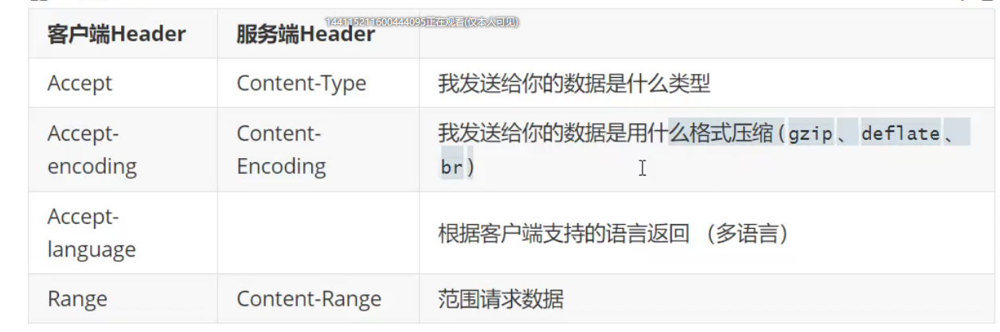

- 核心在于内容协商

#### 长链接

实现长链接 增加 connection: keep-alive connection: close
复用 tcp 通道传递数据 必须在一次请求应答后才能复用

#### 管线化方式传递数据
每个域名分配 6哥 tcp 通道 （域名分片）
域名不宜过多 dns 解析大量域名

过多并发 应答依然是按照顺序的（管道的特点 先发送先回来）（http1.1 中的队头阻塞）

#### 可以采用 cookies 使用用户身份
在客户端增加 cookies 字段 服务端 set cookie 每次请求的时候会自动携带 cookies （cookies 不易过大）

### HTTP 缓存

- 强制缓存 当客户端访问服务器后，服务器，10s内 不要找我了，去缓存里面找 在 10s 内就不要向服务器请求了
  - 1.0 Expires X 绝对的时间
  - 1.1 Cache-Control max-age 缓存的最大时间 毫秒
  - 
- 协商缓存 当强制缓存失效后会再次向服务器发起请求，服务器端 需要 比对 客户端的缓存文件和服务端是否一致
  - 一致 直接使用使用 缓存 304 状态
  - 不一致 重新请求
    - Last-Modified 最后修改时间变化了，但是内容没有变化，同一时间内 没办法检查修改（只能精确到秒）
    - If-Modified-Since
    - E-Tag 文件哈希 md5 不同的内容摘要的结果 肯定是不同的，两个相同的结果摘要肯定相同，长度是相同，内容不同，结果差异大
      - 性能问题 弱指纹 last-modified + 文件长度 成为一个指纹
    - if-none-match 
    - no-cache (不缓存，但是缓存中有，每次询问)
    - no-store (不缓存，重新去取)

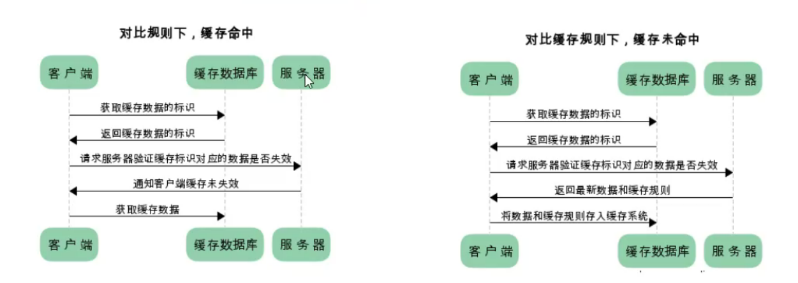

### https

保证密文

HTTP 采用明文传输，中间人可以获取到明文数据（从而实现对数据的篡改）

HTTPS = HTTP + SSL/TLS SSL 安全套接层 发展到 v3 时 改命 未 TLS 传输层安全

#### 算法
- 可以通过摘要来辨别数据有没有被篡改过

#### 对称加密算法
加密方和接收方都有一把共同的钥匙

- RSA
- AES 
- Chacha20

#### 非对称加密
发送方和接收方都有一把钥匙 发送方会有公钥 接收方会拿到私钥

- 私钥加密 公钥解密
- 公钥解密 私钥加密
- 效率问题 数据越复杂加密越复杂

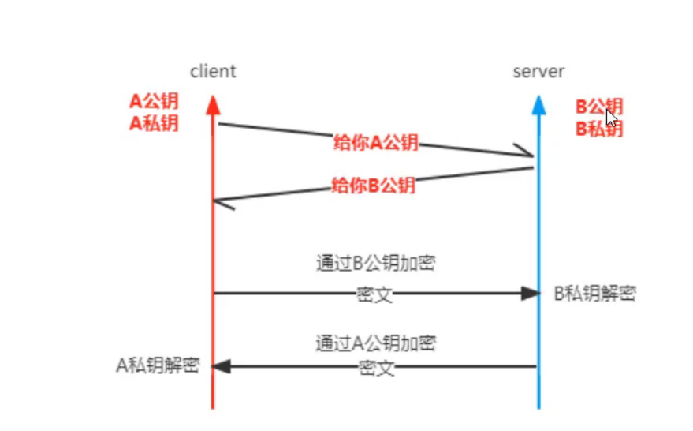

#### 混合加密
对称 + 非对称

- 获取公钥从服务器
- 客户端公钥加密随机数 发到服务器端
- 随机数作为对称加密算法 作为钥匙
- 服务器用 私钥 解密随机数
- 随机数作为对称加密的秘钥 同一把钥匙

#### 混合加密的问题

- 缺陷是 不知道公钥是谁发给我的
- 中间人 伪造公钥

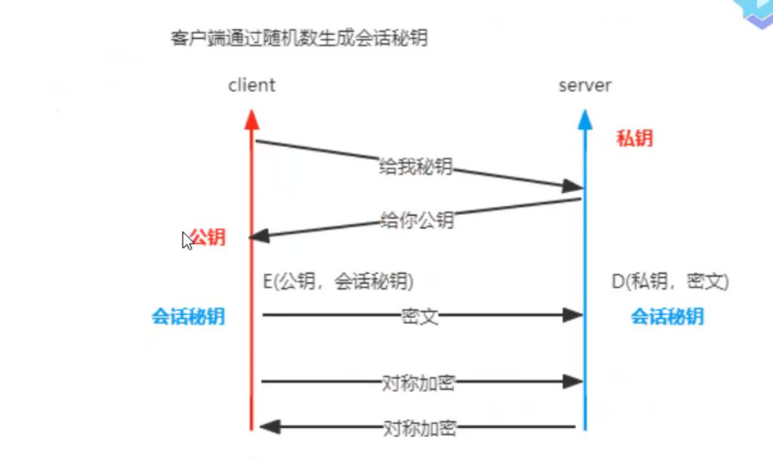

#### 数字证书和CA

因为谁都可以发布公钥，所以我们需要验证对方身份，防止中间人攻击

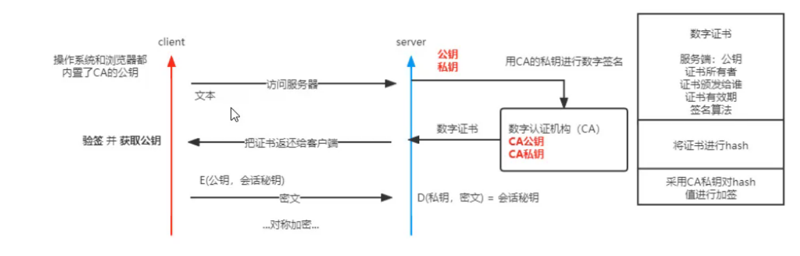

- 公钥经过 CA 数字认真机构 CA公钥 CA私钥
- 把证书摘要 + CA 秘钥加密 发送给客户端
- 客户端 在操作系统和浏览器中放入 根证书，所以收到证书以后，所以受到证书后可以进行验签
- 客户端 解密出摘要 将传递的明文再次摘要和解密出来的摘要进行匹配，如果一致，公钥就是合法
- 会话秘钥 进行互相通信

### HTTPS 过程

HTTPS的通信过程如下：
- 客户端向服务器发起请求，请求中包含使用的协议版本号、生成的一个随机数、以及客户端支持的加密方法。
- 服务器端接收到请求后，确认双方使用的加密方法、并给出服务器的证书、以及一个服务器生成的随机数。
- 客户端确认服务器证书有效后，生成一个新的随机数，并使用数字证书中的公钥，加密这个随机数，然后发给服 务器。并且还会提供一个前面所有内容的 hash 的值，用来供服务器检验。
- 服务器使用自己的私钥，来解密客户端发送过来的随机数。并提供前面所有内容的 hash 值来供客户端检验。
- 客户端和服务器端根据约定的加密方法使用前面的三个随机数，生成对话秘钥，以后的对话过程都使用这个秘钥来加密信息。
